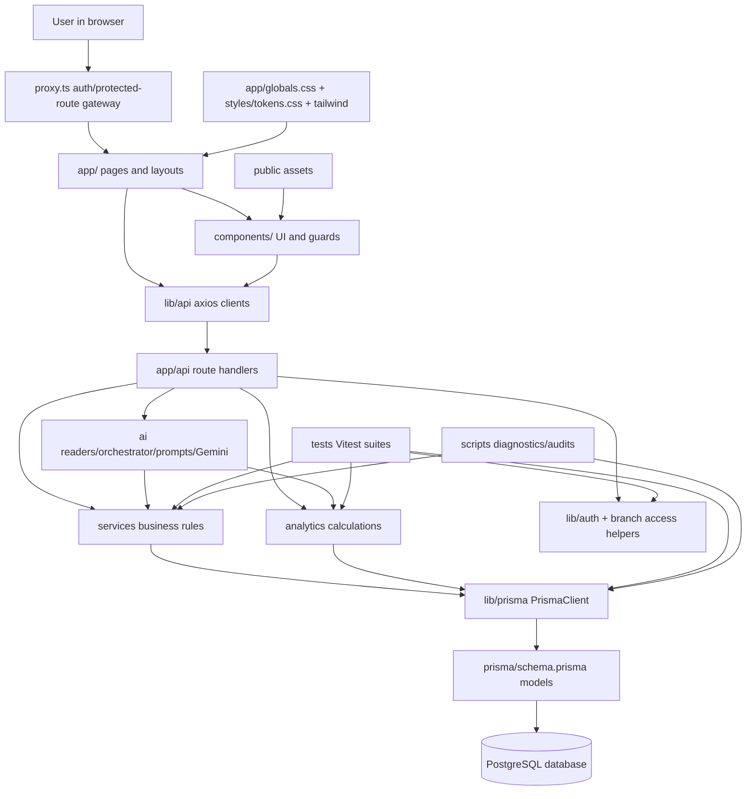

# Lab Lords Full App Source Knowledge Graph

Generated from the local repository inventory on 2026-05-07T09:38:35.552Z. This file is intentionally source-level and favors completeness over brevity. Secret values from environment files are redacted; generated/dependency internals are summarized rather than expanded.

## High-Level App Graph

## Inventory Scope

- Source-level documented files: 293.
- Included local configuration/docs/meta files: 14.
- Excluded from detailed expansion: `.git`, `.next`, `node_modules`, `app/generated/prisma`, `tsconfig.tsbuildinfo`, transient build/dependency/VCS internals.
- Environment files are represented only by variable names with values redacted.

## Folder Knowledge Graph

### `.agent/`
- Responsibility: Local agent rules and generated/static agent metadata for coding-assistant behavior and lint snapshots.
- Included files documented: 3.
- File categories present: `Local agent metadata/rules`.
- Notable child paths: `.agent/eslint.json`, `.agent/FRONTEND_AGENT_RULES.md`, `.agent/rules`.

### `.github/`
- Responsibility: GitHub automation such as CI workflow definitions.
- Included files documented: 1.
- File categories present: `GitHub workflow/config`.
- Notable child paths: `.github/workflows`.

### `.jules/`
- Responsibility: Local Jules/Bolt project instructions or metadata.
- Included files documented: 1.
- File categories present: `Local Jules/Bolt metadata`.
- Notable child paths: `.jules/bolt.md`.

### `ai/`
- Responsibility: Gemini client, AI contracts, prompts, readers, orchestration, risk detection, report generation, and message drafting.
- Included files documented: 21.
- File categories present: `AI/Gemini module`.
- Notable child paths: `ai/actionSuggestions`, `ai/branchHealthReport.ts`, `ai/contracts`, `ai/index.ts`, `ai/llm`, `ai/messageDrafting`, `ai/orchestrator`, `ai/prompts`, `ai/readers`, `ai/reports`, `ai/riskDetection`.

### `analytics/`
- Responsibility: Prisma-backed analytics calculations for branch/org health, payments, seats, students, and trend series.
- Included files documented: 8.
- File categories present: `Analytics calculation module`.
- Notable child paths: `analytics/branch.analytics.ts`, `analytics/org.analytics.ts`, `analytics/payment.analytics.ts`, `analytics/seat.analytics.ts`, `analytics/student.analytics.ts`, `analytics/trends`.

### `app/`
- Responsibility: Next.js App Router pages, layouts, loading/error states, auth screens, invite screens, and API route handlers.
- Included files documented: 71.
- File categories present: `Next.js page / frontend screen`, `Next.js API route`, `Next.js layout`, `Next.js app UI file`, `Project file`.
- Notable child paths: `app/account`, `app/api`, `app/branch`, `app/error.tsx`, `app/globals.css`, `app/invite`, `app/layout.tsx`, `app/loading.tsx`, `app/onboarding`, `app/org`, `app/page.tsx`, `app/sign-in`, `app/sign-up`.

### `components/`
- Responsibility: Reusable React UI organized by domain: auth, AI, allocations, analytics, dashboard, landing, layout, payments, settings, snapshot, tables, and core UI.
- Included files documented: 51.
- File categories present: `React component`.
- Notable child paths: `components/ai`, `components/allocations`, `components/analytics`, `components/auth`, `components/branch`, `components/dashboard`, `components/landing`, `components/layout`, `components/payments`, `components/settings`, `components/snapshot`, `components/tables`, `components/ui`.

### `docs/`
- Responsibility: Project documentation, auth environment notes, generated knowledge graph, and AI checklists.
- Included files documented: 2.
- File categories present: `Documentation`.
- Notable child paths: `docs/ai-production-checklist.md`, `docs/auth-environments.md`.

### `hooks/`
- Responsibility: React hook files for analytics, org/branch state, and branch access.
- Included files documented: 4.
- File categories present: `React hook/helper`.
- Notable child paths: `hooks/useAnalytics.ts`, `hooks/useBranch.ts`, `hooks/useBranchAccess.ts`, `hooks/useOrg.ts`.

### `lib/`
- Responsibility: Shared runtime helpers: Prisma client, auth/auth-mode, safe redirects, permission messages, branch access, API clients, validation, mock data, and class-name utilities.
- Included files documented: 19.
- File categories present: `Frontend API client wrapper`, `Shared library/helper`.
- Notable child paths: `lib/api`, `lib/auth.ts`, `lib/authMode.ts`, `lib/branchPageAccess.ts`, `lib/formValidation.ts`, `lib/mock-data.ts`, `lib/permissionMessages.ts`, `lib/prisma.ts`, `lib/safeRedirect.ts`, `lib/settingsValidation.ts`, `lib/utils.ts`, `lib/utils`.

### `prisma/`
- Responsibility: Database schema, migrations, migration lock, and seed data.
- Included files documented: 24.
- File categories present: `Prisma migration`, `Prisma database schema`, `Prisma seed/demo data`.
- Notable child paths: `prisma/migrations`, `prisma/schema.prisma`, `prisma/seed.ts`.

### `public/`
- Responsibility: Static assets served by Next.js.
- Included files documented: 1.
- File categories present: `Static public asset`.
- Notable child paths: `public/assets`.

### `scripts/`
- Responsibility: Operational/audit/debug scripts for auth env, database, payments, shifts, analytics, Gemini, and rate limiting.
- Included files documented: 11.
- File categories present: `Diagnostic/verification script`.
- Notable child paths: `scripts/audit_allocation_safety.ts`, `scripts/audit_analytics_consistency.ts`, `scripts/audit_payment_engine.ts`, `scripts/check-auth-env.ts`, `scripts/debug_payments.ts`, `scripts/list_branches.ts`, `scripts/test-gemini-connection.ts`, `scripts/verify_phase5_strict.ts`, `scripts/verify_rate_limit.ts`, `scripts/verify-gemini-client.ts`, `scripts/verify-shifts.ts`.

### `services/`
- Responsibility: Backend service layer containing core business rules, staff invites, permissions, and Prisma data access.
- Included files documented: 12.
- File categories present: `Service-layer business logic`.
- Notable child paths: `services/branch.service.ts`, `services/multiShift.service.ts`, `services/onboarding.service.ts`, `services/organization.service.ts`, `services/payment.service.ts`, `services/seat.service.ts`, `services/seatAllocation.service.ts`, `services/shift.service.ts`, `services/staff.service.ts`, `services/staffInvite.service.ts`, `services/student.service.ts`, `services/user.service.ts`.

### `styles/`
- Responsibility: Shared CSS token files.
- Included files documented: 1.
- File categories present: `Styling/token file`.
- Notable child paths: `styles/tokens.css`.

### `tests/`
- Responsibility: Vitest setup, factories, mocks, unit tests, integration tests, route tests, auth/access tests, and e2e-style tests.
- Included files documented: 28.
- File categories present: `Vitest test/support file`.
- Notable child paths: `tests/e2e`, `tests/factories`, `tests/integration`, `tests/mocks`, `tests/setup`, `tests/unit`.

### `types/`
- Responsibility: Shared TypeScript DTOs, enums, settings contracts, and domain types.
- Included files documented: 10.
- File categories present: `Shared TypeScript domain type`.
- Notable child paths: `types/branch.ts`, `types/enums.ts`, `types/index.ts`, `types/organization.ts`, `types/payment.ts`, `types/seatAllocation.ts`, `types/settings.ts`, `types/shift.ts`, `types/staff.ts`, `types/student.ts`.

### `utils/`
- Responsibility: Small utility modules for dates, money, formatting, and shift-time overlap logic.
- Included files documented: 4.
- File categories present: `Utility helper`.
- Notable child paths: `utils/dates.ts`, `utils/formatters.ts`, `utils/money.ts`, `utils/shiftTime.ts`.

### Generated/local artifact folders summarized only
- `.git/`: excluded from source-level expansion because it is generated, dependency, or VCS state.
- `.next/`: excluded from source-level expansion because it is generated, dependency, or VCS state.
- `node_modules/`: excluded from source-level expansion because it is generated, dependency, or VCS state.
- `app/generated/prisma/`: excluded from source-level expansion because it is generated Prisma Client output.

## Prisma Schema Knowledge Graph

Source: `prisma/schema.prisma`

This schema is the central database contract for the app. It uses PostgreSQL through Prisma, generates the Prisma JS client, and defines branch-scoped operational data plus organization/user identity/auth data.

### Model `User`
- Fields/relations:
  - `id                     String         @id @default(cuid())`
  - `clerkId                String?        @unique`
  - `email                  String         @unique`
  - `name                   String?`
  - `phone                  String?`
  - `timezone               String         @default("Asia/Kolkata")`
  - `locale                 String         @default("en-IN")`
  - `dateFormat             String         @default("dd MMM yyyy")`
  - `themePreference        String         @default("dark")`
  - `densityPreference      String         @default("comfortable")`
  - `defaultMessageLanguage String         @default("en")`
  - `defaultLandingPage     String         @default("org")`
  - `createdAt              DateTime       @default(now())`
  - `organizations          Organization[]`
  - `staff                  Staff[]`
  - `auditLogs              AuditLog[]`
- Indexes/constraints:
  - None declared beyond primary key/default field constraints.
- Main code consumers detected: `.agent/eslint.json`, `.agent/rules/rules.md`, `app/account/page.tsx`, `app/api/branches/[branchId]/shifts/[shiftId]/analyze/route.ts`, `app/api/branches/[branchId]/shifts/[shiftId]/route.ts`, `app/api/branches/[branchId]/shifts/route.ts`, `app/api/branches/route.ts`, `app/api/onboarding/route.ts`, `app/api/users/me/route.ts`, `app/branch/[branchId]/ai/messages/page.tsx`, `app/branch/[branchId]/seats/page.tsx`, `app/branch/[branchId]/students/EditStudentDialog.tsx`.

### Model `Organization`
- Fields/relations:
  - `id               String   @id @default(cuid())`
  - `name             String`
  - `ownerId          String`
  - `businessType     String?`
  - `legalName        String?`
  - `contactEmail     String?`
  - `contactPhone     String?`
  - `address          String?`
  - `timezone         String   @default("Asia/Kolkata")`
  - `currency         String   @default("INR")`
  - `weekStartsOn     Int      @default(1)`
  - `paymentGraceDays Int      @default(0)`
  - `createdAt        DateTime @default(now())`
  - `branches         Branch[]`
  - `owner            User     @relation(fields: [ownerId], references: [id])`
- Indexes/constraints:
  - None declared beyond primary key/default field constraints.
- Main code consumers detected: `.agent/eslint.json`, `analytics/org.analytics.ts`, `app/api/analytics/org/[orgId]/trends/route.ts`, `app/api/branches/route.ts`, `app/api/onboarding/route.ts`, `app/api/organizations/[orgId]/branches/route.ts`, `app/branch/[branchId]/settings/page.tsx`, `app/onboarding/page.tsx`, `app/org/[orgId]/analytics/page.tsx`, `app/org/[orgId]/page.tsx`, `app/org/[orgId]/settings/page.tsx`, `app/org/page.tsx`, `components/branch/CreateBranchDialog.tsx`, `components/layout/OrgSidebar.tsx`, `lib/api/organizations.ts`, `prisma/migrations/20251227051340_add_student/migration.sql`, `prisma/migrations/20260115083737_add_price_to_shift/migration.sql`, `prisma/migrations/20260504120000_add_real_settings/migration.sql`, `prisma/seed.ts`, `product.md`, `scripts/audit_allocation_safety.ts`.

### Model `Branch`
- Fields/relations:
  - `id                     String           @id @default(cuid())`
  - `organizationId         String`
  - `name                   String`
  - `city                   String?`
  - `address                String?`
  - `contactPhone           String?`
  - `openingTime            String?`
  - `closingTime            String?`
  - `defaultFee             Int?             @default(0)`
  - `defaultAdmissionFee    Int?             @default(0)`
  - `defaultMessageLanguage String           @default("en")`
  - `reminderTone           String           @default("polite")`
  - `aiEnabled              Boolean          @default(true)`
  - `createdAt              DateTime         @default(now())`
  - `lastDataChange         DateTime         @default(now())`
  - `aiLastCalledAt         DateTime?`
  - `aiStatus               BranchAIStatus   @default(IDLE)`
  - `organization           Organization     @relation(fields: [organizationId], references: [id])`
  - `aiReports              BranchAIReport[]`
  - `messageDrafts          MessageDraft[]`
  - `multiShifts            MultiShift[]`
  - `payments               Payment[]`
  - `seats                  Seat[]`
  - `shifts                 Shift[]`
  - `staff                  Staff[]`
  - `staffInvites           StaffInvite[]`
  - `students               Student[]`
  - `auditLogs              AuditLog[]`
- Indexes/constraints:
  - None declared beyond primary key/default field constraints.
- Main code consumers detected: `.agent/eslint.json`, `.jules/bolt.md`, `ai/contracts/branch.contract.ts`, `ai/contracts/org.contract.ts`, `ai/contracts/payment.contract.ts`, `ai/messageDrafting/branchMessageDrafter.ts`, `ai/orchestrator/branchAI.orchestrator.ts`, `ai/prompts/branchFullReport.prompt.ts`, `ai/prompts/branchHealth.prompt.ts`, `ai/readers/branch.reader.ts`, `ai/readers/payment.reader.ts`, `ai/riskDetection/branchRiskDetector.ts`, `analytics/branch.analytics.ts`, `analytics/org.analytics.ts`, `analytics/payment.analytics.ts`, `analytics/seat.analytics.ts`, `analytics/student.analytics.ts`, `analytics/trends/branch.trends.ts`, `analytics/trends/payment.trends.ts`, `analytics/trends/seat.trends.ts`, `app/account/page.tsx`, `app/api/ai/branch/[branchId]/messages/route.ts`, `app/api/ai/branch/[branchId]/route.ts`, `app/api/analytics/branch/[branchId]/snapshot/route.ts`, `app/api/analytics/branch/[branchId]/trends/route.ts`, `app/api/branches/[branchId]/access/route.ts`, `app/api/branches/[branchId]/multi-shifts/[multiShiftId]/route.ts`, `app/api/branches/[branchId]/multi-shifts/[multiShiftId]/seat-map/route.ts`, `app/api/branches/[branchId]/multi-shifts/route.ts`, `app/api/branches/[branchId]/payments/generate/route.ts`.

### Model `Student`
- Fields/relations:
  - `id              String           @id @default(cuid())`
  - `branchId        String`
  - `name            String`
  - `phone           String?`
  - `status          StudentStatus    @default(ACTIVE)`
  - `joinedAt        DateTime         @default(now())`
  - `monthlyFee      Int              @default(0)`
  - `feeLinkedShiftId String?`
  - `feeLinkedMultiShiftId String?`
  - `createdAt       DateTime         @default(now())`
  - `updatedAt       DateTime         @updatedAt`
  - `messageDrafts   MessageDraft[]`
  - `payments        Payment[]`
  - `seatAllocations SeatAllocation[]`
  - `branch          Branch           @relation(fields: [branchId], references: [id])`
- Indexes/constraints:
  - `@@index([branchId])`
  - `@@index([feeLinkedShiftId])`
  - `@@index([feeLinkedMultiShiftId])`
- Main code consumers detected: `.agent/eslint.json`, `ai/contracts/branch.contract.ts`, `ai/contracts/messageDraft.contract.ts`, `ai/messageDrafting/branchMessageDrafter.ts`, `ai/riskDetection/branchRiskDetector.ts`, `analytics/branch.analytics.ts`, `analytics/payment.analytics.ts`, `analytics/student.analytics.ts`, `app/api/branches/[branchId]/seat-allocations/route.ts`, `app/api/branches/[branchId]/shifts/capacity/route.ts`, `app/api/branches/[branchId]/students/route.ts`, `app/api/seat-allocations/[allocationId]/route.ts`, `app/api/seat-allocations/route.ts`, `app/api/students/[studentId]/status/route.ts`, `app/branch/[branchId]/ai/messages/page.tsx`, `app/branch/[branchId]/ai/reports/page.tsx`, `app/branch/[branchId]/allocations/page.tsx`, `app/branch/[branchId]/overdue/page.tsx`, `app/branch/[branchId]/page.tsx`, `app/branch/[branchId]/payments/page.tsx`, `app/branch/[branchId]/seats/page.tsx`, `app/branch/[branchId]/settings/page.tsx`, `app/branch/[branchId]/shifts/page.tsx`, `app/branch/[branchId]/students/AddStudentDialog.tsx`, `app/branch/[branchId]/students/EditStudentDialog.tsx`, `app/branch/[branchId]/students/page.tsx`.

### Model `Seat`
- Fields/relations:
  - `id              String           @id @default(cuid())`
  - `branchId        String`
  - `label           String`
  - `createdAt       DateTime         @default(now())`
  - `branch          Branch           @relation(fields: [branchId], references: [id])`
  - `seatAllocations SeatAllocation[]`
- Indexes/constraints:
  - `@@unique([branchId, label])`
  - `@@index([branchId])`
- Main code consumers detected: `.agent/eslint.json`, `.agent/FRONTEND_AGENT_RULES.md`, `.agent/rules/rules.md`, `.jules/bolt.md`, `ai/riskDetection/branchRiskDetector.ts`, `analytics/seat.analytics.ts`, `analytics/student.analytics.ts`, `app/api/analytics/branch/[branchId]/trends/route.ts`, `app/api/branches/[branchId]/multi-shifts/[multiShiftId]/seat-map/route.ts`, `app/api/branches/[branchId]/seat-allocations/route.ts`, `app/api/branches/[branchId]/students/route.ts`, `app/api/seat-allocations/[allocationId]/route.ts`, `app/api/seat-allocations/route.ts`, `app/branch/[branchId]/allocations/page.tsx`, `app/branch/[branchId]/analytics/page.tsx`, `app/branch/[branchId]/page.tsx`, `app/branch/[branchId]/seats/AddSeatDialog.tsx`, `app/branch/[branchId]/seats/page.tsx`, `app/branch/[branchId]/settings/page.tsx`, `app/branch/[branchId]/shifts/page.tsx`, `app/branch/[branchId]/staff/page.tsx`, `app/branch/[branchId]/students/AddStudentDialog.tsx`, `app/branch/[branchId]/students/page.tsx`.

### Model `Shift`
- Fields/relations:
  - `id                   String                @id @default(cuid())`
  - `branchId             String`
  - `name                 String`
  - `startTime            String?`
  - `endTime              String?`
  - `price                Int                   @default(0)`
  - `isReserved           Boolean               @default(false)`
  - `status               ShiftStatus           @default(ACTIVE)`
  - `deletedAt            DateTime?`
  - `createdAt            DateTime              @default(now())`
  - `seatAllocations      SeatAllocation[]`
  - `multiShiftComponents MultiShiftComponent[]`
  - `branch               Branch                @relation(fields: [branchId], references: [id])`
- Indexes/constraints:
  - `@@index([branchId])`
  - `@@index([branchId, status])`
- Main code consumers detected: `.agent/eslint.json`, `.agent/rules/rules.md`, `.jules/bolt.md`, `ai/contracts/branch.contract.ts`, `ai/prompts/branchFullReport.prompt.ts`, `ai/prompts/branchHealth.prompt.ts`, `analytics/branch.analytics.ts`, `analytics/seat.analytics.ts`, `app/api/branches/[branchId]/multi-shifts/[multiShiftId]/seat-map/route.ts`, `app/api/branches/[branchId]/seat-allocations/route.ts`, `app/api/branches/[branchId]/seats/route.ts`, `app/api/branches/[branchId]/shifts/[shiftId]/analyze/route.ts`, `app/api/branches/[branchId]/shifts/[shiftId]/route.ts`, `app/api/branches/[branchId]/shifts/[shiftId]/seat-map/route.ts`, `app/api/branches/[branchId]/shifts/route.ts`, `app/api/branches/[branchId]/students/route.ts`, `app/api/seat-allocations/route.ts`, `app/branch/[branchId]/allocations/page.tsx`, `app/branch/[branchId]/analytics/page.tsx`, `app/branch/[branchId]/seats/page.tsx`, `app/branch/[branchId]/shifts/page.tsx`, `app/branch/[branchId]/students/AddStudentDialog.tsx`, `app/branch/[branchId]/students/page.tsx`.

### Model `MultiShift`
- Fields/relations:
  - `id          String                @id @default(cuid())`
  - `branchId    String`
  - `name        String`
  - `price       Int                   @default(0)`
  - `createdAt   DateTime              @default(now())`
  - `branch      Branch                @relation(fields: [branchId], references: [id])`
  - `components  MultiShiftComponent[]`
  - `allocations SeatAllocation[]`
- Indexes/constraints:
  - `@@unique([branchId, name])`
  - `@@index([branchId])`
- Main code consumers detected: `.agent/eslint.json`, `app/api/branches/[branchId]/multi-shifts/[multiShiftId]/route.ts`, `app/api/branches/[branchId]/multi-shifts/[multiShiftId]/seat-map/route.ts`, `app/api/branches/[branchId]/seat-allocations/route.ts`, `app/api/branches/[branchId]/shifts/[shiftId]/seat-map/route.ts`, `app/api/seat-allocations/[allocationId]/route.ts`, `app/branch/[branchId]/allocations/page.tsx`, `app/branch/[branchId]/shifts/page.tsx`, `app/branch/[branchId]/students/AddStudentDialog.tsx`, `components/allocations/AllocateSeatDialog.tsx`, `components/allocations/AllocationsTable.tsx`, `components/allocations/MultiShiftSeatPicker.tsx`, `components/allocations/SeatPicker.tsx`, `components/allocations/UpdateAllocationDialog.tsx`, `prisma/migrations/20260328092418_add_multi_shift/migration.sql`, `services/multiShift.service.ts`, `services/seat.service.ts`, `services/seatAllocation.service.ts`, `services/shift.service.ts`, `test_infrastructure_plan.md`.

### Model `MultiShiftComponent`
- Fields/relations:
  - `id           String     @id @default(cuid())`
  - `multiShiftId String`
  - `shiftId      String`
  - `order        Int        @default(0)`
  - `multiShift   MultiShift @relation(fields: [multiShiftId], references: [id], onDelete: Cascade)`
  - `shift        Shift      @relation(fields: [shiftId], references: [id])`
- Indexes/constraints:
  - `@@unique([multiShiftId, shiftId])`
- Main code consumers detected:, `prisma/migrations/20260328092418_add_multi_shift/migration.sql`, `test_infrastructure_plan.md`, `tests/setup/db.ts`.

### Model `SeatAllocation`
- Fields/relations:
  - `id           String      @id @default(cuid())`
  - `seatId       String`
  - `studentId    String`
  - `shiftId      String`
  - `multiShiftId String?`
  - `startDate    DateTime    @default(now())`
  - `endDate      DateTime?`
  - `seat         Seat        @relation(fields: [seatId], references: [id])`
  - `shift        Shift       @relation(fields: [shiftId], references: [id])`
  - `student      Student     @relation(fields: [studentId], references: [id])`
  - `multiShift   MultiShift? @relation(fields: [multiShiftId], references: [id])`
- Indexes/constraints:
  - `@@index([seatId, shiftId])`
  - `@@index([studentId])`
  - `@@index([multiShiftId])`
- Main code consumers detected: `.agent/eslint.json`, `analytics/seat.analytics.ts`, `analytics/student.analytics.ts`, `lib/api/seats.ts`, `prisma/migrations/20251227070853_add_seat_allocation/migration.sql`, `prisma/migrations/20260328092418_add_multi_shift/migration.sql`, `prisma/seed.ts`, `scripts/audit_allocation_safety.ts`, `services/seat.service.ts`, `services/seatAllocation.service.ts`, `services/shift.service.ts`, `test_infrastructure_plan.md`, `tests/factories/index.ts`, `tests/integration/services/seatAllocation.test.ts`, `tests/setup/db.ts`.

### Model `Payment`
- Fields/relations:
  - `id            String          @id @default(cuid())`
  - `branchId      String`
  - `studentId     String`
  - `periodStart   DateTime`
  - `periodEnd     DateTime`
  - `dueDate       DateTime`
  - `amount        Int`
  - `status        PaymentStatus   @default(DUE)`
  - `paidAt        DateTime?`
  - `paymentMethod PaymentMethod?`
  - `referenceId   String?`
  - `type          PaymentType     @default(MONTHLY)`
  - `createdAt     DateTime        @default(now())`
  - `branch        Branch          @relation(fields: [branchId], references: [id])`
  - `student       Student         @relation(fields: [studentId], references: [id])`
- Indexes/constraints:
  - `@@unique([studentId, periodStart])`
  - `@@index([branchId, dueDate])`
- Main code consumers detected: `.agent/eslint.json`, `.agent/FRONTEND_AGENT_RULES.md`, `.agent/rules/rules.md`, `.jules/bolt.md`, `ai/messageDrafting/branchMessageDrafter.ts`, `ai/riskDetection/branchRiskDetector.ts`, `analytics/payment.analytics.ts`, `app/api/payments/[paymentId]/audit-log/route.ts`, `app/api/payments/[paymentId]/pay/route.ts`, `app/api/payments/[paymentId]/waive/route.ts`, `app/branch/[branchId]/overdue/page.tsx`, `app/branch/[branchId]/page.tsx`, `app/branch/[branchId]/payments/page.tsx`, `app/branch/[branchId]/students/page.tsx`, `app/org/[orgId]/settings/page.tsx`, `components/dashboard/OverdueTable.tsx`, `components/dashboard/QuickActions.tsx`, `components/dashboard/RecentActivity.tsx`, `components/landing/LandingMockup.tsx`, `components/landing/LandingPricing.tsx`.

### Model `Staff`
- Fields/relations:
  - `id        String    @id @default(cuid())`
  - `userId    String`
  - `branchId  String`
  - `role      StaffRole`
  - `createdAt DateTime  @default(now())`
  - `branch    Branch    @relation(fields: [branchId], references: [id])`
  - `user      User      @relation(fields: [userId], references: [id])`
  - `permissionOverrides StaffPermissionOverride[]`
- Indexes/constraints:
  - `@@unique([userId, branchId])`
  - `@@index([branchId])`
- Main code consumers detected: `.agent/eslint.json`, `.agent/rules/rules.md`, `app/api/branches/[branchId]/staff/[staffId]/route.ts`, `app/branch/[branchId]/settings/page.tsx`, `app/branch/[branchId]/staff/page.tsx`, `app/invite/[token]/page.tsx`, `components/layout/BranchSidebar.tsx`, `lib/api/branches.ts`, `lib/api/staff.ts`, `prisma/migrations/20251230060937_add_staff_roles/migration.sql`, `prisma/migrations/20260507103000_add_staff_permission_overrides/migration.sql`, `prisma/seed.ts`, `product.md`, `services/onboarding.service.ts`, `services/staff.service.ts`, `test_infrastructure_plan.md`, `tests/factories/index.ts`, `tests/integration/services/branch.test.ts`, `tests/integration/services/staff.test.ts`.

### Model `StaffPermissionOverride`
- Fields/relations:
  - `id        String                @id @default(cuid())`
  - `staffId   String`
  - `action    StaffPermissionAction`
  - `allowed   Boolean`
  - `createdAt DateTime              @default(now())`
  - `updatedAt DateTime              @updatedAt`
  - `staff     Staff                 @relation(fields: [staffId], references: [id], onDelete: Cascade)`
- Indexes/constraints:
  - `@@unique([staffId, action])`
  - `@@index([staffId])`
- Main code consumers detected: none by direct name/prisma usage scan.

### Model `StaffInvite`
- Fields/relations:
  - `id         String    @id @default(cuid())`
  - `branchId   String`
  - `role       StaffRole`
  - `token      String    @unique`
  - `expiresAt  DateTime`
  - `acceptedAt DateTime?`
  - `createdAt  DateTime  @default(now())`
  - `branch     Branch    @relation(fields: [branchId], references: [id])`
- Indexes/constraints:
  - `@@index([branchId])`
  - `@@index([expiresAt])`
- Main code consumers detected:, `prisma/migrations/20260506173000_add_staff_invites/migration.sql`, `tests/setup/db.ts`.

### Model `BranchAIReport`
- Fields/relations:
  - `id        String   @id @default(cuid())`
  - `branchId  String`
  - `data      Json`
  - `createdAt DateTime @default(now())`
  - `branch    Branch   @relation(fields: [branchId], references: [id])`
- Indexes/constraints:
  - `@@index([branchId, createdAt])`
- Main code consumers detected: `ai/orchestrator/branchAI.orchestrator.ts`, `prisma/migrations/20260219050254_add_ai_rate_limiting/migration.sql`, `prisma/seed.ts`, `product.md`, `test_infrastructure_plan.md`, `tests/setup/db.ts`.

### Model `MessageDraft`
- Fields/relations:
  - `id        String   @id @default(cuid())`
  - `branchId  String`
  - `studentId String?`
  - `action    String`
  - `language  String   @default("en")`
  - `message   String`
  - `createdAt DateTime @default(now())`
  - `branch    Branch   @relation(fields: [branchId], references: [id])`
  - `student   Student? @relation(fields: [studentId], references: [id])`
- Indexes/constraints:
  - `@@index([branchId, studentId])`
- Main code consumers detected: `.agent/eslint.json`, `ai/messageDrafting/branchMessageDrafter.ts`, `components/ai/MessageDraft.tsx`, `prisma/migrations/20260219050254_add_ai_rate_limiting/migration.sql`, `prisma/seed.ts`, `product.md`, `test_infrastructure_plan.md`, `tests/setup/db.ts`.

### Model `AuditLog`
- Fields/relations:
  - `id        String      @id @default(cuid())`
  - `branchId  String`
  - `userId    String`
  - `action    AuditAction`
  - `paymentId String`
  - `details   Json`
  - `createdAt DateTime    @default(now())`
  - `branch Branch @relation(fields: [branchId], references: [id])`
  - `user   User   @relation(fields: [userId], references: [id])`
- Indexes/constraints:
  - `@@index([branchId])`
  - `@@index([paymentId])`
- Main code consumers detected: `.agent/eslint.json`, `app/api/payments/[paymentId]/audit-log/route.ts`, `prisma/migrations/20260425143443_add_audit_log/migration.sql`, `tests/setup/db.ts`.

### Enum `StudentStatus`
Values: `ACTIVE`, `INACTIVE`.

### Enum `ShiftStatus`
Values: `ACTIVE`, `INACTIVE`.

### Enum `PaymentStatus`
Values: `DUE`, `PAID`, `WAIVED`.

### Enum `StaffRole`
Values: `MANAGER`, `STAFF`.

### Enum `StaffPermissionAction`
Values: `MANAGE_BRANCH`, `STUDENTS`, `SEAT_ALLOCATION`, `VIEW_PAYMENTS`, `GENERATE_PAYMENTS`, `MARK_PAYMENT_PAID`, `WAIVE_PAYMENTS`, `ANALYTICS`.

### Enum `PaymentType`
Values: `ADMISSION`, `MONTHLY`.

### Enum `BranchAIStatus`
Values: `IDLE`, `RUNNING`.

### Enum `PaymentMethod`
Values: `CASH`, `UPI`, `BANK_TRANSFER`.

### Enum `AuditAction`
Values: `PAYMENT_MARKED_PAID`, `PAYMENT_WAIVED`.

### Generated Prisma client
- `app/generated/prisma/`: Prisma Client output generated from `prisma/schema.prisma`; summarized here because it is generated code. Source files may import its types/client exports, but its internal model/input/delegate files are not expanded in the source catalog.

## API Route Index

| Route file | Endpoint | Methods | Main dependencies | Models | Statuses |
|---|---|---:|---|---|---|
| `app/api/ai/branch/[branchId]/messages/route.ts` | `/api/ai/branch/:branchId/messages` | GET | `@/ai/messageDrafting/branchMessageDrafter`, `@/lib/auth`, `@/lib/prisma`, `@/services/staff.service`, `next/server` | `Branch` | `401` |
| `app/api/ai/branch/[branchId]/route.ts` | `/api/ai/branch/:branchId` | GET | `@/ai/orchestrator/branchAI.orchestrator`, `@/lib/auth`, `@/services/staff.service` | `Branch` | `401` |
| `app/api/analytics/branch/[branchId]/snapshot/route.ts` | `/api/analytics/branch/:branchId/snapshot` | GET | `@/analytics/branch.analytics`, `@/analytics/payment.analytics`, `@/lib/auth`, `@/services/staff.service`, `next/server` | `Branch` | `401`, `403`, `404`, `500` |
| `app/api/analytics/branch/[branchId]/trends/route.ts` | `/api/analytics/branch/:branchId/trends` | GET | `@/analytics/payment.analytics`, `@/analytics/trends/branch.trends`, `@/analytics/trends/payment.trends`, `@/analytics/trends/seat.trends`, `@/lib/auth`, `@/services/staff.service`, `next/server` | `Branch`, `Seat` | `401`, `404`, `403`, `400`, `500` |
| `app/api/analytics/org/[orgId]/snapshot/route.ts` | `/api/analytics/org/:orgId/snapshot` | GET | `@/analytics/org.analytics`, `@/lib/auth`, `@/services/organization.service`, `next/server` | - | `401`, `403`, `500` |
| `app/api/analytics/org/[orgId]/trends/route.ts` | `/api/analytics/org/:orgId/trends` | GET | `@/lib/auth`, `@/services/organization.service`, `next/server` | `Organization` | `401`, `403`, `501` |
| `app/api/branches/[branchId]/access/route.ts` | `/api/branches/:branchId/access` | GET | `@/lib/auth`, `@/services/staff.service`, `next/server` | `Branch` | `401` |
| `app/api/branches/[branchId]/multi-shifts/[multiShiftId]/route.ts` | `/api/branches/:branchId/multi-shifts/:multiShiftId` | PATCH, DELETE | `@/lib/auth`, `@/lib/formValidation`, `@/services/multiShift.service`, `next/server` | `Branch`, `MultiShift` | `401`, `400`, `403`, `404`, `409`, `500` |
| `app/api/branches/[branchId]/multi-shifts/[multiShiftId]/seat-map/route.ts` | `/api/branches/:branchId/multi-shifts/:multiShiftId/seat-map` | GET | `@/lib/auth`, `@/lib/prisma`, `@/services/staff.service`, `next/server` | `Branch`, `Seat`, `Shift`, `MultiShift` | `401`, `404`, `403`, `500` |
| `app/api/branches/[branchId]/multi-shifts/route.ts` | `/api/branches/:branchId/multi-shifts` | GET, POST | `@/lib/auth`, `@/lib/formValidation`, `@/services/multiShift.service`, `next/server` | `Branch` | `401`, `403`, `404`, `500`, `400`, `201`, `409` |
| `app/api/branches/[branchId]/payments/generate/route.ts` | `/api/branches/:branchId/payments/generate` | POST | `@/lib/auth`, `@/services/payment.service`, `next/server` | `Branch` | `401`, `403`, `404`, `500` |
| `app/api/branches/[branchId]/payments/overdue/route.ts` | `/api/branches/:branchId/payments/overdue` | GET | `@/analytics/payment.analytics`, `@/lib/auth`, `@/services/payment.service`, `next/server` | `Branch` | `401` |
| `app/api/branches/[branchId]/payments/route.ts` | `/api/branches/:branchId/payments` | GET | `@/app/generated/prisma/enums`, `@/lib/auth`, `@/services/payment.service`, `next/server` | `Branch` | `401`, `403`, `500` |
| `app/api/branches/[branchId]/route.ts` | `/api/branches/:branchId` | GET, PATCH | `@/lib/auth`, `@/services/branch.service`, `next/server` | `Branch` | `401`, `404` |
| `app/api/branches/[branchId]/seat-allocations/route.ts` | `/api/branches/:branchId/seat-allocations` | GET, POST | `@/lib/auth`, `@/services/seatAllocation.service`, `next/server` | `Branch`, `Student`, `Seat`, `Shift`, `MultiShift` | `401`, `400`, `201` |
| `app/api/branches/[branchId]/seats/route.ts` | `/api/branches/:branchId/seats` | GET, POST | `@/lib/auth`, `@/lib/formValidation`, `@/services/seat.service`, `next/server` | `Branch`, `Shift` | `401`, `403`, `404`, `500`, `400`, `201`, `409` |
| `app/api/branches/[branchId]/shifts/[shiftId]/analyze/route.ts` | `/api/branches/:branchId/shifts/:shiftId/analyze` | GET | `@/lib/auth`, `@/services/shift.service`, `next/server` | `User`, `Branch`, `Shift` | `401` |
| `app/api/branches/[branchId]/shifts/[shiftId]/route.ts` | `/api/branches/:branchId/shifts/:shiftId` | PATCH, DELETE | `@/lib/auth`, `@/lib/formValidation`, `@/services/shift.service`, `next/server` | `User`, `Branch`, `Shift` | `401`, `400` |
| `app/api/branches/[branchId]/shifts/[shiftId]/seat-map/route.ts` | `/api/branches/:branchId/shifts/:shiftId/seat-map` | GET | `@/lib/auth`, `@/services/seat.service`, `next/server` | `Branch`, `Shift`, `MultiShift` | `401`, `403`, `404`, `500` |
| `app/api/branches/[branchId]/shifts/capacity/route.ts` | `/api/branches/:branchId/shifts/capacity` | GET | `@/lib/auth`, `@/services/seat.service`, `next/server` | `Branch`, `Student` | `401`, `403`, `404`, `500` |
| `app/api/branches/[branchId]/shifts/route.ts` | `/api/branches/:branchId/shifts` | GET, POST | `@/lib/auth`, `@/lib/formValidation`, `@/services/shift.service`, `next/server` | `User`, `Branch`, `Shift` | `401`, `400` |
| `app/api/branches/[branchId]/staff-invites/[inviteId]/route.ts` | `/api/branches/:branchId/staff-invites/:inviteId` | DELETE | `@/lib/auth`, `@/services/staffInvite.service`, `next/server` | `Branch` | `401` |
| `app/api/branches/[branchId]/staff-invites/route.ts` | `/api/branches/:branchId/staff-invites` | GET, POST | `@/lib/auth`, `@/services/staffInvite.service`, `@/types`, `next/server` | `Branch` | `401`, `400`, `201` |
| `app/api/branches/[branchId]/staff/[staffId]/route.ts` | `/api/branches/:branchId/staff/:staffId` | PATCH, DELETE | `@/lib/auth`, `@/services/staff.service`, `@/types`, `next/server` | `Branch`, `Staff` | `401`, `400` |
| `app/api/branches/[branchId]/staff/route.ts` | `/api/branches/:branchId/staff` | GET, POST | `@/lib/auth`, `@/services/staff.service`, `@/types`, `next/server` | `Branch` | `401`, `403`, `400`, `201` |
| `app/api/branches/[branchId]/students/route.ts` | `/api/branches/:branchId/students` | GET, POST, PATCH | `@/app/generated/prisma/enums`, `@/lib/auth`, `@/lib/formValidation`, `@/services/student.service`, `@/types`, `next/server` | `Branch`, `Student`, `Seat`, `Shift` | `401`, `400`, `201`, `403`, `404`, `500` |
| `app/api/branches/route.ts` | `/api/branches` | POST | `@/lib/auth`, `@/lib/formValidation`, `@/services/branch.service`, `@/services/organization.service`, `next/server` | `User`, `Organization`, `Branch` | `401`, `400`, `403`, `201` |
| `app/api/onboarding/route.ts` | `/api/onboarding` | POST | `@/lib/auth`, `@/lib/formValidation`, `@/services/onboarding.service`, `next/server` | `User`, `Organization`, `Branch` | `401`, `400`, `201` |
| `app/api/organizations/[orgId]/branches/route.ts` | `/api/organizations/:orgId/branches` | GET, POST | `@/lib/auth`, `@/services/branch.service`, `@/services/organization.service`, `next/server` | `Organization` | `401`, `403`, `500`, `400`, `201` |
| `app/api/organizations/[orgId]/route.ts` | `/api/organizations/:orgId` | GET, PATCH | `@/lib/auth`, `@/services/organization.service`, `next/server` | - | `401` |
| `app/api/organizations/route.ts` | `/api/organizations` | GET, POST | `@/lib/auth`, `@/services/organization.service`, `next/server` | - | `401`, `500`, `400`, `201` |
| `app/api/payments/[paymentId]/audit-log/route.ts` | `/api/payments/:paymentId/audit-log` | GET | `@/lib/auth`, `@/lib/prisma`, `@/services/staff.service`, `next/server` | `Branch`, `Payment`, `AuditLog` | `401`, `404` |
| `app/api/payments/[paymentId]/pay/route.ts` | `/api/payments/:paymentId/pay` | PATCH | `@/lib/auth`, `@/services/payment.service`, `@/types`, `next/server` | `Payment` | `401`, `403`, `404`, `500` |
| `app/api/payments/[paymentId]/waive/route.ts` | `/api/payments/:paymentId/waive` | PATCH | `@/lib/auth`, `@/services/payment.service`, `next/server` | `Payment` | `401`, `403`, `404`, `500` |
| `app/api/seat-allocations/[allocationId]/end/route.ts` | `/api/seat-allocations/:allocationId/end` | POST | `@/lib/auth`, `@/services/seatAllocation.service`, `next/server` | - | `401`, `400` |
| `app/api/seat-allocations/[allocationId]/route.ts` | `/api/seat-allocations/:allocationId` | PUT, PATCH | `@/lib/auth`, `@/services/seatAllocation.service`, `next/server` | `Student`, `Seat`, `MultiShift` | `401`, `400` |
| `app/api/seat-allocations/route.ts` | `/api/seat-allocations` | POST | `@/lib/auth`, `@/services/seatAllocation.service`, `next/server` | `Branch`, `Student`, `Seat`, `Shift` | `401`, `400`, `201` |
| `app/api/students/[studentId]/status/route.ts` | `/api/students/:studentId/status` | PATCH | `@/app/generated/prisma/enums`, `@/lib/auth`, `@/services/student.service`, `next/server` | `Student` | `401`, `400`, `403`, `500` |
| `app/api/users/me/route.ts` | `/api/users/me` | GET, PATCH | `@/lib/auth`, `@/services/user.service`, `next/server` | `User` | `401`, `404`, `500` |

## Service To Domain Index

| Service | Exports | Key methods/helpers | Prisma/domain models | Business rules detected | Tests |
|---|---|---|---|---|---|
| `services/branch.service.ts` | `BranchService` | `createBranchForOrg`, `createBranch`, `getBranchesByOrganizationId`, `getBranchById`, `getBranchDetails`, `parseSettingsPayload`, `updateSettings` | `User`, `Organization`, `Branch` | `authentication`, `permission/access control`, `branch scoping`, `validation`, `payment lifecycle`, `soft delete/status`, `settings persistence` | `tests/integration/services/branch.test.ts`, `tests/unit/api/branches.route.test.ts` |
| `services/multiShift.service.ts` | `MultiShiftService`, `CreateMultiShiftDto`, `UpdateMultiShiftDto`, `MultiShiftItem` | `createMultiShift`, `updateMultiShift`, `deleteMultiShift`, `listMultiShifts` | `User`, `Branch`, `Shift`, `MultiShift` | `authentication`, `permission/access control`, `branch scoping`, `validation`, `allocation conflict`, `soft delete/status` | `tests/integration/services/multiShift.test.ts` |
| `services/onboarding.service.ts` | `OnboardingService` | `createNetwork` | `User`, `Organization`, `Branch`, `Staff` | `authentication`, `permission/access control`, `branch scoping`, `validation`, `soft delete/status`, `AI/rate limiting` | `tests/integration/services/onboarding.test.ts` |
| `services/organization.service.ts` | `OrganizationService` | `createOrganization`, `getOrganizationsByUserId`, `getOrganizationById`, `getOrganizationForOwner`, `parseSettingsPayload`, `updateOrganization`, `updateSettings`, `isOwner` | `User`, `Organization`, `Payment` | `authentication`, `permission/access control`, `branch scoping`, `validation`, `payment lifecycle`, `settings persistence` | `tests/integration/services/organization.test.ts`, `tests/unit/api/branches.route.test.ts` |
| `services/payment.service.ts` | `PaymentService` | `assertBranchOwnership`, `assertBranchAccess`, `listPayments`, `markPaymentAsPaid`, `markPaymentAsWaived` | `User`, `Branch`, `Student`, `Payment` | `authentication`, `permission/access control`, `branch scoping`, `validation`, `payment lifecycle`, `soft delete/status`, `AI/rate limiting` | `tests/e2e/onboarding.test.ts`, `tests/integration/services/payment.test.ts` |
| `services/seat.service.ts` | `SeatService`, `SeatOccupancySnapshot` | `createSeat`, `listSeats`, `generateOccupancySnapshot`, `getSeatMap`, `getShiftsCapacity`, `getShiftsCapacityWithMulti` | `User`, `Branch`, `Student`, `Seat`, `Shift`, `MultiShift`, `SeatAllocation` | `authentication`, `permission/access control`, `branch scoping`, `validation`, `allocation conflict`, `soft delete/status`, `AI/rate limiting` | `tests/integration/services/seat.test.ts` |
| `services/seatAllocation.service.ts` | `SeatAllocationService` | `assignSeatToShifts`, `assignSeat`, `unassignSeat`, `updateAllocation`, `listAllocations` | `User`, `Branch`, `Student`, `Seat`, `Shift`, `MultiShift`, `SeatAllocation` | `authentication`, `permission/access control`, `branch scoping`, `validation`, `allocation conflict`, `soft delete/status`, `AI/rate limiting` | `tests/integration/services/seatAllocation.test.ts` |
| `services/shift.service.ts` | `ShiftService`, `ShiftImpactAnalysis`, `ResolutionPlan`, `DEFAULT_SHIFTS` | `createShift`, `updateShift`, `analyzeShiftDeletion`, `deleteShift`, `ensureDefaultShifts`, `listShifts` | `User`, `Branch`, `Student`, `Seat`, `Shift`, `MultiShift`, `SeatAllocation` | `authentication`, `permission/access control`, `branch scoping`, `validation`, `allocation conflict`, `soft delete/status`, `AI/rate limiting` | `tests/integration/services/shift.test.ts` |
| `services/staff.service.ts` | `StaffService`, `PERMISSION_MATRIX` | `authorize`, `getBranchAccess`, `addStaff`, `addStaffByEmail`, `removeStaff`, `updateStaffRole`, `updateStaffPermissions`, `updateStaffAccess`, `listStaff` | `User`, `Organization`, `Branch`, `Staff` | `authentication`, `permission/access control`, `branch scoping`, `validation`, `payment lifecycle`, `AI/rate limiting` | `tests/integration/services/staff.test.ts`, `tests/unit/api/payment-audit-log.route.test.ts`, `tests/unit/services/staff.test.ts` |
| `services/staffInvite.service.ts` | `StaffInviteService` | `listActiveInvites`, `createInvite`, `revokeInvite`, `getInvitePreview`, `acceptInvite` | `User`, `Branch` | `authentication`, `permission/access control`, `branch scoping`, `validation`, `soft delete/status` | `tests/integration/services/staffInvite.test.ts` |
| `services/student.service.ts` | `StudentService` | `createStudent`, `updateStudentProfile`, `getStudentsByBranch`, `updateStudentStatus` | `User`, `Branch`, `Student`, `Seat`, `Shift` | `authentication`, `permission/access control`, `branch scoping`, `validation`, `allocation conflict`, `payment lifecycle`, `soft delete/status`, `AI/rate limiting` | `tests/e2e/onboarding.test.ts`, `tests/integration/services/student.test.ts` |
| `services/user.service.ts` | `UserService` | `getUserProfile`, `parseSettingsPayload`, `updateSettings` | `User` | `authentication`, `permission/access control`, `validation`, `settings persistence` | `tests/integration/services/user.test.ts` |

## Frontend Screen/Layout Index

| File | Screen/role | Imports | API calls | Components exported |
|---|---|---|---|---|
| `app/account/page.tsx` | `/account` | `@/components/settings/SettingsWorkspace`, `@/components/ui/Button`, `@/lib/formValidation` | `/api/users/me` | `AccountPage` |
| `app/branch/[branchId]/ai/insights/page.tsx` | `/branch/:branchId/ai/insights` | `@/components/auth/BranchAccessGuard`, `@/components/layout/PageHeader`, `@/components/ui/Card`, `@/lib/branchPageAccess` | `/api/ai/branch/${branchId}` | `AIInsightsPage` |
| `app/branch/[branchId]/ai/messages/page.tsx` | `/branch/:branchId/ai/messages` | `@/components/auth/BranchAccessGuard`, `@/components/layout/PageHeader`, `@/components/ui/Button`, `@/components/ui/Card`, `@/lib/branchPageAccess` | `/api/branches/${branchId}`, `/api/users/me`, `/api/ai/branch/${branchId}/messages?lang=${language}` | `AIMessagesPage` |
| `app/branch/[branchId]/ai/reports/page.tsx` | `/branch/:branchId/ai/reports` | `@/ai/contracts/structuredReport.contract`, `@/components/ai/BranchHealthPanel`, `@/components/auth/BranchAccessGuard`, `@/components/layout/PageHeader`, `@/components/ui/Card`, `@/lib/branchPageAccess` | `/api/ai/branch/${branchId}` | `AIReportsPage` |
| `app/branch/[branchId]/allocations/page.tsx` | `/branch/:branchId/allocations` | `@/components/allocations/AllocateSeatDialog`, `@/components/allocations/AllocationsTable`, `@/components/allocations/UpdateAllocationDialog`, `@/components/auth/BranchAccessGuard`, `@/components/tables/DataTable`, `@/components/tables/ViewToggle`, `@/components/ui/Button` | `/api/branches/${branchId}/seat-allocations`, `/api/seat-allocations/${id}/end` | `AllocationsPage` |
| `app/branch/[branchId]/analytics/page.tsx` | `/branch/:branchId/analytics` | `@/components/auth/BranchAccessGuard`, `@/components/layout/PageHeader`, `@/components/snapshot/KpiRow`, `@/components/snapshot/MainChart`, `@/components/snapshot/SideStats`, `@/components/tables/DataTable`, `@/components/ui/Badge` | - | `AnalyticsPage` |
| `app/branch/[branchId]/layout.tsx` | Next.js layout | `@/components/layout/AppShell`, `@/components/layout/BranchSidebar` | - | `BranchLayout` |
| `app/branch/[branchId]/overdue/page.tsx` | `/branch/:branchId/overdue` | `@/components/auth/BranchAccessGuard`, `@/components/ui/Badge`, `@/components/ui/Button`, `@/components/ui/Card`, `@/lib/branchPageAccess` | `/api/branches/${branchId}/payments/overdue`, `/api/branches/${branchId}`, `/api/users/me` | `OverduePage` |
| `app/branch/[branchId]/page.tsx` | `/branch/:branchId` | `@/components/dashboard/OverdueTable`, `@/components/dashboard/QuickActions`, `@/components/dashboard/RecentActivity`, `@/components/dashboard/ShiftOccupancyCard`, `@/components/dashboard/StatCard`, `@/hooks/useBranchAccess`, `@/lib/api/analytics` | `/api/branches/${branchId}/seat-allocations?activeOnly=true`, `/api/branches/${branchId}/payments?month=${monthStr}` | `BranchDashboardPage` |
| `app/branch/[branchId]/payments/page.tsx` | `/branch/:branchId/payments` | `@/app/generated/prisma/browser`, `@/components/auth/BranchAccessGuard`, `@/components/payments/PaymentAuditLog`, `@/components/tables/DataTable`, `@/components/tables/ViewToggle`, `@/components/ui/Badge`, `@/components/ui/Button` | `/api/branches/${branchId}/payments?month=${monthStr}`, `/api/branches/${branchId}/payments/generate` | `PaymentsPage` |
| `app/branch/[branchId]/seats/AddSeatDialog.tsx` | Next.js app UI file | `@/components/ui/Button`, `@/lib/api/branches`, `@/lib/formValidation` | - | `AddSeatDialog` |
| `app/branch/[branchId]/seats/page.tsx` | `/branch/:branchId/seats` | `./AddSeatDialog`, `@/app/generated/prisma/browser`, `@/components/auth/BranchAccessGuard`, `@/components/layout/PageHeader`, `@/components/ui/Button`, `@/components/ui/Card`, `@/lib/api/branches` | - | `SeatsPage` |
| `app/branch/[branchId]/settings/page.tsx` | `/branch/:branchId/settings` | `@/components/auth/BranchAccessGuard`, `@/components/settings/SettingsWorkspace`, `@/components/ui/Button`, `@/lib/branchPageAccess`, `@/lib/formValidation` | `/api/branches/${branchId}` | `BranchSettingsPage` |
| `app/branch/[branchId]/shifts/page.tsx` | `/branch/:branchId/shifts` | `@/components/auth/BranchAccessGuard`, `@/components/layout/PageHeader`, `@/components/ui/Badge`, `@/components/ui/Button`, `@/components/ui/Card`, `@/lib/branchPageAccess`, `@/lib/formValidation` | `/api/branches/${branchId}/shifts/${shift.id}/analyze`, `/api/branches/${branchId}/shifts/${shift.id}`, `/api/branches/${branchId}/shifts`, `/api/branches/${branchId}/multi-shifts`, `/api/branches/${branchId}/multi-shifts/${ms.id}` | `ShiftsPage` |
| `app/branch/[branchId]/staff/page.tsx` | `/branch/:branchId/staff` | `@/components/auth/BranchAccessGuard`, `@/components/layout/PageHeader`, `@/components/ui/Badge`, `@/components/ui/Button`, `@/components/ui/Card`, `@/components/ui/ConfirmDialog`, `@/lib/api/staff` | `/api/branches/${branchId}/staff`, `/api/branches/${branchId}/staff/${removeTarget.id}` | `StaffPage` |
| `app/branch/[branchId]/students/AddStudentDialog.tsx` | Next.js app UI file | `@/components/allocations/SeatPicker`, `@/components/ui/Button`, `@/lib/api/students`, `@/lib/formValidation`, `@/types` | `/api/branches/${branchId}`, `/api/branches/${branchId}/seat-allocations` | `AddStudentDialog` |
| `app/branch/[branchId]/students/EditStudentDialog.tsx` | Next.js app UI file | `@/app/generated/prisma/browser`, `@/components/ui/Button`, `@/lib/formValidation` | `/api/branches/${branchId}/students` | `EditStudentDialog` |
| `app/branch/[branchId]/students/page.tsx` | `/branch/:branchId/students` | `./AddStudentDialog`, `./EditStudentDialog`, `@/app/generated/prisma/browser`, `@/components/auth/BranchAccessGuard`, `@/components/layout/PageHeader`, `@/components/tables/DataTable`, `@/components/tables/ViewToggle` | `/api/branches/${branchId}/students` | `StudentsPage` |
| `app/error.tsx` | Next.js app UI file | `@/components/ui/Button`, `@/components/ui/Card` | - | `Error` |
| `app/globals.css` | Project file | - | - | - |
| `app/invite/[token]/page.tsx` | `/invite/:token` | `@/components/ui/AmbientBackground`, `@/components/ui/Badge`, `@/lib/auth`, `@/services/staffInvite.service` | - | `dynamic` |
| `app/layout.tsx` | Next.js layout | `@/lib/authMode` | - | `RootLayout`, `metadata` |
| `app/loading.tsx` | Next.js app UI file | - | - | `Loading` |
| `app/onboarding/page.tsx` | `/onboarding` | `@/components/ui/AmbientBackground`, `@/components/ui/Button`, `@/components/ui/Card`, `@/components/ui/GlowText`, `@/lib/api/core`, `@/lib/formValidation` | - | `OnboardingPage` |
| `app/org/[orgId]/analytics/page.tsx` | `/org/:orgId/analytics` | - | - | `OrgAnalyticsPage` |
| `app/org/[orgId]/layout.tsx` | Next.js layout | `@/components/layout/AppShell`, `@/components/layout/OrgSidebar` | - | `OrgLayout` |
| `app/org/[orgId]/page.tsx` | `/org/:orgId` | `@/components/branch/CreateBranchDialog`, `@/lib/api/organizations` | - | `OrgDashboardPage` |
| `app/org/[orgId]/settings/page.tsx` | `/org/:orgId/settings` | `@/components/settings/SettingsWorkspace`, `@/components/ui/Button`, `@/lib/formValidation` | `/api/organizations/${orgId}` | `OrgSettingsPage` |
| `app/org/page.tsx` | `/org` | `@/app/generated/prisma/browser`, `@/components/ui/AmbientBackground`, `@/components/ui/Badge`, `@/components/ui/Card`, `@/components/ui/GlowText`, `@/lib/api/organizations` | - | `OrgSelectionPage` |
| `app/page.tsx` | `/` | `@/components/landing/LandingFeatures`, `@/components/landing/LandingFooter`, `@/components/landing/LandingHero`, `@/components/landing/LandingHowItWorks`, `@/components/landing/LandingMockup`, `@/components/landing/LandingNavbar`, `@/components/landing/LandingPricing` | - | `RootPage` |
| `app/sign-in/[[...sign-in]]/page.tsx` | `/sign-in/:sign-in*` | `@/components/ui/AmbientBackground`, `@/components/ui/GlowText`, `@/lib/authMode`, `@/lib/safeRedirect` | - | - |
| `app/sign-up/[[...sign-up]]/page.tsx` | `/sign-up/:sign-up*` | `@/components/ui/AmbientBackground`, `@/components/ui/GlowText`, `@/lib/authMode`, `@/lib/safeRedirect` | - | - |

## Migration Index

| Migration file | Summary |
|---|---|
| `prisma/migrations/20251225100329_init/migration.sql` | CREATE TABLE, CREATE UNIQUE INDEX touching `CREATE`, `User`, `User_email_key`. |
| `prisma/migrations/20251227051340_add_student/migration.sql` | CREATE TABLE, ALTER TABLE, CREATE INDEX, CREATE TYPE touching `StudentStatus`, `ALTER`, `User`, `CREATE`, `Organization`, `Branch`, `Student`, `Student_branchId_idx`. |
| `prisma/migrations/20251227060107_add_seat/migration.sql` | CREATE TABLE, ALTER TABLE, CREATE INDEX, CREATE UNIQUE INDEX touching `CREATE`, `Seat`, `Seat_branchId_idx`, `Seat_branchId_label_key`. |
| `prisma/migrations/20251227061935_add_shift/migration.sql` | CREATE TABLE, ALTER TABLE, CREATE INDEX, CREATE UNIQUE INDEX touching `CREATE`, `Shift`, `Shift_branchId_idx`, `Shift_branchId_name_key`. |
| `prisma/migrations/20251227070853_add_seat_allocation/migration.sql` | CREATE TABLE, ALTER TABLE, CREATE INDEX touching `CREATE`, `SeatAllocation`, `SeatAllocation_seatId_shiftId_idx`, `SeatAllocation_studentId_idx`. |
| `prisma/migrations/20251229060148_add_payment/migration.sql` | CREATE TABLE, ALTER TABLE, CREATE INDEX, CREATE UNIQUE INDEX, CREATE TYPE touching `PaymentStatus`, `CREATE`, `Payment`, `Payment_branchId_dueDate_idx`, `Payment_studentId_periodStart_key`. |
| `prisma/migrations/20251230060937_add_staff_roles/migration.sql` | CREATE TABLE, ALTER TABLE, CREATE INDEX, CREATE UNIQUE INDEX, CREATE TYPE touching `StaffRole`, `CREATE`, `Staff`, `Staff_branchId_idx`, `Staff_userId_branchId_key`. |
| `prisma/migrations/20260115083737_add_price_to_shift/migration.sql` | ALTER TABLE touching `ALTER`, `Branch`, `Organization`, `Shift`. |
| `prisma/migrations/20260117050125_impl_shifts/migration.sql` | ALTER TABLE touching `ALTER`, `Shift`. |
| `prisma/migrations/20260219050254_add_ai_rate_limiting/migration.sql` | CREATE TABLE, ALTER TABLE, CREATE INDEX, CREATE TYPE touching `PaymentType`, `ALTER`, `Branch`, `Payment`, `Student`, `CREATE`, `BranchAIReport`, `MessageDraft`, `BranchAIReport_branchId_createdAt_idx`, `MessageDraft_branchId_studentId_idx`. |
| `prisma/migrations/20260219055724_add_ai_status/migration.sql` | ALTER TABLE, CREATE TYPE touching `BranchAIStatus`, `ALTER`, `Branch`. |
| `prisma/migrations/20260227090001_new_enumin_payment/migration.sql` | ALTER TABLE, ALTER TYPE touching `without`, `is`, `PaymentStatus`, `ALTER`, `Student`. |
| `prisma/migrations/20260302072450_add_shift_soft_delete/migration.sql` | ALTER TABLE, CREATE INDEX, CREATE TYPE touching `ShiftStatus`, `ALTER`, `Shift`, `CREATE`, `Shift_branchId_status_idx`. |
| `prisma/migrations/20260328092418_add_multi_shift/migration.sql` | CREATE TABLE, ALTER TABLE, CREATE INDEX, CREATE UNIQUE INDEX, DROP INDEX touching `DROP`, `Shift_branchId_name_key`, `ALTER`, `SeatAllocation`, `CREATE`, `MultiShift`, `MultiShiftComponent`, `MultiShift_branchId_idx`, `MultiShift_branchId_name_key`, `MultiShiftComponent_multiShiftId_shiftId_key`, `SeatAllocation_multiShiftId_idx`. |
| `prisma/migrations/20260425143443_add_audit_log/migration.sql` | CREATE TABLE, ALTER TABLE, CREATE INDEX, CREATE TYPE touching `AuditAction`, `CREATE`, `AuditLog`, `AuditLog_branchId_idx`, `AuditLog_paymentId_idx`. |
| `prisma/migrations/20260426055443_add_payment_method/migration.sql` | ALTER TABLE, CREATE TYPE touching `PaymentMethod`, `ALTER`, `Payment`. |
| `prisma/migrations/20260504000000_add_student_fee_links/migration.sql` | ALTER TABLE, CREATE INDEX touching `ALTER`, `Student`, `CREATE`, `Student_feeLinkedShiftId_idx`, `Student_feeLinkedMultiShiftId_idx`. |
| `prisma/migrations/20260504120000_add_real_settings/migration.sql` | ALTER TABLE touching `User`, `Organization`, `Branch`. |
| `prisma/migrations/20260506100000_add_clerk_user_id/migration.sql` | ALTER TABLE, CREATE UNIQUE INDEX touching `User`, `User_clerkId_key`. |
| `prisma/migrations/20260506173000_add_staff_invites/migration.sql` | CREATE TABLE, ALTER TABLE, CREATE INDEX, CREATE UNIQUE INDEX touching `CREATE`, `StaffInvite`, `StaffInvite_token_key`, `StaffInvite_branchId_idx`, `StaffInvite_expiresAt_idx`. |
| `prisma/migrations/20260507103000_add_staff_permission_overrides/migration.sql` | CREATE TABLE, ALTER TABLE, CREATE INDEX, CREATE UNIQUE INDEX, CREATE TYPE touching `StaffPermissionAction`, `CREATE`, `StaffPermissionOverride`, `StaffPermissionOverride_staffId_idx`, `StaffPermissionOverride_staffId_action_key`. |
| `prisma/migrations/migration_lock.toml` | SQL migration. |

## Subsystem Maps

### Authentication, Invites, And Branch Access
- Request gate: `proxy.ts` and auth helpers coordinate public/protected route handling.
- Screens: `app/sign-in/[[...sign-in]]/page.tsx`, `app/sign-up/[[...sign-up]]/page.tsx`, and `app/invite/[token]/page.tsx` cover auth and invite entry points.
- Access helpers: `lib/auth.ts`, `lib/authMode.ts`, `lib/branchPageAccess.ts`, `lib/permissionMessages.ts`, `lib/safeRedirect.ts`, `hooks/useBranchAccess.ts`, and `components/auth/BranchAccessGuard.tsx` keep permissions and redirects centralized.
- Staff invite service/API: `services/staffInvite.service.ts`, `/api/branches/:branchId/staff-invites`, and `/api/branches/:branchId/staff-invites/:inviteId` manage invite lifecycle.

### Student Lifecycle
- Frontend: `app/branch/[branchId]/students/page.tsx`, `AddStudentDialog.tsx`, and `EditStudentDialog.tsx` gather student identity, fee linkage, status, and due-resolution choices.
- API: `/api/branches/:branchId/students` creates/lists/updates students; `/api/students/:studentId/status` changes active/inactive status.
- Service: `services/student.service.ts` enforces branch scoping, profile updates, fee-link relationships, and status transitions.

### Seat Allocation And Shift Overlap
- Frontend: allocation pages/dialogs use `SeatPicker.tsx` and `MultiShiftSeatPicker.tsx` to visualize capacity and seat choices.
- API: seat-map, capacity, seat-allocation, and allocation-end routes expose available seats and mutations.
- Services: `services/seatAllocation.service.ts`, `seat.service.ts`, `shift.service.ts`, and `multiShift.service.ts` enforce no incompatible overlap, active shift constraints, branch scoping, and allocation end/update behavior.
- Utility: `utils/shiftTime.ts` parses HH:mm values and handles overlap, including overnight/full-day ranges.

### Payment Generation, Pay, Waive, Audit
- Frontend: payments, overdue, dashboard, and AI message screens surface dues, actions, and audit history.
- API: payment list/generate/overdue/pay/waive/audit-log endpoints wrap the payment service and audit reads.
- Service: `services/payment.service.ts` owns billing period generation, due/paid/waived transitions, payment methods, reference IDs, and audit log creation.

### Settings Persistence
- Frontend: account, organization settings, branch settings, and shared settings workspace components render segmented forms and save bars.
- API/services: users/me, organization, and branch routes call `UserService`, `OrganizationService`, and `BranchService` settings methods.
- Validation: `lib/settingsValidation.ts` and `lib/formValidation.ts` enforce plain-object bodies, known fields, enum choices, optional text/email/time/number/boolean rules, and shift draft normalization.

### AI Branch Report And Messages
- API: `/api/ai/branch/:branchId` runs branch AI; `/api/ai/branch/:branchId/messages` drafts overdue payment messages.
- Orchestration: `ai/orchestrator/branchAI.orchestrator.ts` applies cache/running-state/rate-limit style protection, reads branch snapshots, detects risks, suggests actions, calls Gemini/report fallbacks, stores branch AI reports, and resets status.

### Analytics Snapshot And Trends
- Frontend/API clients: branch/org analytics pages and dashboard components call analytics API wrappers.
- API: analytics snapshot/trend routes choose period/type/window and call analytics modules.
- Calculations: `analytics/*.ts` and `analytics/trends/*.ts` compute health, occupancy, utilization, payment, student, and trend metrics from Prisma.

## Test Coverage Index

| Test/support file | Type | Covered behavior from declarations | Dependencies |
|---|---|---|---|
| `tests/e2e/onboarding.test.ts` | Vitest test/support file | `E2E Flow: Student Admission Journey`, `FLOW: Create student → Seat gets occupied → Admission payment created`, `E2E Flow: Month-End Billing`, `FLOW: Generate payments → Student appears overdue → Mark paid → Draft cleared` | `@/services/payment.service`, `@/services/student.service`, `@/tests/factories`, `@/tests/mocks`, `@/tests/setup/db` |
| `tests/factories/index.ts` | Vitest test/support file | Vitest test/support file used by the Lab Lords app. | `../setup/db` |
| `tests/integration/analytics/payment.analytics.test.ts` | Vitest test/support file | `Analytics corrections`, `getPaymentPeriodStats`, `separates monthly revenue, monthly collected, and all due correctly`, `getSeatUtilizationTrend`, `uses shift-slot occupancy instead of distinct-seat occupancy`, `branch analytics route authorization`, `rejects users without analytics access`, `accepts period=month for authorized owners` | `@/analytics/payment.analytics`, `@/analytics/trends/seat.trends`, `@/app/api/analytics/branch/[branchId]/snapshot/route`, `@/tests/factories`, `@/tests/setup/db` |
| `tests/integration/services/branch.test.ts` | Vitest test/support file | `BranchService Integration`, `createBranchForOrg`, `creates branch linked to correct org`, `creates default shifts (Morning, Afternoon, Evening, Full Time) when none supplied`, `creates the correct number of seats when seatCount supplied`, `adds calling user as MANAGER on the new branch`, `rejects branch creation for an organization the user does not own`, `rejects invalid branch creation fields`, `getBranchById`, `returns null for an unknown id` | `@/services/branch.service`, `@/tests/factories`, `@/tests/setup/db` |
| `tests/integration/services/multiShift.test.ts` | Vitest test/support file | `MultiShiftService Integration`, `createMultiShift`, `happy path — creates multi-shift with correct DTO shape`, `REJECTS when fewer than 2 shifts are provided`, `REJECTS shifts from another branch`, `REJECTS INACTIVE shifts`, `REJECTS duplicate combination (same shifts, different order)`, `REJECTS invalid name, price, and component IDs`, `updateMultiShift`, `updates name and price only — components unchanged` | `@/services/multiShift.service`, `@/tests/factories`, `@/tests/setup/db` |
| `tests/integration/services/onboarding.test.ts` | Vitest test/support file | `OnboardingService Integration`, `createNetwork`, `creates org and branch atomically — correct ownership chain`, `creates default shifts on the new branch`, `creates correct number of seats when seatCount is supplied`, `adds the user as MANAGER on the new branch`, `calling twice creates 2 separate networks — no dedup (expected contract)`, `creates custom shifts when shifts array is supplied` | `@/services/onboarding.service`, `@/tests/factories`, `@/tests/setup/db` |
| `tests/integration/services/organization.test.ts` | Vitest test/support file | `OrganizationService Integration`, `createOrganization`, `creates org linked to the correct owner`, `getOrganizationsByUserId`, `returns only orgs belonging to the requesting user`, `returns empty array when user has no orgs`, `getOrganizationById`, `returns org with branches included`, `returns null for unknown org id`, `updateOrganization` | `@/services/organization.service`, `@/tests/factories`, `@/tests/setup/db` |
| `tests/integration/services/payment.test.ts` | Vitest test/support file | `PaymentService Integration`, `generateDuePaymentsForBranch`, `generates 1 payment for a student joined 1 month ago (time advanced by 1 month)`, `is idempotent — running twice does not create duplicate payments`, `catch-up: generates multiple payments if not run for several months`, `does not generate payments for INACTIVE students`, `throws Unauthorized for non-owner`, `rejects STAFF role users from generating payments`, `listPayments`, `DUE filter includes overdue payments (older than current month)` | `@/services/payment.service`, `@/tests/factories`, `@/tests/setup/db`, `@/tests/setup/time` |
| `tests/integration/services/seat.test.ts` | Vitest test/support file | `SeatService Integration`, `createSeat`, `happy path — creates seat with correct branchId and label`, `REJECTS duplicate label in same branch`, `REJECTS non-owner call`, `REJECTS STAFF role users from creating physical seats`, `REJECTS invalid seat labels`, `listSeats`, `returns seats with their active allocations included`, `allows STAFF role users to view seat maps` | `@/services/seat.service`, `@/tests/factories`, `@/tests/setup/db` |
| `tests/integration/services/seatAllocation.test.ts` | Vitest test/support file | `SeatAllocationService Integration`, `assignSeatToShifts — happy path`, `creates allocation records for each requested shift`, `allows STAFF role users to assign seats in their branch`, `creates TWO allocations for morning + evening (non-overlapping)`, `assignSeatToShifts — conflict detection`, `REJECTS if seat is already occupied in a time-overlapping shift`, `REJECTS if student is already in an overlapping shift`, `REJECTS if requested shifts overlap each other (e.g. Morning + Full Time)`, `REJECTS INACTIVE student` | `@/services/seatAllocation.service`, `@/tests/factories`, `@/tests/setup/db` |
| `tests/integration/services/shift.test.ts` | Vitest test/support file | `ShiftService Integration`, `createShift`, `creates a shift successfully`, `REJECTS if new shift time overlaps an existing active shift`, `REJECTS duplicate shift name in same branch`, `REJECTS invalid required fields, time pairs, and price`, `analyzeShiftDeletion`, `correctly counts students in shift`, `sets isLastActiveShift=true if only 1 active shift`, `deleteShift` | `@/services/shift.service`, `@/tests/factories`, `@/tests/setup/db` |
| `tests/integration/services/staff.test.ts` | Vitest test/support file | `StaffService Integration`, `authorize`, `Owner is always allowed for any action`, `MANAGER is allowed for manage_branch`, `STAFF is denied for generate_payments`, `throws if user has no staff record on the branch`, `allows a permission override to grant STAFF access beyond role defaults`, `allows a permission override to deny MANAGER access despite role defaults`, `removes a permission override when it is reset to null`, `rejects permission updates from non-owners` | `@/services/staff.service`, `@/tests/factories`, `@/tests/setup/db`, `@/types` |
| `tests/integration/services/staffInvite.test.ts` | Vitest test/support file | `StaffInviteService Integration`, `createInvite`, `creates a one-use invite token for the branch owner`, `rejects branch managers because staff invites are owner-only`, `listActiveInvites`, `lists only active pending invites for the owner`, `revokeInvite`, `expires a pending invite so it can no longer be accepted`, `acceptInvite`, `creates the staff membership and marks the invite accepted` | `@/services/staffInvite.service`, `@/tests/factories`, `@/tests/setup/db`, `@/types` |
| `tests/integration/services/student.test.ts` | Vitest test/support file | `StudentService Integration`, `createStudent`, `creates student with ACTIVE status`, `allows STAFF role users to create students in their branch`, `creates admission payment if admissionFee > 0`, `does NOT create admission payment if admissionFee is 0`, `uses branch defaults for monthly and admission fees`, `assigns seat+shift if seatId and shiftIds are provided`, `uses the linked shift price as monthlyFee when requested`, `rejects invalid profile, fee, and fee-link inputs` | `@/services/student.service`, `@/tests/factories`, `@/tests/setup/db` |
| `tests/integration/services/user.test.ts` | Vitest test/support file | `UserService settings`, `updates persisted account settings`, `rejects unknown or invalid account settings` | `@/services/user.service`, `@/tests/factories`, `@/tests/setup/db` |
| `tests/mocks/index.ts` | Vitest test/support file | Vitest test/support file used by the Lab Lords app. | `@/tests/mocks` |
| `tests/setup/db.ts` | Vitest test/support file | Vitest test/support file used by the Lab Lords app. | `../../app/generated/prisma/client` |
| `tests/setup/global.ts` | Vitest test/support file | `@` | - |
| `tests/setup/time.ts` | Vitest test/support file | Vitest test/support file used by the Lab Lords app. | - |
| `tests/unit/api/branches.route.test.ts` | Vitest test/support file | `POST /api/branches`, `returns 401 when no user is signed in`, `returns 403 when the signed-in user does not own the organization`, `creates the branch when the signed-in user owns the organization` | `@/app/api/branches/route` |
| `tests/unit/api/payment-audit-log.route.test.ts` | Vitest test/support file | `GET /api/payments/[paymentId]/audit-log`, `returns 401 when no user is signed in`, `requires view_payments access for the payment branch`, `returns 403 when the signed-in user cannot view branch payments` | `@/app/api/payments/[paymentId]/audit-log/route` |
| `tests/unit/lib/auth.test.ts` | Vitest test/support file | `getSessionUser`, `uses the configured local bypass user without calling Clerk`, `returns null when Clerk has no signed-in user`, `returns the local user when clerkId is already linked`, `links an existing local user by normalized email`, `creates a local user when no clerkId or email match exists`, `rejects email matches already linked to another Clerk user` | `@/lib/auth` |
| `tests/unit/lib/branchPageAccess.test.ts` | Vitest test/support file | `branch page access mapping`, `maps restricted pages to their effective staff permission`, `uses the effective permission result instead of role names`, `denies access when no branch access payload is available` | `@/lib/branchPageAccess`, `@/types` |
| `tests/unit/lib/formValidation.test.ts` | Vitest test/support file | `formValidation`, `rejects negative and decimal integer fields`, `keeps empty optional integer fields undefined`, `rejects non-text optional IDs and non-numeric integer payloads`, `validates phone shape and digit count`, `rejects unsafe seat labels`, `normalizes shift drafts and rejects bad rows` | `@/lib/formValidation` |
| `tests/unit/lib/permissionMessages.test.ts` | Vitest test/support file | `permission messages`, `has readable labels for sensitive staff actions`, `explains who can adjust permissions`, `explains when any one of multiple permissions can unlock an action` | `@/lib/permissionMessages` |
| `tests/unit/lib/safeRedirect.test.ts` | Vitest test/support file | `getSafeRedirectPath`, `allows local relative paths`, `rejects external and malformed paths` | `@/lib/safeRedirect` |
| `tests/unit/services/staff.test.ts` | Vitest test/support file | `PERMISSION_MATRIX`, `manage_org allows no roles (owner only)`, `manage_branch allows MANAGER`, `students allows MANAGER and STAFF`, `payment collection allows MANAGER and STAFF`, `payment generation and waivers allow MANAGER only`, `staff_management allows no roles (owner only)`, `StaffService.authorize()`, `allows org OWNER for any action`, `allows MANAGER to manage_branch` | `@/lib/prisma`, `@/services/staff.service`, `@/types` |
| `tests/unit/utils/shiftTime.test.ts` | Vitest test/support file | `parseTime`, `converts HH:MM string to minutes since midnight`, `parseNullableTime`, `returns null for null input`, `returns null for empty string`, `returns null for undefined`, `parses valid time string`, `timesOverlap`, `returns true for standard overlap (06:00-12:00 vs 08:00-14:00)`, `returns true when one shift fully contains the other` | `@/utils/shiftTime` |

## Per-File Source Catalog

## Root, Meta, Config, Docs

### `.agent/FRONTEND_AGENT_RULES.md`
- Location: `.agent/`
- Category: Local agent metadata/rules; 411 lines; 5940 bytes.
- Purpose: Local agent metadata/rules used by the Lab Lords app.
- Logic contained: declarative/configuration content or styling/documentation rather than executable domain logic.
- Exports: none detected.
- Important imports/dependencies: none detected.
- Database/domain models touched: `Seat`, `Payment`.
- Business/validation rules detected: `authentication`, `permission/access control`, `validation`, `allocation conflict`, `payment lifecycle`, `AI/rate limiting`.
- Known consumers/importers: none detected by local import graph.

### `.agent/eslint.json`
- Location: `.agent/`
- Category: Local agent metadata/rules; 1 lines; 494138 bytes.
- Purpose: Local agent metadata/rules used by the Lab Lords app.
- Logic contained: route methods `GET`, `POST`, `PUT`, `PATCH`, `DELETE` for `/.agent/eslint.json`
- Exports: `AIReportsPage`, `AllocationsPage`, `BranchDashboardPage`, `PaymentsPage`, `SeatsPage`, `ShiftsPage`, `StaffPage`, `StudentsPage`, `MessageDraft`, `SeatPicker`, `OverdueTable`, `RecentActivity`, `LandingFeatures`, `LandingHowItWorks`, `BranchSidebar`, `OrgSidebar`, `PaymentAuditLog`, `SnapshotFooter`, `ConfirmDialog`, `EmptyState`, `callGemini`, `draftOverdueMessages`, `getBranchHealthTrend`, `GET`, `POST`, `DELETE`, `PATCH`, `PUT`, `SeatAllocationService`, `OverdueMessageDraft`, `ShiftCapacity`, `SeatCell`, `SeatMapData`, `ActivityItem`, `AuditLogEntry`, `branches`, `payments`, `seats`.
- Important imports/dependencies:
  - External: `lucide-react`, `react`.
  - Local: `@/ai/contracts/messageDraft.contract`, `@/components/ui/Button`, `@/components/ui/Card`.
- Database/domain models touched: `User`, `Organization`, `Branch`, `Student`, `Seat`, `Shift`, `MultiShift`, `SeatAllocation`, `Payment`, `Staff`, `MessageDraft`, `AuditLog`.
- Business/validation rules detected: `authentication`, `permission/access control`, `branch scoping`, `validation`, `allocation conflict`, `payment lifecycle`, `soft delete/status`, `AI/rate limiting`, `settings persistence`.
- API calls/endpoints referenced: `@/lib/api/analytics\`.
- HTTP status responses detected: `401`, `404`, `403`, `500`, `400`, `201`.
- Environment variables referenced: `GEMINI_API_KEY`, `DATABASE_URL`.
- Known consumers/importers: none detected by local import graph.

### `.agent/rules/rules.md`
- Location: `.agent/rules/`
- Category: Local agent metadata/rules; 267 lines; 8629 bytes.
- Purpose: Local agent metadata/rules used by the Lab Lords app.
- Logic contained: declarative/configuration content or styling/documentation rather than executable domain logic.
- Exports: none detected.
- Important imports/dependencies: none detected.
- Database/domain models touched: `User`, `Seat`, `Shift`, `Payment`, `Staff`.
- Business/validation rules detected: `authentication`, `permission/access control`, `validation`, `allocation conflict`, `payment lifecycle`, `soft delete/status`, `AI/rate limiting`.
- Known consumers/importers: none detected by local import graph.

### `.env`
- Location: `/`
- Category: Environment config (redacted); 17 lines; 278 bytes.
- Purpose: Environment config (redacted) used by the Lab Lords app.
- Redacted keys present: `DATABASE_URL`, `GEMINI_API_KEY`, `NEXT_PUBLIC_AUTH_BYPASS_ENABLED`, `AUTH_BYPASS_EMAIL`.
- Runtime use: database, auth, AI, and framework integrations read these values indirectly through app/runtime configuration.
- Logic contained: declarative/configuration content or styling/documentation rather than executable domain logic.
- Exports: none detected.
- Important imports/dependencies: none detected.
- Database/domain models touched: none detected by static scan.
- Business/validation rules detected: `AI/rate limiting`.
- Known consumers/importers: none detected by local import graph.
- Related tests: `tests/setup/db.ts`, `tests/setup/global.ts`, `tests/unit/lib/auth.test.ts`.

### `.env.test`
- Location: `/`
- Category: Environment config (redacted); 2 lines; 24 bytes.
- Purpose: Environment config (redacted) used by the Lab Lords app.
- Redacted keys present: `DATABASE_URL`.
- Runtime use: test database URL consumed by Vitest setup; project rules require the value to contain `test`.
- Logic contained: declarative/configuration content or styling/documentation rather than executable domain logic.
- Exports: none detected.
- Important imports/dependencies: none detected.
- Database/domain models touched: none detected by static scan.
- Business/validation rules detected: none explicit in this file.
- Known consumers/importers: none detected by local import graph.
- Related tests: `tests/setup/db.ts`, `tests/setup/global.ts`, `tests/unit/lib/auth.test.ts`.

### `.github/workflows/ci.yml`
- Location: `.github/workflows/`
- Category: GitHub workflow/config; 75 lines; 1806 bytes.
- Purpose: GitHub workflow/config used by the Lab Lords app.
- Logic contained: declarative/configuration content or styling/documentation rather than executable domain logic.
- Exports: none detected.
- Important imports/dependencies: none detected.
- Database/domain models touched: none detected by static scan.
- Business/validation rules detected: `AI/rate limiting`.
- Known consumers/importers: none detected by local import graph.
- Related tests: `tests/integration/services/branch.test.ts`, `tests/integration/services/onboarding.test.ts`, `tests/integration/services/seat.test.ts`, `tests/integration/services/shift.test.ts`, `tests/setup/db.ts`, `tests/setup/time.ts`, `tests/unit/api/branches.route.test.ts`, `tests/unit/lib/formValidation.test.ts`, `tests/unit/services/staff.test.ts`.

### `.gitignore`
- Location: `/`
- Category: Project configuration; 48 lines; 639 bytes.
- Purpose: Project configuration used by the Lab Lords app.
- Logic contained: declarative/configuration content or styling/documentation rather than executable domain logic.
- Exports: none detected.
- Important imports/dependencies: none detected.
- Database/domain models touched: none detected by static scan.
- Business/validation rules detected: `authentication`, `AI/rate limiting`.
- Known consumers/importers: none detected by local import graph.

### `.jules/bolt.md`
- Location: `.jules/`
- Category: Local Jules/Bolt metadata; 17 lines; 2643 bytes.
- Purpose: Local Jules/Bolt metadata used by the Lab Lords app.
- Logic contained: declarative/configuration content or styling/documentation rather than executable domain logic.
- Exports: none detected.
- Important imports/dependencies: none detected.
- Database/domain models touched: `Branch`, `Seat`, `Shift`, `Payment`.
- Business/validation rules detected: `allocation conflict`, `payment lifecycle`, `soft delete/status`.
- Known consumers/importers: none detected by local import graph.

### `AGENTS.md`
- Location: `/`
- Category: Documentation; 118 lines; 4132 bytes.
- Purpose: Documentation used by the Lab Lords app.
- Logic contained: declarative/configuration content or styling/documentation rather than executable domain logic.
- Exports: none detected.
- Important imports/dependencies: none detected.
- Database/domain models touched: none detected by static scan.
- Business/validation rules detected: `authentication`, `permission/access control`, `payment lifecycle`, `AI/rate limiting`.
- Known consumers/importers: none detected by local import graph.

### `README.md`
- Location: `/`
- Category: Documentation; 198 lines; 5738 bytes.
- Purpose: Documentation used by the Lab Lords app.
- Logic contained: declarative/configuration content or styling/documentation rather than executable domain logic.
- Exports: none detected.
- Important imports/dependencies: none detected.
- Database/domain models touched: none detected by static scan.
- Business/validation rules detected: `authentication`, `permission/access control`, `validation`, `payment lifecycle`, `AI/rate limiting`.
- Known consumers/importers: none detected by local import graph.

### `docs/ai-production-checklist.md`
- Location: `docs/`
- Category: Documentation; 169 lines; 3137 bytes.
- Purpose: Documentation used by the Lab Lords app.
- Logic contained: declarative/configuration content or styling/documentation rather than executable domain logic.
- Exports: none detected.
- Important imports/dependencies: none detected.
- Database/domain models touched: `Branch`, `Student`, `Seat`, `Payment`.
- Business/validation rules detected: `permission/access control`, `allocation conflict`, `payment lifecycle`, `soft delete/status`, `AI/rate limiting`, `settings persistence`.
- Known consumers/importers: none detected by local import graph.

### `docs/auth-environments.md`
- Location: `docs/`
- Category: Documentation; 98 lines; 3175 bytes.
- Purpose: Documentation used by the Lab Lords app.
- Logic contained: declarative/configuration content or styling/documentation rather than executable domain logic.
- Exports: none detected.
- Important imports/dependencies: none detected.
- Database/domain models touched: `User`.
- Business/validation rules detected: `authentication`, `permission/access control`, `validation`, `payment lifecycle`, `AI/rate limiting`, `settings persistence`.
- Known consumers/importers: none detected by local import graph.

### `eslint.config.mjs`
- Location: `/`
- Category: Project configuration; 19 lines; 465 bytes.
- Purpose: Project configuration used by the Lab Lords app.
- Logic contained: declares `eslintConfig`
- Exports: none detected.
- Important imports/dependencies:
  - External: `eslint-config-next/core-web-vitals`, `eslint-config-next/typescript`, `eslint/config`.
- Database/domain models touched: none detected by static scan.
- Business/validation rules detected: `permission/access control`.
- Known consumers/importers: none detected by local import graph.

### `next-env.d.ts`
- Location: `/`
- Category: Project file; 7 lines; 247 bytes.
- Purpose: Project file used by the Lab Lords app.
- Logic contained: declarative/configuration content or styling/documentation rather than executable domain logic.
- Exports: none detected.
- Important imports/dependencies: none detected.
- Database/domain models touched: none detected by static scan.
- Business/validation rules detected: none explicit in this file.
- Known consumers/importers: none detected by local import graph.

### `next.config.ts`
- Location: `/`
- Category: Project configuration; 8 lines; 140 bytes.
- Purpose: Project configuration used by the Lab Lords app.
- Logic contained: declares `nextConfig`
- Exports: none detected.
- Important imports/dependencies:
  - External: `next`.
- Database/domain models touched: none detected by static scan.
- Business/validation rules detected: none explicit in this file.
- Known consumers/importers: none detected by local import graph.

### `package.json`
- Location: `/`
- Category: Project configuration; 67 lines; 1716 bytes.
- Purpose: Declares project metadata, pnpm scripts, runtime dependencies, dev dependencies, Prisma seed command, and lint-staged behavior.
- Logic contained: declarative/configuration content or styling/documentation rather than executable domain logic.
- Exports: none detected.
- Important imports/dependencies: none detected.
- Database/domain models touched: none detected by static scan.
- Business/validation rules detected: `authentication`, `AI/rate limiting`.
- Package scripts: `dev: cross-env NEXT_DISABLE_TURBOPACK=1 next dev`, `build: next build`, `start: next start`, `postinstall: prisma generate`, `auth:check: tsx scripts/check-auth-env.ts`, `lint: eslint`, `test: vitest run`, `test:watch: vitest`, `test:coverage: vitest run --coverage`, `test:ui: vitest --ui`.
- Known consumers/importers: none detected by local import graph.

### `pnpm-lock.yaml`
- Location: `/`
- Category: Project configuration; 7348 lines; 251101 bytes.
- Purpose: Project configuration used by the Lab Lords app.
- Logic contained: declarative/configuration content or styling/documentation rather than executable domain logic.
- Exports: none detected.
- Important imports/dependencies: none detected.
- Database/domain models touched: none detected by static scan.
- Business/validation rules detected: `authentication`, `permission/access control`, `validation`, `allocation conflict`, `payment lifecycle`, `soft delete/status`, `AI/rate limiting`, `settings persistence`.
- Known consumers/importers: none detected by local import graph.

### `pnpm-workspace.yaml`
- Location: `/`
- Category: Project configuration; 6 lines; 75 bytes.
- Purpose: Project configuration used by the Lab Lords app.
- Logic contained: declarative/configuration content or styling/documentation rather than executable domain logic.
- Exports: none detected.
- Important imports/dependencies: none detected.
- Database/domain models touched: none detected by static scan.
- Business/validation rules detected: none explicit in this file.
- Known consumers/importers: none detected by local import graph.

### `postcss.config.mjs`
- Location: `/`
- Category: Project configuration; 8 lines; 94 bytes.
- Purpose: Project configuration used by the Lab Lords app.
- Logic contained: declares `config`
- Exports: none detected.
- Important imports/dependencies: none detected.
- Database/domain models touched: none detected by static scan.
- Business/validation rules detected: none explicit in this file.
- Known consumers/importers: none detected by local import graph.

### `prisma.config.ts`
- Location: `/`
- Category: Project configuration; 18 lines; 419 bytes.
- Purpose: Project configuration used by the Lab Lords app.
- Logic contained: declarative/configuration content or styling/documentation rather than executable domain logic.
- Exports: none detected.
- Important imports/dependencies:
  - External: `prisma/config`.
- Database/domain models touched: none detected by static scan.
- Business/validation rules detected: `AI/rate limiting`.
- Environment variables referenced: `DATABASE_URL`.
- Known consumers/importers: none detected by local import graph.

### `product.md`
- Location: `/`
- Category: Documentation; 88 lines; 5281 bytes.
- Purpose: Documentation used by the Lab Lords app.
- Logic contained: declarative/configuration content or styling/documentation rather than executable domain logic.
- Exports: none detected.
- Important imports/dependencies: none detected.
- Database/domain models touched: `User`, `Organization`, `Branch`, `Student`, `Seat`, `Shift`, `Staff`, `BranchAIReport`, `MessageDraft`.
- Business/validation rules detected: `authentication`, `permission/access control`, `branch scoping`, `validation`, `allocation conflict`, `payment lifecycle`, `soft delete/status`, `AI/rate limiting`, `settings persistence`.
- Known consumers/importers: none detected by local import graph.

### `proxy.ts`
- Location: `/`
- Category: Next.js proxy/middleware auth gateway; 33 lines; 894 bytes.
- Purpose: Runs request-time auth/proxy logic before selected Next.js routes and coordinates public/protected route access.
- Logic contained: declares `isProtectedRoute`, `clerkAuthMiddleware`, `proxy`, `config`
- Exports: `proxy`, `config`.
- Important imports/dependencies:
  - External: `@clerk/nextjs/server`, `next/server`.
  - Local: `@/lib/authMode`.
- Database/domain models touched: none detected by static scan.
- Business/validation rules detected: `authentication`.
- Known consumers/importers: none detected by local import graph.
- Related tests: none found by name/import scan; consider coverage if behavior changes.

### `tailwind.config.ts`
- Location: `/`
- Category: Project configuration; 52 lines; 1707 bytes.
- Purpose: Project configuration used by the Lab Lords app.
- Logic contained: declares `config`
- Exports: none detected.
- Important imports/dependencies:
  - External: `tailwind-scrollbar`, `tailwindcss`.
- Database/domain models touched: none detected by static scan.
- Business/validation rules detected: none explicit in this file.
- Known consumers/importers: none detected by local import graph.

### `test_infrastructure_plan.md`
- Location: `/`
- Category: Documentation; 1694 lines; 64077 bytes.
- Purpose: Documentation used by the Lab Lords app.
- Logic contained: declares `setup`, `teardown`, `testPrisma`, `resetDatabase`, `disconnectDatabase`, `BASE_DATE`, `freezeTime`, `advanceMonths`, `newDate`, `restoreTime`, `uid`, `createUser`, `createOrg`, `createBranch`, `createShift`, `createSeat`, `createStudent`, `createAllocation`, `createPayment`, `createStaff`, `createTestWorld`, `user`, `org`, `branch`, `shift`, `seat`, `mockAI`, `resetAllMocks`, `mockBranch`, `mockStaff`
- Exports: `freezeTime`, `advanceMonths`, `restoreTime`, `resetAllMocks`, `setup`, `teardown`, `resetDatabase`, `disconnectDatabase`, `createUser`, `createOrg`, `createBranch`, `createShift`, `createSeat`, `createStudent`, `createAllocation`, `createPayment`, `createStaff`, `createTestWorld`, `testPrisma`, `mockAI`.
- Important imports/dependencies:
  - External: `@prisma/adapter-pg`, `@prisma/client`, `date-fns`, `dotenv`, `path`, `vite-tsconfig-paths`, `vitest`, `vitest/config`.
  - Local: `../setup/db`, `@/lib/prisma`, `@/services/payment.service`, `@/services/seatAllocation.service`, `@/services/shift.service`, `@/services/staff.service`, `@/services/student.service`, `@/tests/factories`, `@/tests/mocks`, `@/tests/setup/db`, `@/tests/setup/time`, `@/utils/shiftTime`.
- Database/domain models touched: `User`, `Organization`, `Branch`, `Student`, `Seat`, `Shift`, `MultiShift`, `MultiShiftComponent`, `SeatAllocation`, `Payment`, `Staff`, `BranchAIReport`, `MessageDraft`.
- Business/validation rules detected: `authentication`, `permission/access control`, `branch scoping`, `validation`, `allocation conflict`, `payment lifecycle`, `soft delete/status`, `AI/rate limiting`.
- Environment variables referenced: `DATABASE_URL`.
- Known consumers/importers: none detected by local import graph.

### `tsconfig.json`
- Location: `/`
- Category: Project configuration; 43 lines; 756 bytes.
- Purpose: Project configuration used by the Lab Lords app.
- Logic contained: declarative/configuration content or styling/documentation rather than executable domain logic.
- Exports: none detected.
- Important imports/dependencies: none detected.
- Database/domain models touched: none detected by static scan.
- Business/validation rules detected: none explicit in this file.
- Known consumers/importers: none detected by local import graph.

### `vitest.config.ts`
- Location: `/`
- Category: Project configuration; 24 lines; 593 bytes.
- Purpose: Project configuration used by the Lab Lords app.
- Logic contained: declarative/configuration content or styling/documentation rather than executable domain logic.
- Exports: none detected.
- Important imports/dependencies:
  - External: `vite-tsconfig-paths`, `vitest/config`.
- Database/domain models touched: none detected by static scan.
- Business/validation rules detected: none explicit in this file.
- Known consumers/importers: none detected by local import graph.

## Prisma Schema, Migrations, Seed

### `prisma/migrations/20251225100329_init/migration.sql`
- Location: `prisma/migrations/20251225100329_init/`
- Category: Prisma migration; 12 lines; 228 bytes.
- Purpose: Prisma migration used by the Lab Lords app.
- Logic contained: CREATE TABLE, CREATE UNIQUE INDEX touching `CREATE`, `User`, `User_email_key`.
- Exports: none detected.
- Important imports/dependencies: none detected.
- Database/domain models touched: `User`.
- Business/validation rules detected: none explicit in this file.
- Known consumers/importers: none detected by local import graph.

### `prisma/migrations/20251227051340_add_student/migration.sql`
- Location: `prisma/migrations/20251227051340_add_student/`
- Category: Prisma migration; 51 lines; 1656 bytes.
- Purpose: Prisma migration used by the Lab Lords app.
- Logic contained: CREATE TABLE, ALTER TABLE, CREATE INDEX, CREATE TYPE touching `StudentStatus`, `ALTER`, `User`, `CREATE`, `Organization`, `Branch`, `Student`, `Student_branchId_idx`.
- Exports: none detected.
- Important imports/dependencies: none detected.
- Database/domain models touched: `User`, `Organization`, `Branch`, `Student`.
- Business/validation rules detected: `permission/access control`, `branch scoping`, `soft delete/status`.
- Known consumers/importers: none detected by local import graph.

### `prisma/migrations/20251227060107_add_seat/migration.sql`
- Location: `prisma/migrations/20251227060107_add_seat/`
- Category: Prisma migration; 19 lines; 561 bytes.
- Purpose: Prisma migration used by the Lab Lords app.
- Logic contained: CREATE TABLE, ALTER TABLE, CREATE INDEX, CREATE UNIQUE INDEX touching `CREATE`, `Seat`, `Seat_branchId_idx`, `Seat_branchId_label_key`.
- Exports: none detected.
- Important imports/dependencies: none detected.
- Database/domain models touched: `Branch`, `Seat`.
- Business/validation rules detected: `branch scoping`.
- Known consumers/importers: none detected by local import graph.

### `prisma/migrations/20251227061935_add_shift/migration.sql`
- Location: `prisma/migrations/20251227061935_add_shift/`
- Category: Prisma migration; 21 lines; 608 bytes.
- Purpose: Prisma migration used by the Lab Lords app.
- Logic contained: CREATE TABLE, ALTER TABLE, CREATE INDEX, CREATE UNIQUE INDEX touching `CREATE`, `Shift`, `Shift_branchId_idx`, `Shift_branchId_name_key`.
- Exports: none detected.
- Important imports/dependencies: none detected.
- Database/domain models touched: `Branch`, `Shift`.
- Business/validation rules detected: `branch scoping`.
- Known consumers/importers: none detected by local import graph.

### `prisma/migrations/20251227070853_add_seat_allocation/migration.sql`
- Location: `prisma/migrations/20251227070853_add_seat_allocation/`
- Category: Prisma migration; 27 lines; 1053 bytes.
- Purpose: Prisma migration used by the Lab Lords app.
- Logic contained: CREATE TABLE, ALTER TABLE, CREATE INDEX touching `CREATE`, `SeatAllocation`, `SeatAllocation_seatId_shiftId_idx`, `SeatAllocation_studentId_idx`.
- Exports: none detected.
- Important imports/dependencies: none detected.
- Database/domain models touched: `Student`, `Seat`, `Shift`, `SeatAllocation`.
- Business/validation rules detected: `allocation conflict`.
- Known consumers/importers: none detected by local import graph.

### `prisma/migrations/20251229060148_add_payment/migration.sql`
- Location: `prisma/migrations/20251229060148_add_payment/`
- Category: Prisma migration; 31 lines; 1089 bytes.
- Purpose: Prisma migration used by the Lab Lords app.
- Logic contained: CREATE TABLE, ALTER TABLE, CREATE INDEX, CREATE UNIQUE INDEX, CREATE TYPE touching `PaymentStatus`, `CREATE`, `Payment`, `Payment_branchId_dueDate_idx`, `Payment_studentId_periodStart_key`.
- Exports: none detected.
- Important imports/dependencies: none detected.
- Database/domain models touched: `Branch`, `Student`, `Payment`.
- Business/validation rules detected: `branch scoping`, `payment lifecycle`, `soft delete/status`.
- Known consumers/importers: none detected by local import graph.

### `prisma/migrations/20251230060937_add_staff_roles/migration.sql`
- Location: `prisma/migrations/20251230060937_add_staff_roles/`
- Category: Prisma migration; 26 lines; 832 bytes.
- Purpose: Prisma migration used by the Lab Lords app.
- Logic contained: CREATE TABLE, ALTER TABLE, CREATE INDEX, CREATE UNIQUE INDEX, CREATE TYPE touching `StaffRole`, `CREATE`, `Staff`, `Staff_branchId_idx`, `Staff_userId_branchId_key`.
- Exports: none detected.
- Important imports/dependencies: none detected.
- Database/domain models touched: `User`, `Branch`, `Staff`.
- Business/validation rules detected: `authentication`, `permission/access control`, `branch scoping`.
- Known consumers/importers: none detected by local import graph.

### `prisma/migrations/20260115083737_add_price_to_shift/migration.sql`
- Location: `prisma/migrations/20260115083737_add_price_to_shift/`
- Category: Prisma migration; 10 lines; 274 bytes.
- Purpose: Prisma migration used by the Lab Lords app.
- Logic contained: ALTER TABLE touching `ALTER`, `Branch`, `Organization`, `Shift`.
- Exports: none detected.
- Important imports/dependencies: none detected.
- Database/domain models touched: `Organization`, `Branch`, `Shift`.
- Business/validation rules detected: none explicit in this file.
- Known consumers/importers: none detected by local import graph.

### `prisma/migrations/20260117050125_impl_shifts/migration.sql`
- Location: `prisma/migrations/20260117050125_impl_shifts/`
- Category: Prisma migration; 3 lines; 94 bytes.
- Purpose: Prisma migration used by the Lab Lords app.
- Logic contained: ALTER TABLE touching `ALTER`, `Shift`.
- Exports: none detected.
- Important imports/dependencies: none detected.
- Database/domain models touched: `Shift`.
- Business/validation rules detected: none explicit in this file.
- Known consumers/importers: none detected by local import graph.

### `prisma/migrations/20260219050254_add_ai_rate_limiting/migration.sql`
- Location: `prisma/migrations/20260219050254_add_ai_rate_limiting/`
- Category: Prisma migration; 50 lines; 1751 bytes.
- Purpose: Prisma migration used by the Lab Lords app.
- Logic contained: CREATE TABLE, ALTER TABLE, CREATE INDEX, CREATE TYPE touching `PaymentType`, `ALTER`, `Branch`, `Payment`, `Student`, `CREATE`, `BranchAIReport`, `MessageDraft`, `BranchAIReport_branchId_createdAt_idx`, `MessageDraft_branchId_studentId_idx`.
- Exports: none detected.
- Important imports/dependencies: none detected.
- Database/domain models touched: `Branch`, `Student`, `Payment`, `BranchAIReport`, `MessageDraft`.
- Business/validation rules detected: `branch scoping`.
- Known consumers/importers: none detected by local import graph.

### `prisma/migrations/20260219055724_add_ai_status/migration.sql`
- Location: `prisma/migrations/20260219055724_add_ai_status/`
- Category: Prisma migration; 7 lines; 222 bytes.
- Purpose: Prisma migration used by the Lab Lords app.
- Logic contained: ALTER TABLE, CREATE TYPE touching `BranchAIStatus`, `ALTER`, `Branch`.
- Exports: none detected.
- Important imports/dependencies: none detected.
- Database/domain models touched: `Branch`.
- Business/validation rules detected: `soft delete/status`, `AI/rate limiting`.
- Known consumers/importers: none detected by local import graph.

### `prisma/migrations/20260227090001_new_enumin_payment/migration.sql`
- Location: `prisma/migrations/20260227090001_new_enumin_payment/`
- Category: Prisma migration; 12 lines; 305 bytes.
- Purpose: Prisma migration used by the Lab Lords app.
- Logic contained: ALTER TABLE, ALTER TYPE touching `without`, `is`, `PaymentStatus`, `ALTER`, `Student`.
- Exports: none detected.
- Important imports/dependencies: none detected.
- Database/domain models touched: `Student`.
- Business/validation rules detected: `validation`, `payment lifecycle`, `soft delete/status`.
- Known consumers/importers: none detected by local import graph.

### `prisma/migrations/20260302072450_add_shift_soft_delete/migration.sql`
- Location: `prisma/migrations/20260302072450_add_shift_soft_delete/`
- Category: Prisma migration; 10 lines; 304 bytes.
- Purpose: Prisma migration used by the Lab Lords app.
- Logic contained: ALTER TABLE, CREATE INDEX, CREATE TYPE touching `ShiftStatus`, `ALTER`, `Shift`, `CREATE`, `Shift_branchId_status_idx`.
- Exports: none detected.
- Important imports/dependencies: none detected.
- Database/domain models touched: `Branch`, `Shift`.
- Business/validation rules detected: `branch scoping`, `soft delete/status`.
- Known consumers/importers: none detected by local import graph.

### `prisma/migrations/20260328092418_add_multi_shift/migration.sql`
- Location: `prisma/migrations/20260328092418_add_multi_shift/`
- Category: Prisma migration; 51 lines; 1845 bytes.
- Purpose: Prisma migration used by the Lab Lords app.
- Logic contained: CREATE TABLE, ALTER TABLE, CREATE INDEX, CREATE UNIQUE INDEX, DROP INDEX touching `DROP`, `Shift_branchId_name_key`, `ALTER`, `SeatAllocation`, `CREATE`, `MultiShift`, `MultiShiftComponent`, `MultiShift_branchId_idx`, `MultiShift_branchId_name_key`, `MultiShiftComponent_multiShiftId_shiftId_key`, `SeatAllocation_multiShiftId_idx`.
- Exports: none detected.
- Important imports/dependencies: none detected.
- Database/domain models touched: `Branch`, `Shift`, `MultiShift`, `MultiShiftComponent`, `SeatAllocation`.
- Business/validation rules detected: `branch scoping`, `allocation conflict`.
- Known consumers/importers: none detected by local import graph.

### `prisma/migrations/20260425143443_add_audit_log/migration.sql`
- Location: `prisma/migrations/20260425143443_add_audit_log/`
- Category: Prisma migration; 28 lines; 955 bytes.
- Purpose: Prisma migration used by the Lab Lords app.
- Logic contained: CREATE TABLE, ALTER TABLE, CREATE INDEX, CREATE TYPE touching `AuditAction`, `CREATE`, `AuditLog`, `AuditLog_branchId_idx`, `AuditLog_paymentId_idx`.
- Exports: none detected.
- Important imports/dependencies: none detected.
- Database/domain models touched: `User`, `Branch`, `Payment`, `AuditLog`.
- Business/validation rules detected: `authentication`, `branch scoping`, `payment lifecycle`.
- Known consumers/importers: none detected by local import graph.

### `prisma/migrations/20260426055443_add_payment_method/migration.sql`
- Location: `prisma/migrations/20260426055443_add_payment_method/`
- Category: Prisma migration; 7 lines; 210 bytes.
- Purpose: Prisma migration used by the Lab Lords app.
- Logic contained: ALTER TABLE, CREATE TYPE touching `PaymentMethod`, `ALTER`, `Payment`.
- Exports: none detected.
- Important imports/dependencies: none detected.
- Database/domain models touched: `Payment`.
- Business/validation rules detected: none explicit in this file.
- Known consumers/importers: none detected by local import graph.

### `prisma/migrations/20260504000000_add_student_fee_links/migration.sql`
- Location: `prisma/migrations/20260504000000_add_student_fee_links/`
- Category: Prisma migration; 11 lines; 329 bytes.
- Purpose: Prisma migration used by the Lab Lords app.
- Logic contained: ALTER TABLE, CREATE INDEX touching `ALTER`, `Student`, `CREATE`, `Student_feeLinkedShiftId_idx`, `Student_feeLinkedMultiShiftId_idx`.
- Exports: none detected.
- Important imports/dependencies: none detected.
- Database/domain models touched: `Student`.
- Business/validation rules detected: none explicit in this file.
- Known consumers/importers: none detected by local import graph.

### `prisma/migrations/20260504120000_add_real_settings/migration.sql`
- Location: `prisma/migrations/20260504120000_add_real_settings/`
- Category: Prisma migration; 33 lines; 1336 bytes.
- Purpose: Prisma migration used by the Lab Lords app.
- Logic contained: ALTER TABLE touching `User`, `Organization`, `Branch`.
- Exports: none detected.
- Important imports/dependencies: none detected.
- Database/domain models touched: `User`, `Organization`, `Branch`.
- Business/validation rules detected: `payment lifecycle`, `settings persistence`.
- Known consumers/importers: none detected by local import graph.

### `prisma/migrations/20260506100000_add_clerk_user_id/migration.sql`
- Location: `prisma/migrations/20260506100000_add_clerk_user_id/`
- Category: Prisma migration; 4 lines; 111 bytes.
- Purpose: Prisma migration used by the Lab Lords app.
- Logic contained: ALTER TABLE, CREATE UNIQUE INDEX touching `User`, `User_clerkId_key`.
- Exports: none detected.
- Important imports/dependencies: none detected.
- Database/domain models touched: `User`.
- Business/validation rules detected: `authentication`.
- Known consumers/importers: none detected by local import graph.

### `prisma/migrations/20260506173000_add_staff_invites/migration.sql`
- Location: `prisma/migrations/20260506173000_add_staff_invites/`
- Category: Prisma migration; 25 lines; 811 bytes.
- Purpose: Prisma migration used by the Lab Lords app.
- Logic contained: CREATE TABLE, ALTER TABLE, CREATE INDEX, CREATE UNIQUE INDEX touching `CREATE`, `StaffInvite`, `StaffInvite_token_key`, `StaffInvite_branchId_idx`, `StaffInvite_expiresAt_idx`.
- Exports: none detected.
- Important imports/dependencies: none detected.
- Database/domain models touched: `Branch`, `StaffInvite`.
- Business/validation rules detected: `authentication`, `permission/access control`, `branch scoping`.
- Known consumers/importers: none detected by local import graph.

### `prisma/migrations/20260507103000_add_staff_permission_overrides/migration.sql`
- Location: `prisma/migrations/20260507103000_add_staff_permission_overrides/`
- Category: Prisma migration; 33 lines; 1062 bytes.
- Purpose: Prisma migration used by the Lab Lords app.
- Logic contained: CREATE TABLE, ALTER TABLE, CREATE INDEX, CREATE UNIQUE INDEX, CREATE TYPE touching `StaffPermissionAction`, `CREATE`, `StaffPermissionOverride`, `StaffPermissionOverride_staffId_idx`, `StaffPermissionOverride_staffId_action_key`.
- Exports: none detected.
- Important imports/dependencies: none detected.
- Database/domain models touched: `Staff`.
- Business/validation rules detected: `permission/access control`, `payment lifecycle`, `AI/rate limiting`.
- Known consumers/importers: none detected by local import graph.

### `prisma/migrations/migration_lock.toml`
- Location: `prisma/migrations/`
- Category: Prisma migration; 4 lines; 128 bytes.
- Purpose: Prisma migration used by the Lab Lords app.
- Logic contained: SQL migration.
- Exports: none detected.
- Important imports/dependencies: none detected.
- Database/domain models touched: none detected by static scan.
- Business/validation rules detected: none explicit in this file.
- Known consumers/importers: none detected by local import graph.

### `prisma/schema.prisma`
- Location: `prisma/`
- Category: Prisma database schema; 330 lines; 9699 bytes.
- Purpose: Defines the PostgreSQL-backed Prisma schema, generated client, application models, relations, indexes, unique constraints, and enums.
- Logic contained: declares `PaymentType`
- Exports: none detected.
- Important imports/dependencies: none detected.
- Database/domain models touched: `User`, `Organization`, `Branch`, `Student`, `Seat`, `Shift`, `MultiShift`, `MultiShiftComponent`, `SeatAllocation`, `Payment`, `Staff`, `StaffInvite`, `BranchAIReport`, `MessageDraft`, `AuditLog`.
- Business/validation rules detected: `authentication`, `permission/access control`, `branch scoping`, `allocation conflict`, `payment lifecycle`, `soft delete/status`, `AI/rate limiting`, `settings persistence`.
- Known consumers/importers: none detected by local import graph.
- Related tests: `tests/factories/index.ts`.

### `prisma/seed.ts`
- Location: `prisma/`
- Category: Prisma seed/demo data; 471 lines; 27963 bytes.
- Purpose: Creates local/demo data for users, organizations, branches, shifts, seats, students, allocations, payments, staff, AI reports, message drafts, and invite/permission demo state where present.
- Logic contained: declares `prisma`, `logStream`, `log`, `generateMonthlyPayments`, `today`, `records`, `dueDate`, `status`, `main`, `alice`, `bob`, `carol`, `dave`, `aliceOrg`, `uptown`, `seats`, `s01At`, `s01`, `s02At`, `s02`, `s03At`, `s03`, `s04At`, `s04`, `s05At`, `s05`, `s06At`, `s06`, `s07At`, `s07`
- Exports: none detected.
- Important imports/dependencies:
  - External: `@prisma/adapter-pg`, `date-fns`, `fs`.
  - Local: `../app/generated/prisma/client`.
- Database/domain models touched: `User`, `Organization`, `Branch`, `Student`, `Seat`, `Shift`, `SeatAllocation`, `Payment`, `Staff`, `BranchAIReport`, `MessageDraft`.
- Business/validation rules detected: `authentication`, `permission/access control`, `branch scoping`, `allocation conflict`, `payment lifecycle`, `soft delete/status`, `AI/rate limiting`.
- Environment variables referenced: `DATABASE_URL`.
- Known consumers/importers: none detected by local import graph.

## Application Routes And Screens

### `app/account/page.tsx`
- Location: `app/account/`
- Category: Next.js page / frontend screen; 340 lines; 14934 bytes.
- Purpose: Renders the /account screen in the Next.js App Router.
- Logic contained: declares `UserProfile`, `AccountForm`, `SECTIONS`, `toForm`, `router`, `load`, `res`, `data`, `hasChanges`, `updateForm`, `reset`, `save`, `nameResult`, `phoneResult`, `updated`, `nextProfile`, `totalBranches`
- Exports: `AccountPage`.
- Important imports/dependencies:
  - External: `date-fns`, `lucide-react`, `next/navigation`, `react`.
  - Local: `@/components/settings/SettingsWorkspace`, `@/components/ui/Button`, `@/lib/formValidation`.
- Database/domain models touched: `User`, `Branch`.
- Business/validation rules detected: `permission/access control`, `validation`, `soft delete/status`, `settings persistence`.
- API calls/endpoints referenced: `/api/users/me`.
- Known consumers/importers: none detected by local import graph.
- Related tests: `tests/unit/lib/branchPageAccess.test.ts`.

### `app/api/ai/branch/[branchId]/messages/route.ts`
- Location: `app/api/ai/branch/[branchId]/messages/`
- Category: Next.js API route; 42 lines; 1610 bytes.
- Purpose: Implements /api/ai/branch/:branchId/messages with request/response handling around services, analytics, AI, auth, or Prisma helpers.
- Logic contained: route methods `GET` for `/api/ai/branch/:branchId/messages`; declares `GET`, `user`, `langParam`, `branch`, `fallbackLanguage`, `language`, `drafts`, `message`
- Exports: `GET`.
- Important imports/dependencies:
  - External: `next/server`.
  - Local: `@/ai/messageDrafting/branchMessageDrafter`, `@/lib/auth`, `@/lib/prisma`, `@/services/staff.service`.
- Database/domain models touched: `Branch`.
- Business/validation rules detected: `authentication`, `permission/access control`, `branch scoping`, `payment lifecycle`, `soft delete/status`, `AI/rate limiting`, `settings persistence`.
- HTTP status responses detected: `401`.
- Known consumers/importers: none detected by local import graph.
- Related tests: `tests/integration/analytics/payment.analytics.test.ts`, `tests/unit/api/branches.route.test.ts`, `tests/unit/api/payment-audit-log.route.test.ts`.

### `app/api/ai/branch/[branchId]/route.ts`
- Location: `app/api/ai/branch/[branchId]/`
- Category: Next.js API route; 32 lines; 1048 bytes.
- Purpose: Implements /api/ai/branch/:branchId with request/response handling around services, analytics, AI, auth, or Prisma helpers.
- Logic contained: route methods `GET` for `/api/ai/branch/:branchId`; declares `GET`, `params`, `user`, `result`, `message`, `status`
- Exports: `GET`.
- Important imports/dependencies:
  - Local: `@/ai/orchestrator/branchAI.orchestrator`, `@/lib/auth`, `@/services/staff.service`.
- Database/domain models touched: `Branch`.
- Business/validation rules detected: `authentication`, `permission/access control`, `branch scoping`, `soft delete/status`, `AI/rate limiting`.
- HTTP status responses detected: `401`.
- Known consumers/importers: none detected by local import graph.
- Related tests: `tests/integration/analytics/payment.analytics.test.ts`, `tests/unit/api/branches.route.test.ts`, `tests/unit/api/payment-audit-log.route.test.ts`.

### `app/api/analytics/branch/[branchId]/snapshot/route.ts`
- Location: `app/api/analytics/branch/[branchId]/snapshot/`
- Category: Next.js API route; 74 lines; 2990 bytes.
- Purpose: Implements /api/analytics/branch/:branchId/snapshot with request/response handling around services, analytics, AI, auth, or Prisma helpers.
- Logic contained: route methods `GET` for `/api/analytics/branch/:branchId/snapshot`; declares `GET`, `user`, `url`, `periodParam`, `period`, `totalSeats`, `assignedSeats`, `totalStudents`, `paidAmount`, `dueAmount`, `monthlyRevenue`, `collectionRate`, `snapshot`
- Exports: `GET`.
- Important imports/dependencies:
  - External: `next/server`.
  - Local: `@/analytics/branch.analytics`, `@/analytics/payment.analytics`, `@/lib/auth`, `@/services/staff.service`.
- Database/domain models touched: `Branch`.
- Business/validation rules detected: `authentication`, `permission/access control`, `branch scoping`, `allocation conflict`, `payment lifecycle`, `soft delete/status`, `AI/rate limiting`.
- HTTP status responses detected: `401`, `403`, `404`, `500`.
- Known consumers/importers: none detected by local import graph.
- Related tests: `tests/integration/analytics/payment.analytics.test.ts`, `tests/unit/api/branches.route.test.ts`, `tests/unit/api/payment-audit-log.route.test.ts`.

### `app/api/analytics/branch/[branchId]/trends/route.ts`
- Location: `app/api/analytics/branch/[branchId]/trends/`
- Category: Next.js API route; 114 lines; 4457 bytes.
- Purpose: Implements /api/analytics/branch/:branchId/trends with request/response handling around services, analytics, AI, auth, or Prisma helpers.
- Logic contained: route methods `GET` for `/api/analytics/branch/:branchId/trends`; declares `GET`, `user`, `searchParams`, `fromParam`, `toParam`, `type`, `period`, `from`, `to`, `seatData`, `studentData`, `paymentData`, `healthData`
- Exports: `GET`.
- Important imports/dependencies:
  - External: `next/server`.
  - Local: `@/analytics/payment.analytics`, `@/analytics/trends/branch.trends`, `@/analytics/trends/payment.trends`, `@/analytics/trends/seat.trends`, `@/lib/auth`, `@/services/staff.service`.
- Database/domain models touched: `Branch`, `Seat`.
- Business/validation rules detected: `authentication`, `permission/access control`, `branch scoping`, `validation`, `payment lifecycle`, `soft delete/status`.
- HTTP status responses detected: `401`, `404`, `403`, `400`, `500`.
- Known consumers/importers: none detected by local import graph.
- Related tests: `tests/integration/analytics/payment.analytics.test.ts`, `tests/unit/api/branches.route.test.ts`, `tests/unit/api/payment-audit-log.route.test.ts`.

### `app/api/analytics/org/[orgId]/snapshot/route.ts`
- Location: `app/api/analytics/org/[orgId]/snapshot/`
- Category: Next.js API route; 32 lines; 1074 bytes.
- Purpose: Implements /api/analytics/org/:orgId/snapshot with request/response handling around services, analytics, AI, auth, or Prisma helpers.
- Logic contained: route methods `GET` for `/api/analytics/org/:orgId/snapshot`; declares `GET`, `user`, `isOwner`, `snapshot`
- Exports: `GET`.
- Important imports/dependencies:
  - External: `next/server`.
  - Local: `@/analytics/org.analytics`, `@/lib/auth`, `@/services/organization.service`.
- Database/domain models touched: none detected by static scan.
- Business/validation rules detected: `authentication`, `permission/access control`, `soft delete/status`.
- HTTP status responses detected: `401`, `403`, `500`.
- Known consumers/importers: none detected by local import graph.
- Related tests: `tests/integration/analytics/payment.analytics.test.ts`, `tests/unit/api/branches.route.test.ts`, `tests/unit/api/payment-audit-log.route.test.ts`.

### `app/api/analytics/org/[orgId]/trends/route.ts`
- Location: `app/api/analytics/org/[orgId]/trends/`
- Category: Next.js API route; 27 lines; 935 bytes.
- Purpose: Implements /api/analytics/org/:orgId/trends with request/response handling around services, analytics, AI, auth, or Prisma helpers.
- Logic contained: route methods `GET` for `/api/analytics/org/:orgId/trends`; declares `GET`, `user`, `isOwner`
- Exports: `GET`.
- Important imports/dependencies:
  - External: `next/server`.
  - Local: `@/lib/auth`, `@/services/organization.service`.
- Database/domain models touched: `Organization`.
- Business/validation rules detected: `authentication`, `permission/access control`, `soft delete/status`.
- HTTP status responses detected: `401`, `403`, `501`.
- Known consumers/importers: none detected by local import graph.
- Related tests: `tests/integration/analytics/payment.analytics.test.ts`, `tests/unit/api/branches.route.test.ts`, `tests/unit/api/payment-audit-log.route.test.ts`.

### `app/api/branches/[branchId]/access/route.ts`
- Location: `app/api/branches/[branchId]/access/`
- Category: Next.js API route; 29 lines; 1002 bytes.
- Purpose: Implements /api/branches/:branchId/access with request/response handling around services, analytics, AI, auth, or Prisma helpers.
- Logic contained: route methods `GET` for `/api/branches/:branchId/access`; declares `statusForError`, `GET`, `user`, `access`, `message`
- Exports: `GET`.
- Important imports/dependencies:
  - External: `next/server`.
  - Local: `@/lib/auth`, `@/services/staff.service`.
- Database/domain models touched: `Branch`.
- Business/validation rules detected: `authentication`, `permission/access control`, `branch scoping`, `soft delete/status`.
- HTTP status responses detected: `401`.
- Known consumers/importers: none detected by local import graph.
- Related tests: `tests/integration/analytics/payment.analytics.test.ts`, `tests/unit/api/branches.route.test.ts`, `tests/unit/api/payment-audit-log.route.test.ts`.

### `app/api/branches/[branchId]/multi-shifts/[multiShiftId]/route.ts`
- Location: `app/api/branches/[branchId]/multi-shifts/[multiShiftId]/`
- Category: Next.js API route; 65 lines; 3198 bytes.
- Purpose: Implements /api/branches/:branchId/multi-shifts/:multiShiftId with request/response handling around services, analytics, AI, auth, or Prisma helpers.
- Logic contained: route methods `PATCH`, `DELETE` for `/api/branches/:branchId/multi-shifts/:multiShiftId`; declares `Params`, `getErrorMessage`, `PATCH`, `user`, `body`, `nameResult`, `priceResult`, `updated`, `message`, `DELETE`, `result`
- Exports: `PATCH`, `DELETE`.
- Important imports/dependencies:
  - External: `next/server`.
  - Local: `@/lib/auth`, `@/lib/formValidation`, `@/services/multiShift.service`.
- Database/domain models touched: `Branch`, `MultiShift`.
- Business/validation rules detected: `authentication`, `permission/access control`, `branch scoping`, `validation`, `soft delete/status`.
- HTTP status responses detected: `401`, `400`, `403`, `404`, `409`, `500`.
- Known consumers/importers: none detected by local import graph.
- Related tests: `tests/integration/analytics/payment.analytics.test.ts`, `tests/unit/api/branches.route.test.ts`, `tests/unit/api/payment-audit-log.route.test.ts`.

### `app/api/branches/[branchId]/multi-shifts/[multiShiftId]/seat-map/route.ts`
- Location: `app/api/branches/[branchId]/multi-shifts/[multiShiftId]/seat-map/`
- Category: Next.js API route; 135 lines; 5148 bytes.
- Purpose: Implements /api/branches/:branchId/multi-shifts/:multiShiftId/seat-map with request/response handling around services, analytics, AI, auth, or Prisma helpers.
- Logic contained: route methods `GET` for `/api/branches/:branchId/multi-shifts/:multiShiftId/seat-map`; declares `Params`, `parseTime`, `timesOverlap`, `GET`, `user`, `ms`, `componentShiftIds`, `allShifts`, `shiftTimeMap`, `seats`, `seatList`, `allocShift`, `as`, `ae`, `cs`, `ce`, `message`
- Exports: `GET`.
- Important imports/dependencies:
  - External: `next/server`.
  - Local: `@/lib/auth`, `@/lib/prisma`, `@/services/staff.service`.
- Database/domain models touched: `Branch`, `Seat`, `Shift`, `MultiShift`.
- Business/validation rules detected: `authentication`, `permission/access control`, `branch scoping`, `allocation conflict`, `soft delete/status`.
- HTTP status responses detected: `401`, `404`, `403`, `500`.
- Known consumers/importers: none detected by local import graph.
- Related tests: `tests/integration/analytics/payment.analytics.test.ts`, `tests/unit/api/branches.route.test.ts`, `tests/unit/api/payment-audit-log.route.test.ts`.

### `app/api/branches/[branchId]/multi-shifts/route.ts`
- Location: `app/api/branches/[branchId]/multi-shifts/`
- Category: Next.js API route; 67 lines; 3059 bytes.
- Purpose: Implements /api/branches/:branchId/multi-shifts with request/response handling around services, analytics, AI, auth, or Prisma helpers.
- Logic contained: route methods `GET`, `POST` for `/api/branches/:branchId/multi-shifts`; declares `Params`, `getErrorMessage`, `GET`, `user`, `list`, `message`, `POST`, `body`, `nameResult`, `priceResult`, `created`
- Exports: `GET`, `POST`.
- Important imports/dependencies:
  - External: `next/server`.
  - Local: `@/lib/auth`, `@/lib/formValidation`, `@/services/multiShift.service`.
- Database/domain models touched: `Branch`.
- Business/validation rules detected: `authentication`, `permission/access control`, `branch scoping`, `validation`, `soft delete/status`.
- HTTP status responses detected: `401`, `403`, `404`, `500`, `400`, `201`, `409`.
- Known consumers/importers: none detected by local import graph.
- Related tests: `tests/integration/analytics/payment.analytics.test.ts`, `tests/unit/api/branches.route.test.ts`, `tests/unit/api/payment-audit-log.route.test.ts`.

### `app/api/branches/[branchId]/payments/generate/route.ts`
- Location: `app/api/branches/[branchId]/payments/generate/`
- Category: Next.js API route; 32 lines; 1149 bytes.
- Purpose: Implements /api/branches/:branchId/payments/generate with request/response handling around services, analytics, AI, auth, or Prisma helpers.
- Logic contained: route methods `POST` for `/api/branches/:branchId/payments/generate`; declares `POST`, `user`, `result`, `message`
- Exports: `POST`.
- Important imports/dependencies:
  - External: `next/server`.
  - Local: `@/lib/auth`, `@/services/payment.service`.
- Database/domain models touched: `Branch`.
- Business/validation rules detected: `authentication`, `permission/access control`, `branch scoping`, `payment lifecycle`, `soft delete/status`, `AI/rate limiting`.
- HTTP status responses detected: `401`, `403`, `404`, `500`.
- Known consumers/importers: none detected by local import graph.
- Related tests: `tests/integration/analytics/payment.analytics.test.ts`, `tests/unit/api/branches.route.test.ts`, `tests/unit/api/payment-audit-log.route.test.ts`.

### `app/api/branches/[branchId]/payments/overdue/route.ts`
- Location: `app/api/branches/[branchId]/payments/overdue/`
- Category: Next.js API route; 31 lines; 1103 bytes.
- Purpose: Implements /api/branches/:branchId/payments/overdue with request/response handling around services, analytics, AI, auth, or Prisma helpers.
- Logic contained: route methods `GET` for `/api/branches/:branchId/payments/overdue`; declares `GET`, `user`, `result`, `message`
- Exports: `GET`.
- Important imports/dependencies:
  - External: `next/server`.
  - Local: `@/analytics/payment.analytics`, `@/lib/auth`, `@/services/payment.service`.
- Database/domain models touched: `Branch`.
- Business/validation rules detected: `authentication`, `permission/access control`, `branch scoping`, `validation`, `payment lifecycle`, `soft delete/status`.
- HTTP status responses detected: `401`.
- Known consumers/importers: none detected by local import graph.
- Related tests: `tests/integration/analytics/payment.analytics.test.ts`, `tests/unit/api/branches.route.test.ts`, `tests/unit/api/payment-audit-log.route.test.ts`.

### `app/api/branches/[branchId]/payments/route.ts`
- Location: `app/api/branches/[branchId]/payments/`
- Category: Next.js API route; 51 lines; 1746 bytes.
- Purpose: Implements /api/branches/:branchId/payments with request/response handling around services, analytics, AI, auth, or Prisma helpers.
- Logic contained: route methods `GET` for `/api/branches/:branchId/payments`; declares `GET`, `session`, `statusParam`, `monthParam`, `payments`
- Exports: `GET`.
- Important imports/dependencies:
  - External: `next/server`.
  - Local: `@/app/generated/prisma/enums`, `@/lib/auth`, `@/services/payment.service`.
- Database/domain models touched: `Branch`.
- Business/validation rules detected: `authentication`, `permission/access control`, `branch scoping`, `validation`, `soft delete/status`, `AI/rate limiting`.
- HTTP status responses detected: `401`, `403`, `500`.
- Known consumers/importers: none detected by local import graph.
- Related tests: `tests/integration/analytics/payment.analytics.test.ts`, `tests/unit/api/branches.route.test.ts`, `tests/unit/api/payment-audit-log.route.test.ts`.

### `app/api/branches/[branchId]/route.ts`
- Location: `app/api/branches/[branchId]/`
- Category: Next.js API route; 58 lines; 2014 bytes.
- Purpose: Implements /api/branches/:branchId with request/response handling around services, analytics, AI, auth, or Prisma helpers.
- Logic contained: route methods `GET`, `PATCH` for `/api/branches/:branchId`; declares `responseForError`, `message`, `status`, `GET`, `user`, `branch`, `PATCH`, `updated`
- Exports: `GET`, `PATCH`.
- Important imports/dependencies:
  - External: `next/server`.
  - Local: `@/lib/auth`, `@/services/branch.service`.
- Database/domain models touched: `Branch`.
- Business/validation rules detected: `authentication`, `permission/access control`, `branch scoping`, `validation`, `soft delete/status`, `settings persistence`.
- HTTP status responses detected: `401`, `404`.
- Known consumers/importers: none detected by local import graph.
- Related tests: `tests/integration/analytics/payment.analytics.test.ts`, `tests/unit/api/branches.route.test.ts`, `tests/unit/api/payment-audit-log.route.test.ts`.

### `app/api/branches/[branchId]/seat-allocations/route.ts`
- Location: `app/api/branches/[branchId]/seat-allocations/`
- Category: Next.js API route; 91 lines; 3083 bytes.
- Purpose: Implements /api/branches/:branchId/seat-allocations with request/response handling around services, analytics, AI, auth, or Prisma helpers.
- Logic contained: route methods `GET`, `POST` for `/api/branches/:branchId/seat-allocations`; declares `POST`, `user`, `body`, `resolvedShiftIds`, `allocations`, `message`, `status`, `GET`, `studentId`, `shiftId`, `activeOnly`
- Exports: `POST`, `GET`.
- Important imports/dependencies:
  - External: `next/server`.
  - Local: `@/lib/auth`, `@/services/seatAllocation.service`.
- Database/domain models touched: `Branch`, `Student`, `Seat`, `Shift`, `MultiShift`.
- Business/validation rules detected: `authentication`, `permission/access control`, `branch scoping`, `validation`, `allocation conflict`, `soft delete/status`.
- HTTP status responses detected: `401`, `400`, `201`.
- Known consumers/importers: none detected by local import graph.
- Related tests: `tests/integration/analytics/payment.analytics.test.ts`, `tests/unit/api/branches.route.test.ts`, `tests/unit/api/payment-audit-log.route.test.ts`.

### `app/api/branches/[branchId]/seats/route.ts`
- Location: `app/api/branches/[branchId]/seats/`
- Category: Next.js API route; 89 lines; 2928 bytes.
- Purpose: Implements /api/branches/:branchId/seats with request/response handling around services, analytics, AI, auth, or Prisma helpers.
- Logic contained: route methods `GET`, `POST` for `/api/branches/:branchId/seats`; declares `Params`, `getErrorMessage`, `GET`, `user`, `shiftId`, `seats`, `message`, `POST`, `body`, `labelResult`, `seat`
- Exports: `GET`, `POST`.
- Important imports/dependencies:
  - External: `next/server`.
  - Local: `@/lib/auth`, `@/lib/formValidation`, `@/services/seat.service`.
- Database/domain models touched: `Branch`, `Shift`.
- Business/validation rules detected: `authentication`, `permission/access control`, `branch scoping`, `validation`, `soft delete/status`.
- HTTP status responses detected: `401`, `403`, `404`, `500`, `400`, `201`, `409`.
- Known consumers/importers: none detected by local import graph.
- Related tests: `tests/integration/analytics/payment.analytics.test.ts`, `tests/unit/api/branches.route.test.ts`, `tests/unit/api/payment-audit-log.route.test.ts`.

### `app/api/branches/[branchId]/shifts/[shiftId]/analyze/route.ts`
- Location: `app/api/branches/[branchId]/shifts/[shiftId]/analyze/`
- Category: Next.js API route; 34 lines; 1196 bytes.
- Purpose: Implements /api/branches/:branchId/shifts/:shiftId/analyze with request/response handling around services, analytics, AI, auth, or Prisma helpers.
- Logic contained: route methods `GET` for `/api/branches/:branchId/shifts/:shiftId/analyze`; declares `getUserId`, `user`, `GET`, `userId`, `analysis`, `message`, `status`
- Exports: `GET`.
- Important imports/dependencies:
  - External: `next/server`.
  - Local: `@/lib/auth`, `@/services/shift.service`.
- Database/domain models touched: `User`, `Branch`, `Shift`.
- Business/validation rules detected: `authentication`, `permission/access control`, `branch scoping`, `soft delete/status`.
- HTTP status responses detected: `401`.
- Known consumers/importers: none detected by local import graph.
- Related tests: `tests/integration/analytics/payment.analytics.test.ts`, `tests/unit/api/branches.route.test.ts`, `tests/unit/api/payment-audit-log.route.test.ts`.

### `app/api/branches/[branchId]/shifts/[shiftId]/route.ts`
- Location: `app/api/branches/[branchId]/shifts/[shiftId]/`
- Category: Next.js API route; 98 lines; 4247 bytes.
- Purpose: Implements /api/branches/:branchId/shifts/:shiftId with request/response handling around services, analytics, AI, auth, or Prisma helpers.
- Logic contained: route methods `PATCH`, `DELETE` for `/api/branches/:branchId/shifts/:shiftId`; declares `getUserId`, `user`, `getErrorMessage`, `PATCH`, `userId`, `body`, `nameResult`, `startResult`, `endResult`, `priceResult`, `updated`, `message`, `status`, `DELETE`
- Exports: `PATCH`, `DELETE`.
- Important imports/dependencies:
  - External: `next/server`.
  - Local: `@/lib/auth`, `@/lib/formValidation`, `@/services/shift.service`.
- Database/domain models touched: `User`, `Branch`, `Shift`.
- Business/validation rules detected: `authentication`, `permission/access control`, `branch scoping`, `validation`, `soft delete/status`.
- HTTP status responses detected: `401`, `400`.
- Known consumers/importers: none detected by local import graph.
- Related tests: `tests/integration/analytics/payment.analytics.test.ts`, `tests/unit/api/branches.route.test.ts`, `tests/unit/api/payment-audit-log.route.test.ts`.

### `app/api/branches/[branchId]/shifts/[shiftId]/seat-map/route.ts`
- Location: `app/api/branches/[branchId]/shifts/[shiftId]/seat-map/`
- Category: Next.js API route; 37 lines; 1572 bytes.
- Purpose: Implements /api/branches/:branchId/shifts/:shiftId/seat-map with request/response handling around services, analytics, AI, auth, or Prisma helpers.
- Logic contained: route methods `GET` for `/api/branches/:branchId/shifts/:shiftId/seat-map`; declares `Params`, `GET`, `user`, `multiShiftId`, `excludeRaw`, `excludeAllocationIds`, `seatMap`, `message`
- Exports: `GET`.
- Important imports/dependencies:
  - External: `next/server`.
  - Local: `@/lib/auth`, `@/services/seat.service`.
- Database/domain models touched: `Branch`, `Shift`, `MultiShift`.
- Business/validation rules detected: `authentication`, `permission/access control`, `branch scoping`, `soft delete/status`.
- HTTP status responses detected: `401`, `403`, `404`, `500`.
- Known consumers/importers: none detected by local import graph.
- Related tests: `tests/integration/analytics/payment.analytics.test.ts`, `tests/unit/api/branches.route.test.ts`, `tests/unit/api/payment-audit-log.route.test.ts`.

### `app/api/branches/[branchId]/shifts/capacity/route.ts`
- Location: `app/api/branches/[branchId]/shifts/capacity/`
- Category: Next.js API route; 45 lines; 1835 bytes.
- Purpose: Implements /api/branches/:branchId/shifts/capacity with request/response handling around services, analytics, AI, auth, or Prisma helpers.
- Logic contained: route methods `GET` for `/api/branches/:branchId/shifts/capacity`; declares `Params`, `GET`, `user`, `studentId`, `excludeRaw`, `excludeAllocationIds`, `capacity`, `message`
- Exports: `GET`.
- Important imports/dependencies:
  - External: `next/server`.
  - Local: `@/lib/auth`, `@/services/seat.service`.
- Database/domain models touched: `Branch`, `Student`.
- Business/validation rules detected: `authentication`, `permission/access control`, `branch scoping`, `validation`, `allocation conflict`, `soft delete/status`.
- HTTP status responses detected: `401`, `403`, `404`, `500`.
- Known consumers/importers: none detected by local import graph.
- Related tests: `tests/integration/analytics/payment.analytics.test.ts`, `tests/unit/api/branches.route.test.ts`, `tests/unit/api/payment-audit-log.route.test.ts`.

### `app/api/branches/[branchId]/shifts/route.ts`
- Location: `app/api/branches/[branchId]/shifts/`
- Category: Next.js API route; 87 lines; 3443 bytes.
- Purpose: Implements /api/branches/:branchId/shifts with request/response handling around services, analytics, AI, auth, or Prisma helpers.
- Logic contained: route methods `GET`, `POST` for `/api/branches/:branchId/shifts`; declares `getUserId`, `user`, `getErrorMessage`, `GET`, `userId`, `shifts`, `message`, `status`, `POST`, `body`, `nameResult`, `startResult`, `endResult`, `priceResult`, `shift`
- Exports: `GET`, `POST`.
- Important imports/dependencies:
  - External: `next/server`.
  - Local: `@/lib/auth`, `@/lib/formValidation`, `@/services/shift.service`.
- Database/domain models touched: `User`, `Branch`, `Shift`.
- Business/validation rules detected: `authentication`, `permission/access control`, `branch scoping`, `validation`, `soft delete/status`, `AI/rate limiting`.
- HTTP status responses detected: `401`, `400`.
- Known consumers/importers: none detected by local import graph.
- Related tests: `tests/integration/analytics/payment.analytics.test.ts`, `tests/unit/api/branches.route.test.ts`, `tests/unit/api/payment-audit-log.route.test.ts`.

### `app/api/branches/[branchId]/staff-invites/[inviteId]/route.ts`
- Location: `app/api/branches/[branchId]/staff-invites/[inviteId]/`
- Category: Next.js API route; 34 lines; 1182 bytes.
- Purpose: Implements /api/branches/:branchId/staff-invites/:inviteId with request/response handling around services, analytics, AI, auth, or Prisma helpers.
- Logic contained: route methods `DELETE` for `/api/branches/:branchId/staff-invites/:inviteId`; declares `getStatusForError`, `DELETE`, `user`, `message`
- Exports: `DELETE`.
- Important imports/dependencies:
  - External: `next/server`.
  - Local: `@/lib/auth`, `@/services/staffInvite.service`.
- Database/domain models touched: `Branch`.
- Business/validation rules detected: `authentication`, `permission/access control`, `branch scoping`, `soft delete/status`.
- HTTP status responses detected: `401`.
- Known consumers/importers: none detected by local import graph.
- Related tests: `tests/integration/analytics/payment.analytics.test.ts`, `tests/unit/api/branches.route.test.ts`, `tests/unit/api/payment-audit-log.route.test.ts`.

### `app/api/branches/[branchId]/staff-invites/route.ts`
- Location: `app/api/branches/[branchId]/staff-invites/`
- Category: Next.js API route; 99 lines; 3346 bytes.
- Purpose: Implements /api/branches/:branchId/staff-invites with request/response handling around services, analytics, AI, auth, or Prisma helpers.
- Logic contained: route methods `GET`, `POST` for `/api/branches/:branchId/staff-invites`; declares `isStaffRole`, `getStatusForError`, `toInviteResponse`, `GET`, `user`, `origin`, `invites`, `message`, `POST`, `body`, `role`, `ttlDays`, `invite`
- Exports: `GET`, `POST`.
- Important imports/dependencies:
  - External: `next/server`.
  - Local: `@/lib/auth`, `@/services/staffInvite.service`, `@/types`.
- Database/domain models touched: `Branch`.
- Business/validation rules detected: `authentication`, `permission/access control`, `branch scoping`, `validation`, `soft delete/status`.
- HTTP status responses detected: `401`, `400`, `201`.
- Known consumers/importers: none detected by local import graph.
- Related tests: `tests/integration/analytics/payment.analytics.test.ts`, `tests/unit/api/branches.route.test.ts`, `tests/unit/api/payment-audit-log.route.test.ts`.

### `app/api/branches/[branchId]/staff/[staffId]/route.ts`
- Location: `app/api/branches/[branchId]/staff/[staffId]/`
- Category: Next.js API route; 60 lines; 2676 bytes.
- Purpose: Implements /api/branches/:branchId/staff/:staffId with request/response handling around services, analytics, AI, auth, or Prisma helpers.
- Logic contained: route methods `PATCH`, `DELETE` for `/api/branches/:branchId/staff/:staffId`; declares `DELETE`, `user`, `message`, `PATCH`, `body`, `updated`, `status`
- Exports: `DELETE`, `PATCH`.
- Important imports/dependencies:
  - External: `next/server`.
  - Local: `@/lib/auth`, `@/services/staff.service`, `@/types`.
- Database/domain models touched: `Branch`, `Staff`.
- Business/validation rules detected: `authentication`, `permission/access control`, `branch scoping`, `validation`, `soft delete/status`.
- HTTP status responses detected: `401`, `400`.
- Known consumers/importers: none detected by local import graph.
- Related tests: `tests/integration/analytics/payment.analytics.test.ts`, `tests/unit/api/branches.route.test.ts`, `tests/unit/api/payment-audit-log.route.test.ts`.

### `app/api/branches/[branchId]/staff/route.ts`
- Location: `app/api/branches/[branchId]/staff/`
- Category: Next.js API route; 72 lines; 2389 bytes.
- Purpose: Implements /api/branches/:branchId/staff with request/response handling around services, analytics, AI, auth, or Prisma helpers.
- Logic contained: route methods `GET`, `POST` for `/api/branches/:branchId/staff`; declares `isStaffRole`, `GET`, `user`, `staffMembers`, `message`, `POST`, `body`, `newStaff`
- Exports: `GET`, `POST`.
- Important imports/dependencies:
  - External: `next/server`.
  - Local: `@/lib/auth`, `@/services/staff.service`, `@/types`.
- Database/domain models touched: `Branch`.
- Business/validation rules detected: `authentication`, `permission/access control`, `branch scoping`, `validation`, `soft delete/status`.
- HTTP status responses detected: `401`, `403`, `400`, `201`.
- Known consumers/importers: none detected by local import graph.
- Related tests: `tests/integration/analytics/payment.analytics.test.ts`, `tests/unit/api/branches.route.test.ts`, `tests/unit/api/payment-audit-log.route.test.ts`.

### `app/api/branches/[branchId]/students/route.ts`
- Location: `app/api/branches/[branchId]/students/`
- Category: Next.js API route; 172 lines; 8373 bytes.
- Purpose: Implements /api/branches/:branchId/students with request/response handling around services, analytics, AI, auth, or Prisma helpers.
- Logic contained: route methods `GET`, `POST`, `PATCH` for `/api/branches/:branchId/students`; declares `getErrorMessage`, `POST`, `user`, `body`, `nameResult`, `phoneResult`, `monthlyFeeResult`, `admissionFeeResult`, `linkedShiftResult`, `linkedMultiShiftResult`, `shiftIds`, `student`, `message`, `GET`, `status`, `shiftId`, `students`, `PATCH`, `updated`
- Exports: `POST`, `GET`, `PATCH`.
- Important imports/dependencies:
  - External: `next/server`.
  - Local: `@/app/generated/prisma/enums`, `@/lib/auth`, `@/lib/formValidation`, `@/services/student.service`, `@/types`.
- Database/domain models touched: `Branch`, `Student`, `Seat`, `Shift`.
- Business/validation rules detected: `authentication`, `permission/access control`, `branch scoping`, `validation`, `payment lifecycle`, `soft delete/status`, `AI/rate limiting`.
- HTTP status responses detected: `401`, `400`, `201`, `403`, `404`, `500`.
- Known consumers/importers: none detected by local import graph.
- Related tests: `tests/integration/analytics/payment.analytics.test.ts`, `tests/unit/api/branches.route.test.ts`, `tests/unit/api/payment-audit-log.route.test.ts`.

### `app/api/branches/route.ts`
- Location: `app/api/branches/`
- Category: Next.js API route; 70 lines; 3247 bytes.
- Purpose: Implements /api/branches with request/response handling around services, analytics, AI, auth, or Prisma helpers.
- Logic contained: route methods `POST` for `/api/branches`; declares `getErrorMessage`, `POST`, `user`, `body`, `isOwner`, `nameResult`, `cityResult`, `defaultFeeResult`, `seatCountResult`, `shiftsResult`, `branch`, `message`
- Exports: `POST`.
- Important imports/dependencies:
  - External: `next/server`.
  - Local: `@/lib/auth`, `@/lib/formValidation`, `@/services/branch.service`, `@/services/organization.service`.
- Database/domain models touched: `User`, `Organization`, `Branch`.
- Business/validation rules detected: `authentication`, `permission/access control`, `branch scoping`, `validation`, `soft delete/status`.
- HTTP status responses detected: `401`, `400`, `403`, `201`.
- Known consumers/importers: none detected by local import graph.
- Related tests: `tests/integration/analytics/payment.analytics.test.ts`, `tests/unit/api/branches.route.test.ts`, `tests/unit/api/payment-audit-log.route.test.ts`.

### `app/api/onboarding/route.ts`
- Location: `app/api/onboarding/`
- Category: Next.js API route; 65 lines; 3127 bytes.
- Purpose: Implements /api/onboarding with request/response handling around services, analytics, AI, auth, or Prisma helpers.
- Logic contained: route methods `POST` for `/api/onboarding`; declares `getErrorMessage`, `POST`, `user`, `body`, `orgNameResult`, `businessTypeResult`, `branchNameResult`, `cityResult`, `defaultFeeResult`, `seatCountResult`, `shiftsResult`, `result`
- Exports: `POST`.
- Important imports/dependencies:
  - External: `next/server`.
  - Local: `@/lib/auth`, `@/lib/formValidation`, `@/services/onboarding.service`.
- Database/domain models touched: `User`, `Organization`, `Branch`.
- Business/validation rules detected: `authentication`, `permission/access control`, `validation`, `soft delete/status`.
- HTTP status responses detected: `401`, `400`, `201`.
- Known consumers/importers: none detected by local import graph.
- Related tests: `tests/integration/analytics/payment.analytics.test.ts`, `tests/unit/api/branches.route.test.ts`, `tests/unit/api/payment-audit-log.route.test.ts`.

### `app/api/organizations/[orgId]/branches/route.ts`
- Location: `app/api/organizations/[orgId]/branches/`
- Category: Next.js API route; 87 lines; 2560 bytes.
- Purpose: Implements /api/organizations/:orgId/branches with request/response handling around services, analytics, AI, auth, or Prisma helpers.
- Logic contained: route methods `GET`, `POST` for `/api/organizations/:orgId/branches`; declares `Params`, `GET`, `user`, `isOwner`, `branches`, `POST`, `body`, `branch`
- Exports: `GET`, `POST`.
- Important imports/dependencies:
  - External: `next/server`.
  - Local: `@/lib/auth`, `@/services/branch.service`, `@/services/organization.service`.
- Database/domain models touched: `Organization`.
- Business/validation rules detected: `authentication`, `permission/access control`, `branch scoping`, `validation`, `soft delete/status`.
- HTTP status responses detected: `401`, `403`, `500`, `400`, `201`.
- Known consumers/importers: none detected by local import graph.
- Related tests: `tests/integration/analytics/payment.analytics.test.ts`, `tests/unit/api/branches.route.test.ts`, `tests/unit/api/payment-audit-log.route.test.ts`.

### `app/api/organizations/[orgId]/route.ts`
- Location: `app/api/organizations/[orgId]/`
- Category: Next.js API route; 55 lines; 2085 bytes.
- Purpose: Implements /api/organizations/:orgId with request/response handling around services, analytics, AI, auth, or Prisma helpers.
- Logic contained: route methods `GET`, `PATCH` for `/api/organizations/:orgId`; declares `GET`, `user`, `org`, `message`, `status`, `PATCH`, `updated`
- Exports: `GET`, `PATCH`.
- Important imports/dependencies:
  - External: `next/server`.
  - Local: `@/lib/auth`, `@/services/organization.service`.
- Database/domain models touched: none detected by static scan.
- Business/validation rules detected: `authentication`, `permission/access control`, `validation`, `soft delete/status`, `settings persistence`.
- HTTP status responses detected: `401`.
- Known consumers/importers: none detected by local import graph.
- Related tests: `tests/integration/analytics/payment.analytics.test.ts`, `tests/unit/api/branches.route.test.ts`, `tests/unit/api/payment-audit-log.route.test.ts`.

### `app/api/organizations/route.ts`
- Location: `app/api/organizations/`
- Category: Next.js API route; 37 lines; 1364 bytes.
- Purpose: Implements /api/organizations with request/response handling around services, analytics, AI, auth, or Prisma helpers.
- Logic contained: route methods `GET`, `POST` for `/api/organizations`; declares `GET`, `user`, `organizations`, `POST`, `body`, `organization`
- Exports: `GET`, `POST`.
- Important imports/dependencies:
  - External: `next/server`.
  - Local: `@/lib/auth`, `@/services/organization.service`.
- Database/domain models touched: none detected by static scan.
- Business/validation rules detected: `authentication`, `permission/access control`, `branch scoping`, `validation`, `soft delete/status`.
- HTTP status responses detected: `401`, `500`, `400`, `201`.
- Known consumers/importers: none detected by local import graph.
- Related tests: `tests/integration/analytics/payment.analytics.test.ts`, `tests/unit/api/branches.route.test.ts`, `tests/unit/api/payment-audit-log.route.test.ts`.

### `app/api/payments/[paymentId]/audit-log/route.ts`
- Location: `app/api/payments/[paymentId]/audit-log/`
- Category: Next.js API route; 47 lines; 1632 bytes.
- Purpose: Implements /api/payments/:paymentId/audit-log with request/response handling around services, analytics, AI, auth, or Prisma helpers.
- Logic contained: route methods `GET` for `/api/payments/:paymentId/audit-log`; declares `GET`, `user`, `payment`, `logs`, `message`, `status`
- Exports: `GET`.
- Important imports/dependencies:
  - External: `next/server`.
  - Local: `@/lib/auth`, `@/lib/prisma`, `@/services/staff.service`.
- Database/domain models touched: `Branch`, `Payment`, `AuditLog`.
- Business/validation rules detected: `authentication`, `permission/access control`, `branch scoping`, `payment lifecycle`, `soft delete/status`.
- HTTP status responses detected: `401`, `404`.
- Known consumers/importers: none detected by local import graph.
- Related tests: `tests/integration/analytics/payment.analytics.test.ts`, `tests/unit/api/branches.route.test.ts`, `tests/unit/api/payment-audit-log.route.test.ts`.

### `app/api/payments/[paymentId]/pay/route.ts`
- Location: `app/api/payments/[paymentId]/pay/`
- Category: Next.js API route; 39 lines; 1548 bytes.
- Purpose: Implements /api/payments/:paymentId/pay with request/response handling around services, analytics, AI, auth, or Prisma helpers.
- Logic contained: route methods `PATCH` for `/api/payments/:paymentId/pay`; declares `PATCH`, `user`, `body`, `method`, `referenceId`, `payment`, `message`
- Exports: `PATCH`.
- Important imports/dependencies:
  - External: `next/server`.
  - Local: `@/lib/auth`, `@/services/payment.service`, `@/types`.
- Database/domain models touched: `Payment`.
- Business/validation rules detected: `authentication`, `permission/access control`, `validation`, `payment lifecycle`, `soft delete/status`.
- HTTP status responses detected: `401`, `403`, `404`, `500`.
- Known consumers/importers: none detected by local import graph.
- Related tests: `tests/integration/analytics/payment.analytics.test.ts`, `tests/unit/api/branches.route.test.ts`, `tests/unit/api/payment-audit-log.route.test.ts`.

### `app/api/payments/[paymentId]/waive/route.ts`
- Location: `app/api/payments/[paymentId]/waive/`
- Category: Next.js API route; 31 lines; 1115 bytes.
- Purpose: Implements /api/payments/:paymentId/waive with request/response handling around services, analytics, AI, auth, or Prisma helpers.
- Logic contained: route methods `PATCH` for `/api/payments/:paymentId/waive`; declares `PATCH`, `user`, `payment`, `message`
- Exports: `PATCH`.
- Important imports/dependencies:
  - External: `next/server`.
  - Local: `@/lib/auth`, `@/services/payment.service`.
- Database/domain models touched: `Payment`.
- Business/validation rules detected: `authentication`, `permission/access control`, `payment lifecycle`, `soft delete/status`.
- HTTP status responses detected: `401`, `403`, `404`, `500`.
- Known consumers/importers: none detected by local import graph.
- Related tests: `tests/integration/analytics/payment.analytics.test.ts`, `tests/unit/api/branches.route.test.ts`, `tests/unit/api/payment-audit-log.route.test.ts`.

### `app/api/seat-allocations/[allocationId]/end/route.ts`
- Location: `app/api/seat-allocations/[allocationId]/end/`
- Category: Next.js API route; 38 lines; 1230 bytes.
- Purpose: Implements /api/seat-allocations/:allocationId/end with request/response handling around services, analytics, AI, auth, or Prisma helpers.
- Logic contained: route methods `POST` for `/api/seat-allocations/:allocationId/end`; declares `POST`, `user`, `updated`, `message`, `status`
- Exports: `POST`.
- Important imports/dependencies:
  - External: `next/server`.
  - Local: `@/lib/auth`, `@/services/seatAllocation.service`.
- Database/domain models touched: none detected by static scan.
- Business/validation rules detected: `authentication`, `permission/access control`, `validation`, `allocation conflict`, `soft delete/status`.
- HTTP status responses detected: `401`, `400`.
- Known consumers/importers: none detected by local import graph.
- Related tests: `tests/integration/analytics/payment.analytics.test.ts`, `tests/unit/api/branches.route.test.ts`, `tests/unit/api/payment-audit-log.route.test.ts`.

### `app/api/seat-allocations/[allocationId]/route.ts`
- Location: `app/api/seat-allocations/[allocationId]/`
- Category: Next.js API route; 84 lines; 3241 bytes.
- Purpose: Implements /api/seat-allocations/:allocationId with request/response handling around services, analytics, AI, auth, or Prisma helpers.
- Logic contained: route methods `PUT`, `PATCH` for `/api/seat-allocations/:allocationId`; declares `PUT`, `user`, `releasedAllocation`, `message`, `status`, `PATCH`, `body`, `ids`, `result`
- Exports: `PUT`, `PATCH`.
- Important imports/dependencies:
  - External: `next/server`.
  - Local: `@/lib/auth`, `@/services/seatAllocation.service`.
- Database/domain models touched: `Student`, `Seat`, `MultiShift`.
- Business/validation rules detected: `authentication`, `permission/access control`, `validation`, `allocation conflict`, `soft delete/status`, `AI/rate limiting`.
- HTTP status responses detected: `401`, `400`.
- Known consumers/importers: none detected by local import graph.
- Related tests: `tests/integration/analytics/payment.analytics.test.ts`, `tests/unit/api/branches.route.test.ts`, `tests/unit/api/payment-audit-log.route.test.ts`.

### `app/api/seat-allocations/route.ts`
- Location: `app/api/seat-allocations/`
- Category: Next.js API route; 46 lines; 1674 bytes.
- Purpose: Implements /api/seat-allocations with request/response handling around services, analytics, AI, auth, or Prisma helpers.
- Logic contained: route methods `POST` for `/api/seat-allocations`; declares `POST`, `user`, `body`, `allocation`, `message`, `status`
- Exports: `POST`.
- Important imports/dependencies:
  - External: `next/server`.
  - Local: `@/lib/auth`, `@/services/seatAllocation.service`.
- Database/domain models touched: `Branch`, `Student`, `Seat`, `Shift`.
- Business/validation rules detected: `authentication`, `permission/access control`, `branch scoping`, `validation`, `allocation conflict`, `soft delete/status`.
- HTTP status responses detected: `401`, `400`, `201`.
- Known consumers/importers: none detected by local import graph.
- Related tests: `tests/integration/analytics/payment.analytics.test.ts`, `tests/unit/api/branches.route.test.ts`, `tests/unit/api/payment-audit-log.route.test.ts`.

### `app/api/students/[studentId]/status/route.ts`
- Location: `app/api/students/[studentId]/status/`
- Category: Next.js API route; 41 lines; 1387 bytes.
- Purpose: Implements /api/students/:studentId/status with request/response handling around services, analytics, AI, auth, or Prisma helpers.
- Logic contained: route methods `PATCH` for `/api/students/:studentId/status`; declares `PATCH`, `user`, `body`, `student`, `message`
- Exports: `PATCH`.
- Important imports/dependencies:
  - External: `next/server`.
  - Local: `@/app/generated/prisma/enums`, `@/lib/auth`, `@/services/student.service`.
- Database/domain models touched: `Student`.
- Business/validation rules detected: `authentication`, `permission/access control`, `validation`, `soft delete/status`, `AI/rate limiting`.
- HTTP status responses detected: `401`, `400`, `403`, `500`.
- Known consumers/importers: none detected by local import graph.
- Related tests: `tests/integration/analytics/payment.analytics.test.ts`, `tests/unit/api/branches.route.test.ts`, `tests/unit/api/payment-audit-log.route.test.ts`.

### `app/api/users/me/route.ts`
- Location: `app/api/users/me/`
- Category: Next.js API route; 52 lines; 1715 bytes.
- Purpose: Implements /api/users/me with request/response handling around services, analytics, AI, auth, or Prisma helpers.
- Logic contained: route methods `GET`, `PATCH` for `/api/users/me`; declares `GET`, `session`, `user`, `PATCH`, `updated`, `message`, `status`
- Exports: `GET`, `PATCH`.
- Important imports/dependencies:
  - External: `next/server`.
  - Local: `@/lib/auth`, `@/services/user.service`.
- Database/domain models touched: `User`.
- Business/validation rules detected: `authentication`, `permission/access control`, `validation`, `soft delete/status`, `settings persistence`.
- HTTP status responses detected: `401`, `404`, `500`.
- Known consumers/importers: none detected by local import graph.
- Related tests: `tests/integration/analytics/payment.analytics.test.ts`, `tests/unit/api/branches.route.test.ts`, `tests/unit/api/payment-audit-log.route.test.ts`.

### `app/branch/[branchId]/ai/insights/page.tsx`
- Location: `app/branch/[branchId]/ai/insights/`
- Category: Next.js page / frontend screen; 148 lines; 5993 bytes.
- Purpose: Renders the /branch/:branchId/ai/insights screen in the Next.js App Router.
- Logic contained: declares `AIResponse`, `params`, `branchId`, `AIInsightsContent`, `fetchData`, `res`, `json`
- Exports: `AIInsightsPage`.
- Important imports/dependencies:
  - External: `lucide-react`, `next/navigation`, `react`.
  - Local: `@/components/auth/BranchAccessGuard`, `@/components/layout/PageHeader`, `@/components/ui/Card`, `@/lib/branchPageAccess`.
- Database/domain models touched: `Branch`.
- Business/validation rules detected: `permission/access control`, `branch scoping`, `validation`, `allocation conflict`.
- API calls/endpoints referenced: `/api/ai/branch/${branchId}`.
- Known consumers/importers: none detected by local import graph.
- Related tests: `tests/unit/lib/branchPageAccess.test.ts`.

### `app/branch/[branchId]/ai/messages/page.tsx`
- Location: `app/branch/[branchId]/ai/messages/`
- Category: Next.js page / frontend screen; 182 lines; 7245 bytes.
- Purpose: Renders the /branch/:branchId/ai/messages screen in the Next.js App Router.
- Logic contained: declares `OverdueMessageDraft`, `MessagesResponse`, `MessageCard`, `handleCopy`, `params`, `branchId`, `AIMessagesContent`, `loadDefaultLanguage`, `branch`, `user`, `preferred`, `fetchData`, `res`, `json`
- Exports: `AIMessagesPage`.
- Important imports/dependencies:
  - External: `date-fns`, `lucide-react`, `next/navigation`, `react`.
  - Local: `@/components/auth/BranchAccessGuard`, `@/components/layout/PageHeader`, `@/components/ui/Button`, `@/components/ui/Card`, `@/lib/branchPageAccess`.
- Database/domain models touched: `User`, `Branch`, `Student`.
- Business/validation rules detected: `permission/access control`, `branch scoping`, `validation`, `payment lifecycle`, `settings persistence`.
- API calls/endpoints referenced: `/api/branches/${branchId}`, `/api/users/me`, `/api/ai/branch/${branchId}/messages?lang=${language}`.
- Known consumers/importers: none detected by local import graph.
- Related tests: `tests/unit/lib/branchPageAccess.test.ts`.

### `app/branch/[branchId]/ai/reports/page.tsx`
- Location: `app/branch/[branchId]/ai/reports/`
- Category: Next.js page / frontend screen; 152 lines; 6605 bytes.
- Purpose: Renders the /branch/:branchId/ai/reports screen in the Next.js App Router.
- Logic contained: declares `AIResponse`, `RISK_COLOR`, `RISK_LABEL_COLOR`, `params`, `branchId`, `AIReportsContent`, `fetchData`, `res`, `json`, `report`, `riskItems`
- Exports: `AIReportsPage`.
- Important imports/dependencies:
  - External: `lucide-react`, `next/navigation`, `react`.
  - Local: `@/ai/contracts/structuredReport.contract`, `@/components/ai/BranchHealthPanel`, `@/components/auth/BranchAccessGuard`, `@/components/layout/PageHeader`, `@/components/ui/Card`, `@/lib/branchPageAccess`.
- Database/domain models touched: `Branch`, `Student`.
- Business/validation rules detected: `permission/access control`, `branch scoping`, `validation`, `AI/rate limiting`.
- API calls/endpoints referenced: `/api/ai/branch/${branchId}`.
- Known consumers/importers: none detected by local import graph.
- Related tests: `tests/unit/lib/branchPageAccess.test.ts`.

### `app/branch/[branchId]/allocations/page.tsx`
- Location: `app/branch/[branchId]/allocations/`
- Category: Next.js page / frontend screen; 236 lines; 10470 bytes.
- Purpose: Renders the /branch/:branchId/allocations screen in the Next.js App Router.
- Logic contained: declares `AllocationRow`, `params`, `branchId`, `AllocationsContent`, `searchParams`, `router`, `preselectedStudentId`, `preselectedStudentName`, `changeStudentId`, `changeStudentName`, `studentAllocs`, `ids`, `fetchAllocations`, `res`, `data`, `handleEndAllocation`, `idArray`, `handleClose`, `filteredAllocations`
- Exports: `AllocationsPage`.
- Important imports/dependencies:
  - External: `next/navigation`, `react`.
  - Local: `@/components/allocations/AllocateSeatDialog`, `@/components/allocations/AllocationsTable`, `@/components/allocations/UpdateAllocationDialog`, `@/components/auth/BranchAccessGuard`, `@/components/tables/DataTable`, `@/components/tables/ViewToggle`, `@/components/ui/Button`, `@/components/ui/EmptyState`, `@/lib/branchPageAccess`.
- Database/domain models touched: `Branch`, `Student`, `Seat`, `Shift`, `MultiShift`.
- Business/validation rules detected: `permission/access control`, `branch scoping`, `validation`, `allocation conflict`, `soft delete/status`.
- API calls/endpoints referenced: `/api/branches/${branchId}/seat-allocations`, `/api/seat-allocations/${id}/end`.
- Known consumers/importers: none detected by local import graph.
- Related tests: `tests/unit/lib/branchPageAccess.test.ts`.

### `app/branch/[branchId]/analytics/page.tsx`
- Location: `app/branch/[branchId]/analytics/`
- Category: Next.js page / frontend screen; 265 lines; 11620 bytes.
- Purpose: Renders the /branch/:branchId/analytics screen in the Next.js App Router.
- Logic contained: declares `ChartKey`, `BranchAnalyticsRow`, `PERIODS`, `CHARTS`, `getTrendWindow`, `to`, `from`, `money`, `AnalyticsContent`, `loadAnalytics`, `trendType`, `chartConfig`, `chartData`, `category`, `valueFormatter`
- Exports: `AnalyticsPage`.
- Important imports/dependencies:
  - External: `lucide-react`, `react`.
  - Local: `@/components/auth/BranchAccessGuard`, `@/components/layout/PageHeader`, `@/components/snapshot/KpiRow`, `@/components/snapshot/MainChart`, `@/components/snapshot/SideStats`, `@/components/tables/DataTable`, `@/components/ui/Badge`, `@/components/ui/Card`, `@/lib/api/analytics`, `@/lib/api/branches`, `@/lib/branchPageAccess`, `@/lib/utils`.
- Database/domain models touched: `Branch`, `Seat`, `Shift`.
- Business/validation rules detected: `permission/access control`, `branch scoping`, `validation`, `allocation conflict`, `payment lifecycle`, `soft delete/status`, `AI/rate limiting`, `settings persistence`.
- Known consumers/importers: none detected by local import graph.
- Related tests: `tests/unit/lib/branchPageAccess.test.ts`.

### `app/branch/[branchId]/layout.tsx`
- Location: `app/branch/[branchId]/`
- Category: Next.js layout; 13 lines; 348 bytes.
- Purpose: Next.js layout used by the Lab Lords app.
- Logic contained: declarative/configuration content or styling/documentation rather than executable domain logic.
- Exports: `BranchLayout`.
- Important imports/dependencies:
  - Local: `@/components/layout/AppShell`, `@/components/layout/BranchSidebar`.
- Database/domain models touched: none detected by static scan.
- Business/validation rules detected: none explicit in this file.
- Known consumers/importers: none detected by local import graph.

### `app/branch/[branchId]/overdue/page.tsx`
- Location: `app/branch/[branchId]/overdue/`
- Category: Next.js page / frontend screen; 216 lines; 10748 bytes.
- Purpose: Renders the /branch/:branchId/overdue screen in the Next.js App Router.
- Logic contained: declares `OverduePayment`, `DraftMessage`, `params`, `branchId`, `OverdueContent`, `router`, `fetchOverdue`, `res`, `data`, `loadDefaultLanguage`, `branch`, `user`, `preferred`, `generateDrafts`, `newDrafts`, `date`, `copyToClipboard`
- Exports: `OverduePage`.
- Important imports/dependencies:
  - External: `lucide-react`, `next/navigation`, `react`.
  - Local: `@/components/auth/BranchAccessGuard`, `@/components/ui/Badge`, `@/components/ui/Button`, `@/components/ui/Card`, `@/lib/branchPageAccess`.
- Database/domain models touched: `Branch`, `Student`, `Payment`.
- Business/validation rules detected: `permission/access control`, `branch scoping`, `validation`, `payment lifecycle`, `AI/rate limiting`, `settings persistence`.
- API calls/endpoints referenced: `/api/branches/${branchId}/payments/overdue`, `/api/branches/${branchId}`, `/api/users/me`.
- Known consumers/importers: none detected by local import graph.
- Related tests: `tests/unit/lib/branchPageAccess.test.ts`.

### `app/branch/[branchId]/page.tsx`
- Location: `app/branch/[branchId]/`
- Category: Next.js page / frontend screen; 354 lines; 15277 bytes.
- Purpose: Renders the /branch/:branchId screen in the Next.js App Router.
- Logic contained: declares `OverduePayment`, `Student`, `PaymentWithStudent`, `AllocationSummary`, `DashboardData`, `Skeleton`, `DashboardSkeleton`, `getGreeting`, `h`, `formatDate`, `utilAccent`, `load`, `monthStr`, `paymentsData`, `allocationsData`, `paidPaymentsRes`, `overdueRes`, `sorted`, `da`, `db`, `rawItems`, `activityItems`, `snap`
- Exports: `BranchDashboardPage`.
- Important imports/dependencies:
  - External: `date-fns`, `lucide-react`, `react`.
  - Local: `@/components/dashboard/OverdueTable`, `@/components/dashboard/QuickActions`, `@/components/dashboard/RecentActivity`, `@/components/dashboard/ShiftOccupancyCard`, `@/components/dashboard/StatCard`, `@/hooks/useBranchAccess`, `@/lib/api/analytics`, `@/lib/api/branches`, `@/lib/utils/paymentStatus`.
- Database/domain models touched: `Branch`, `Student`, `Seat`, `Payment`.
- Business/validation rules detected: `permission/access control`, `branch scoping`, `validation`, `payment lifecycle`, `soft delete/status`, `AI/rate limiting`, `settings persistence`.
- API calls/endpoints referenced: `/api/branches/${branchId}/seat-allocations?activeOnly=true`, `/api/branches/${branchId}/payments?month=${monthStr}`.
- Known consumers/importers: none detected by local import graph.
- Related tests: `tests/unit/lib/branchPageAccess.test.ts`.

### `app/branch/[branchId]/payments/page.tsx`
- Location: `app/branch/[branchId]/payments/`
- Category: Next.js page / frontend screen; 666 lines; 29931 bytes.
- Purpose: Renders the /branch/:branchId/payments screen in the Next.js App Router.
- Logic contained: declares `PaymentRow`, `PaymentsContent`, `router`, `paymentActionHelpText`, `paymentGenerationHelpText`, `loadPayments`, `monthStr`, `res`, `list`, `generateAndLoad`, `genRes`, `genData`, `handleMonthChange`, `handleMarkPaid`, `confirmMarkPaid`, `confirmWaive`, `filteredData`, `isCurrentMonth`, `formatPaymentAmount`, `renderDueDate`, `overdue`, `renderPaymentStatus`, `renderPaymentMethod`, `m`, `map`, `renderPaymentActions`, `RowDropdown`, `ref`, `handleClickOutside`, `PayMethod`
- Exports: `PaymentsPage`.
- Important imports/dependencies:
  - External: `date-fns`, `lucide-react`, `next/navigation`, `react`, `react-dom`.
  - Local: `@/app/generated/prisma/browser`, `@/components/auth/BranchAccessGuard`, `@/components/payments/PaymentAuditLog`, `@/components/tables/DataTable`, `@/components/tables/ViewToggle`, `@/components/ui/Badge`, `@/components/ui/Button`, `@/components/ui/ConfirmDialog`, `@/lib/api/payments`, `@/lib/branchPageAccess`, `@/lib/permissionMessages`, `@/lib/utils`, `@/lib/utils/paymentStatus`.
- Database/domain models touched: `Branch`, `Student`, `Payment`.
- Business/validation rules detected: `permission/access control`, `branch scoping`, `validation`, `payment lifecycle`, `soft delete/status`, `AI/rate limiting`, `settings persistence`.
- API calls/endpoints referenced: `/api/branches/${branchId}/payments?month=${monthStr}`, `/api/branches/${branchId}/payments/generate`.
- Known consumers/importers: none detected by local import graph.
- Related tests: `tests/unit/lib/branchPageAccess.test.ts`.

### `app/branch/[branchId]/seats/AddSeatDialog.tsx`
- Location: `app/branch/[branchId]/seats/`
- Category: Next.js app UI file; 120 lines; 5166 bytes.
- Purpose: Next.js app UI file used by the Lab Lords app.
- Logic contained: declares `AddSeatDialogProps`, `getErrorMessage`, `response`, `AddSeatDialog`, `handleSubmit`, `labelResult`
- Exports: `AddSeatDialog`.
- Important imports/dependencies:
  - External: `lucide-react`, `react`.
  - Local: `@/components/ui/Button`, `@/lib/api/branches`, `@/lib/formValidation`.
- Database/domain models touched: `Branch`, `Seat`.
- Business/validation rules detected: `branch scoping`, `validation`.
- Known consumers/importers: `app/branch/[branchId]/seats/page.tsx`.

### `app/branch/[branchId]/seats/page.tsx`
- Location: `app/branch/[branchId]/seats/`
- Category: Next.js page / frontend screen; 220 lines; 9834 bytes.
- Purpose: Renders the /branch/:branchId/seats screen in the Next.js App Router.
- Logic contained: declares `SeatWithStatus`, `SeatApi`, `getErrorMessage`, `SeatsContent`, `router`, `loadShifts`, `shiftsData`, `loadSeats`, `data`, `mapped`, `message`
- Exports: `SeatsPage`.
- Important imports/dependencies:
  - External: `lucide-react`, `next/navigation`, `react`.
  - Local: `./AddSeatDialog`, `@/app/generated/prisma/browser`, `@/components/auth/BranchAccessGuard`, `@/components/layout/PageHeader`, `@/components/ui/Button`, `@/components/ui/Card`, `@/lib/api/branches`, `@/lib/branchPageAccess`, `@/lib/permissionMessages`, `@/lib/utils`.
- Database/domain models touched: `User`, `Branch`, `Student`, `Seat`, `Shift`.
- Business/validation rules detected: `permission/access control`, `branch scoping`, `validation`, `allocation conflict`, `soft delete/status`, `AI/rate limiting`.
- Known consumers/importers: none detected by local import graph.
- Related tests: `tests/unit/lib/branchPageAccess.test.ts`.

### `app/branch/[branchId]/settings/page.tsx`
- Location: `app/branch/[branchId]/settings/`
- Category: Next.js page / frontend screen; 458 lines; 21292 bytes.
- Purpose: Renders the /branch/:branchId/settings screen in the Next.js App Router.
- Logic contained: declares `ActiveShift`, `StaffMember`, `BranchData`, `BranchForm`, `SECTIONS`, `toForm`, `BranchSettingsContent`, `router`, `load`, `res`, `data`, `hasChanges`, `updateForm`, `reset`, `save`, `nameResult`, `cityResult`, `addressResult`, `contactPhoneResult`, `openingTimeResult`, `closingTimeResult`, `defaultFeeResult`, `defaultAdmissionFeeResult`, `updated`, `counts`, `shifts`, `staff`
- Exports: `BranchSettingsPage`.
- Important imports/dependencies:
  - External: `date-fns`, `lucide-react`, `next/navigation`, `react`.
  - Local: `@/components/auth/BranchAccessGuard`, `@/components/settings/SettingsWorkspace`, `@/components/ui/Button`, `@/lib/branchPageAccess`, `@/lib/formValidation`.
- Database/domain models touched: `Organization`, `Branch`, `Student`, `Seat`, `Staff`.
- Business/validation rules detected: `permission/access control`, `branch scoping`, `validation`, `allocation conflict`, `payment lifecycle`, `soft delete/status`, `AI/rate limiting`, `settings persistence`.
- API calls/endpoints referenced: `/api/branches/${branchId}`.
- Known consumers/importers: none detected by local import graph.
- Related tests: `tests/unit/lib/branchPageAccess.test.ts`.

### `app/branch/[branchId]/shifts/page.tsx`
- Location: `app/branch/[branchId]/shifts/`
- Category: Next.js page / frontend screen; 1464 lines; 79910 bytes.
- Purpose: Renders the /branch/:branchId/shifts screen in the Next.js App Router.
- Logic contained: declares `formatMins`, `h`, `m`, `Shift`, `MultiShift`, `ShiftAllocation`, `OtherShift`, `ShiftImpactAnalysis`, `DeleteResolution`, `getErrorMessage`, `ShiftDialogProps`, `ShiftDialog`, `shouldCheckOverlap`, `overlapWith`, `start1`, `end1`, `start2`, `end2`, `handleSubmit`, `nameResult`, `startResult`, `endResult`, `priceResult`, `url`, `method`, `payload`, `res`, `d`, `saved`, `ResolutionMode`
- Exports: `ShiftsPage`.
- Important imports/dependencies:
  - External: `lucide-react`, `next/navigation`, `react`.
  - Local: `@/components/auth/BranchAccessGuard`, `@/components/layout/PageHeader`, `@/components/ui/Badge`, `@/components/ui/Button`, `@/components/ui/Card`, `@/lib/branchPageAccess`, `@/lib/formValidation`, `@/lib/permissionMessages`, `@/lib/utils`, `@/utils/shiftTime`.
- Database/domain models touched: `Branch`, `Student`, `Seat`, `Shift`, `MultiShift`.
- Business/validation rules detected: `permission/access control`, `branch scoping`, `validation`, `allocation conflict`, `soft delete/status`, `AI/rate limiting`.
- API calls/endpoints referenced: `/api/branches/${branchId}/shifts/${shift.id}/analyze`, `/api/branches/${branchId}/shifts/${shift.id}`, `/api/branches/${branchId}/shifts`, `/api/branches/${branchId}/multi-shifts`, `/api/branches/${branchId}/multi-shifts/${ms.id}`.
- Known consumers/importers: none detected by local import graph.
- Related tests: `tests/unit/lib/branchPageAccess.test.ts`.

### `app/branch/[branchId]/staff/page.tsx`
- Location: `app/branch/[branchId]/staff/`
- Category: Next.js page / frontend screen; 1014 lines; 48141 bytes.
- Purpose: Renders the /branch/:branchId/staff screen in the Next.js App Router.
- Logic contained: declares `StaffMember`, `StaffRoleOption`, `PermissionActionCode`, `ROLE_DETAILS`, `PERMISSION_OPTIONS`, `PERMISSION_ACTION_MAP`, `ROLE_DEFAULT_PERMISSIONS`, `getPermissionOverride`, `code`, `getPermissionDraft`, `hasPermissionOverrides`, `getEffectivePermission`, `AccessSummary`, `allowed`, `blocked`, `RolePermissionSummary`, `details`, `getErrorMessage`, `RowAction`, `RowActions`, `ref`, `h`, `Icon`, `PermissionModeButton`, `PermissionControls`, `override`, `effective`, `EditRoleDialogProps`, `EditRoleDialog`, `permissionsChanged`
- Exports: `StaffPage`.
- Important imports/dependencies:
  - External: `date-fns`, `lucide-react`, `react`.
  - Local: `@/components/auth/BranchAccessGuard`, `@/components/layout/PageHeader`, `@/components/ui/Badge`, `@/components/ui/Button`, `@/components/ui/Card`, `@/components/ui/ConfirmDialog`, `@/lib/api/staff`, `@/lib/branchPageAccess`, `@/lib/permissionMessages`, `@/lib/utils`, `@/types`.
- Database/domain models touched: `Branch`, `Seat`, `Staff`.
- Business/validation rules detected: `authentication`, `permission/access control`, `branch scoping`, `validation`, `payment lifecycle`, `soft delete/status`, `AI/rate limiting`, `settings persistence`.
- API calls/endpoints referenced: `/api/branches/${branchId}/staff`, `/api/branches/${branchId}/staff/${removeTarget.id}`.
- Known consumers/importers: none detected by local import graph.
- Related tests: `tests/unit/lib/branchPageAccess.test.ts`.

### `app/branch/[branchId]/students/AddStudentDialog.tsx`
- Location: `app/branch/[branchId]/students/`
- Category: Next.js app UI file; 385 lines; 20052 bytes.
- Purpose: Next.js app UI file used by the Lab Lords app.
- Logic contained: declares `AddStudentDialogProps`, `AddStudentDialog`, `loadBranchDefaults`, `res`, `branch`, `feeLinkLabel`, `handleSubmit`, `nameResult`, `phoneResult`, `monthlyFeeResult`, `admissionFeeResult`, `studentPayload`, `data`, `message`
- Exports: `AddStudentDialog`.
- Important imports/dependencies:
  - External: `lucide-react`, `react`.
  - Local: `@/components/allocations/SeatPicker`, `@/components/ui/Button`, `@/lib/api/students`, `@/lib/formValidation`, `@/types`.
- Database/domain models touched: `Branch`, `Student`, `Seat`, `Shift`, `MultiShift`.
- Business/validation rules detected: `branch scoping`, `validation`, `soft delete/status`, `AI/rate limiting`.
- API calls/endpoints referenced: `/api/branches/${branchId}`, `/api/branches/${branchId}/seat-allocations`.
- Known consumers/importers: `app/branch/[branchId]/students/page.tsx`.

### `app/branch/[branchId]/students/EditStudentDialog.tsx`
- Location: `app/branch/[branchId]/students/`
- Category: Next.js app UI file; 214 lines; 9986 bytes.
- Purpose: Next.js app UI file used by the Lab Lords app.
- Logic contained: declares `EditStudentDialogProps`, `EditStudentDialog`, `currentFeeStr`, `linkedFeeSource`, `hasChanges`, `handleSave`, `nameResult`, `phoneResult`, `monthlyFeeResult`, `res`, `d`, `updated`, `handleClose`
- Exports: `EditStudentDialog`.
- Important imports/dependencies:
  - External: `lucide-react`, `react`.
  - Local: `@/app/generated/prisma/browser`, `@/components/ui/Button`, `@/lib/formValidation`.
- Database/domain models touched: `User`, `Branch`, `Student`.
- Business/validation rules detected: `branch scoping`, `validation`, `AI/rate limiting`.
- API calls/endpoints referenced: `/api/branches/${branchId}/students`.
- Known consumers/importers: `app/branch/[branchId]/students/page.tsx`.

### `app/branch/[branchId]/students/page.tsx`
- Location: `app/branch/[branchId]/students/`
- Category: Next.js page / frontend screen; 750 lines; 37520 bytes.
- Purpose: Renders the /branch/:branchId/students screen in the Next.js App Router.
- Logic contained: declares `DueResolution`, `formatCurrency`, `ActionItem`, `RowActions`, `ref`, `handler`, `Icon`, `InactivateDialogProps`, `InactivateDialog`, `totalDue`, `hasDues`, `resolutionOptions`, `selected`, `StudentsContent`, `router`, `paymentHelpText`, `allocationHelpText`, `loadData`, `studentFinancials`, `map`, `sp`, `filteredStudents`, `matchesTab`, `q`, `renderFeeSummary`, `fin`, `renderStudentActions`, `handleInactivateConfirm`, `res`, `handleActivateClick`
- Exports: `StudentsPage`.
- Important imports/dependencies:
  - External: `date-fns`, `lucide-react`, `next/navigation`, `react`.
  - Local: `./AddStudentDialog`, `./EditStudentDialog`, `@/app/generated/prisma/browser`, `@/components/auth/BranchAccessGuard`, `@/components/layout/PageHeader`, `@/components/tables/DataTable`, `@/components/tables/ViewToggle`, `@/components/ui/Badge`, `@/components/ui/Button`, `@/components/ui/ConfirmDialog`, `@/lib/api/branches`, `@/lib/api/payments`, `@/lib/api/students`, `@/lib/branchPageAccess`, `@/lib/permissionMessages`, `@/lib/utils`.
- Database/domain models touched: `Branch`, `Student`, `Seat`, `Shift`, `Payment`.
- Business/validation rules detected: `permission/access control`, `branch scoping`, `validation`, `allocation conflict`, `payment lifecycle`, `soft delete/status`, `AI/rate limiting`, `settings persistence`.
- API calls/endpoints referenced: `/api/branches/${branchId}/students`.
- Known consumers/importers: none detected by local import graph.
- Related tests: `tests/unit/lib/branchPageAccess.test.ts`.

### `app/error.tsx`
- Location: `app/`
- Category: Next.js app UI file; 41 lines; 1390 bytes.
- Purpose: Next.js app UI file used by the Lab Lords app.
- Logic contained: declarative/configuration content or styling/documentation rather than executable domain logic.
- Exports: `Error`.
- Important imports/dependencies:
  - External: `react`.
  - Local: `@/components/ui/Button`, `@/components/ui/Card`.
- Database/domain models touched: none detected by static scan.
- Business/validation rules detected: `validation`.
- Known consumers/importers: none detected by local import graph.
- Related tests: `tests/integration/services/shift.test.ts`, `tests/setup/db.ts`, `tests/unit/api/branches.route.test.ts`.

### `app/globals.css`
- Location: `app/`
- Category: Project file; 77 lines; 1541 bytes.
- Purpose: Project file used by the Lab Lords app.
- Logic contained: declarative/configuration content or styling/documentation rather than executable domain logic.
- Exports: none detected.
- Important imports/dependencies: none detected.
- Database/domain models touched: none detected by static scan.
- Business/validation rules detected: `authentication`, `soft delete/status`, `settings persistence`.
- Known consumers/importers: none detected by local import graph.

### `app/invite/[token]/page.tsx`
- Location: `app/invite/[token]/`
- Category: Next.js page / frontend screen; 148 lines; 6713 bytes.
- Purpose: Renders the /invite/:token screen in the Next.js App Router.
- Logic contained: declares `dynamic`, `InvitePageProps`, `AuthLinks`, `encodedRedirect`, `primaryLinkClass`, `secondaryLinkClass`, `InviteState`, `Icon`, `invitePath`, `user`, `message`
- Exports: `dynamic`.
- Important imports/dependencies:
  - External: `lucide-react`, `next/link`, `next/navigation`.
  - Local: `@/components/ui/AmbientBackground`, `@/components/ui/Badge`, `@/lib/auth`, `@/services/staffInvite.service`.
- Database/domain models touched: `Branch`, `Staff`.
- Business/validation rules detected: `authentication`, `permission/access control`, `branch scoping`, `validation`, `AI/rate limiting`, `settings persistence`.
- Known consumers/importers: none detected by local import graph.
- Related tests: `tests/unit/lib/branchPageAccess.test.ts`.

### `app/layout.tsx`
- Location: `app/`
- Category: Next.js layout; 44 lines; 1001 bytes.
- Purpose: Next.js layout used by the Lab Lords app.
- Logic contained: declares `geistSans`, `geistMono`, `metadata`, `content`
- Exports: `RootLayout`, `metadata`.
- Important imports/dependencies:
  - External: `@clerk/nextjs`, `next`, `next/font/google`.
  - Local: `@/lib/authMode`.
- Database/domain models touched: none detected by static scan.
- Business/validation rules detected: `authentication`.
- Known consumers/importers: none detected by local import graph.

### `app/loading.tsx`
- Location: `app/`
- Category: Next.js app UI file; 8 lines; 284 bytes.
- Purpose: Next.js app UI file used by the Lab Lords app.
- Logic contained: declarative/configuration content or styling/documentation rather than executable domain logic.
- Exports: `Loading`.
- Important imports/dependencies: none detected.
- Database/domain models touched: none detected by static scan.
- Business/validation rules detected: none explicit in this file.
- Known consumers/importers: none detected by local import graph.

### `app/onboarding/page.tsx`
- Location: `app/onboarding/`
- Category: Next.js page / frontend screen; 378 lines; 19902 bytes.
- Purpose: Renders the /onboarding screen in the Next.js App Router.
- Logic contained: declares `OnboardingShiftDraft`, `OnboardingResponse`, `router`, `handleInputChange`, `handleShiftChange`, `newShifts`, `addShift`, `removeShift`, `handleNext`, `orgNameResult`, `businessTypeResult`, `handleSubmit`, `branchNameResult`, `cityResult`, `seatCountResult`, `shiftsResult`, `res`, `branchId`, `message`
- Exports: `OnboardingPage`.
- Important imports/dependencies:
  - External: `lucide-react`, `next/navigation`, `react`.
  - Local: `@/components/ui/AmbientBackground`, `@/components/ui/Button`, `@/components/ui/Card`, `@/components/ui/GlowText`, `@/lib/api/core`, `@/lib/formValidation`.
- Database/domain models touched: `Organization`, `Branch`, `Shift`.
- Business/validation rules detected: `branch scoping`, `validation`, `allocation conflict`.
- Known consumers/importers: none detected by local import graph.
- Related tests: `tests/unit/lib/branchPageAccess.test.ts`.

### `app/org/[orgId]/analytics/page.tsx`
- Location: `app/org/[orgId]/analytics/`
- Category: Next.js page / frontend screen; 9 lines; 261 bytes.
- Purpose: Renders the /org/:orgId/analytics screen in the Next.js App Router.
- Logic contained: declarative/configuration content or styling/documentation rather than executable domain logic.
- Exports: `OrgAnalyticsPage`.
- Important imports/dependencies: none detected.
- Database/domain models touched: `Organization`.
- Business/validation rules detected: `validation`.
- Known consumers/importers: none detected by local import graph.
- Related tests: `tests/unit/lib/branchPageAccess.test.ts`.

### `app/org/[orgId]/layout.tsx`
- Location: `app/org/[orgId]/`
- Category: Next.js layout; 13 lines; 336 bytes.
- Purpose: Next.js layout used by the Lab Lords app.
- Logic contained: declarative/configuration content or styling/documentation rather than executable domain logic.
- Exports: `OrgLayout`.
- Important imports/dependencies:
  - Local: `@/components/layout/AppShell`, `@/components/layout/OrgSidebar`.
- Database/domain models touched: none detected by static scan.
- Business/validation rules detected: none explicit in this file.
- Known consumers/importers: none detected by local import graph.

### `app/org/[orgId]/page.tsx`
- Location: `app/org/[orgId]/`
- Category: Next.js page / frontend screen; 185 lines; 10025 bytes.
- Purpose: Renders the /org/:orgId screen in the Next.js App Router.
- Logic contained: declares `router`, `loadBranches`, `data`, `handleBranchCreated`
- Exports: `OrgDashboardPage`.
- Important imports/dependencies:
  - External: `lucide-react`, `next/navigation`, `react`.
  - Local: `@/components/branch/CreateBranchDialog`, `@/lib/api/organizations`.
- Database/domain models touched: `Organization`, `Branch`.
- Business/validation rules detected: `branch scoping`, `validation`, `soft delete/status`, `settings persistence`.
- Known consumers/importers: none detected by local import graph.
- Related tests: `tests/unit/lib/branchPageAccess.test.ts`.

### `app/org/[orgId]/settings/page.tsx`
- Location: `app/org/[orgId]/settings/`
- Category: Next.js page / frontend screen; 368 lines; 16490 bytes.
- Purpose: Renders the /org/:orgId/settings screen in the Next.js App Router.
- Logic contained: declares `BranchSummary`, `OrgDetails`, `OrgForm`, `SECTIONS`, `BUSINESS_TYPES`, `toForm`, `router`, `load`, `res`, `data`, `hasChanges`, `updateForm`, `reset`, `save`, `nameResult`, `businessTypeResult`, `legalNameResult`, `contactEmailResult`, `contactPhoneResult`, `addressResult`, `paymentGraceDaysResult`, `updated`, `nextOrg`
- Exports: `OrgSettingsPage`.
- Important imports/dependencies:
  - External: `date-fns`, `lucide-react`, `next/navigation`, `react`.
  - Local: `@/components/settings/SettingsWorkspace`, `@/components/ui/Button`, `@/lib/formValidation`.
- Database/domain models touched: `Organization`, `Payment`.
- Business/validation rules detected: `permission/access control`, `branch scoping`, `validation`, `payment lifecycle`, `soft delete/status`, `settings persistence`.
- API calls/endpoints referenced: `/api/organizations/${orgId}`.
- Known consumers/importers: none detected by local import graph.
- Related tests: `tests/unit/lib/branchPageAccess.test.ts`.

### `app/org/page.tsx`
- Location: `app/org/`
- Category: Next.js page / frontend screen; 90 lines; 4432 bytes.
- Purpose: Renders the /org screen in the Next.js App Router.
- Logic contained: declares `router`, `fetchOrgs`, `data`, `handleSelect`
- Exports: `OrgSelectionPage`.
- Important imports/dependencies:
  - External: `lucide-react`, `next/navigation`, `react`.
  - Local: `@/app/generated/prisma/browser`, `@/components/ui/AmbientBackground`, `@/components/ui/Badge`, `@/components/ui/Card`, `@/components/ui/GlowText`, `@/lib/api/organizations`.
- Database/domain models touched: `Organization`.
- Business/validation rules detected: `validation`, `soft delete/status`, `AI/rate limiting`.
- Known consumers/importers: none detected by local import graph.
- Related tests: `tests/unit/lib/branchPageAccess.test.ts`.

### `app/page.tsx`
- Location: `app/`
- Category: Next.js page / frontend screen; 87 lines; 2784 bytes.
- Purpose: Renders the / screen in the Next.js App Router.
- Logic contained: declares `LandingContentProps`, `LandingContent`, `router`, `handleDashboardClick`, `data`, `ClerkLandingPage`
- Exports: `RootPage`.
- Important imports/dependencies:
  - External: `@clerk/nextjs`, `lucide-react`, `next/navigation`, `react`.
  - Local: `@/components/landing/LandingFeatures`, `@/components/landing/LandingFooter`, `@/components/landing/LandingHero`, `@/components/landing/LandingHowItWorks`, `@/components/landing/LandingMockup`, `@/components/landing/LandingNavbar`, `@/components/landing/LandingPricing`, `@/lib/api/organizations`, `@/lib/authMode`.
- Database/domain models touched: none detected by static scan.
- Business/validation rules detected: `authentication`, `validation`.
- Known consumers/importers: none detected by local import graph.
- Related tests: `tests/unit/lib/branchPageAccess.test.ts`.

### `app/sign-in/[[...sign-in]]/page.tsx`
- Location: `app/sign-in/[[...sign-in]]/`
- Category: Next.js page / frontend screen; 59 lines; 2679 bytes.
- Purpose: Renders the /sign-in/:sign-in* screen in the Next.js App Router.
- Logic contained: declares `params`, `fallbackRedirectUrl`
- Exports: none detected.
- Important imports/dependencies:
  - External: `@clerk/nextjs`, `lucide-react`, `next/navigation`.
  - Local: `@/components/ui/AmbientBackground`, `@/components/ui/GlowText`, `@/lib/authMode`, `@/lib/safeRedirect`.
- Database/domain models touched: none detected by static scan.
- Business/validation rules detected: `authentication`, `validation`, `AI/rate limiting`.
- Known consumers/importers: none detected by local import graph.
- Related tests: `tests/unit/lib/branchPageAccess.test.ts`.

### `app/sign-up/[[...sign-up]]/page.tsx`
- Location: `app/sign-up/[[...sign-up]]/`
- Category: Next.js page / frontend screen; 59 lines; 2687 bytes.
- Purpose: Renders the /sign-up/:sign-up* screen in the Next.js App Router.
- Logic contained: declares `params`, `fallbackRedirectUrl`
- Exports: none detected.
- Important imports/dependencies:
  - External: `@clerk/nextjs`, `lucide-react`, `next/navigation`.
  - Local: `@/components/ui/AmbientBackground`, `@/components/ui/GlowText`, `@/lib/authMode`, `@/lib/safeRedirect`.
- Database/domain models touched: none detected by static scan.
- Business/validation rules detected: `authentication`, `validation`, `AI/rate limiting`.
- Known consumers/importers: none detected by local import graph.
- Related tests: `tests/unit/lib/branchPageAccess.test.ts`.

## React Components

### `components/ai/BranchHealthPanel.tsx`
- Location: `components/ai/`
- Category: React component; 186 lines; 9201 bytes.
- Purpose: Provides reusable UI for the ai area of the product.
- Logic contained: declares `BranchHealthPanelProps`, `BranchHealthPanel`, `target`, `interval`, `now`, `diff`, `minutes`, `seconds`, `getHealthBadge`, `getRiskColor`
- Exports: `BranchHealthPanel`.
- Important imports/dependencies:
  - External: `lucide-react`, `react`.
  - Local: `@/ai/contracts/structuredReport.contract`, `@/components/ui/Badge`, `@/components/ui/Card`, `@/components/ui/Separator`.
- Database/domain models touched: `Branch`.
- Business/validation rules detected: `validation`, `payment lifecycle`, `AI/rate limiting`, `settings persistence`.
- Known consumers/importers: none detected by local import graph.

### `components/ai/InsightCard.tsx`
- Location: `components/ai/`
- Category: React component; 0 lines; 0 bytes.
- Purpose: Empty placeholder file; no active logic is currently implemented here.
- Logic contained: Empty file; no imports, exports, runtime logic, or business rules currently exist.
- Exports: none detected.
- Important imports/dependencies: none detected.
- Database/domain models touched: none detected by static scan.
- Business/validation rules detected: none explicit in this file.
- Known consumers/importers: none detected by local import graph.

### `components/ai/MessageDraft.tsx`
- Location: `components/ai/`
- Category: React component; 68 lines; 2875 bytes.
- Purpose: Provides reusable UI for the ai area of the product.
- Logic contained: declares `MessageDraftProps`, `MessageDraft`, `handleCopy`
- Exports: `MessageDraft`.
- Important imports/dependencies:
  - External: `lucide-react`, `react`.
  - Local: `@/ai/contracts/messageDraft.contract`, `@/components/ui/Button`, `@/components/ui/Card`.
- Database/domain models touched: `MessageDraft`.
- Business/validation rules detected: `validation`.
- Known consumers/importers: none detected by local import graph.
- Related tests: `tests/integration/services/payment.test.ts`, `tests/setup/db.ts`.

### `components/ai/ReportCard.tsx`
- Location: `components/ai/`
- Category: React component; 0 lines; 0 bytes.
- Purpose: Empty placeholder file; no active logic is currently implemented here.
- Logic contained: Empty file; no imports, exports, runtime logic, or business rules currently exist.
- Exports: none detected.
- Important imports/dependencies: none detected.
- Database/domain models touched: none detected by static scan.
- Business/validation rules detected: none explicit in this file.
- Known consumers/importers: none detected by local import graph.

### `components/allocations/AllocateSeatDialog.tsx`
- Location: `components/allocations/`
- Category: React component; 300 lines; 13683 bytes.
- Purpose: Provides reusable UI for the allocations area of the product.
- Logic contained: declares `StudentOption`, `AllocateSeatDialogProps`, `AllocateSeatDialog`, `feeLinkLabel`, `handleToggleShift`, `exists`, `handleConfirm`, `sid`, `res`, `data`, `feeRes`, `effectiveStudentId`, `effectiveStudentName`, `hasStudent`, `canConfirm`, `filteredStudents`, `confirmLabel`
- Exports: `AllocateSeatDialog`.
- Important imports/dependencies:
  - External: `lucide-react`, `react`.
  - Local: `./SeatPicker`, `@/components/ui/Button`.
- Database/domain models touched: `Branch`, `Student`, `Seat`, `Shift`, `MultiShift`.
- Business/validation rules detected: `branch scoping`, `validation`, `allocation conflict`, `soft delete/status`.
- API calls/endpoints referenced: `/api/branches/${branchId}/students?status=ACTIVE`, `/api/branches/${branchId}/seat-allocations`, `/api/branches/${branchId}/students`.
- Known consumers/importers: none detected by local import graph.

### `components/allocations/AllocationsTable.tsx`
- Location: `components/allocations/`
- Category: React component; 384 lines; 19785 bytes.
- Purpose: Provides reusable UI for the allocations area of the product.
- Logic contained: declares `Allocation`, `AllocationsTableProps`, `GroupedAllocation`, `AllocationsTable`, `handleEndClick`, `confirmEnd`, `grouped`, `result`, `isActive`, `msId`, `msName`, `key`, `group`, `sorted`, `aActive`, `bActive`, `renderShiftSummary`, `renderAllocationStatus`, `renderAllocationActions`, `actions`, `isMulti`
- Exports: `AllocationsTable`.
- Important imports/dependencies:
  - External: `date-fns`, `lucide-react`, `react`.
  - Local: `@/components/tables/DataTable`, `@/components/ui/Badge`, `@/components/ui/Button`, `@/components/ui/Card`, `@/components/ui/ConfirmDialog`.
- Database/domain models touched: `Student`, `Seat`, `Shift`, `MultiShift`.
- Business/validation rules detected: `validation`, `soft delete/status`.
- Known consumers/importers: none detected by local import graph.

### `components/allocations/MultiShiftSeatPicker.tsx`
- Location: `components/allocations/`
- Category: React component; 134 lines; 5687 bytes.
- Purpose: Provides reusable UI for the allocations area of the product.
- Logic contained: declares `SeatCell`, `MultiShiftSeatPickerProps`, `MultiShiftSeatPicker`, `isSelected`, `isHovered`
- Exports: `MultiShiftSeatPicker`.
- Important imports/dependencies:
  - External: `lucide-react`, `react`.
  - Local: `@/lib/utils`.
- Database/domain models touched: `Branch`, `Seat`, `MultiShift`.
- Business/validation rules detected: `branch scoping`, `validation`, `allocation conflict`.
- API calls/endpoints referenced: `/api/branches/${branchId}/multi-shifts/${multiShiftId}/seat-map`.
- Known consumers/importers: none detected by local import graph.

### `components/allocations/SeatPicker.tsx`
- Location: `components/allocations/`
- Category: React component; 450 lines; 22971 bytes.
- Purpose: Provides reusable UI for the allocations area of the product.
- Logic contained: declares `ShiftCapacity`, `SeatCell`, `SeatMapData`, `capacityBarColor`, `capacityTextColor`, `formatTime`, `suffix`, `hh`, `SeatPickerProps`, `SeatPicker`, `primaryShiftId`, `excludeAllocationIdsKey`, `capacityParams`, `capacityQuery`, `seatMapParams`, `seatMapQuery`, `seatMapUrl`, `selectedCount`, `primaryShifts`, `multiShifts`, `isSelected`, `isHovered`, `isCurrent`, `ShiftCard`, `blocked`, `pct`, `isMulti`
- Exports: `SeatPicker`, `ShiftCapacity`, `SeatCell`, `SeatMapData`.
- Important imports/dependencies:
  - External: `lucide-react`, `react`.
  - Local: `@/lib/utils`.
- Database/domain models touched: `Branch`, `Student`, `Seat`, `Shift`, `MultiShift`.
- Business/validation rules detected: `permission/access control`, `branch scoping`, `validation`, `allocation conflict`, `AI/rate limiting`.
- Known consumers/importers: `components/allocations/AllocateSeatDialog.tsx`, `components/allocations/UpdateAllocationDialog.tsx`.

### `components/allocations/UpdateAllocationDialog.tsx`
- Location: `components/allocations/`
- Category: React component; 286 lines; 13123 bytes.
- Purpose: Provides reusable UI for the allocations area of the product.
- Logic contained: declares `UpdateAllocationDialogProps`, `UpdateAllocationDialog`, `feeLinkLabel`, `handleToggleShift`, `exists`, `handleConfirm`, `newFeeResult`, `res`, `data`, `feeRes`, `canConfirm`, `confirmLabel`
- Exports: `UpdateAllocationDialog`.
- Important imports/dependencies:
  - External: `lucide-react`, `react`.
  - Local: `./SeatPicker`, `@/components/ui/Button`, `@/lib/formValidation`.
- Database/domain models touched: `Branch`, `Student`, `Seat`, `Shift`, `MultiShift`.
- Business/validation rules detected: `branch scoping`, `validation`, `allocation conflict`.
- API calls/endpoints referenced: `/api/seat-allocations/${allocationId}`, `/api/branches/${branchId}/students`.
- Known consumers/importers: none detected by local import graph.

### `components/analytics/AnalyticsHeader.tsx`
- Location: `components/analytics/`
- Category: React component; 0 lines; 0 bytes.
- Purpose: Empty placeholder file; no active logic is currently implemented here.
- Logic contained: Empty file; no imports, exports, runtime logic, or business rules currently exist.
- Exports: none detected.
- Important imports/dependencies: none detected.
- Database/domain models touched: none detected by static scan.
- Business/validation rules detected: none explicit in this file.
- Known consumers/importers: none detected by local import graph.

### `components/analytics/TrendSummary.tsx`
- Location: `components/analytics/`
- Category: React component; 0 lines; 0 bytes.
- Purpose: Empty placeholder file; no active logic is currently implemented here.
- Logic contained: Empty file; no imports, exports, runtime logic, or business rules currently exist.
- Exports: none detected.
- Important imports/dependencies: none detected.
- Database/domain models touched: none detected by static scan.
- Business/validation rules detected: none explicit in this file.
- Known consumers/importers: none detected by local import graph.

### `components/analytics/TrendTable.tsx`
- Location: `components/analytics/`
- Category: React component; 0 lines; 0 bytes.
- Purpose: Empty placeholder file; no active logic is currently implemented here.
- Logic contained: Empty file; no imports, exports, runtime logic, or business rules currently exist.
- Exports: none detected.
- Important imports/dependencies: none detected.
- Database/domain models touched: none detected by static scan.
- Business/validation rules detected: none explicit in this file.
- Known consumers/importers: none detected by local import graph.

### `components/auth/BranchAccessGuard.tsx`
- Location: `components/auth/`
- Category: React component; 90 lines; 3088 bytes.
- Purpose: Provides branch/access authentication UI guards for protected frontend flows.
- Logic contained: declares `BranchAccessGuardProps`, `BranchAccessLoading`, `BranchNoAccess`, `router`, `BranchAccessGuard`
- Exports: `BranchAccessLoading`, `BranchNoAccess`, `BranchAccessGuard`.
- Important imports/dependencies:
  - External: `lucide-react`, `next/navigation`, `react`.
  - Local: `@/components/ui/Button`, `@/hooks/useBranchAccess`, `@/lib/permissionMessages`, `@/types`.
- Database/domain models touched: `Branch`.
- Business/validation rules detected: `permission/access control`, `branch scoping`, `validation`, `soft delete/status`.
- Known consumers/importers: none detected by local import graph.

### `components/branch/CreateBranchDialog.tsx`
- Location: `components/branch/`
- Category: React component; 413 lines; 20580 bytes.
- Purpose: Provides reusable UI for the branch area of the product.
- Logic contained: declares `formatMins`, `h`, `m`, `ShiftDraft`, `CreateBranchDialogProps`, `DEFAULT_SHIFTS`, `CreateBranchDialog`, `overlaps`, `issues`, `s1`, `s2`, `start1`, `end1`, `start2`, `end2`, `handleChange`, `handleShiftChange`, `next`, `addShift`, `removeShift`, `handleSubmit`, `nameResult`, `cityResult`, `seatCountResult`, `defaultFeeResult`, `shiftsResult`, `res`, `data`, `branch`, `handleClose`
- Exports: `CreateBranchDialog`.
- Important imports/dependencies:
  - External: `lucide-react`, `react`.
  - Local: `@/components/ui/Button`, `@/lib/formValidation`, `@/utils/shiftTime`.
- Database/domain models touched: `Organization`, `Branch`, `Shift`.
- Business/validation rules detected: `branch scoping`, `validation`, `allocation conflict`.
- API calls/endpoints referenced: `/api/branches`.
- Known consumers/importers: none detected by local import graph.

### `components/dashboard/OverdueTable.tsx`
- Location: `components/dashboard/`
- Category: React component; 123 lines; 5371 bytes.
- Purpose: Provides reusable UI for the dashboard area of the product.
- Logic contained: declares `OverduePayment`, `OverdueTableProps`, `getInitials`, `avatarColors`, `renderTime`, `OverdueTable`, `router`, `shown`, `daysOverdue`
- Exports: `OverdueTable`.
- Important imports/dependencies:
  - External: `lucide-react`, `next/navigation`.
  - Local: `@/components/ui/Badge`, `@/components/ui/Card`.
- Database/domain models touched: `Branch`, `Student`, `Payment`.
- Business/validation rules detected: `branch scoping`, `validation`, `payment lifecycle`, `settings persistence`.
- Known consumers/importers: none detected by local import graph.

### `components/dashboard/QuickActions.tsx`
- Location: `components/dashboard/`
- Category: React component; 112 lines; 5014 bytes.
- Purpose: Provides reusable UI for the dashboard area of the product.
- Logic contained: declares `Action`, `actions`, `QuickActions`, `router`, `visibleActions`, `unavailableActions`, `helpText`
- Exports: `QuickActions`.
- Important imports/dependencies:
  - External: `lucide-react`, `next/navigation`.
  - Local: `@/components/ui/Card`, `@/hooks/useBranchAccess`, `@/lib/permissionMessages`, `@/lib/utils`, `@/types`.
- Database/domain models touched: `Branch`, `Student`, `Seat`, `Payment`.
- Business/validation rules detected: `permission/access control`, `branch scoping`, `validation`, `allocation conflict`, `payment lifecycle`.
- Known consumers/importers: none detected by local import graph.

### `components/dashboard/RecentActivity.tsx`
- Location: `components/dashboard/`
- Category: React component; 182 lines; 7148 bytes.
- Purpose: Provides reusable UI for the dashboard area of the product.
- Logic contained: declares `ActivityItem`, `RecentActivityProps`, `CONFIG`, `ActivityCard`, `cfg`, `title`, `desc`, `timeAgo`, `EmptyActivity`, `RecentActivity`, `router`
- Exports: `RecentActivity`, `ActivityItem`.
- Important imports/dependencies:
  - External: `date-fns`, `lucide-react`, `next/navigation`.
  - Local: `@/components/ui/Card`.
- Database/domain models touched: `Branch`, `Student`, `Seat`, `Payment`.
- Business/validation rules detected: `branch scoping`, `validation`, `allocation conflict`, `payment lifecycle`, `settings persistence`.
- Known consumers/importers: none detected by local import graph.

### `components/dashboard/RecentStudents.tsx`
- Location: `components/dashboard/`
- Category: React component; 99 lines; 4023 bytes.
- Purpose: Provides reusable UI for the dashboard area of the product.
- Logic contained: declares `Student`, `RecentStudentsProps`, `getInitials`, `avatarColors`, `RecentStudents`, `router`, `dateStr`, `joined`
- Exports: `RecentStudents`.
- Important imports/dependencies:
  - External: `date-fns`, `lucide-react`, `next/navigation`.
  - Local: `@/components/ui/Badge`, `@/components/ui/Card`.
- Database/domain models touched: `Branch`, `Student`.
- Business/validation rules detected: `branch scoping`, `validation`, `soft delete/status`.
- Known consumers/importers: none detected by local import graph.

### `components/dashboard/ShiftOccupancyCard.tsx`
- Location: `components/dashboard/`
- Category: React component; 78 lines; 3374 bytes.
- Purpose: Provides reusable UI for the dashboard area of the product.
- Logic contained: declares `Shift`, `ShiftOccupancyCardProps`, `getBarColor`, `ShiftOccupancyCard`, `router`, `pct`, `color`
- Exports: `ShiftOccupancyCard`.
- Important imports/dependencies:
  - External: `lucide-react`, `next/navigation`.
  - Local: `@/components/ui/Card`, `@/lib/utils`.
- Database/domain models touched: `Branch`, `Shift`.
- Business/validation rules detected: `branch scoping`, `validation`, `allocation conflict`.
- Known consumers/importers: none detected by local import graph.

### `components/dashboard/StatCard.tsx`
- Location: `components/dashboard/`
- Category: React component; 66 lines; 2340 bytes.
- Purpose: Provides reusable UI for the dashboard area of the product.
- Logic contained: declares `StatCardProps`, `accentMap`, `StatCard`, `a`
- Exports: `StatCard`.
- Important imports/dependencies:
  - External: `lucide-react`.
  - Local: `@/components/ui/Card`, `@/lib/utils`.
- Database/domain models touched: none detected by static scan.
- Business/validation rules detected: `validation`.
- Known consumers/importers: none detected by local import graph.

### `components/landing/LandingFeatures.tsx`
- Location: `components/landing/`
- Category: React component; 75 lines; 3541 bytes.
- Purpose: Provides reusable UI for the landing area of the product.
- Logic contained: declares `features`, `LandingFeatures`
- Exports: `LandingFeatures`.
- Important imports/dependencies:
  - External: `lucide-react`.
- Database/domain models touched: `Branch`, `Student`, `Seat`.
- Business/validation rules detected: `permission/access control`, `validation`, `allocation conflict`, `payment lifecycle`.
- Known consumers/importers: none detected by local import graph.

### `components/landing/LandingFooter.tsx`
- Location: `components/landing/`
- Category: React component; 75 lines; 3919 bytes.
- Purpose: Provides reusable UI for the landing area of the product.
- Logic contained: declares `LandingFooter`
- Exports: `LandingFooter`.
- Important imports/dependencies:
  - External: `lucide-react`.
- Database/domain models touched: none detected by static scan.
- Business/validation rules detected: `validation`.
- Known consumers/importers: none detected by local import graph.

### `components/landing/LandingHero.tsx`
- Location: `components/landing/`
- Category: React component; 46 lines; 2128 bytes.
- Purpose: Provides reusable UI for the landing area of the product.
- Logic contained: declares `LandingHero`
- Exports: `LandingHero`.
- Important imports/dependencies: none detected.
- Database/domain models touched: none detected by static scan.
- Business/validation rules detected: `soft delete/status`, `AI/rate limiting`.
- Known consumers/importers: none detected by local import graph.

### `components/landing/LandingHowItWorks.tsx`
- Location: `components/landing/`
- Category: React component; 88 lines; 4246 bytes.
- Purpose: Provides reusable UI for the landing area of the product.
- Logic contained: declares `LandingHowItWorks`, `steps`
- Exports: `LandingHowItWorks`.
- Important imports/dependencies:
  - External: `lucide-react`.
- Database/domain models touched: `User`.
- Business/validation rules detected: `permission/access control`, `validation`, `allocation conflict`, `payment lifecycle`.
- Known consumers/importers: none detected by local import graph.

### `components/landing/LandingMockup.tsx`
- Location: `components/landing/`
- Category: React component; 187 lines; 12926 bytes.
- Purpose: Provides reusable UI for the landing area of the product.
- Logic contained: declares `LandingMockup`
- Exports: `LandingMockup`.
- Important imports/dependencies:
  - External: `lucide-react`.
- Database/domain models touched: `Branch`, `Seat`, `Payment`.
- Business/validation rules detected: `validation`, `allocation conflict`, `payment lifecycle`, `soft delete/status`.
- Known consumers/importers: none detected by local import graph.

### `components/landing/LandingNavbar.tsx`
- Location: `components/landing/`
- Category: React component; 48 lines; 1773 bytes.
- Purpose: Provides reusable UI for the landing area of the product.
- Logic contained: declares `LandingNavbar`
- Exports: `LandingNavbar`.
- Important imports/dependencies:
  - External: `next/link`.
- Database/domain models touched: none detected by static scan.
- Business/validation rules detected: none explicit in this file.
- Known consumers/importers: none detected by local import graph.

### `components/landing/LandingPricing.tsx`
- Location: `components/landing/`
- Category: React component; 128 lines; 6132 bytes.
- Purpose: Provides reusable UI for the landing area of the product.
- Logic contained: declares `LandingPricing`
- Exports: `LandingPricing`.
- Important imports/dependencies:
  - External: `lucide-react`.
- Database/domain models touched: `Branch`, `Seat`, `Payment`.
- Business/validation rules detected: `permission/access control`, `validation`, `payment lifecycle`, `soft delete/status`.
- Known consumers/importers: none detected by local import graph.

### `components/layout/AppShell.tsx`
- Location: `components/layout/`
- Category: React component; 115 lines; 4794 bytes.
- Purpose: Provides reusable UI for the layout area of the product.
- Logic contained: declares `User`, `AppShellProps`, `ClerkAccountSummary`, `displayName`, `displayRole`, `DevAccountSummary`, `AccountSummary`, `AccountControl`, `AppShell`, `router`
- Exports: `AppShell`.
- Important imports/dependencies:
  - External: `@clerk/nextjs`, `lucide-react`, `next/navigation`, `react`.
  - Local: `@/components/ui/AmbientBackground`, `@/lib/authMode`.
- Database/domain models touched: `User`.
- Business/validation rules detected: `authentication`, `permission/access control`, `validation`.
- Known consumers/importers: none detected by local import graph.

### `components/layout/BranchSidebar.tsx`
- Location: `components/layout/`
- Category: React component; 122 lines; 5659 bytes.
- Purpose: Provides reusable UI for the layout area of the product.
- Logic contained: declares `BranchNavItem`, `BranchSidebar`, `pathname`, `router`, `segments`, `branchId`, `basePath`, `canSee`, `overviewItems`, `operationItems`, `intelligenceItems`, `renderItems`
- Exports: `BranchSidebar`.
- Important imports/dependencies:
  - External: `lucide-react`, `next/navigation`.
  - Local: `./SidebarItem`, `@/hooks/useBranchAccess`, `@/types`.
- Database/domain models touched: `Branch`, `Staff`.
- Business/validation rules detected: `permission/access control`, `branch scoping`, `validation`, `soft delete/status`, `settings persistence`.
- Known consumers/importers: none detected by local import graph.

### `components/layout/OrgSidebar.tsx`
- Location: `components/layout/`
- Category: React component; 48 lines; 2239 bytes.
- Purpose: Provides reusable UI for the layout area of the product.
- Logic contained: declares `OrgSidebar`, `pathname`, `router`, `navigate`, `segments`, `orgId`, `basePath`
- Exports: `OrgSidebar`.
- Important imports/dependencies:
  - External: `lucide-react`, `next/navigation`.
  - Local: `./SidebarItem`.
- Database/domain models touched: `Organization`.
- Business/validation rules detected: `soft delete/status`, `settings persistence`.
- Known consumers/importers: none detected by local import graph.

### `components/layout/PageHeader.tsx`
- Location: `components/layout/`
- Category: React component; 59 lines; 2406 bytes.
- Purpose: Provides reusable UI for the layout area of the product.
- Logic contained: declares `PageHeaderProps`, `PageHeader`
- Exports: `PageHeader`.
- Important imports/dependencies:
  - External: `lucide-react`.
  - Local: `@/components/ui/Button`.
- Database/domain models touched: none detected by static scan.
- Business/validation rules detected: none explicit in this file.
- Known consumers/importers: none detected by local import graph.

### `components/layout/SidebarItem.tsx`
- Location: `components/layout/`
- Category: React component; 28 lines; 1203 bytes.
- Purpose: Provides reusable UI for the layout area of the product.
- Logic contained: declares `SidebarItemProps`, `SidebarItem`
- Exports: `SidebarItem`.
- Important imports/dependencies:
  - External: `lucide-react`, `react`.
- Database/domain models touched: none detected by static scan.
- Business/validation rules detected: `validation`, `soft delete/status`.
- Known consumers/importers: `components/layout/BranchSidebar.tsx`, `components/layout/OrgSidebar.tsx`.

### `components/payments/PaymentAuditLog.tsx`
- Location: `components/payments/`
- Category: React component; 166 lines; 7433 bytes.
- Purpose: Provides reusable UI for the payments area of the product.
- Logic contained: declares `ACTION_LABEL`, `ACTION_COLOR`, `PaymentAuditLogProps`, `PaymentAuditLog`, `formatCurrency`, `content`
- Exports: `PaymentAuditLog`.
- Important imports/dependencies:
  - External: `date-fns`, `lucide-react`, `react`, `react-dom`.
  - Local: `@/lib/api/payments`, `@/lib/utils`.
- Database/domain models touched: `Payment`.
- Business/validation rules detected: `validation`, `payment lifecycle`, `settings persistence`.
- Known consumers/importers: none detected by local import graph.

### `components/settings/SettingsWorkspace.tsx`
- Location: `components/settings/`
- Category: React component; 298 lines; 10898 bytes.
- Purpose: Provides reusable UI for the settings area of the product.
- Logic contained: declares `SettingsSection`, `SettingsWorkspace`, `clickedSectionRef`, `panels`, `observer`, `visible`, `handleSectionClick`, `Icon`, `active`, `SettingsPanel`, `SettingsField`, `SettingsInput`, `SettingsTextArea`, `SettingsSelect`, `SettingsToggle`, `SegmentedControl`, `ReadOnlyRow`, `SettingsSaveBar`
- Exports: `SettingsWorkspace`, `SettingsPanel`, `SettingsField`, `SettingsInput`, `SettingsTextArea`, `SettingsSelect`, `SettingsToggle`, `SegmentedControl`, `ReadOnlyRow`, `SettingsSaveBar`, `SettingsSection`.
- Important imports/dependencies:
  - External: `lucide-react`, `react`.
  - Local: `@/components/ui/Button`, `@/lib/utils`.
- Database/domain models touched: none detected by static scan.
- Business/validation rules detected: `validation`, `soft delete/status`, `settings persistence`.
- Known consumers/importers: none detected by local import graph.

### `components/snapshot/KpiRow.tsx`
- Location: `components/snapshot/`
- Category: React component; 138 lines; 5495 bytes.
- Purpose: Provides reusable UI for the snapshot area of the product.
- Logic contained: declares `KpiRowProps`, `KpiCard`, `chartData`, `color`, `KpiRow`, `loadTrends`, `to`, `from`
- Exports: `KpiCard`, `KpiRow`.
- Important imports/dependencies:
  - External: `react`, `recharts`.
  - Local: `@/components/ui/Card`, `@/lib/api/analytics`.
- Database/domain models touched: `Branch`.
- Business/validation rules detected: `branch scoping`, `validation`, `allocation conflict`, `payment lifecycle`, `soft delete/status`, `AI/rate limiting`, `settings persistence`.
- Known consumers/importers: none detected by local import graph.

### `components/snapshot/MainChart.tsx`
- Location: `components/snapshot/`
- Category: React component; 88 lines; 4367 bytes.
- Purpose: Provides reusable UI for the snapshot area of the product.
- Logic contained: declares `MainChartProps`, `formatXAxis`, `parsed`, `MainChart`, `chartData`
- Exports: `MainChart`.
- Important imports/dependencies:
  - External: `date-fns`, `recharts`.
  - Local: `@/components/ui/Card`, `@/lib/api/analytics`.
- Database/domain models touched: none detected by static scan.
- Business/validation rules detected: `validation`, `allocation conflict`, `settings persistence`.
- Known consumers/importers: none detected by local import graph.

### `components/snapshot/SideStats.tsx`
- Location: `components/snapshot/`
- Category: React component; 51 lines; 2460 bytes.
- Purpose: Provides reusable UI for the snapshot area of the product.
- Logic contained: declares `SideStats`, `periodLabel`
- Exports: `SideStats`.
- Important imports/dependencies:
  - External: `lucide-react`.
  - Local: `@/components/ui/Badge`, `@/components/ui/Card`, `@/lib/api/analytics`.
- Database/domain models touched: none detected by static scan.
- Business/validation rules detected: `validation`, `payment lifecycle`, `AI/rate limiting`, `settings persistence`.
- Known consumers/importers: none detected by local import graph.

### `components/snapshot/SnapshotFooter.tsx`
- Location: `components/snapshot/`
- Category: React component; 105 lines; 5914 bytes.
- Purpose: Provides reusable UI for the snapshot area of the product.
- Logic contained: declares `SnapshotFooter`, `loadTrends`, `to`, `from`, `stuMap`, `d`, `payMap`
- Exports: `SnapshotFooter`.
- Important imports/dependencies:
  - External: `date-fns`, `react`, `recharts`.
  - Local: `@/components/ui/Card`, `@/lib/api/analytics`.
- Database/domain models touched: `Branch`.
- Business/validation rules detected: `branch scoping`, `validation`, `payment lifecycle`, `soft delete/status`, `settings persistence`.
- Known consumers/importers: none detected by local import graph.

### `components/tables/DataTable.tsx`
- Location: `components/tables/`
- Category: React component; 93 lines; 3782 bytes.
- Purpose: Provides reusable UI for the tables area of the product.
- Logic contained: declares `DataViewMode`, `DataTableProps`, `DataTable`
- Exports: `DataTable`, `DataViewMode`.
- Important imports/dependencies:
  - External: `react`.
  - Local: `@/lib/utils`.
- Database/domain models touched: none detected by static scan.
- Business/validation rules detected: `permission/access control`, `allocation conflict`.
- Known consumers/importers: `components/tables/ViewToggle.tsx`.

### `components/tables/RowActions.tsx`
- Location: `components/tables/`
- Category: React component; 0 lines; 0 bytes.
- Purpose: Empty placeholder file; no active logic is currently implemented here.
- Logic contained: Empty file; no imports, exports, runtime logic, or business rules currently exist.
- Exports: none detected.
- Important imports/dependencies: none detected.
- Database/domain models touched: none detected by static scan.
- Business/validation rules detected: none explicit in this file.
- Known consumers/importers: none detected by local import graph.

### `components/tables/TableFilters.tsx`
- Location: `components/tables/`
- Category: React component; 0 lines; 0 bytes.
- Purpose: Empty placeholder file; no active logic is currently implemented here.
- Logic contained: Empty file; no imports, exports, runtime logic, or business rules currently exist.
- Exports: none detected.
- Important imports/dependencies: none detected.
- Database/domain models touched: none detected by static scan.
- Business/validation rules detected: none explicit in this file.
- Known consumers/importers: none detected by local import graph.

### `components/tables/ViewToggle.tsx`
- Location: `components/tables/`
- Category: React component; 45 lines; 1756 bytes.
- Purpose: Provides reusable UI for the tables area of the product.
- Logic contained: declares `ViewToggleProps`, `options`, `ViewToggle`, `active`
- Exports: `ViewToggle`.
- Important imports/dependencies:
  - External: `lucide-react`.
  - Local: `./DataTable`, `@/lib/utils`.
- Database/domain models touched: none detected by static scan.
- Business/validation rules detected: `soft delete/status`.
- Known consumers/importers: none detected by local import graph.

### `components/ui/AmbientBackground.tsx`
- Location: `components/ui/`
- Category: React component; 15 lines; 784 bytes.
- Purpose: Provides reusable UI for the ui area of the product.
- Logic contained: declares `AmbientBackground`
- Exports: `AmbientBackground`.
- Important imports/dependencies:
  - External: `react`.
- Database/domain models touched: none detected by static scan.
- Business/validation rules detected: none explicit in this file.
- Known consumers/importers: none detected by local import graph.

### `components/ui/Badge.tsx`
- Location: `components/ui/`
- Category: React component; 30 lines; 1278 bytes.
- Purpose: Provides reusable UI for the ui area of the product.
- Logic contained: declares `BadgeProps`, `Badge`, `variants`
- Exports: `Badge`.
- Important imports/dependencies:
  - External: `react`.
  - Local: `@/lib/utils`.
- Database/domain models touched: none detected by static scan.
- Business/validation rules detected: none explicit in this file.
- Known consumers/importers: none detected by local import graph.

### `components/ui/Button.tsx`
- Location: `components/ui/`
- Category: React component; 53 lines; 3192 bytes.
- Purpose: Provides reusable UI for the ui area of the product.
- Logic contained: declares `ButtonProps`, `Button`
- Exports: `Button`.
- Important imports/dependencies:
  - External: `lucide-react`, `react`.
  - Local: `@/lib/utils`.
- Database/domain models touched: none detected by static scan.
- Business/validation rules detected: `validation`, `soft delete/status`.
- Known consumers/importers: none detected by local import graph.

### `components/ui/Card.tsx`
- Location: `components/ui/`
- Category: React component; 37 lines; 1315 bytes.
- Purpose: Provides reusable UI for the ui area of the product.
- Logic contained: declares `CardProps`, `Card`
- Exports: `Card`.
- Important imports/dependencies:
  - External: `react`.
  - Local: `@/lib/utils`.
- Database/domain models touched: none detected by static scan.
- Business/validation rules detected: none explicit in this file.
- Known consumers/importers: none detected by local import graph.

### `components/ui/ConfirmDialog.tsx`
- Location: `components/ui/`
- Category: React component; 110 lines; 3637 bytes.
- Purpose: Provides reusable UI for the ui area of the product.
- Logic contained: declares `ConfirmDialogProps`, `ConfirmDialog`, `getIcon`, `getIconBg`, `getButtonVariant`, `dialogContent`
- Exports: `ConfirmDialog`.
- Important imports/dependencies:
  - External: `lucide-react`, `react`, `react-dom`.
  - Local: `@/components/ui/Button`.
- Database/domain models touched: none detected by static scan.
- Business/validation rules detected: `validation`.
- Known consumers/importers: none detected by local import graph.

### `components/ui/EmptyState.tsx`
- Location: `components/ui/`
- Category: React component; 40 lines; 1428 bytes.
- Purpose: Provides reusable UI for the ui area of the product.
- Logic contained: declares `EmptyStateProps`, `EmptyState`
- Exports: `EmptyState`.
- Important imports/dependencies:
  - External: `next/image`, `react`.
- Database/domain models touched: none detected by static scan.
- Business/validation rules detected: none explicit in this file.
- Known consumers/importers: none detected by local import graph.

### `components/ui/GlowText.tsx`
- Location: `components/ui/`
- Category: React component; 14 lines; 447 bytes.
- Purpose: Provides reusable UI for the ui area of the product.
- Logic contained: declares `GlowTextProps`, `GlowText`
- Exports: `GlowText`.
- Important imports/dependencies:
  - External: `react`.
  - Local: `@/lib/utils`.
- Database/domain models touched: none detected by static scan.
- Business/validation rules detected: none explicit in this file.
- Known consumers/importers: none detected by local import graph.

### `components/ui/Separator.tsx`
- Location: `components/ui/`
- Category: React component; 32 lines; 839 bytes.
- Purpose: Provides reusable UI for the ui area of the product.
- Logic contained: declares `Separator`
- Exports: `Separator`.
- Important imports/dependencies:
  - External: `react`.
  - Local: `@/lib/utils`.
- Database/domain models touched: none detected by static scan.
- Business/validation rules detected: `permission/access control`.
- Known consumers/importers: none detected by local import graph.

### `components/ui/Table.tsx`
- Location: `components/ui/`
- Category: React component; 8 lines; 206 bytes.
- Purpose: Provides reusable UI for the ui area of the product.
- Logic contained: declares `Table`
- Exports: `Table`.
- Important imports/dependencies: none detected.
- Database/domain models touched: none detected by static scan.
- Business/validation rules detected: none explicit in this file.
- Known consumers/importers: none detected by local import graph.

## Services Business Logic

### `services/branch.service.ts`
- Location: `services/`
- Category: Service-layer business logic; 303 lines; 11829 bytes.
- Purpose: Contains backend business rules for branch operations and wraps Prisma access behind service functions/classes.
- Logic contained: methods/helpers `createBranchForOrg`, `createBranch`, `getBranchesByOrganizationId`, `getBranchById`, `getBranchDetails`, `parseSettingsPayload`, `updateSettings`; declares `CreateBranchForOrgParams`, `BRANCH_SETTINGS_FIELDS`, `BranchService`, `nameResult`, `cityResult`, `defaultFeeResult`, `seatCountResult`, `shiftsResult`, `org`, `branch`, `shiftsToCreate`, `seatsData`, `access`, `canViewDetails`, `canViewStaff`, `settings`, `name`, `city`, `address`, `contactPhone`, `openingTime`, `closingTime`, `defaultFee`, `defaultAdmissionFee`, `defaultMessageLanguage`, `reminderTone`, `aiEnabled`, `data`
- Exports: `BranchService`.
- Important imports/dependencies:
  - Local: `./shift.service`, `./staff.service`, `@/lib/formValidation`, `@/lib/prisma`, `@/lib/settingsValidation`, `@/types`.
- Database/domain models touched: `User`, `Organization`, `Branch`.
- Business/validation rules detected: `authentication`, `permission/access control`, `branch scoping`, `validation`, `payment lifecycle`, `soft delete/status`, `settings persistence`.
- Known consumers/importers: none detected by local import graph.
- Related tests: `tests/integration/services/branch.test.ts`, `tests/unit/api/branches.route.test.ts`.

### `services/multiShift.service.ts`
- Location: `services/`
- Category: Service-layer business logic; 277 lines; 10094 bytes.
- Purpose: Contains backend business rules for multiShift operations and wraps Prisma access behind service functions/classes.
- Logic contained: methods/helpers `createMultiShift`, `updateMultiShift`, `deleteMultiShift`, `listMultiShifts`; declares `CreateMultiShiftDto`, `UpdateMultiShiftDto`, `MultiShiftItem`, `MultiShiftWithComponents`, `MultiShiftService`, `branch`, `uniqueIds`, `shifts`, `sortedNew`, `existingMultiShifts`, `sortedExisting`, `nameResult`, `priceResult`, `ms`, `normalizedPrice`, `priceChanged`, `updated`, `saved`, `list`
- Exports: `MultiShiftService`, `CreateMultiShiftDto`, `UpdateMultiShiftDto`, `MultiShiftItem`.
- Important imports/dependencies:
  - Local: `@/lib/formValidation`, `@/lib/prisma`, `@/services/staff.service`, `@/types`.
- Database/domain models touched: `User`, `Branch`, `Shift`, `MultiShift`.
- Business/validation rules detected: `authentication`, `permission/access control`, `branch scoping`, `validation`, `allocation conflict`, `soft delete/status`.
- Known consumers/importers: none detected by local import graph.
- Related tests: `tests/integration/services/multiShift.test.ts`.

### `services/onboarding.service.ts`
- Location: `services/`
- Category: Service-layer business logic; 132 lines; 5651 bytes.
- Purpose: Contains backend business rules for onboarding operations and wraps Prisma access behind service functions/classes.
- Logic contained: methods/helpers `createNetwork`; declares `CreateNetworkParams`, `OnboardingService`, `orgNameResult`, `businessTypeResult`, `branchNameResult`, `cityResult`, `defaultFeeResult`, `seatCountResult`, `shiftsResult`, `org`, `branch`, `shiftsToCreate`, `seatsData`
- Exports: `OnboardingService`.
- Important imports/dependencies:
  - Local: `@/lib/formValidation`, `@/lib/prisma`.
- Database/domain models touched: `User`, `Organization`, `Branch`, `Staff`.
- Business/validation rules detected: `authentication`, `permission/access control`, `branch scoping`, `validation`, `soft delete/status`, `AI/rate limiting`.
- Known consumers/importers: none detected by local import graph.
- Related tests: `tests/integration/services/onboarding.test.ts`.

### `services/organization.service.ts`
- Location: `services/`
- Category: Service-layer business logic; 125 lines; 4921 bytes.
- Purpose: Contains backend business rules for organization operations and wraps Prisma access behind service functions/classes.
- Logic contained: methods/helpers `createOrganization`, `getOrganizationsByUserId`, `getOrganizationById`, `getOrganizationForOwner`, `parseSettingsPayload`, `updateOrganization`, `updateSettings`, `isOwner`; declares `ORG_SETTINGS_FIELDS`, `OrganizationService`, `org`, `settings`, `name`, `businessType`, `legalName`, `contactEmail`, `contactPhone`, `address`, `timezone`, `currency`, `weekStartsOn`, `paymentGraceDays`, `data`
- Exports: `OrganizationService`.
- Important imports/dependencies:
  - Local: `@/lib/prisma`, `@/lib/settingsValidation`, `@/types`.
- Database/domain models touched: `User`, `Organization`, `Payment`.
- Business/validation rules detected: `authentication`, `permission/access control`, `branch scoping`, `validation`, `payment lifecycle`, `settings persistence`.
- Known consumers/importers: none detected by local import graph.
- Related tests: `tests/integration/services/organization.test.ts`, `tests/unit/api/branches.route.test.ts`.

### `services/payment.service.ts`
- Location: `services/`
- Category: Service-layer business logic; 355 lines; 12410 bytes.
- Purpose: Contains backend business rules for payment operations and wraps Prisma access behind service functions/classes.
- Logic contained: methods/helpers `assertBranchOwnership`, `assertBranchAccess`, `listPayments`, `markPaymentAsPaid`, `markPaymentAsWaived`; declares `PaymentService`, `branch`, `today`, `students`, `paymentsToCreate`, `existingDueDates`, `dueDate`, `dueDateNormalized`, `created`, `start`, `end`, `payment`, `updatedPayment`
- Exports: `PaymentService`.
- Important imports/dependencies:
  - External: `date-fns`.
  - Local: `@/app/generated/prisma/client`, `@/lib/prisma`, `@/services/staff.service`, `@/types`.
- Database/domain models touched: `User`, `Branch`, `Student`, `Payment`.
- Business/validation rules detected: `authentication`, `permission/access control`, `branch scoping`, `validation`, `payment lifecycle`, `soft delete/status`, `AI/rate limiting`.
- Known consumers/importers: `scripts/audit_payment_engine.ts`, `scripts/debug_payments.ts`, `test_infrastructure_plan.md`.
- Related tests: `tests/e2e/onboarding.test.ts`, `tests/integration/services/payment.test.ts`.

### `services/seat.service.ts`
- Location: `services/`
- Category: Service-layer business logic; 497 lines; 19712 bytes.
- Purpose: Contains backend business rules for seat operations and wraps Prisma access behind service functions/classes.
- Logic contained: methods/helpers `createSeat`, `listSeats`, `generateOccupancySnapshot`, `getSeatMap`, `getShiftsCapacity`, `getShiftsCapacityWithMulti`; declares `SeatOccupancySnapshot`, `SeatService`, `branch`, `labelResult`, `existingSeat`, `date`, `seatCount`, `shiftCount`, `totalShiftCapacity`, `shiftBuckets`, `shiftsResult`, `bucket`, `occupancyPercent`, `totalOccupancyPercent`, `ms`, `componentShiftIds`, `allShifts`, `shiftTimeMap`, `seats`, `s`, `totalSeats`, `mappedSeats`, `alloc`, `occupiedBy`, `requestedStart`, `requestedEnd`, `existingShift`, `es`, `ee`, `AllocWithTime`
- Exports: `SeatService`, `SeatOccupancySnapshot`.
- Important imports/dependencies:
  - Local: `@/lib/formValidation`, `@/lib/prisma`, `@/services/staff.service`, `@/types`, `@/utils/shiftTime`.
- Database/domain models touched: `User`, `Branch`, `Student`, `Seat`, `Shift`, `MultiShift`, `SeatAllocation`.
- Business/validation rules detected: `authentication`, `permission/access control`, `branch scoping`, `validation`, `allocation conflict`, `soft delete/status`, `AI/rate limiting`.
- Known consumers/importers: none detected by local import graph.
- Related tests: `tests/integration/services/seat.test.ts`.

### `services/seatAllocation.service.ts`
- Location: `services/`
- Category: Service-layer business logic; 398 lines; 16996 bytes.
- Purpose: Contains backend business rules for seatAllocation operations and wraps Prisma access behind service functions/classes.
- Logic contained: methods/helpers `assignSeatToShifts`, `assignSeat`, `unassignSeat`, `updateAllocation`, `listAllocations`; declares `SeatAllocationService`, `seat`, `allocation`, `uniqueShiftIds`, `authorizedBranchId`, `branchId`, `student`, `ms`, `requestedShifts`, `a`, `b`, `allBranchShifts`, `shiftTimeMap`, `activeSeatAllocations`, `activeStudentAllocations`, `allocationsToCreate`, `newStart`, `newEnd`, `existing`, `mockAllocation`, `results`, `scopedAllocation`, `updatedAllocation`, `allocationBranch`, `uniqueAllocationIds`, `scopedAllocations`, `targetSeat`, `multiShift`, `shifts`, `created`
- Exports: `SeatAllocationService`.
- Important imports/dependencies:
  - Local: `@/app/generated/prisma/client`, `@/lib/prisma`, `@/services/staff.service`, `@/types`, `@/utils/shiftTime`.
- Database/domain models touched: `User`, `Branch`, `Student`, `Seat`, `Shift`, `MultiShift`, `SeatAllocation`.
- Business/validation rules detected: `authentication`, `permission/access control`, `branch scoping`, `validation`, `allocation conflict`, `soft delete/status`, `AI/rate limiting`.
- Known consumers/importers: `scripts/audit_allocation_safety.ts`, `test_infrastructure_plan.md`.
- Related tests: `tests/integration/services/seatAllocation.test.ts`.

### `services/shift.service.ts`
- Location: `services/`
- Category: Service-layer business logic; 601 lines; 27885 bytes.
- Purpose: Contains backend business rules for shift operations and wraps Prisma access behind service functions/classes.
- Logic contained: methods/helpers `createShift`, `updateShift`, `analyzeShiftDeletion`, `deleteShift`, `ensureDefaultShifts`, `listShifts`; declares `DEFAULT_SHIFTS`, `ResolutionPlan`, `ShiftImpactAnalysis`, `ShiftService`, `branch`, `newStart`, `newEnd`, `activeShifts`, `existStart`, `existEnd`, `nameResult`, `startResult`, `endResult`, `priceResult`, `existingShift`, `shift`, `normalizedName`, `duplicate`, `normalizedPrice`, `priceChanged`, `updated`, `branchId`, `activeShiftCount`, `isLastActiveShift`, `rawAllocations`, `allocations`, `studentsInShift`, `otherActiveShifts`, `totalBranchSeats`, `otherShifts`
- Exports: `ShiftService`, `ShiftImpactAnalysis`, `ResolutionPlan`, `DEFAULT_SHIFTS`.
- Important imports/dependencies:
  - Local: `@/app/generated/prisma/client`, `@/lib/formValidation`, `@/lib/prisma`, `@/services/staff.service`, `@/types`, `@/utils/shiftTime`.
- Database/domain models touched: `User`, `Branch`, `Student`, `Seat`, `Shift`, `MultiShift`, `SeatAllocation`.
- Business/validation rules detected: `authentication`, `permission/access control`, `branch scoping`, `validation`, `allocation conflict`, `soft delete/status`, `AI/rate limiting`.
- Known consumers/importers: `services/branch.service.ts`, `test_infrastructure_plan.md`.
- Related tests: `tests/integration/services/shift.test.ts`.

### `services/staff.service.ts`
- Location: `services/`
- Category: Service-layer business logic; 437 lines; 14280 bytes.
- Purpose: Contains backend business rules for staff operations and wraps Prisma access behind service functions/classes.
- Logic contained: methods/helpers `authorize`, `getBranchAccess`, `addStaff`, `addStaffByEmail`, `removeStaff`, `updateStaffRole`, `updateStaffPermissions`, `updateStaffAccess`, `listStaff`; declares `PERMISSION_MATRIX`, `ACTION_TO_PERMISSION_ACTION`, `OVERRIDABLE_ACTION_SET`, `isOverridableStaffAction`, `normalizePermissionUpdate`, `buildOwnerPermissions`, `buildStaffPermissions`, `permissionAction`, `override`, `StaffService`, `branch`, `staffMember`, `allowedRoles`, `email`, `user`, `existingStaff`, `permissionUpdates`
- Exports: `StaffService`, `PERMISSION_MATRIX`.
- Important imports/dependencies:
  - Local: `@/lib/prisma`, `@/types`.
- Database/domain models touched: `User`, `Organization`, `Branch`, `Staff`.
- Business/validation rules detected: `authentication`, `permission/access control`, `branch scoping`, `validation`, `payment lifecycle`, `AI/rate limiting`.
- Known consumers/importers: `services/branch.service.ts`, `test_infrastructure_plan.md`.
- Related tests: `tests/integration/services/staff.test.ts`, `tests/unit/api/payment-audit-log.route.test.ts`, `tests/unit/services/staff.test.ts`.

### `services/staffInvite.service.ts`
- Location: `services/`
- Category: Service-layer business logic; 160 lines; 4694 bytes.
- Purpose: Contains backend business rules for staffInvite operations and wraps Prisma access behind service functions/classes.
- Logic contained: methods/helpers `listActiveInvites`, `createInvite`, `revokeInvite`, `getInvitePreview`, `acceptInvite`; declares `DEFAULT_INVITE_TTL_DAYS`, `createInviteToken`, `addDays`, `result`, `normalizeToken`, `StaffInviteService`, `invite`, `now`, `existingStaff`, `staff`
- Exports: `StaffInviteService`.
- Important imports/dependencies:
  - External: `crypto`.
  - Local: `@/lib/prisma`, `@/services/staff.service`, `@/types`.
- Database/domain models touched: `User`, `Branch`.
- Business/validation rules detected: `authentication`, `permission/access control`, `branch scoping`, `validation`, `soft delete/status`.
- Known consumers/importers: none detected by local import graph.
- Related tests: `tests/integration/services/staffInvite.test.ts`.

### `services/student.service.ts`
- Location: `services/`
- Category: Service-layer business logic; 389 lines; 14978 bytes.
- Purpose: Contains backend business rules for student operations and wraps Prisma access behind service functions/classes.
- Logic contained: methods/helpers `createStudent`, `updateStudentProfile`, `getStudentsByBranch`, `updateStudentStatus`; declares `StudentService`, `branch`, `student`, `feeLinkedShiftId`, `feeLinkedMultiShiftId`, `shift`, `multiShift`, `nameResult`, `phoneResult`, `monthlyFeeResult`, `admissionFeeResult`, `linkedShiftResult`, `linkedMultiShiftResult`, `shiftIds`, `feeData`, `created`, `admissionFee`, `verifiedStudent`, `feeLinkTouched`, `feeManuallyTouched`, `updated`, `now`
- Exports: `StudentService`.
- Important imports/dependencies:
  - External: `date-fns`.
  - Local: `@/app/generated/prisma/client`, `@/lib/formValidation`, `@/lib/prisma`, `@/services/seatAllocation.service`, `@/services/staff.service`, `@/types`.
- Database/domain models touched: `User`, `Branch`, `Student`, `Seat`, `Shift`.
- Business/validation rules detected: `authentication`, `permission/access control`, `branch scoping`, `validation`, `allocation conflict`, `payment lifecycle`, `soft delete/status`, `AI/rate limiting`.
- Known consumers/importers: `scripts/audit_payment_engine.ts`, `test_infrastructure_plan.md`.
- Related tests: `tests/e2e/onboarding.test.ts`, `tests/integration/services/student.test.ts`.

### `services/user.service.ts`
- Location: `services/`
- Category: Service-layer business logic; 83 lines; 3230 bytes.
- Purpose: Contains backend business rules for user operations and wraps Prisma access behind service functions/classes.
- Logic contained: methods/helpers `getUserProfile`, `parseSettingsPayload`, `updateSettings`; declares `USER_SETTINGS_FIELDS`, `UserService`, `settings`, `name`, `phone`, `timezone`, `locale`, `dateFormat`, `themePreference`, `densityPreference`, `defaultMessageLanguage`, `defaultLandingPage`, `data`
- Exports: `UserService`.
- Important imports/dependencies:
  - Local: `@/lib/prisma`, `@/lib/settingsValidation`, `@/types`.
- Database/domain models touched: `User`.
- Business/validation rules detected: `authentication`, `permission/access control`, `validation`, `settings persistence`.
- Known consumers/importers: none detected by local import graph.
- Related tests: `tests/integration/services/user.test.ts`.

## Analytics

### `analytics/branch.analytics.ts`
- Location: `analytics/`
- Category: Analytics calculation module; 123 lines; 3205 bytes.
- Purpose: Computes branch/org/payment/seat/student analytics snapshots or trend series from Prisma data.
- Logic contained: declares `AsOf`, `resolveAsOf`, `getBranchHealthSnapshot`, `date`, `getBranchSnapshot`
- Exports: `getBranchHealthSnapshot`, `getBranchSnapshot`.
- Important imports/dependencies:
  - Local: `./payment.analytics`, `./seat.analytics`, `./student.analytics`, `@/lib/prisma`.
- Database/domain models touched: `Branch`, `Student`, `Shift`.
- Business/validation rules detected: `branch scoping`, `allocation conflict`, `payment lifecycle`, `soft delete/status`.
- Known consumers/importers: `analytics/org.analytics.ts`, `analytics/trends/branch.trends.ts`.
- Related tests: none found by name/import scan; consider coverage if behavior changes.

### `analytics/org.analytics.ts`
- Location: `analytics/`
- Category: Analytics calculation module; 135 lines; 3166 bytes.
- Purpose: Computes branch/org/payment/seat/student analytics snapshots or trend series from Prisma data.
- Logic contained: declares `AsOf`, `resolveAsOf`, `getOrganizationHealthSnapshot`, `date`, `branches`, `branchSnapshots`, `snapshot`, `getOrgSnapshot`
- Exports: `getOrganizationHealthSnapshot`, `getOrgSnapshot`.
- Important imports/dependencies:
  - Local: `./branch.analytics`, `@/lib/prisma`.
- Database/domain models touched: `Organization`, `Branch`.
- Business/validation rules detected: `branch scoping`, `payment lifecycle`, `soft delete/status`.
- Known consumers/importers: none detected by local import graph.
- Related tests: none found by name/import scan; consider coverage if behavior changes.

### `analytics/payment.analytics.ts`
- Location: `analytics/`
- Category: Analytics calculation module; 285 lines; 6708 bytes.
- Purpose: Computes branch/org/payment/seat/student analytics snapshots or trend series from Prisma data.
- Logic contained: declares `AsOf`, `AnalyticsPeriod`, `resolveAsOf`, `resolvePeriod`, `dayEnd`, `d`, `getPaymentPeriodStats`, `date`, `selectedPeriod`, `periodStart`, `periodEnd`, `revenueAmount`, `paidAmount`, `dueAmount`, `getPaymentStats`, `payments`, `getDueStudents`, `daysOverdue`, `getOverduePayments`, `getPaymentSnapshot`, `buckets`, `days`, `overdueBuckets`
- Exports: `getPaymentPeriodStats`, `getPaymentStats`, `getDueStudents`, `getOverduePayments`, `getPaymentSnapshot`, `AnalyticsPeriod`.
- Important imports/dependencies:
  - External: `date-fns`.
  - Local: `@/lib/prisma`, `@/lib/utils/paymentStatus`.
- Database/domain models touched: `Branch`, `Student`, `Payment`.
- Business/validation rules detected: `branch scoping`, `payment lifecycle`, `soft delete/status`, `AI/rate limiting`.
- Known consumers/importers: `analytics/branch.analytics.ts`, `analytics/trends/payment.trends.ts`.
- Related tests: `tests/integration/analytics/payment.analytics.test.ts`.

### `analytics/seat.analytics.ts`
- Location: `analytics/`
- Category: Analytics calculation module; 125 lines; 2792 bytes.
- Purpose: Computes branch/org/payment/seat/student analytics snapshots or trend series from Prisma data.
- Logic contained: declares `AsOf`, `resolveAsOf`, `getSeatUtilization`, `date`, `totalSeats`, `distinctAllocations`, `occupiedSeats`, `getSeatUtilizationByShift`, `seatsCount`, `shifts`, `allocations`, `byShift`, `result`, `occupied`, `getSeatOccupancySnapshot`
- Exports: `getSeatUtilization`, `getSeatUtilizationByShift`, `getSeatOccupancySnapshot`.
- Important imports/dependencies:
  - Local: `@/lib/prisma`, `@/services/seat.service`.
- Database/domain models touched: `Branch`, `Seat`, `Shift`, `SeatAllocation`.
- Business/validation rules detected: `branch scoping`, `allocation conflict`, `soft delete/status`, `AI/rate limiting`.
- Known consumers/importers: `analytics/branch.analytics.ts`, `analytics/trends/seat.trends.ts`.
- Related tests: none found by name/import scan; consider coverage if behavior changes.

### `analytics/student.analytics.ts`
- Location: `analytics/`
- Category: Analytics calculation module; 97 lines; 1863 bytes.
- Purpose: Computes branch/org/payment/seat/student analytics snapshots or trend series from Prisma data.
- Logic contained: declares `AsOf`, `resolveAsOf`, `getStudentStatusSnapshot`, `getStudentSeatingSnapshot`, `date`, `activeStudents`, `seatedStudentIds`, `seated`, `notSeated`
- Exports: `getStudentStatusSnapshot`, `getStudentSeatingSnapshot`.
- Important imports/dependencies:
  - Local: `@/lib/prisma`.
- Database/domain models touched: `Branch`, `Student`, `Seat`, `SeatAllocation`.
- Business/validation rules detected: `branch scoping`, `allocation conflict`, `soft delete/status`.
- Known consumers/importers: `analytics/branch.analytics.ts`.
- Related tests: none found by name/import scan; consider coverage if behavior changes.

### `analytics/trends/branch.trends.ts`
- Location: `analytics/trends/`
- Category: Analytics calculation module; 30 lines; 598 bytes.
- Purpose: Computes branch/org/payment/seat/student analytics snapshots or trend series from Prisma data.
- Logic contained: declares `getBranchHealthTrend`, `points`, `cursor`, `snapshot`
- Exports: `getBranchHealthTrend`.
- Important imports/dependencies:
  - Local: `../branch.analytics`.
- Database/domain models touched: `Branch`.
- Business/validation rules detected: `branch scoping`.
- Known consumers/importers: none detected by local import graph.
- Related tests: none found by name/import scan; consider coverage if behavior changes.

### `analytics/trends/payment.trends.ts`
- Location: `analytics/trends/`
- Category: Analytics calculation module; 46 lines; 964 bytes.
- Purpose: Computes branch/org/payment/seat/student analytics snapshots or trend series from Prisma data.
- Logic contained: declares `TrendInterval`, `addDays`, `d`, `getPaymentTrend`, `points`, `snapshot`
- Exports: `getPaymentTrend`.
- Important imports/dependencies:
  - Local: `../payment.analytics`.
- Database/domain models touched: `Branch`.
- Business/validation rules detected: `branch scoping`, `payment lifecycle`.
- Known consumers/importers: none detected by local import graph.
- Related tests: none found by name/import scan; consider coverage if behavior changes.

### `analytics/trends/seat.trends.ts`
- Location: `analytics/trends/`
- Category: Analytics calculation module; 30 lines; 608 bytes.
- Purpose: Computes branch/org/payment/seat/student analytics snapshots or trend series from Prisma data.
- Logic contained: declares `getSeatUtilizationTrend`, `points`, `cursor`, `snapshot`
- Exports: `getSeatUtilizationTrend`.
- Important imports/dependencies:
  - Local: `../seat.analytics`.
- Database/domain models touched: `Branch`.
- Business/validation rules detected: `branch scoping`.
- Known consumers/importers: none detected by local import graph.
- Related tests: `tests/integration/analytics/payment.analytics.test.ts`.

## AI System

### `ai/actionSuggestions/branchActionSuggester.ts`
- Location: `ai/actionSuggestions/`
- Category: AI/Gemini module; 37 lines; 903 bytes.
- Purpose: AI/Gemini module used by the Lab Lords app.
- Logic contained: declares `suggestActionsForBranch`, `actions`
- Exports: `suggestActionsForBranch`.
- Important imports/dependencies:
  - Local: `../contracts/actionSuggestion.contract`, `../contracts/risk.contract`.
- Database/domain models touched: none detected by static scan.
- Business/validation rules detected: `payment lifecycle`, `soft delete/status`.
- Known consumers/importers: `ai/branchHealthReport.ts`, `ai/orchestrator/branchAI.orchestrator.ts`, `scripts/verify_phase5_strict.ts`.
- Related tests: none found by name/import scan; consider coverage if behavior changes.

### `ai/branchHealthReport.ts`
- Location: `ai/`
- Category: AI/Gemini module; 67 lines; 2715 bytes.
- Purpose: AI/Gemini module used by the Lab Lords app.
- Logic contained: declares `generateBranchHealthReport`, `risks`, `healthScore`, `suggestedActions`, `prompt`, `rawResponse`, `cleanJson`, `narrativeData`, `getFallbackReport`
- Exports: `generateBranchHealthReport`.
- Important imports/dependencies:
  - Local: `./actionSuggestions/branchActionSuggester`, `./contracts/actionSuggestion.contract`, `./contracts/branch.contract`, `./contracts/structuredReport.contract`, `./llm/gemini.client`, `./prompts/branchHealth.prompt`, `./riskDetection/branchRiskDetector`.
- Database/domain models touched: none detected by static scan.
- Business/validation rules detected: `allocation conflict`, `soft delete/status`, `AI/rate limiting`.
- Known consumers/importers: `ai/orchestrator/branchAI.orchestrator.ts`.
- Related tests: none found by name/import scan; consider coverage if behavior changes.

### `ai/contracts/actionSuggestion.contract.ts`
- Location: `ai/contracts/`
- Category: AI/Gemini module; 14 lines; 288 bytes.
- Purpose: Defines TypeScript contracts for structured AI input/output payloads.
- Logic contained: declares `AIActionType`, `AIActionSuggestion`
- Exports: `AIActionSuggestion`, `AIActionType`.
- Important imports/dependencies: none detected.
- Database/domain models touched: none detected by static scan.
- Business/validation rules detected: `payment lifecycle`, `soft delete/status`.
- Known consumers/importers: `ai/actionSuggestions/branchActionSuggester.ts`, `ai/branchHealthReport.ts`, `ai/contracts/structuredReport.contract.ts`, `ai/prompts/branchFullReport.prompt.ts`, `ai/reports/branchFullReport.generator.ts`.
- Related tests: none found by name/import scan; consider coverage if behavior changes.

### `ai/contracts/branch.contract.ts`
- Location: `ai/contracts/`
- Category: AI/Gemini module; 40 lines; 804 bytes.
- Purpose: Defines TypeScript contracts for structured AI input/output payloads.
- Logic contained: declares `AIBranchSnapshot`
- Exports: `AIBranchSnapshot`.
- Important imports/dependencies: none detected.
- Database/domain models touched: `Branch`, `Student`, `Shift`.
- Business/validation rules detected: `branch scoping`, `allocation conflict`, `payment lifecycle`, `soft delete/status`.
- Known consumers/importers: `ai/branchHealthReport.ts`, `ai/prompts/branchFullReport.prompt.ts`, `ai/prompts/branchHealth.prompt.ts`, `ai/reports/branchFullReport.generator.ts`, `ai/riskDetection/branchRiskDetector.ts`, `scripts/verify_phase5_strict.ts`.
- Related tests: none found by name/import scan; consider coverage if behavior changes.

### `ai/contracts/branchHealthReport.contract.ts`
- Location: `ai/contracts/`
- Category: AI/Gemini module; 6 lines; 112 bytes.
- Purpose: Defines TypeScript contracts for structured AI input/output payloads.
- Logic contained: declares `AIBranchHealthReport`
- Exports: `AIBranchHealthReport`.
- Important imports/dependencies: none detected.
- Database/domain models touched: none detected by static scan.
- Business/validation rules detected: none explicit in this file.
- Known consumers/importers: none detected by local import graph.
- Related tests: none found by name/import scan; consider coverage if behavior changes.

### `ai/contracts/messageDraft.contract.ts`
- Location: `ai/contracts/`
- Category: AI/Gemini module; 10 lines; 196 bytes.
- Purpose: Defines TypeScript contracts for structured AI input/output payloads.
- Logic contained: declares `MessageLanguage`, `AIMessageDraft`
- Exports: `AIMessageDraft`, `MessageLanguage`.
- Important imports/dependencies: none detected.
- Database/domain models touched: `Student`.
- Business/validation rules detected: none explicit in this file.
- Known consumers/importers: none detected by local import graph.
- Related tests: none found by name/import scan; consider coverage if behavior changes.

### `ai/contracts/org.contract.ts`
- Location: `ai/contracts/`
- Category: AI/Gemini module; 23 lines; 391 bytes.
- Purpose: Defines TypeScript contracts for structured AI input/output payloads.
- Logic contained: declares `AIOrgSnapshot`
- Exports: `AIOrgSnapshot`.
- Important imports/dependencies: none detected.
- Database/domain models touched: `Branch`.
- Business/validation rules detected: `branch scoping`, `payment lifecycle`.
- Known consumers/importers: none detected by local import graph.
- Related tests: none found by name/import scan; consider coverage if behavior changes.

### `ai/contracts/payment.contract.ts`
- Location: `ai/contracts/`
- Category: AI/Gemini module; 19 lines; 275 bytes.
- Purpose: Defines TypeScript contracts for structured AI input/output payloads.
- Logic contained: declares `AIPaymentSnapshot`
- Exports: `AIPaymentSnapshot`.
- Important imports/dependencies: none detected.
- Database/domain models touched: `Branch`.
- Business/validation rules detected: `branch scoping`, `payment lifecycle`.
- Known consumers/importers: none detected by local import graph.
- Related tests: none found by name/import scan; consider coverage if behavior changes.

### `ai/contracts/risk.contract.ts`
- Location: `ai/contracts/`
- Category: AI/Gemini module; 17 lines; 333 bytes.
- Purpose: Defines TypeScript contracts for structured AI input/output payloads.
- Logic contained: declares `AIRiskType`, `AIRiskSeverity`, `AIRisk`
- Exports: `AIRisk`, `AIRiskType`, `AIRiskSeverity`.
- Important imports/dependencies: none detected.
- Database/domain models touched: none detected by static scan.
- Business/validation rules detected: `payment lifecycle`, `soft delete/status`.
- Known consumers/importers: `ai/actionSuggestions/branchActionSuggester.ts`, `ai/prompts/branchFullReport.prompt.ts`, `ai/prompts/branchHealth.prompt.ts`, `ai/reports/branchFullReport.generator.ts`, `ai/riskDetection/branchRiskDetector.ts`.
- Related tests: none found by name/import scan; consider coverage if behavior changes.

### `ai/contracts/structuredReport.contract.ts`
- Location: `ai/contracts/`
- Category: AI/Gemini module; 20 lines; 631 bytes.
- Purpose: Defines TypeScript contracts for structured AI input/output payloads.
- Logic contained: declares `AIStructuredBranchReport`
- Exports: `AIStructuredBranchReport`.
- Important imports/dependencies:
  - Local: `./actionSuggestion.contract`.
- Database/domain models touched: none detected by static scan.
- Business/validation rules detected: `AI/rate limiting`.
- Known consumers/importers: `ai/branchHealthReport.ts`, `ai/orchestrator/branchAI.orchestrator.ts`, `ai/prompts/branchHealth.prompt.ts`, `ai/riskDetection/branchRiskDetector.ts`.
- Related tests: none found by name/import scan; consider coverage if behavior changes.

### `ai/index.ts`
- Location: `ai/`
- Category: AI/Gemini module; 10 lines; 274 bytes.
- Purpose: AI/Gemini module used by the Lab Lords app.
- Logic contained: declarative/configuration content or styling/documentation rather than executable domain logic.
- Exports: none detected.
- Important imports/dependencies: none detected.
- Database/domain models touched: none detected by static scan.
- Business/validation rules detected: none explicit in this file.
- Known consumers/importers: none detected by local import graph.
- Related tests: none found by name/import scan; consider coverage if behavior changes.

### `ai/llm/gemini.client.ts`
- Location: `ai/llm/`
- Category: AI/Gemini module; 50 lines; 1758 bytes.
- Purpose: Wraps the Google Gemini client and centralizes model invocation/fallback handling.
- Logic contained: declares `apiKey`, `genAI`, `callGemini`, `response`, `text`, `name`, `message`
- Exports: `callGemini`.
- Important imports/dependencies:
  - External: `@google/genai`.
- Database/domain models touched: none detected by static scan.
- Business/validation rules detected: `permission/access control`, `AI/rate limiting`.
- Environment variables referenced: `GEMINI_API_KEY`.
- Known consumers/importers: `ai/branchHealthReport.ts`, `ai/messageDrafting/branchMessageDrafter.ts`, `ai/reports/branchFullReport.generator.ts`, `scripts/verify-gemini-client.ts`.
- Related tests: none found by name/import scan; consider coverage if behavior changes.

### `ai/messageDrafting/branchMessageDrafter.ts`
- Location: `ai/messageDrafting/`
- Category: AI/Gemini module; 175 lines; 6022 bytes.
- Purpose: AI/Gemini module used by the Lab Lords app.
- Logic contained: declares `OverdueMessageDraft`, `ACTION`, `draftOverdueMessages`, `today`, `overduePayments`, `results`, `needsGeneration`, `alreadyQueued`, `alreadyInResults`, `existing`, `isOutdated`, `studentList`, `prompt`, `aiResponse`, `clean`, `generated`, `meta`, `fallback`
- Exports: `draftOverdueMessages`, `OverdueMessageDraft`.
- Important imports/dependencies:
  - External: `date-fns`.
  - Local: `../llm/gemini.client`, `@/lib/prisma`.
- Database/domain models touched: `Branch`, `Student`, `Payment`, `MessageDraft`.
- Business/validation rules detected: `permission/access control`, `branch scoping`, `payment lifecycle`, `soft delete/status`, `AI/rate limiting`.
- Known consumers/importers: `scripts/verify_phase5_strict.ts`.
- Related tests: none found by name/import scan; consider coverage if behavior changes.

### `ai/orchestrator/branchAI.orchestrator.ts`
- Location: `ai/orchestrator/`
- Category: AI/Gemini module; 193 lines; 6669 bytes.
- Purpose: AI/Gemini module used by the Lab Lords app.
- Logic contained: declares `BranchAIResponse`, `CACHE_TTL_MS`, `STUCK_TIMEOUT_MS`, `runBranchAI`, `now`, `branch`, `lastReport`, `lastCalledAt`, `timeSinceLastCall`, `isRateLimited`, `hasDataChanged`, `isRunning`, `runsForTooLong`, `actuallyRunning`, `nextAllowedCallAt`, `responseExtras`, `updateResult`, `snapshot`, `risks`, `actions`, `structuredReport`, `result`
- Exports: `runBranchAI`, `BranchAIResponse`.
- Important imports/dependencies:
  - Local: `../actionSuggestions/branchActionSuggester`, `../branchHealthReport`, `../contracts/structuredReport.contract`, `../readers/branch.reader`, `../riskDetection/branchRiskDetector`, `@/app/generated/prisma/client`, `@/lib/prisma`.
- Database/domain models touched: `Branch`, `BranchAIReport`.
- Business/validation rules detected: `branch scoping`, `validation`, `allocation conflict`, `soft delete/status`, `AI/rate limiting`, `settings persistence`.
- Known consumers/importers: `scripts/verify_rate_limit.ts`.
- Related tests: none found by name/import scan; consider coverage if behavior changes.

### `ai/prompts/branchFullReport.prompt.ts`
- Location: `ai/prompts/`
- Category: AI/Gemini module; 52 lines; 1647 bytes.
- Purpose: Builds Gemini prompts from typed branch/analytics data.
- Logic contained: declares `branchFullReportPrompt`
- Exports: `branchFullReportPrompt`.
- Important imports/dependencies:
  - Local: `../contracts/actionSuggestion.contract`, `../contracts/branch.contract`, `../contracts/risk.contract`.
- Database/domain models touched: `Branch`, `Shift`.
- Business/validation rules detected: `permission/access control`, `allocation conflict`, `payment lifecycle`, `soft delete/status`, `AI/rate limiting`.
- Known consumers/importers: `ai/reports/branchFullReport.generator.ts`.
- Related tests: none found by name/import scan; consider coverage if behavior changes.

### `ai/prompts/branchHealth.prompt.ts`
- Location: `ai/prompts/`
- Category: AI/Gemini module; 55 lines; 2466 bytes.
- Purpose: Builds Gemini prompts from typed branch/analytics data.
- Logic contained: declares `branchHealthPrompt`
- Exports: `branchHealthPrompt`.
- Important imports/dependencies:
  - Local: `../contracts/branch.contract`, `../contracts/risk.contract`, `../contracts/structuredReport.contract`.
- Database/domain models touched: `Branch`, `Shift`.
- Business/validation rules detected: `allocation conflict`, `payment lifecycle`, `soft delete/status`, `AI/rate limiting`.
- Known consumers/importers: `ai/branchHealthReport.ts`.
- Related tests: none found by name/import scan; consider coverage if behavior changes.

### `ai/readers/branch.reader.ts`
- Location: `ai/readers/`
- Category: AI/Gemini module; 26 lines; 690 bytes.
- Purpose: Reads analytics/service data and converts it into AI contract snapshots.
- Logic contained: declares `readBranchSnapshotForAI`, `snapshot`
- Exports: `readBranchSnapshotForAI`.
- Important imports/dependencies:
  - Local: `@/ai/contracts/branch.contract`, `@/analytics/branch.analytics`.
- Database/domain models touched: `Branch`.
- Business/validation rules detected: `branch scoping`, `payment lifecycle`.
- Known consumers/importers: `ai/orchestrator/branchAI.orchestrator.ts`.
- Related tests: none found by name/import scan; consider coverage if behavior changes.

### `ai/readers/org.reader.ts`
- Location: `ai/readers/`
- Category: AI/Gemini module; 20 lines; 529 bytes.
- Purpose: Reads analytics/service data and converts it into AI contract snapshots.
- Logic contained: declares `readOrgSnapshotForAI`, `snapshot`
- Exports: `readOrgSnapshotForAI`.
- Important imports/dependencies:
  - Local: `@/ai/contracts/org.contract`, `@/analytics/org.analytics`.
- Database/domain models touched: none detected by static scan.
- Business/validation rules detected: none explicit in this file.
- Known consumers/importers: none detected by local import graph.
- Related tests: none found by name/import scan; consider coverage if behavior changes.

### `ai/readers/payment.reader.ts`
- Location: `ai/readers/`
- Category: AI/Gemini module; 19 lines; 551 bytes.
- Purpose: Reads analytics/service data and converts it into AI contract snapshots.
- Logic contained: declares `readPaymentSnapshotForAI`, `snapshot`
- Exports: `readPaymentSnapshotForAI`.
- Important imports/dependencies:
  - Local: `@/ai/contracts/payment.contract`, `@/analytics/payment.analytics`.
- Database/domain models touched: `Branch`.
- Business/validation rules detected: `branch scoping`, `payment lifecycle`.
- Known consumers/importers: none detected by local import graph.
- Related tests: none found by name/import scan; consider coverage if behavior changes.

### `ai/reports/branchFullReport.generator.ts`
- Location: `ai/reports/`
- Category: AI/Gemini module; 20 lines; 725 bytes.
- Purpose: AI/Gemini module used by the Lab Lords app.
- Logic contained: declares `generateBranchFullReport`, `prompt`, `response`
- Exports: `generateBranchFullReport`.
- Important imports/dependencies:
  - Local: `../contracts/actionSuggestion.contract`, `../contracts/branch.contract`, `../contracts/risk.contract`, `../llm/gemini.client`, `../prompts/branchFullReport.prompt`.
- Database/domain models touched: none detected by static scan.
- Business/validation rules detected: `AI/rate limiting`.
- Known consumers/importers: none detected by local import graph.
- Related tests: none found by name/import scan; consider coverage if behavior changes.

### `ai/riskDetection/branchRiskDetector.ts`
- Location: `ai/riskDetection/`
- Category: AI/Gemini module; 92 lines; 2998 bytes.
- Purpose: AI/Gemini module used by the Lab Lords app.
- Logic contained: declares `detectBranchRisks`, `risks`, `overduePercent`, `calculateHealthScore`, `hasHighRisk`, `hasMediumRisk`
- Exports: `detectBranchRisks`, `calculateHealthScore`.
- Important imports/dependencies:
  - Local: `../contracts/branch.contract`, `../contracts/risk.contract`, `../contracts/structuredReport.contract`.
- Database/domain models touched: `Branch`, `Student`, `Seat`, `Payment`.
- Business/validation rules detected: `payment lifecycle`, `soft delete/status`, `AI/rate limiting`.
- Known consumers/importers: `ai/branchHealthReport.ts`, `ai/orchestrator/branchAI.orchestrator.ts`, `scripts/verify_phase5_strict.ts`.
- Related tests: none found by name/import scan; consider coverage if behavior changes.

## Shared Lib, API Clients, Types, Utils, Hooks

### `hooks/useAnalytics.ts`
- Location: `hooks/`
- Category: React hook/helper; 0 lines; 0 bytes.
- Purpose: Empty placeholder file; no active logic is currently implemented here.
- Logic contained: Empty file; no imports, exports, runtime logic, or business rules currently exist.
- Exports: none detected.
- Important imports/dependencies: none detected.
- Database/domain models touched: none detected by static scan.
- Business/validation rules detected: none explicit in this file.
- Known consumers/importers: none detected by local import graph.

### `hooks/useBranch.ts`
- Location: `hooks/`
- Category: React hook/helper; 0 lines; 0 bytes.
- Purpose: Empty placeholder file; no active logic is currently implemented here.
- Logic contained: Empty file; no imports, exports, runtime logic, or business rules currently exist.
- Exports: none detected.
- Important imports/dependencies: none detected.
- Database/domain models touched: none detected by static scan.
- Business/validation rules detected: none explicit in this file.
- Known consumers/importers: none detected by local import graph.

### `hooks/useBranchAccess.ts`
- Location: `hooks/`
- Category: React hook/helper; 53 lines; 1567 bytes.
- Purpose: React hook/helper used by the Lab Lords app.
- Logic contained: declares `useBranchAccess`, `access`, `error`, `loading`, `can`
- Exports: `useBranchAccess`.
- Important imports/dependencies:
  - External: `react`.
  - Local: `@/lib/api/branches`, `@/types`.
- Database/domain models touched: `Branch`.
- Business/validation rules detected: `permission/access control`, `branch scoping`.
- Known consumers/importers: none detected by local import graph.

### `hooks/useOrg.ts`
- Location: `hooks/`
- Category: React hook/helper; 0 lines; 0 bytes.
- Purpose: Empty placeholder file; no active logic is currently implemented here.
- Logic contained: Empty file; no imports, exports, runtime logic, or business rules currently exist.
- Exports: none detected.
- Important imports/dependencies: none detected.
- Database/domain models touched: none detected by static scan.
- Business/validation rules detected: none explicit in this file.
- Known consumers/importers: none detected by local import graph.

### `lib/api/analytics.ts`
- Location: `lib/api/`
- Category: Frontend API client wrapper; 54 lines; 1710 bytes.
- Purpose: Wraps axios/apiClient calls for frontend usage against Next.js API routes.
- Logic contained: declares `BranchSnapshot`, `AnalyticsPeriod`, `AnalyticsTrendType`, `TrendData`, `analytics`, `query`
- Exports: `BranchSnapshot`, `AnalyticsPeriod`, `AnalyticsTrendType`, `TrendData`, `analytics`.
- Important imports/dependencies:
  - Local: `./core`.
- Database/domain models touched: `Branch`, `Shift`.
- Business/validation rules detected: `branch scoping`, `allocation conflict`, `payment lifecycle`, `soft delete/status`, `AI/rate limiting`.
- Known consumers/importers: none detected by local import graph.
- Related tests: `tests/integration/analytics/payment.analytics.test.ts`, `tests/integration/services/staff.test.ts`, `tests/unit/lib/branchPageAccess.test.ts`, `tests/unit/lib/permissionMessages.test.ts`, `tests/unit/services/staff.test.ts`.

### `lib/api/branches.ts`
- Location: `lib/api/`
- Category: Frontend API client wrapper; 54 lines; 2227 bytes.
- Purpose: Wraps axios/apiClient calls for frontend usage against Next.js API routes.
- Logic contained: declares `branches`, `query`, `params`
- Exports: `branches`.
- Important imports/dependencies:
  - Local: `./core`, `@/app/generated/prisma/browser`, `@/types`.
- Database/domain models touched: `Branch`, `Student`, `Seat`, `Shift`, `Payment`, `Staff`.
- Business/validation rules detected: `permission/access control`, `branch scoping`, `soft delete/status`, `AI/rate limiting`.
- Known consumers/importers: none detected by local import graph.
- Related tests: `tests/integration/services/onboarding.test.ts`, `tests/integration/services/organization.test.ts`, `tests/unit/api/branches.route.test.ts`.

### `lib/api/core.ts`
- Location: `lib/api/`
- Category: Frontend API client wrapper; 21 lines; 626 bytes.
- Purpose: Wraps axios/apiClient calls for frontend usage against Next.js API routes.
- Logic contained: declares `apiClient`, `message`
- Exports: `apiClient`.
- Important imports/dependencies:
  - External: `axios`.
- Database/domain models touched: none detected by static scan.
- Business/validation rules detected: `validation`.
- Known consumers/importers: `lib/api/analytics.ts`, `lib/api/branches.ts`, `lib/api/organizations.ts`, `lib/api/payments.ts`, `lib/api/seats.ts`, `lib/api/staff.ts`, `lib/api/students.ts`.

### `lib/api/organizations.ts`
- Location: `lib/api/`
- Category: Frontend API client wrapper; 35 lines; 1268 bytes.
- Purpose: Wraps axios/apiClient calls for frontend usage against Next.js API routes.
- Logic contained: declares `BranchWithCounts`, `organizations`
- Exports: `BranchWithCounts`, `organizations`.
- Important imports/dependencies:
  - Local: `./core`, `@/app/generated/prisma/browser`, `@/types`.
- Database/domain models touched: `Organization`, `Branch`.
- Business/validation rules detected: `AI/rate limiting`.
- Known consumers/importers: none detected by local import graph.

### `lib/api/payments.ts`
- Location: `lib/api/`
- Category: Frontend API client wrapper; 51 lines; 1822 bytes.
- Purpose: Wraps axios/apiClient calls for frontend usage against Next.js API routes.
- Logic contained: declares `AuditLogEntry`, `payments`, `params`
- Exports: `AuditLogEntry`, `payments`.
- Important imports/dependencies:
  - Local: `./core`, `@/app/generated/prisma/browser`.
- Database/domain models touched: `Branch`, `Payment`.
- Business/validation rules detected: `branch scoping`, `validation`, `payment lifecycle`, `soft delete/status`, `AI/rate limiting`.
- Known consumers/importers: none detected by local import graph.
- Related tests: `tests/e2e/onboarding.test.ts`, `tests/integration/services/branch.test.ts`, `tests/integration/services/payment.test.ts`, `tests/integration/services/shift.test.ts`, `tests/integration/services/staff.test.ts`, `tests/integration/services/student.test.ts`, `tests/unit/api/payment-audit-log.route.test.ts`, `tests/unit/lib/branchPageAccess.test.ts`, `tests/unit/lib/permissionMessages.test.ts`, `tests/unit/services/staff.test.ts`.

### `lib/api/seats.ts`
- Location: `lib/api/`
- Category: Frontend API client wrapper; 22 lines; 1116 bytes.
- Purpose: Wraps axios/apiClient calls for frontend usage against Next.js API routes.
- Logic contained: declares `seats`, `query`
- Exports: `seats`.
- Important imports/dependencies:
  - Local: `./core`, `@/app/generated/prisma/browser`.
- Database/domain models touched: `Branch`, `Student`, `Seat`, `Shift`, `SeatAllocation`.
- Business/validation rules detected: `branch scoping`, `allocation conflict`, `soft delete/status`, `AI/rate limiting`.
- Known consumers/importers: none detected by local import graph.
- Related tests: `tests/integration/services/branch.test.ts`, `tests/integration/services/onboarding.test.ts`, `tests/integration/services/seat.test.ts`, `tests/integration/services/seatAllocation.test.ts`, `tests/integration/services/shift.test.ts`, `tests/unit/lib/branchPageAccess.test.ts`, `tests/unit/utils/shiftTime.test.ts`.

### `lib/api/staff.ts`
- Location: `lib/api/`
- Category: Frontend API client wrapper; 48 lines; 1716 bytes.
- Purpose: Wraps axios/apiClient calls for frontend usage against Next.js API routes.
- Logic contained: declares `StaffWithUser`, `StaffInviteResponse`, `staff`
- Exports: `StaffWithUser`, `StaffInviteResponse`, `staff`.
- Important imports/dependencies:
  - Local: `./core`, `@/app/generated/prisma/browser`, `@/types`.
- Database/domain models touched: `Branch`, `Staff`.
- Business/validation rules detected: `authentication`, `permission/access control`, `branch scoping`, `AI/rate limiting`.
- Known consumers/importers: none detected by local import graph.
- Related tests: `tests/factories/index.ts`, `tests/integration/services/branch.test.ts`, `tests/integration/services/onboarding.test.ts`, `tests/integration/services/payment.test.ts`, `tests/integration/services/seat.test.ts`, `tests/integration/services/seatAllocation.test.ts`, `tests/integration/services/staff.test.ts`, `tests/integration/services/staffInvite.test.ts`, `tests/integration/services/student.test.ts`, `tests/unit/api/payment-audit-log.route.test.ts`, `tests/unit/lib/branchPageAccess.test.ts`, `tests/unit/lib/permissionMessages.test.ts`, `tests/unit/services/staff.test.ts`.

### `lib/api/students.ts`
- Location: `lib/api/`
- Category: Frontend API client wrapper; 29 lines; 1124 bytes.
- Purpose: Wraps axios/apiClient calls for frontend usage against Next.js API routes.
- Logic contained: declares `students`
- Exports: `students`.
- Important imports/dependencies:
  - Local: `./core`, `@/app/generated/prisma/browser`, `@/types`.
- Database/domain models touched: `Branch`, `Student`, `Shift`.
- Business/validation rules detected: `branch scoping`, `soft delete/status`, `AI/rate limiting`.
- Known consumers/importers: none detected by local import graph.
- Related tests: `tests/integration/analytics/payment.analytics.test.ts`, `tests/integration/services/payment.test.ts`, `tests/integration/services/seat.test.ts`, `tests/integration/services/shift.test.ts`, `tests/integration/services/staff.test.ts`, `tests/integration/services/student.test.ts`, `tests/unit/lib/branchPageAccess.test.ts`, `tests/unit/services/staff.test.ts`.

### `lib/auth.ts`
- Location: `lib/`
- Category: Shared library/helper; 141 lines; 3580 bytes.
- Purpose: Shared library/helper used by the Lab Lords app.
- Logic contained: declares `SessionUser`, `ClerkUser`, `normalizeEmail`, `getPrimaryEmailAddress`, `getDisplayName`, `fullName`, `isUniqueConstraintError`, `findSessionUserByClerkId`, `user`, `getBypassSessionUser`, `email`, `existingUser`, `getSessionUser`, `clerkUser`, `rawEmail`, `name`, `userWithEmail`, `racedUser`
- Exports: `getSessionUser`, `SessionUser`.
- Important imports/dependencies:
  - External: `@clerk/nextjs/server`.
  - Local: `@/lib/authMode`, `@/lib/prisma`.
- Database/domain models touched: `User`.
- Business/validation rules detected: `authentication`, `validation`.
- Known consumers/importers: none detected by local import graph.
- Related tests: `tests/integration/analytics/payment.analytics.test.ts`, `tests/integration/services/branch.test.ts`, `tests/integration/services/multiShift.test.ts`, `tests/integration/services/organization.test.ts`, `tests/integration/services/payment.test.ts`, `tests/integration/services/seat.test.ts`, `tests/integration/services/seatAllocation.test.ts`, `tests/integration/services/staff.test.ts`, `tests/integration/services/staffInvite.test.ts`, `tests/mocks/index.ts`, `tests/unit/api/branches.route.test.ts`, `tests/unit/api/payment-audit-log.route.test.ts`, `tests/unit/lib/auth.test.ts`, `tests/unit/services/staff.test.ts`.

### `lib/authMode.ts`
- Location: `lib/`
- Category: Shared library/helper; 9 lines; 288 bytes.
- Purpose: Shared library/helper used by the Lab Lords app.
- Logic contained: declares `isAuthBypassEnabled`, `getAuthBypassEmail`
- Exports: `isAuthBypassEnabled`, `getAuthBypassEmail`.
- Important imports/dependencies: none detected.
- Database/domain models touched: none detected by static scan.
- Business/validation rules detected: none explicit in this file.
- Environment variables referenced: `NODE_ENV`, `NEXT_PUBLIC_AUTH_BYPASS_ENABLED`, `AUTH_BYPASS_EMAIL`.
- Known consumers/importers: `proxy.ts`.
- Related tests: none found by name/import scan; consider coverage if behavior changes.

### `lib/branchPageAccess.ts`
- Location: `lib/`
- Category: Shared library/helper; 26 lines; 802 bytes.
- Purpose: Shared library/helper used by the Lab Lords app.
- Logic contained: declares `BRANCH_PAGE_ACCESS`, `BranchPageAccessKey`, `hasBranchPageAccess`
- Exports: `hasBranchPageAccess`, `BranchPageAccessKey`, `BRANCH_PAGE_ACCESS`.
- Important imports/dependencies:
  - Local: `@/types`.
- Database/domain models touched: none detected by static scan.
- Business/validation rules detected: `permission/access control`, `payment lifecycle`, `settings persistence`.
- Known consumers/importers: none detected by local import graph.
- Related tests: `tests/unit/lib/branchPageAccess.test.ts`.

### `lib/formValidation.ts`
- Location: `lib/`
- Category: Shared library/helper; 230 lines; 8877 bytes.
- Purpose: Shared library/helper used by the Lab Lords app.
- Logic contained: declares `TIME_PATTERN`, `EMAIL_PATTERN`, `FORM_LIMITS`, `ValidationResult`, `ShiftDraftInput`, `NormalizedShiftDraft`, `compactText`, `validateRequiredText`, `text`, `validateOptionalText`, `validatePhone`, `phone`, `digits`, `validateOptionalEmail`, `parseIntegerField`, `raw`, `parsed`, `validateSeatLabel`, `label`, `validateOptionalId`, `id`, `validateOptionalTime`, `time`, `validateShiftDrafts`, `allowEmpty`, `activeRows`, `seenNames`, `normalized`, `rowLabel`, `nameResult`
- Exports: `compactText`, `validateRequiredText`, `validateOptionalText`, `validatePhone`, `validateOptionalEmail`, `parseIntegerField`, `validateSeatLabel`, `validateOptionalId`, `validateOptionalTime`, `validateShiftDrafts`, `ShiftDraftInput`, `NormalizedShiftDraft`, `ValidationResult`, `FORM_LIMITS`.
- Important imports/dependencies:
  - Local: `@/utils/shiftTime`.
- Database/domain models touched: `Seat`, `Shift`.
- Business/validation rules detected: `validation`, `allocation conflict`, `soft delete/status`.
- Known consumers/importers: none detected by local import graph.
- Related tests: `tests/unit/lib/formValidation.test.ts`.

### `lib/mock-data.ts`
- Location: `lib/`
- Category: Shared library/helper; 39 lines; 2832 bytes.
- Purpose: Shared library/helper used by the Lab Lords app.
- Logic contained: declares `MOCK_STUDENTS`, `MOCK_PAYMENTS`, `MOCK_SEATS`, `MOCK_BRANCH_ANALYTICS`, `MOCK_NOTIFICATIONS`
- Exports: `MOCK_STUDENTS`, `MOCK_PAYMENTS`, `MOCK_SEATS`, `MOCK_BRANCH_ANALYTICS`, `MOCK_NOTIFICATIONS`.
- Important imports/dependencies: none detected.
- Database/domain models touched: `Seat`, `Payment`.
- Business/validation rules detected: `allocation conflict`, `payment lifecycle`, `soft delete/status`.
- Known consumers/importers: none detected by local import graph.
- Related tests: none found by name/import scan; consider coverage if behavior changes.

### `lib/permissionMessages.ts`
- Location: `lib/`
- Category: Shared library/helper; 37 lines; 1460 bytes.
- Purpose: Shared library/helper used by the Lab Lords app.
- Logic contained: declares `STAFF_ACTION_LABELS`, `getPermissionHelpText`, `getAnyPermissionHelpText`, `labels`, `last`, `prefix`, `labelText`
- Exports: `getPermissionHelpText`, `getAnyPermissionHelpText`, `STAFF_ACTION_LABELS`.
- Important imports/dependencies:
  - Local: `@/types`.
- Database/domain models touched: none detected by static scan.
- Business/validation rules detected: `permission/access control`, `payment lifecycle`, `AI/rate limiting`.
- Known consumers/importers: none detected by local import graph.
- Related tests: `tests/unit/lib/permissionMessages.test.ts`.

### `lib/prisma.ts`
- Location: `lib/`
- Category: Shared library/helper; 32 lines; 887 bytes.
- Purpose: Shared library/helper used by the Lab Lords app.
- Logic contained: declares `createPrismaClient`, `databaseUrl`, `accelerateUrl`, `globalForPrisma`, `prisma`
- Exports: `prisma`.
- Important imports/dependencies:
  - External: `@prisma/adapter-pg`, `@prisma/extension-accelerate`.
  - Local: `@/app/generated/prisma/client`.
- Database/domain models touched: none detected by static scan.
- Business/validation rules detected: `AI/rate limiting`.
- Environment variables referenced: `DATABASE_URL`, `ACCELERATE_URL`, `NODE_ENV`.
- Known consumers/importers: `scripts/audit_allocation_safety.ts`, `scripts/audit_analytics_consistency.ts`, `scripts/audit_payment_engine.ts`, `scripts/debug_payments.ts`, `scripts/verify_rate_limit.ts`, `test_infrastructure_plan.md`.
- Related tests: `tests/factories/index.ts`, `tests/setup/db.ts`, `tests/setup/global.ts`, `tests/unit/api/payment-audit-log.route.test.ts`, `tests/unit/lib/auth.test.ts`, `tests/unit/services/staff.test.ts`.

### `lib/safeRedirect.ts`
- Location: `lib/`
- Category: Shared library/helper; 11 lines; 313 bytes.
- Purpose: Shared library/helper used by the Lab Lords app.
- Logic contained: declares `getSafeRedirectPath`, `trimmed`
- Exports: `getSafeRedirectPath`.
- Important imports/dependencies: none detected.
- Database/domain models touched: none detected by static scan.
- Business/validation rules detected: `validation`, `AI/rate limiting`.
- Known consumers/importers: none detected by local import graph.
- Related tests: `tests/unit/lib/safeRedirect.test.ts`.

### `lib/settingsValidation.ts`
- Location: `lib/`
- Category: Shared library/helper; 92 lines; 3497 bytes.
- Purpose: Shared library/helper used by the Lab Lords app.
- Logic contained: declares `EMAIL_PATTERN`, `TIME_PATTERN`, `assertPlainObject`, `assertKnownFields`, `allowedSet`, `unknown`, `optionalText`, `trimmed`, `optionalEmail`, `text`, `optionalTime`, `optionalNumber`, `raw`, `number`, `optionalBoolean`, `optionalChoice`
- Exports: `assertPlainObject`, `assertKnownFields`, `optionalText`, `optionalEmail`, `optionalTime`, `optionalNumber`, `optionalBoolean`, `optionalChoice`.
- Important imports/dependencies: none detected.
- Database/domain models touched: none detected by static scan.
- Business/validation rules detected: `validation`, `settings persistence`.
- Known consumers/importers: none detected by local import graph.
- Related tests: none found by name/import scan; consider coverage if behavior changes.

### `lib/utils.ts`
- Location: `lib/`
- Category: Shared library/helper; 8 lines; 215 bytes.
- Purpose: Shared library/helper used by the Lab Lords app.
- Logic contained: declares `cn`
- Exports: `cn`.
- Important imports/dependencies:
  - External: `clsx`, `tailwind-merge`.
- Database/domain models touched: none detected by static scan.
- Business/validation rules detected: none explicit in this file.
- Known consumers/importers: none detected by local import graph.
- Related tests: `tests/unit/utils/shiftTime.test.ts`.

### `lib/utils/paymentStatus.ts`
- Location: `lib/utils/`
- Category: Shared library/helper; 19 lines; 657 bytes.
- Purpose: Shared library/helper used by the Lab Lords app.
- Logic contained: declares `OVERDUE_GRACE_DAYS`, `isOverdue`, `overdueCutoff`, `d`
- Exports: `isOverdue`, `overdueCutoff`, `OVERDUE_GRACE_DAYS`.
- Important imports/dependencies:
  - External: `date-fns`.
- Database/domain models touched: none detected by static scan.
- Business/validation rules detected: `payment lifecycle`, `soft delete/status`.
- Known consumers/importers: none detected by local import graph.
- Related tests: none found by name/import scan; consider coverage if behavior changes.

### `types/branch.ts`
- Location: `types/`
- Category: Shared TypeScript domain type; 5 lines; 85 bytes.
- Purpose: Shared TypeScript domain type used by the Lab Lords app.
- Logic contained: declares `CreateBranchDto`
- Exports: `CreateBranchDto`.
- Important imports/dependencies: none detected.
- Database/domain models touched: `Organization`.
- Business/validation rules detected: `branch scoping`.
- Known consumers/importers: none detected by local import graph.
- Related tests: `tests/e2e/onboarding.test.ts`, `tests/factories/index.ts`, `tests/integration/analytics/payment.analytics.test.ts`, `tests/integration/services/branch.test.ts`, `tests/integration/services/multiShift.test.ts`, `tests/integration/services/onboarding.test.ts`, `tests/integration/services/organization.test.ts`, `tests/integration/services/payment.test.ts`, `tests/integration/services/seat.test.ts`, `tests/integration/services/seatAllocation.test.ts`, `tests/integration/services/shift.test.ts`, `tests/integration/services/staff.test.ts`, `tests/integration/services/staffInvite.test.ts`, `tests/integration/services/student.test.ts`.

### `types/enums.ts`
- Location: `types/`
- Category: Shared TypeScript domain type; 4 lines; 199 bytes.
- Purpose: Shared TypeScript domain type used by the Lab Lords app.
- Logic contained: declares `DueResolution`
- Exports: `DueResolution`, `StudentStatus`, `PaymentStatus`, `StaffRole`, `StaffPermissionAction`, `PaymentType`, `PaymentMethod`.
- Important imports/dependencies: none detected.
- Database/domain models touched: none detected by static scan.
- Business/validation rules detected: `permission/access control`, `payment lifecycle`, `soft delete/status`, `AI/rate limiting`.
- Known consumers/importers: `types/staff.ts`.

### `types/index.ts`
- Location: `types/`
- Category: Shared TypeScript domain type; 10 lines; 258 bytes.
- Purpose: Shared TypeScript domain type used by the Lab Lords app.
- Logic contained: declarative/configuration content or styling/documentation rather than executable domain logic.
- Exports: none detected.
- Important imports/dependencies: none detected.
- Database/domain models touched: none detected by static scan.
- Business/validation rules detected: `permission/access control`, `allocation conflict`, `settings persistence`.
- Known consumers/importers: none detected by local import graph.

### `types/organization.ts`
- Location: `types/`
- Category: Shared TypeScript domain type; 5 lines; 84 bytes.
- Purpose: Shared TypeScript domain type used by the Lab Lords app.
- Logic contained: declares `CreateOrganizationDto`
- Exports: `CreateOrganizationDto`.
- Important imports/dependencies: none detected.
- Database/domain models touched: none detected by static scan.
- Business/validation rules detected: `permission/access control`, `branch scoping`.
- Known consumers/importers: none detected by local import graph.
- Related tests: `tests/factories/index.ts`, `tests/integration/analytics/payment.analytics.test.ts`, `tests/integration/services/branch.test.ts`, `tests/integration/services/onboarding.test.ts`, `tests/integration/services/organization.test.ts`, `tests/unit/api/branches.route.test.ts`, `tests/unit/services/staff.test.ts`.

### `types/payment.ts`
- Location: `types/`
- Category: Shared TypeScript domain type; 12 lines; 236 bytes.
- Purpose: Shared TypeScript domain type used by the Lab Lords app.
- Logic contained: declares `BillingPeriod`, `PaymentGenerationResult`
- Exports: `BillingPeriod`, `PaymentGenerationResult`.
- Important imports/dependencies: none detected.
- Database/domain models touched: none detected by static scan.
- Business/validation rules detected: `payment lifecycle`, `AI/rate limiting`.
- Known consumers/importers: none detected by local import graph.
- Related tests: `tests/e2e/onboarding.test.ts`, `tests/factories/index.ts`, `tests/integration/analytics/payment.analytics.test.ts`, `tests/integration/services/branch.test.ts`, `tests/integration/services/organization.test.ts`, `tests/integration/services/payment.test.ts`, `tests/integration/services/shift.test.ts`, `tests/integration/services/staff.test.ts`, `tests/integration/services/student.test.ts`, `tests/setup/time.ts`, `tests/unit/api/payment-audit-log.route.test.ts`, `tests/unit/lib/branchPageAccess.test.ts`, `tests/unit/lib/permissionMessages.test.ts`, `tests/unit/services/staff.test.ts`.

### `types/seatAllocation.ts`
- Location: `types/`
- Category: Shared TypeScript domain type; 6 lines; 118 bytes.
- Purpose: Shared TypeScript domain type used by the Lab Lords app.
- Logic contained: declares `SeatAllocationFilters`
- Exports: `SeatAllocationFilters`.
- Important imports/dependencies: none detected.
- Database/domain models touched: `Student`, `Shift`.
- Business/validation rules detected: `allocation conflict`, `soft delete/status`.
- Known consumers/importers: none detected by local import graph.
- Related tests: `tests/e2e/onboarding.test.ts`, `tests/factories/index.ts`, `tests/integration/services/multiShift.test.ts`, `tests/integration/services/seat.test.ts`, `tests/integration/services/seatAllocation.test.ts`, `tests/integration/services/shift.test.ts`, `tests/integration/services/student.test.ts`.

### `types/settings.ts`
- Location: `types/`
- Category: Shared TypeScript domain type; 52 lines; 1802 bytes.
- Purpose: Shared TypeScript domain type used by the Lab Lords app.
- Logic contained: declares `MESSAGE_LANGUAGES`, `REMINDER_TONES`, `THEME_PREFERENCES`, `DENSITY_PREFERENCES`, `DEFAULT_LANDING_PAGES`, `WEEK_STARTS_ON`, `MessageLanguage`, `ReminderTone`, `ThemePreference`, `DensityPreference`, `DefaultLandingPage`, `UpdateUserSettingsDto`, `UpdateOrganizationSettingsDto`, `UpdateBranchSettingsDto`
- Exports: `UpdateUserSettingsDto`, `UpdateOrganizationSettingsDto`, `UpdateBranchSettingsDto`, `MessageLanguage`, `ReminderTone`, `ThemePreference`, `DensityPreference`, `DefaultLandingPage`, `MESSAGE_LANGUAGES`, `REMINDER_TONES`, `THEME_PREFERENCES`, `DENSITY_PREFERENCES`, `DEFAULT_LANDING_PAGES`, `WEEK_STARTS_ON`.
- Important imports/dependencies: none detected.
- Database/domain models touched: none detected by static scan.
- Business/validation rules detected: `payment lifecycle`, `settings persistence`.
- Known consumers/importers: none detected by local import graph.
- Related tests: `tests/integration/services/branch.test.ts`, `tests/integration/services/organization.test.ts`, `tests/integration/services/user.test.ts`, `tests/unit/lib/branchPageAccess.test.ts`.

### `types/shift.ts`
- Location: `types/`
- Category: Shared TypeScript domain type; 8 lines; 153 bytes.
- Purpose: Shared TypeScript domain type used by the Lab Lords app.
- Logic contained: declares `CreateShiftDto`
- Exports: `CreateShiftDto`.
- Important imports/dependencies: none detected.
- Database/domain models touched: none detected by static scan.
- Business/validation rules detected: none explicit in this file.
- Known consumers/importers: none detected by local import graph.
- Related tests: `tests/e2e/onboarding.test.ts`, `tests/factories/index.ts`, `tests/integration/analytics/payment.analytics.test.ts`, `tests/integration/services/branch.test.ts`, `tests/integration/services/multiShift.test.ts`, `tests/integration/services/onboarding.test.ts`, `tests/integration/services/seat.test.ts`, `tests/integration/services/seatAllocation.test.ts`, `tests/integration/services/shift.test.ts`, `tests/integration/services/student.test.ts`, `tests/unit/api/branches.route.test.ts`, `tests/unit/lib/branchPageAccess.test.ts`, `tests/unit/lib/formValidation.test.ts`, `tests/unit/utils/shiftTime.test.ts`.

### `types/staff.ts`
- Location: `types/`
- Category: Shared TypeScript domain type; 44 lines; 1148 bytes.
- Purpose: Shared TypeScript domain type used by the Lab Lords app.
- Logic contained: declares `STAFF_ACTIONS`, `StaffAction`, `OVERRIDABLE_STAFF_ACTIONS`, `OverridableStaffAction`, `StaffPermissionUpdate`, `EntityPermissionMatrix`, `BranchAccessRole`, `BranchAccess`
- Exports: `StaffAction`, `OverridableStaffAction`, `StaffPermissionUpdate`, `EntityPermissionMatrix`, `BranchAccessRole`, `BranchAccess`, `STAFF_ACTIONS`, `OVERRIDABLE_STAFF_ACTIONS`.
- Important imports/dependencies:
  - Local: `./enums`.
- Database/domain models touched: `Branch`, `Staff`.
- Business/validation rules detected: `permission/access control`, `branch scoping`, `payment lifecycle`, `AI/rate limiting`.
- Known consumers/importers: none detected by local import graph.
- Related tests: `tests/factories/index.ts`, `tests/integration/services/branch.test.ts`, `tests/integration/services/onboarding.test.ts`, `tests/integration/services/payment.test.ts`, `tests/integration/services/seat.test.ts`, `tests/integration/services/seatAllocation.test.ts`, `tests/integration/services/staff.test.ts`, `tests/integration/services/staffInvite.test.ts`, `tests/integration/services/student.test.ts`, `tests/unit/api/payment-audit-log.route.test.ts`, `tests/unit/lib/branchPageAccess.test.ts`, `tests/unit/lib/permissionMessages.test.ts`, `tests/unit/services/staff.test.ts`.

### `types/student.ts`
- Location: `types/`
- Category: Shared TypeScript domain type; 22 lines; 684 bytes.
- Purpose: Shared TypeScript domain type used by the Lab Lords app.
- Logic contained: declares `CreateStudentDto`, `UpdateStudentProfileDto`
- Exports: `CreateStudentDto`, `UpdateStudentProfileDto`.
- Important imports/dependencies: none detected.
- Database/domain models touched: `Seat`, `Shift`.
- Business/validation rules detected: none explicit in this file.
- Known consumers/importers: none detected by local import graph.
- Related tests: `tests/e2e/onboarding.test.ts`, `tests/factories/index.ts`, `tests/integration/analytics/payment.analytics.test.ts`, `tests/integration/services/multiShift.test.ts`, `tests/integration/services/payment.test.ts`, `tests/integration/services/seat.test.ts`, `tests/integration/services/seatAllocation.test.ts`, `tests/integration/services/shift.test.ts`, `tests/integration/services/staff.test.ts`, `tests/integration/services/student.test.ts`, `tests/setup/time.ts`, `tests/unit/lib/branchPageAccess.test.ts`, `tests/unit/services/staff.test.ts`.

### `utils/dates.ts`
- Location: `utils/`
- Category: Utility helper; 0 lines; 0 bytes.
- Purpose: Empty placeholder file; no active logic is currently implemented here.
- Logic contained: Empty file; no imports, exports, runtime logic, or business rules currently exist.
- Exports: none detected.
- Important imports/dependencies: none detected.
- Database/domain models touched: none detected by static scan.
- Business/validation rules detected: none explicit in this file.
- Known consumers/importers: none detected by local import graph.
- Related tests: `tests/integration/services/branch.test.ts`, `tests/integration/services/multiShift.test.ts`, `tests/integration/services/organization.test.ts`, `tests/integration/services/payment.test.ts`, `tests/integration/services/staff.test.ts`, `tests/integration/services/user.test.ts`, `tests/setup/time.ts`, `tests/unit/lib/formValidation.test.ts`.

### `utils/formatters.ts`
- Location: `utils/`
- Category: Utility helper; 0 lines; 0 bytes.
- Purpose: Empty placeholder file; no active logic is currently implemented here.
- Logic contained: Empty file; no imports, exports, runtime logic, or business rules currently exist.
- Exports: none detected.
- Important imports/dependencies: none detected.
- Database/domain models touched: none detected by static scan.
- Business/validation rules detected: none explicit in this file.
- Known consumers/importers: none detected by local import graph.
- Related tests: none found by name/import scan; consider coverage if behavior changes.

### `utils/money.ts`
- Location: `utils/`
- Category: Utility helper; 0 lines; 0 bytes.
- Purpose: Empty placeholder file; no active logic is currently implemented here.
- Logic contained: Empty file; no imports, exports, runtime logic, or business rules currently exist.
- Exports: none detected.
- Important imports/dependencies: none detected.
- Database/domain models touched: none detected by static scan.
- Business/validation rules detected: none explicit in this file.
- Known consumers/importers: none detected by local import graph.
- Related tests: `tests/mocks/index.ts`.

### `utils/shiftTime.ts`
- Location: `utils/`
- Category: Utility helper; 81 lines; 2696 bytes.
- Purpose: Utility helper used by the Lab Lords app.
- Logic contained: declares `FULL_DAY_START`, `FULL_DAY_END`, `parseTime`, `timesOverlap`, `as`, `ae`, `bs`, `be`, `aSegments`, `bSegments`, `normalOverlap`, `toSegments`, `parseNullableTime`
- Exports: `parseTime`, `timesOverlap`, `parseNullableTime`.
- Important imports/dependencies: none detected.
- Database/domain models touched: none detected by static scan.
- Business/validation rules detected: `allocation conflict`.
- Known consumers/importers: `test_infrastructure_plan.md`.
- Related tests: `tests/unit/utils/shiftTime.test.ts`.

## Tests

### `tests/e2e/onboarding.test.ts`
- Location: `tests/e2e/`
- Category: Vitest test/support file; 102 lines; 3802 bytes.
- Purpose: Vitest test/support file used by the Lab Lords app.
- Logic contained: declares `student`, `allocation`, `payment`, `BASE`, `result`, `payments`, `drafts`; test/describe blocks `E2E Flow: Student Admission Journey`, `FLOW: Create student → Seat gets occupied → Admission payment created`, `E2E Flow: Month-End Billing`, `FLOW: Generate payments → Student appears overdue → Mark paid → Draft cleared`
- Exports: none detected.
- Important imports/dependencies:
  - External: `date-fns`, `vitest`.
  - Local: `@/services/payment.service`, `@/services/student.service`, `@/tests/factories`, `@/tests/mocks`, `@/tests/setup/db`.
- Database/domain models touched: `Branch`, `Student`, `Seat`, `Shift`.
- Business/validation rules detected: `branch scoping`, `validation`, `allocation conflict`, `payment lifecycle`, `soft delete/status`, `AI/rate limiting`.
- Known consumers/importers: none detected by local import graph.

### `tests/factories/index.ts`
- Location: `tests/factories/`
- Category: Vitest test/support file; 236 lines; 8364 bytes.
- Purpose: Vitest test/support file used by the Lab Lords app.
- Logic contained: declares `uid`, `createUser`, `createOrg`, `createBranch`, `createShift`, `createSeat`, `createStudent`, `createAllocation`, `createPayment`, `createStaff`, `createTestWorld`, `user`, `org`, `branch`, `shift`, `seat`
- Exports: `createUser`, `createOrg`, `createBranch`, `createShift`, `createSeat`, `createStudent`, `createAllocation`, `createPayment`, `createStaff`, `createTestWorld`.
- Important imports/dependencies:
  - Local: `../setup/db`.
- Database/domain models touched: `User`, `Organization`, `Branch`, `Student`, `Seat`, `Shift`, `SeatAllocation`, `Payment`, `Staff`.
- Business/validation rules detected: `authentication`, `permission/access control`, `branch scoping`, `validation`, `allocation conflict`, `payment lifecycle`, `soft delete/status`.
- Known consumers/importers: `test_infrastructure_plan.md`.

### `tests/integration/analytics/payment.analytics.test.ts`
- Location: `tests/integration/analytics/`
- Category: Vitest test/support file; 194 lines; 7147 bytes.
- Purpose: Integration test coverage for service/API behavior against the test database setup.
- Logic contained: declares `authMock`, `asOf`, `students`, `paidInMarch`, `monthly`, `allTime`, `secondShift`, `firstStudent`, `secondStudent`, `trend`, `stranger`, `response`, `user`, `org`, `branch`, `student`, `body`; test/describe blocks `Analytics corrections`, `getPaymentPeriodStats`, `separates monthly revenue, monthly collected, and all due correctly`, `getSeatUtilizationTrend`, `uses shift-slot occupancy instead of distinct-seat occupancy`, `branch analytics route authorization`, `rejects users without analytics access`, `accepts period=month for authorized owners`
- Exports: none detected.
- Important imports/dependencies:
  - External: `date-fns`, `vitest`.
  - Local: `@/analytics/payment.analytics`, `@/analytics/trends/seat.trends`, `@/app/api/analytics/branch/[branchId]/snapshot/route`, `@/tests/factories`, `@/tests/setup/db`.
- Database/domain models touched: `Organization`, `Branch`, `Student`, `Seat`, `Shift`.
- Business/validation rules detected: `authentication`, `permission/access control`, `branch scoping`, `validation`, `payment lifecycle`, `soft delete/status`, `AI/rate limiting`.
- Known consumers/importers: none detected by local import graph.

### `tests/integration/services/branch.test.ts`
- Location: `tests/integration/services/`
- Category: Vitest test/support file; 284 lines; 9870 bytes.
- Purpose: Integration test coverage for service/API behavior against the test database setup.
- Logic contained: declares `user`, `org`, `branch`, `shifts`, `count`, `staffRecord`, `owner`, `otherUser`, `result`, `found`, `staff`, `details`, `updated`, `manager`; test/describe blocks `BranchService Integration`, `createBranchForOrg`, `creates branch linked to correct org`, `creates default shifts (Morning, Afternoon, Evening, Full Time) when none supplied`, `creates the correct number of seats when seatCount supplied`, `adds calling user as MANAGER on the new branch`, `rejects branch creation for an organization the user does not own`, `rejects invalid branch creation fields`, `getBranchById`, `returns null for an unknown id`, `returns branch for a valid id`, `getBranchDetails`, `allows staff with payment access to read branch metadata without staff records`, `updateSettings`, `updates branch settings for the organization owner`
- Exports: none detected.
- Important imports/dependencies:
  - External: `vitest`.
  - Local: `@/services/branch.service`, `@/tests/factories`, `@/tests/setup/db`.
- Database/domain models touched: `User`, `Organization`, `Branch`, `Seat`, `Shift`, `Payment`, `Staff`.
- Business/validation rules detected: `authentication`, `permission/access control`, `branch scoping`, `validation`, `settings persistence`.
- Known consumers/importers: none detected by local import graph.

### `tests/integration/services/multiShift.test.ts`
- Location: `tests/integration/services/`
- Category: Vitest test/support file; 340 lines; 12929 bytes.
- Purpose: Integration test coverage for service/API behavior against the test database setup.
- Logic contained: declares `setupTwoShifts`, `world`, `morning`, `evening`, `ms`, `foreignShift`, `updated`, `linkedStudent`, `manualStudent`, `refreshedLinked`, `refreshedManual`, `afternoon`, `shiftIds`, `ms2`, `seat`, `student`, `alloc`, `refreshed`, `wrongUser`, `list`, `item`; test/describe blocks `MultiShiftService Integration`, `createMultiShift`, `happy path — creates multi-shift with correct DTO shape`, `REJECTS when fewer than 2 shifts are provided`, `REJECTS shifts from another branch`, `REJECTS INACTIVE shifts`, `REJECTS duplicate combination (same shifts, different order)`, `REJECTS invalid name, price, and component IDs`, `updateMultiShift`, `updates name and price only — components unchanged`, `syncs linked student fees when bundle price changes`, `updates components — replaces old, creates new`, `REJECTS duplicate combination on update`, `deleteMultiShift`, `soft-nulls multiShiftId on existing allocations — history preserved`
- Exports: none detected.
- Important imports/dependencies:
  - External: `vitest`.
  - Local: `@/services/multiShift.service`, `@/tests/factories`, `@/tests/setup/db`.
- Database/domain models touched: `Branch`, `Student`, `Seat`, `Shift`, `MultiShift`.
- Business/validation rules detected: `permission/access control`, `branch scoping`, `validation`, `allocation conflict`, `soft delete/status`.
- Known consumers/importers: none detected by local import graph.

### `tests/integration/services/onboarding.test.ts`
- Location: `tests/integration/services/`
- Category: Vitest test/support file; 108 lines; 4474 bytes.
- Purpose: Integration test coverage for service/API behavior against the test database setup.
- Logic contained: declares `baseParams`, `user`, `shiftCount`, `seatCount`, `staffRecord`, `result1`, `result2`, `orgCount`, `shifts`; test/describe blocks `OnboardingService Integration`, `createNetwork`, `creates org and branch atomically — correct ownership chain`, `creates default shifts on the new branch`, `creates correct number of seats when seatCount is supplied`, `adds the user as MANAGER on the new branch`, `calling twice creates 2 separate networks — no dedup (expected contract)`, `creates custom shifts when shifts array is supplied`
- Exports: none detected.
- Important imports/dependencies:
  - External: `vitest`.
  - Local: `@/services/onboarding.service`, `@/tests/factories`, `@/tests/setup/db`.
- Database/domain models touched: `User`, `Organization`, `Branch`.
- Business/validation rules detected: `authentication`, `permission/access control`, `branch scoping`, `AI/rate limiting`.
- Known consumers/importers: none detected by local import graph.

### `tests/integration/services/organization.test.ts`
- Location: `tests/integration/services/`
- Category: Vitest test/support file; 173 lines; 6709 bytes.
- Purpose: Integration test coverage for service/API behavior against the test database setup.
- Logic contained: declares `user`, `org`, `user1`, `user2`, `orgs`, `found`, `updated`, `owner`, `stranger`, `result`; test/describe blocks `OrganizationService Integration`, `createOrganization`, `creates org linked to the correct owner`, `getOrganizationsByUserId`, `returns only orgs belonging to the requesting user`, `returns empty array when user has no orgs`, `getOrganizationById`, `returns org with branches included`, `returns null for unknown org id`, `updateOrganization`, `updates org name successfully`, `REJECTS update by non-owner`, `updates persisted organization settings`, `rejects invalid organization settings`, `isOwner`
- Exports: none detected.
- Important imports/dependencies:
  - External: `vitest`.
  - Local: `@/services/organization.service`, `@/tests/factories`, `@/tests/setup/db`.
- Database/domain models touched: `Organization`, `Branch`.
- Business/validation rules detected: `authentication`, `permission/access control`, `branch scoping`, `validation`, `payment lifecycle`, `settings persistence`.
- Known consumers/importers: none detected by local import graph.

### `tests/integration/services/payment.test.ts`
- Location: `tests/integration/services/`
- Category: Vitest test/support file; 420 lines; 17114 bytes.
- Purpose: Integration test coverage for service/API behavior against the test database setup.
- Logic contained: declares `BASE`, `result`, `asOf`, `payments`, `student`, `staffUser`, `february`, `results`, `payment`, `updated`, `drafts`; test/describe blocks `PaymentService Integration`, `generateDuePaymentsForBranch`, `generates 1 payment for a student joined 1 month ago (time advanced by 1 month)`, `is idempotent — running twice does not create duplicate payments`, `catch-up: generates multiple payments if not run for several months`, `does not generate payments for INACTIVE students`, `throws Unauthorized for non-owner`, `rejects STAFF role users from generating payments`, `listPayments`, `DUE filter includes overdue payments (older than current month)`, `PAID filter is strict — only shows payments in the requested month`, `allows STAFF role users to view branch payments`, `markPaymentAsPaid`, `updates payment status to PAID`, `is idempotent — marking PAID twice does not throw`
- Exports: none detected.
- Important imports/dependencies:
  - External: `date-fns`, `vitest`.
  - Local: `@/services/payment.service`, `@/tests/factories`, `@/tests/setup/db`, `@/tests/setup/time`.
- Database/domain models touched: `User`, `Branch`, `Student`.
- Business/validation rules detected: `authentication`, `permission/access control`, `branch scoping`, `payment lifecycle`, `soft delete/status`, `AI/rate limiting`.
- Known consumers/importers: none detected by local import graph.

### `tests/integration/services/seat.test.ts`
- Location: `tests/integration/services/`
- Category: Vitest test/support file; 393 lines; 17205 bytes.
- Purpose: Integration test coverage for service/API behavior against the test database setup.
- Logic contained: declares `seat`, `wrongUser`, `staffUser`, `student`, `seats`, `found`, `snap`, `evening`, `students`, `morningShift`, `extraStudents`, `warnSpy`, `map`, `entry`, `fullTime`, `morning`, `ms`, `capacities`, `ftEntry`, `eveningEntry`; test/describe blocks `SeatService Integration`, `createSeat`, `happy path — creates seat with correct branchId and label`, `REJECTS duplicate label in same branch`, `REJECTS non-owner call`, `REJECTS STAFF role users from creating physical seats`, `REJECTS invalid seat labels`, `listSeats`, `returns seats with their active allocations included`, `allows STAFF role users to view seat maps`, `excludes ended allocations (endDate ≠ null)`, `generateOccupancySnapshot`, `returns 0% when there are no allocations`, `2 shifts × 5 seats × 3 students = correct occupancy math`, `invariant: used ≤ capacity per shift even with corrupted data`
- Exports: none detected.
- Important imports/dependencies:
  - External: `vitest`.
  - Local: `@/services/seat.service`, `@/tests/factories`, `@/tests/setup/db`.
- Database/domain models touched: `User`, `Branch`, `Student`, `Seat`, `Shift`.
- Business/validation rules detected: `authentication`, `permission/access control`, `branch scoping`, `validation`, `allocation conflict`, `soft delete/status`, `AI/rate limiting`.
- Known consumers/importers: none detected by local import graph.

### `tests/integration/services/seatAllocation.test.ts`
- Location: `tests/integration/services/`
- Category: Vitest test/support file; 242 lines; 11530 bytes.
- Purpose: Integration test coverage for service/API behavior against the test database setup.
- Logic contained: declares `student`, `shift`, `result`, `staffUser`, `evening`, `seat`, `morningShift`, `student1`, `student2`, `overlappingShift`, `seat1`, `seat2`, `illegalShift`, `fullTime`, `morning`, `alloc`, `updated`, `stranger`, `results`; test/describe blocks `SeatAllocationService Integration`, `assignSeatToShifts — happy path`, `creates allocation records for each requested shift`, `allows STAFF role users to assign seats in their branch`, `creates TWO allocations for morning + evening (non-overlapping)`, `assignSeatToShifts — conflict detection`, `REJECTS if seat is already occupied in a time-overlapping shift`, `REJECTS if student is already in an overlapping shift`, `REJECTS if requested shifts overlap each other (e.g. Morning + Full Time)`, `REJECTS INACTIVE student`, `REGRESSION: double allocation`, `BUG #001 — Same seat + same shift cannot be allocated twice`, `unassignSeat`, `happy path — sets endDate to a non-null Date value`, `double-release throws — second call rejects`
- Exports: none detected.
- Important imports/dependencies:
  - External: `vitest`.
  - Local: `@/services/seatAllocation.service`, `@/tests/factories`, `@/tests/setup/db`.
- Database/domain models touched: `User`, `Branch`, `Student`, `Seat`, `Shift`, `SeatAllocation`.
- Business/validation rules detected: `authentication`, `permission/access control`, `branch scoping`, `allocation conflict`, `soft delete/status`.
- Known consumers/importers: none detected by local import graph.

### `tests/integration/services/shift.test.ts`
- Location: `tests/integration/services/`
- Category: Vitest test/support file; 303 lines; 15440 bytes.
- Purpose: Integration test coverage for service/API behavior against the test database setup.
- Logic contained: declares `shift`, `student`, `analysis`, `alloc`, `updatedShift`, `updatedAlloc`, `evening`, `newAlloc`, `seat1`, `seat2`, `blocker1`, `blocker2`, `morningStudent`, `updated`, `linkedStudent`, `manualStudent`, `existingPayment`, `refreshedLinked`, `refreshedManual`, `refreshedPayment`, `morningAlloc`, `shifts`, `names`; test/describe blocks `ShiftService Integration`, `createShift`, `creates a shift successfully`, `REJECTS if new shift time overlaps an existing active shift`, `REJECTS duplicate shift name in same branch`, `REJECTS invalid required fields, time pairs, and price`, `analyzeShiftDeletion`, `correctly counts students in shift`, `sets isLastActiveShift=true if only 1 active shift`, `deleteShift`, `REJECTS deleting the last active shift in a branch`, `END_ALL: marks shift INACTIVE and ends all allocations`, `REALLOCATE_BULK: moves students to target shift and marks source INACTIVE`, `REALLOCATE_BULK: REJECTS if target has no capacity`, `updateShift`
- Exports: none detected.
- Important imports/dependencies:
  - External: `vitest`.
  - Local: `@/services/shift.service`, `@/tests/factories`, `@/tests/setup/db`.
- Database/domain models touched: `Branch`, `Student`, `Seat`, `Shift`.
- Business/validation rules detected: `branch scoping`, `validation`, `allocation conflict`, `payment lifecycle`, `soft delete/status`.
- Known consumers/importers: none detected by local import graph.

### `tests/integration/services/staff.test.ts`
- Location: `tests/integration/services/`
- Category: Vitest test/support file; 277 lines; 12489 bytes.
- Purpose: Integration test coverage for service/API behavior against the test database setup.
- Logic contained: declares `managerUser`, `staffUser`, `stranger`, `staffRecord`, `ownerAccess`, `staffAccess`, `targetUser`, `record`, `nonOwner`, `deleted`, `updated`, `list`, `found`; test/describe blocks `StaffService Integration`, `authorize`, `Owner is always allowed for any action`, `MANAGER is allowed for manage_branch`, `STAFF is denied for generate_payments`, `throws if user has no staff record on the branch`, `allows a permission override to grant STAFF access beyond role defaults`, `allows a permission override to deny MANAGER access despite role defaults`, `removes a permission override when it is reset to null`, `rejects permission updates from non-owners`, `returns effective branch access for owners and staff`, `addStaffByEmail`, `happy path — creates staff record with correct role`, `REJECTS if target user does not exist`, `REJECTS duplicate staff (same user added twice to same branch)`
- Exports: none detected.
- Important imports/dependencies:
  - External: `vitest`.
  - Local: `@/services/staff.service`, `@/tests/factories`, `@/tests/setup/db`, `@/types`.
- Database/domain models touched: `User`, `Branch`, `Staff`.
- Business/validation rules detected: `authentication`, `permission/access control`, `branch scoping`, `payment lifecycle`, `AI/rate limiting`.
- Known consumers/importers: none detected by local import graph.
- Related tests: `tests/integration/services/staff.test.ts`.

### `tests/integration/services/staffInvite.test.ts`
- Location: `tests/integration/services/`
- Category: Vitest test/support file; 126 lines; 5288 bytes.
- Purpose: Integration test coverage for service/API behavior against the test database setup.
- Logic contained: declares `invite`, `manager`, `active`, `accepted`, `expired`, `invites`, `invitedUser`, `revoked`, `staff`, `savedInvite`; test/describe blocks `StaffInviteService Integration`, `createInvite`, `creates a one-use invite token for the branch owner`, `rejects branch managers because staff invites are owner-only`, `listActiveInvites`, `lists only active pending invites for the owner`, `revokeInvite`, `expires a pending invite so it can no longer be accepted`, `acceptInvite`, `creates the staff membership and marks the invite accepted`, `rejects expired invites`, `does not overwrite an existing staff role when accepting another invite`
- Exports: none detected.
- Important imports/dependencies:
  - External: `vitest`.
  - Local: `@/services/staffInvite.service`, `@/tests/factories`, `@/tests/setup/db`, `@/types`.
- Database/domain models touched: `User`, `Branch`.
- Business/validation rules detected: `authentication`, `permission/access control`, `branch scoping`, `soft delete/status`.
- Known consumers/importers: none detected by local import graph.

### `tests/integration/services/student.test.ts`
- Location: `tests/integration/services/`
- Category: Vitest test/support file; 327 lines; 12702 bytes.
- Purpose: Integration test coverage for service/API behavior against the test database setup.
- Logic contained: declares `student`, `staffUser`, `payment`, `admission`, `alloc`, `otherShift`, `updated`, `refreshed`, `unchangedPayment`, `unchangedStudent`, `results`, `studentMorning`, `studentEvening`, `eveningShift`, `seat2`; test/describe blocks `StudentService Integration`, `createStudent`, `creates student with ACTIVE status`, `allows STAFF role users to create students in their branch`, `creates admission payment if admissionFee > 0`, `does NOT create admission payment if admissionFee is 0`, `uses branch defaults for monthly and admission fees`, `assigns seat+shift if seatId and shiftIds are provided`, `uses the linked shift price as monthlyFee when requested`, `rejects invalid profile, fee, and fee-link inputs`, `updateStudentStatus → INACTIVE`, `ends all active seat allocations`, `dueResolution=PAID marks DUE payments as PAID`, `dueResolution=KEEP leaves DUE payments untouched`, `dueResolution=WAIVED marks DUE payments as WAIVED`
- Exports: none detected.
- Important imports/dependencies:
  - External: `vitest`.
  - Local: `@/services/student.service`, `@/tests/factories`, `@/tests/setup/db`.
- Database/domain models touched: `User`, `Branch`, `Student`, `Seat`, `Shift`, `Staff`.
- Business/validation rules detected: `authentication`, `permission/access control`, `branch scoping`, `validation`, `allocation conflict`, `payment lifecycle`, `soft delete/status`.
- Known consumers/importers: none detected by local import graph.

### `tests/integration/services/user.test.ts`
- Location: `tests/integration/services/`
- Category: Vitest test/support file; 51 lines; 1671 bytes.
- Purpose: Integration test coverage for service/API behavior against the test database setup.
- Logic contained: declares `user`, `updated`; test/describe blocks `UserService settings`, `updates persisted account settings`, `rejects unknown or invalid account settings`
- Exports: none detected.
- Important imports/dependencies:
  - External: `vitest`.
  - Local: `@/services/user.service`, `@/tests/factories`, `@/tests/setup/db`.
- Database/domain models touched: none detected by static scan.
- Business/validation rules detected: `permission/access control`, `validation`, `settings persistence`.
- Known consumers/importers: none detected by local import graph.

### `tests/mocks/index.ts`
- Location: `tests/mocks/`
- Category: Vitest test/support file; 55 lines; 2133 bytes.
- Purpose: Vitest test/support file used by the Lab Lords app.
- Logic contained: declares `mockAI`, `resetAllMocks`
- Exports: `resetAllMocks`, `mockAI`.
- Important imports/dependencies:
  - External: `vitest`.
  - Local: `@/tests/mocks`.
- Database/domain models touched: `Payment`.
- Business/validation rules detected: `authentication`, `validation`, `allocation conflict`, `AI/rate limiting`.
- Known consumers/importers: `test_infrastructure_plan.md`.

### `tests/setup/db.ts`
- Location: `tests/setup/`
- Category: Vitest test/support file; 73 lines; 2420 bytes.
- Purpose: Vitest test/support file used by the Lab Lords app.
- Logic contained: declares `testPrisma`, `resetDatabase`, `disconnectDatabase`
- Exports: `resetDatabase`, `disconnectDatabase`, `testPrisma`.
- Important imports/dependencies:
  - External: `@prisma/adapter-pg`.
  - Local: `../../app/generated/prisma/client`.
- Database/domain models touched: `User`, `Organization`, `Branch`, `Student`, `Seat`, `Shift`, `MultiShift`, `MultiShiftComponent`, `SeatAllocation`, `Payment`, `Staff`, `StaffInvite`, `BranchAIReport`, `MessageDraft`, `AuditLog`.
- Business/validation rules detected: `authentication`, `permission/access control`, `allocation conflict`, `payment lifecycle`, `AI/rate limiting`.
- Environment variables referenced: `DATABASE_URL`.
- Known consumers/importers: `test_infrastructure_plan.md`, `tests/factories/index.ts`.
- Related tests: `tests/e2e/onboarding.test.ts`, `tests/factories/index.ts`, `tests/integration/analytics/payment.analytics.test.ts`, `tests/integration/services/branch.test.ts`, `tests/integration/services/multiShift.test.ts`, `tests/integration/services/onboarding.test.ts`, `tests/integration/services/organization.test.ts`, `tests/integration/services/payment.test.ts`, `tests/integration/services/seat.test.ts`, `tests/integration/services/seatAllocation.test.ts`, `tests/integration/services/shift.test.ts`, `tests/integration/services/staff.test.ts`, `tests/integration/services/staffInvite.test.ts`, `tests/integration/services/student.test.ts`.

### `tests/setup/global.ts`
- Location: `tests/setup/`
- Category: Vitest test/support file; 29 lines; 865 bytes.
- Purpose: Vitest test/support file used by the Lab Lords app.
- Logic contained: declares `setup`, `teardown`; test/describe blocks `@`
- Exports: `setup`, `teardown`.
- Important imports/dependencies:
  - External: `dotenv`, `path`.
- Database/domain models touched: none detected by static scan.
- Business/validation rules detected: `permission/access control`, `validation`.
- Environment variables referenced: `DATABASE_URL`.
- Known consumers/importers: none detected by local import graph.
- Related tests: `tests/setup/db.ts`.

### `tests/setup/time.ts`
- Location: `tests/setup/`
- Category: Vitest test/support file; 49 lines; 1304 bytes.
- Purpose: Vitest test/support file used by the Lab Lords app.
- Logic contained: declares `BASE_DATE`, `freezeTime`, `advanceMonths`, `newDate`, `restoreTime`
- Exports: `freezeTime`, `advanceMonths`, `restoreTime`.
- Important imports/dependencies:
  - External: `date-fns`, `vitest`.
- Database/domain models touched: none detected by static scan.
- Business/validation rules detected: `payment lifecycle`, `AI/rate limiting`.
- Known consumers/importers: `test_infrastructure_plan.md`.
- Related tests: `tests/integration/services/organization.test.ts`, `tests/integration/services/payment.test.ts`, `tests/integration/services/seat.test.ts`, `tests/integration/services/seatAllocation.test.ts`, `tests/integration/services/shift.test.ts`, `tests/integration/services/user.test.ts`, `tests/mocks/index.ts`, `tests/setup/time.ts`, `tests/unit/utils/shiftTime.test.ts`.

### `tests/unit/api/branches.route.test.ts`
- Location: `tests/unit/api/`
- Category: Vitest test/support file; 94 lines; 3013 bytes.
- Purpose: Unit-level test coverage for isolated helpers, route handlers, auth, access control, validation, or services.
- Logic contained: declares `mocks`, `request`, `response`; test/describe blocks `POST /api/branches`, `returns 401 when no user is signed in`, `returns 403 when the signed-in user does not own the organization`, `creates the branch when the signed-in user owns the organization`
- Exports: none detected.
- Important imports/dependencies:
  - External: `vitest`.
  - Local: `@/app/api/branches/route`.
- Database/domain models touched: `User`, `Organization`, `Branch`.
- Business/validation rules detected: `authentication`, `permission/access control`, `branch scoping`, `soft delete/status`.
- Known consumers/importers: none detected by local import graph.

### `tests/unit/api/payment-audit-log.route.test.ts`
- Location: `tests/unit/api/`
- Category: Vitest test/support file; 77 lines; 2685 bytes.
- Purpose: Unit-level test coverage for isolated helpers, route handlers, auth, access control, validation, or services.
- Logic contained: declares `mocks`, `request`, `context`, `response`; test/describe blocks `GET /api/payments/[paymentId]/audit-log`, `returns 401 when no user is signed in`, `requires view_payments access for the payment branch`, `returns 403 when the signed-in user cannot view branch payments`
- Exports: none detected.
- Important imports/dependencies:
  - External: `next/server`, `vitest`.
  - Local: `@/app/api/payments/[paymentId]/audit-log/route`.
- Database/domain models touched: `Branch`, `Payment`.
- Business/validation rules detected: `authentication`, `permission/access control`, `branch scoping`, `payment lifecycle`, `soft delete/status`.
- Known consumers/importers: none detected by local import graph.

### `tests/unit/lib/auth.test.ts`
- Location: `tests/unit/lib/`
- Category: Vitest test/support file; 150 lines; 4568 bytes.
- Purpose: Unit-level test coverage for isolated helpers, route handlers, auth, access control, validation, or services.
- Logic contained: declares `mocks`, `clerkUser`; test/describe blocks `getSessionUser`, `uses the configured local bypass user without calling Clerk`, `returns null when Clerk has no signed-in user`, `returns the local user when clerkId is already linked`, `links an existing local user by normalized email`, `creates a local user when no clerkId or email match exists`, `rejects email matches already linked to another Clerk user`
- Exports: none detected.
- Important imports/dependencies:
  - External: `vitest`.
  - Local: `@/lib/auth`.
- Database/domain models touched: `User`.
- Business/validation rules detected: `authentication`, `permission/access control`.
- Environment variables referenced: `NEXT_PUBLIC_AUTH_BYPASS_ENABLED`, `AUTH_BYPASS_EMAIL`.
- Known consumers/importers: none detected by local import graph.

### `tests/unit/lib/branchPageAccess.test.ts`
- Location: `tests/unit/lib/`
- Category: Vitest test/support file; 38 lines; 1798 bytes.
- Purpose: Unit-level test coverage for isolated helpers, route handlers, auth, access control, validation, or services.
- Logic contained: declares `permissions`, `access`; test/describe blocks `branch page access mapping`, `maps restricted pages to their effective staff permission`, `uses the effective permission result instead of role names`, `denies access when no branch access payload is available`
- Exports: none detected.
- Important imports/dependencies:
  - External: `vitest`.
  - Local: `@/lib/branchPageAccess`, `@/types`.
- Database/domain models touched: none detected by static scan.
- Business/validation rules detected: `permission/access control`, `allocation conflict`, `payment lifecycle`, `settings persistence`.
- Known consumers/importers: none detected by local import graph.

### `tests/unit/lib/formValidation.test.ts`
- Location: `tests/unit/lib/`
- Category: Vitest test/support file; 61 lines; 2454 bytes.
- Purpose: Unit-level test coverage for isolated helpers, route handlers, auth, access control, validation, or services.
- Logic contained: declares `result`, `valid`; test/describe blocks `formValidation`, `rejects negative and decimal integer fields`, `keeps empty optional integer fields undefined`, `rejects non-text optional IDs and non-numeric integer payloads`, `validates phone shape and digit count`, `rejects unsafe seat labels`, `normalizes shift drafts and rejects bad rows`
- Exports: none detected.
- Important imports/dependencies:
  - External: `vitest`.
  - Local: `@/lib/formValidation`.
- Database/domain models touched: none detected by static scan.
- Business/validation rules detected: `validation`.
- Known consumers/importers: none detected by local import graph.

### `tests/unit/lib/permissionMessages.test.ts`
- Location: `tests/unit/lib/`
- Category: Vitest test/support file; 22 lines; 1090 bytes.
- Purpose: Unit-level test coverage for isolated helpers, route handlers, auth, access control, validation, or services.
- Logic contained: test/describe blocks `permission messages`, `has readable labels for sensitive staff actions`, `explains who can adjust permissions`, `explains when any one of multiple permissions can unlock an action`
- Exports: none detected.
- Important imports/dependencies:
  - External: `vitest`.
  - Local: `@/lib/permissionMessages`.
- Database/domain models touched: none detected by static scan.
- Business/validation rules detected: `permission/access control`, `payment lifecycle`.
- Known consumers/importers: none detected by local import graph.

### `tests/unit/lib/safeRedirect.test.ts`
- Location: `tests/unit/lib/`
- Category: Vitest test/support file; 15 lines; 581 bytes.
- Purpose: Unit-level test coverage for isolated helpers, route handlers, auth, access control, validation, or services.
- Logic contained: test/describe blocks `getSafeRedirectPath`, `allows local relative paths`, `rejects external and malformed paths`
- Exports: none detected.
- Important imports/dependencies:
  - External: `vitest`.
  - Local: `@/lib/safeRedirect`.
- Database/domain models touched: none detected by static scan.
- Business/validation rules detected: `authentication`, `validation`.
- Known consumers/importers: none detected by local import graph.

### `tests/unit/services/staff.test.ts`
- Location: `tests/unit/services/`
- Category: Vitest test/support file; 217 lines; 7760 bytes.
- Purpose: Unit-level test coverage for isolated helpers, route handlers, auth, access control, validation, or services.
- Logic contained: declares `mockBranch`, `mockStaff`, `OWNER_ID`, `OTHER_ID`, `access`; test/describe blocks `PERMISSION_MATRIX`, `manage_org allows no roles (owner only)`, `manage_branch allows MANAGER`, `students allows MANAGER and STAFF`, `payment collection allows MANAGER and STAFF`, `payment generation and waivers allow MANAGER only`, `staff_management allows no roles (owner only)`, `StaffService.authorize()`, `allows org OWNER for any action`, `allows MANAGER to manage_branch`, `allows MANAGER to generate_payments`, `allows STAFF to view payments and mark paid`, `REJECTS STAFF from waiving payments`, `allows STAFF to view students`, `allows an explicit permission override to grant access beyond role defaults`
- Exports: none detected.
- Important imports/dependencies:
  - External: `vitest`.
  - Local: `@/lib/prisma`, `@/services/staff.service`, `@/types`.
- Database/domain models touched: `Branch`, `Staff`.
- Business/validation rules detected: `permission/access control`, `branch scoping`, `payment lifecycle`, `AI/rate limiting`.
- Known consumers/importers: none detected by local import graph.
- Related tests: `tests/integration/services/staff.test.ts`.

### `tests/unit/utils/shiftTime.test.ts`
- Location: `tests/unit/utils/`
- Category: Vitest test/support file; 81 lines; 3681 bytes.
- Purpose: Unit-level test coverage for isolated helpers, route handlers, auth, access control, validation, or services.
- Logic contained: test/describe blocks `parseTime`, `converts HH:MM string to minutes since midnight`, `parseNullableTime`, `returns null for null input`, `returns null for empty string`, `returns null for undefined`, `parses valid time string`, `timesOverlap`, `returns true for standard overlap (06:00-12:00 vs 08:00-14:00)`, `returns true when one shift fully contains the other`, `returns false for non-overlapping shifts (06:00-12:00 vs 12:00-17:00)`, `returns false for completely separate shifts (06:00-12:00 vs 14:00-18:00)`, `null start/end = full day, overlaps with everything`, `full day overlaps with another full day`, `full day overlaps with midnight-crossing shift`
- Exports: none detected.
- Important imports/dependencies:
  - External: `vitest`.
  - Local: `@/utils/shiftTime`.
- Database/domain models touched: none detected by static scan.
- Business/validation rules detected: `allocation conflict`, `payment lifecycle`, `AI/rate limiting`.
- Known consumers/importers: none detected by local import graph.

## Scripts, Styles, Public Assets

### `public/assets/astronaut_empty_state.png`
- Location: `public/assets/`
- Category: Static public asset; 0 lines; 0 bytes.
- Purpose: Empty placeholder file; no active logic is currently implemented here.
- Logic contained: Empty file; no imports, exports, runtime logic, or business rules currently exist.
- Exports: none detected.
- Important imports/dependencies: none detected.
- Database/domain models touched: none detected by static scan.
- Business/validation rules detected: none explicit in this file.
- Known consumers/importers: none detected by local import graph.

### `scripts/audit_allocation_safety.ts`
- Location: `scripts/`
- Category: Diagnostic/verification script; 102 lines; 4535 bytes.
- Purpose: Standalone diagnostic or verification script; usually expects DATABASE_URL and current Prisma schema.
- Logic contained: declares `errorMessage`, `main`, `user`, `org`, `branch`, `seat1`, `shiftMorning`, `shiftReserved`, `student1`, `student2`, `message`, `alloc`, `historic`
- Exports: none detected.
- Important imports/dependencies:
  - Local: `../app/generated/prisma/enums`, `../lib/prisma`, `../services/seatAllocation.service`.
- Database/domain models touched: `User`, `Organization`, `Branch`, `Student`, `Seat`, `Shift`, `SeatAllocation`.
- Business/validation rules detected: `authentication`, `permission/access control`, `branch scoping`, `validation`, `allocation conflict`, `payment lifecycle`, `soft delete/status`, `AI/rate limiting`.
- Known consumers/importers: none detected by local import graph.

### `scripts/audit_analytics_consistency.ts`
- Location: `scripts/`
- Category: Diagnostic/verification script; 121 lines; 4544 bytes.
- Purpose: Standalone diagnostic or verification script; usually expects DATABASE_URL and current Prisma schema.
- Logic contained: declares `main`, `user`, `org`, `branch`, `s1`, `s2`, `pastOneMonth`, `rawCount`, `payments`, `endpointCount`, `sevenDaysAgo`, `aiHighRiskCount`
- Exports: none detected.
- Important imports/dependencies:
  - Local: `../app/generated/prisma/enums`, `../lib/prisma`.
- Database/domain models touched: `User`, `Organization`, `Branch`, `Student`, `Payment`.
- Business/validation rules detected: `permission/access control`, `branch scoping`, `validation`, `payment lifecycle`, `soft delete/status`, `AI/rate limiting`.
- Known consumers/importers: none detected by local import graph.

### `scripts/audit_payment_engine.ts`
- Location: `scripts/`
- Category: Diagnostic/verification script; 147 lines; 6247 bytes.
- Purpose: Standalone diagnostic or verification script; usually expects DATABASE_URL and current Prisma schema.
- Logic contained: declares `main`, `user`, `org`, `branch`, `joinDate`, `student`, `dueDates`, `expectedDates`, `datesMatch`, `febPayment`, `refetchedPayments`, `newDueDates`, `finalPayments`, `unpaidCount`
- Exports: none detected.
- Important imports/dependencies:
  - External: `date-fns`.
  - Local: `../app/generated/prisma/enums`, `../lib/prisma`, `../services/payment.service`, `../services/student.service`.
- Database/domain models touched: `User`, `Organization`, `Branch`, `Student`, `Payment`.
- Business/validation rules detected: `permission/access control`, `branch scoping`, `payment lifecycle`, `soft delete/status`, `AI/rate limiting`.
- Known consumers/importers: none detected by local import graph.

### `scripts/check-auth-env.ts`
- Location: `scripts/`
- Category: Diagnostic/verification script; 74 lines; 3060 bytes.
- Purpose: Standalone diagnostic or verification script; usually expects DATABASE_URL and current Prisma schema.
- Logic contained: declares `envFile`, `KeyMode`, `getKeyMode`, `pkMode`, `skMode`, `status`, `marker`, `databaseUrl`, `publishableKey`, `secretKey`, `keyMode`, `hasDatabase`, `hasPublishableKey`, `hasSecretKey`, `isTestEnv`, `authBypassEnabled`
- Exports: none detected.
- Important imports/dependencies:
  - External: `dotenv`.
- Database/domain models touched: none detected by static scan.
- Business/validation rules detected: `authentication`, `permission/access control`, `soft delete/status`.
- Environment variables referenced: `DATABASE_URL`, `NEXT_PUBLIC_CLERK_PUBLISHABLE_KEY`, `CLERK_SECRET_KEY`, `NODE_ENV`, `NEXT_PUBLIC_AUTH_BYPASS_ENABLED`, `AUTH_BYPASS_EMAIL`.
- Known consumers/importers: none detected by local import graph.

### `scripts/debug_payments.ts`
- Location: `scripts/`
- Category: Diagnostic/verification script; 36 lines; 969 bytes.
- Purpose: Standalone diagnostic or verification script; usually expects DATABASE_URL and current Prisma schema.
- Logic contained: declares `main`, `branch`, `user`, `payments`
- Exports: none detected.
- Important imports/dependencies:
  - Local: `../lib/prisma`, `../services/payment.service`.
- Database/domain models touched: `User`, `Branch`, `Payment`.
- Business/validation rules detected: `payment lifecycle`, `soft delete/status`.
- Known consumers/importers: none detected by local import graph.

### `scripts/list_branches.ts`
- Location: `scripts/`
- Category: Diagnostic/verification script; 32 lines; 675 bytes.
- Purpose: Standalone diagnostic or verification script; usually expects DATABASE_URL and current Prisma schema.
- Logic contained: declares `prisma`, `main`, `branches`
- Exports: none detected.
- Important imports/dependencies:
  - External: `@prisma/adapter-pg`.
  - Local: `../app/generated/prisma/client`.
- Database/domain models touched: `Organization`, `Branch`.
- Business/validation rules detected: `branch scoping`, `AI/rate limiting`.
- Environment variables referenced: `DATABASE_URL`.
- Known consumers/importers: none detected by local import graph.

### `scripts/test-gemini-connection.ts`
- Location: `scripts/`
- Category: Diagnostic/verification script; 66 lines; 2591 bytes.
- Purpose: Standalone diagnostic or verification script; usually expects DATABASE_URL and current Prisma schema.
- Logic contained: declares `testGemini`, `apiKey`, `maskedKey`, `genAI`, `response`, `text`, `name`, `message`
- Exports: none detected.
- Important imports/dependencies:
  - External: `@google/genai`, `dotenv`.
- Database/domain models touched: none detected by static scan.
- Business/validation rules detected: `permission/access control`, `allocation conflict`, `AI/rate limiting`.
- Environment variables referenced: `GEMINI_API_KEY`.
- Known consumers/importers: none detected by local import graph.

### `scripts/verify-gemini-client.ts`
- Location: `scripts/`
- Category: Diagnostic/verification script; 25 lines; 765 bytes.
- Purpose: Standalone diagnostic or verification script; usually expects DATABASE_URL and current Prisma schema.
- Logic contained: declares `verifyClient`, `response`
- Exports: none detected.
- Important imports/dependencies:
  - External: `dotenv`.
  - Local: `../ai/llm/gemini.client`.
- Database/domain models touched: none detected by static scan.
- Business/validation rules detected: `AI/rate limiting`.
- Known consumers/importers: none detected by local import graph.

### `scripts/verify-shifts.ts`
- Location: `scripts/`
- Category: Diagnostic/verification script; 219 lines; 7896 bytes.
- Purpose: Standalone diagnostic or verification script; usually expects DATABASE_URL and current Prisma schema.
- Logic contained: declares `prisma`, `errorMessage`, `assignSeat`, `seat`, `student`, `shift`, `branchId`, `seatAllocations`, `hasReservedAllocation`, `sameShiftAllocation`, `studentAllocations`, `main`, `ownerEmail`, `user`, `org`, `branch`, `defaults`, `shifts`, `morning`, `evening`, `reserved`, `seatA1`, `seatB1`, `student1`, `student2`, `message`
- Exports: none detected.
- Important imports/dependencies:
  - External: `@prisma/adapter-pg`.
  - Local: `../app/generated/prisma/client`.
- Database/domain models touched: `User`, `Organization`, `Branch`, `Student`, `Seat`, `Shift`.
- Business/validation rules detected: `authentication`, `permission/access control`, `branch scoping`, `validation`, `allocation conflict`, `soft delete/status`, `AI/rate limiting`.
- Environment variables referenced: `DATABASE_URL`.
- Known consumers/importers: none detected by local import graph.

### `scripts/verify_phase5_strict.ts`
- Location: `scripts/`
- Category: Diagnostic/verification script; 70 lines; 3076 bytes.
- Purpose: Standalone diagnostic or verification script; usually expects DATABASE_URL and current Prisma schema.
- Logic contained: declares `zeroDataSnapshot`, `riskySnapshot`, `runVerification`, `zeroRisks`, `zeroScore`, `zeroActions`, `strictRisks`, `strictScore`, `hasOverdue`, `hasInactive`, `hasUtilization`, `messagesEn`, `messagesHi`
- Exports: none detected.
- Important imports/dependencies:
  - Local: `../ai/actionSuggestions/branchActionSuggester`, `../ai/contracts/branch.contract`, `../ai/messageDrafting/branchMessageDrafter`, `../ai/riskDetection/branchRiskDetector`.
- Database/domain models touched: `Branch`.
- Business/validation rules detected: `branch scoping`, `allocation conflict`, `payment lifecycle`, `soft delete/status`, `AI/rate limiting`.
- Known consumers/importers: none detected by local import graph.

### `scripts/verify_rate_limit.ts`
- Location: `scripts/`
- Category: Diagnostic/verification script; 62 lines; 2172 bytes.
- Purpose: Standalone diagnostic or verification script; usually expects DATABASE_URL and current Prisma schema.
- Logic contained: declares `main`, `branch`, `result1`, `result2`, `result3`
- Exports: none detected.
- Important imports/dependencies:
  - Local: `../ai/orchestrator/branchAI.orchestrator`, `../lib/prisma`.
- Database/domain models touched: `Branch`.
- Business/validation rules detected: `AI/rate limiting`.
- Known consumers/importers: none detected by local import graph.

### `styles/tokens.css`
- Location: `styles/`
- Category: Styling/token file; 49 lines; 1379 bytes.
- Purpose: Styling/token file used by the Lab Lords app.
- Logic contained: declarative/configuration content or styling/documentation rather than executable domain logic.
- Exports: none detected.
- Important imports/dependencies: none detected.
- Database/domain models touched: none detected by static scan.
- Business/validation rules detected: `validation`.
- Known consumers/importers: none detected by local import graph.

## Other Included Files

### `.clerk/.tmp/keyless.json`
- Location: `.clerk/.tmp/`
- Category: Project file; 1 lines; 387 bytes.
- Purpose: Project file used by the Lab Lords app.
- Logic contained: declarative/configuration content or styling/documentation rather than executable domain logic.
- Exports: none detected.
- Important imports/dependencies: none detected.
- Database/domain models touched: none detected by static scan.
- Business/validation rules detected: `authentication`.
- Known consumers/importers: none detected by local import graph.

### `.clerk/.tmp/README.md`
- Location: `.clerk/.tmp/`
- Category: Documentation; 4 lines; 210 bytes.
- Purpose: Documentation used by the Lab Lords app.
- Logic contained: declarative/configuration content or styling/documentation rather than executable domain logic.
- Exports: none detected.
- Important imports/dependencies: none detected.
- Database/domain models touched: none detected by static scan.
- Business/validation rules detected: `authentication`, `AI/rate limiting`.
- Known consumers/importers: none detected by local import graph.

## Relationship Indexes

### File To Imports
- `.agent/eslint.json` imports `react`, `@/components/ui/Card`, `@/components/ui/Button`, `lucide-react`, `@/ai/contracts/messageDraft.contract`.
- `ai/actionSuggestions/branchActionSuggester.ts` imports `../contracts/risk.contract`, `../contracts/actionSuggestion.contract`.
- `ai/branchHealthReport.ts` imports `./contracts/branch.contract`, `./contracts/structuredReport.contract`, `./prompts/branchHealth.prompt`, `./llm/gemini.client`, `./riskDetection/branchRiskDetector`, `./actionSuggestions/branchActionSuggester`, `./contracts/actionSuggestion.contract`.
- `ai/contracts/structuredReport.contract.ts` imports `./actionSuggestion.contract`.
- `ai/llm/gemini.client.ts` imports `@google/genai`.
- `ai/messageDrafting/branchMessageDrafter.ts` imports `@/lib/prisma`, `../llm/gemini.client`, `date-fns`.
- `ai/orchestrator/branchAI.orchestrator.ts` imports `../readers/branch.reader`, `../riskDetection/branchRiskDetector`, `../actionSuggestions/branchActionSuggester`, `../branchHealthReport`, `../contracts/structuredReport.contract`, `@/lib/prisma`, `@/app/generated/prisma/client`.
- `ai/prompts/branchFullReport.prompt.ts` imports `../contracts/branch.contract`, `../contracts/risk.contract`, `../contracts/actionSuggestion.contract`.
- `ai/prompts/branchHealth.prompt.ts` imports `../contracts/branch.contract`, `../contracts/risk.contract`, `../contracts/structuredReport.contract`.
- `ai/readers/branch.reader.ts` imports `@/analytics/branch.analytics`, `@/ai/contracts/branch.contract`.
- `ai/readers/org.reader.ts` imports `@/analytics/org.analytics`, `@/ai/contracts/org.contract`.
- `ai/readers/payment.reader.ts` imports `@/analytics/payment.analytics`, `@/ai/contracts/payment.contract`.
- `ai/reports/branchFullReport.generator.ts` imports `../llm/gemini.client`, `../prompts/branchFullReport.prompt`, `../contracts/branch.contract`, `../contracts/risk.contract`, `../contracts/actionSuggestion.contract`.
- `ai/riskDetection/branchRiskDetector.ts` imports `../contracts/branch.contract`, `../contracts/risk.contract`, `../contracts/structuredReport.contract`.
- `analytics/branch.analytics.ts` imports `@/lib/prisma`, `./payment.analytics`, `./seat.analytics`, `./student.analytics`.
- `analytics/org.analytics.ts` imports `@/lib/prisma`, `./branch.analytics`.
- `analytics/payment.analytics.ts` imports `@/lib/prisma`, `@/lib/utils/paymentStatus`, `date-fns`.
- `analytics/seat.analytics.ts` imports `@/lib/prisma`, `@/services/seat.service`.
- `analytics/student.analytics.ts` imports `@/lib/prisma`.
- `analytics/trends/branch.trends.ts` imports `../branch.analytics`.
- `analytics/trends/payment.trends.ts` imports `../payment.analytics`.
- `analytics/trends/seat.trends.ts` imports `../seat.analytics`.
- `app/account/page.tsx` imports `react`, `next/navigation`, `date-fns`, `lucide-react`, `@/components/settings/SettingsWorkspace`, `@/components/ui/Button`, `@/lib/formValidation`.
- `app/api/ai/branch/[branchId]/messages/route.ts` imports `@/ai/messageDrafting/branchMessageDrafter`, `@/lib/auth`, `@/lib/prisma`, `@/services/staff.service`, `next/server`.
- `app/api/ai/branch/[branchId]/route.ts` imports `@/ai/orchestrator/branchAI.orchestrator`, `@/lib/auth`, `@/services/staff.service`.
- `app/api/analytics/branch/[branchId]/snapshot/route.ts` imports `@/analytics/branch.analytics`, `@/analytics/payment.analytics`, `@/lib/auth`, `@/services/staff.service`, `next/server`.
- `app/api/analytics/branch/[branchId]/trends/route.ts` imports `next/server`, `@/lib/auth`, `@/analytics/trends/branch.trends`, `@/analytics/trends/payment.trends`, `@/analytics/trends/seat.trends`, `@/analytics/payment.analytics`, `@/services/staff.service`.
- `app/api/analytics/org/[orgId]/snapshot/route.ts` imports `@/analytics/org.analytics`, `@/lib/auth`, `@/services/organization.service`, `next/server`.
- `app/api/analytics/org/[orgId]/trends/route.ts` imports `@/lib/auth`, `@/services/organization.service`, `next/server`.
- `app/api/branches/[branchId]/access/route.ts` imports `next/server`, `@/lib/auth`, `@/services/staff.service`.
- `app/api/branches/[branchId]/multi-shifts/[multiShiftId]/route.ts` imports `next/server`, `@/services/multiShift.service`, `@/lib/auth`, `@/lib/formValidation`.
- `app/api/branches/[branchId]/multi-shifts/[multiShiftId]/seat-map/route.ts` imports `next/server`, `@/lib/prisma`, `@/lib/auth`, `@/services/staff.service`.
- `app/api/branches/[branchId]/multi-shifts/route.ts` imports `next/server`, `@/services/multiShift.service`, `@/lib/auth`, `@/lib/formValidation`.
- `app/api/branches/[branchId]/payments/generate/route.ts` imports `next/server`, `@/services/payment.service`, `@/lib/auth`.
- `app/api/branches/[branchId]/payments/overdue/route.ts` imports `next/server`, `@/analytics/payment.analytics`, `@/lib/auth`, `@/services/payment.service`.
- `app/api/branches/[branchId]/payments/route.ts` imports `@/lib/auth`, `@/services/payment.service`, `@/app/generated/prisma/enums`, `next/server`.
- `app/api/branches/[branchId]/route.ts` imports `next/server`, `@/services/branch.service`, `@/lib/auth`.
- `app/api/branches/[branchId]/seat-allocations/route.ts` imports `next/server`, `@/services/seatAllocation.service`, `@/lib/auth`.
- `app/api/branches/[branchId]/seats/route.ts` imports `next/server`, `@/services/seat.service`, `@/lib/auth`, `@/lib/formValidation`.
- `app/api/branches/[branchId]/shifts/[shiftId]/analyze/route.ts` imports `next/server`, `@/lib/auth`, `@/services/shift.service`.
- `app/api/branches/[branchId]/shifts/[shiftId]/route.ts` imports `next/server`, `@/lib/auth`, `@/services/shift.service`, `@/lib/formValidation`.
- `app/api/branches/[branchId]/shifts/[shiftId]/seat-map/route.ts` imports `next/server`, `@/services/seat.service`, `@/lib/auth`.
- `app/api/branches/[branchId]/shifts/capacity/route.ts` imports `next/server`, `@/services/seat.service`, `@/lib/auth`.
- `app/api/branches/[branchId]/shifts/route.ts` imports `next/server`, `@/lib/auth`, `@/services/shift.service`, `@/lib/formValidation`.
- `app/api/branches/[branchId]/staff-invites/[inviteId]/route.ts` imports `next/server`, `@/services/staffInvite.service`, `@/lib/auth`.
- `app/api/branches/[branchId]/staff-invites/route.ts` imports `next/server`, `@/services/staffInvite.service`, `@/lib/auth`, `@/types`.
- `app/api/branches/[branchId]/staff/[staffId]/route.ts` imports `next/server`, `@/services/staff.service`, `@/lib/auth`, `@/types`.
- `app/api/branches/[branchId]/staff/route.ts` imports `next/server`, `@/services/staff.service`, `@/lib/auth`, `@/types`.
- `app/api/branches/[branchId]/students/route.ts` imports `next/server`, `@/services/student.service`, `@/lib/auth`, `@/app/generated/prisma/enums`, `@/types`, `@/lib/formValidation`.
- `app/api/branches/route.ts` imports `next/server`, `@/services/branch.service`, `@/services/organization.service`, `@/lib/auth`, `@/lib/formValidation`.
- `app/api/onboarding/route.ts` imports `next/server`, `@/lib/auth`, `@/services/onboarding.service`, `@/lib/formValidation`.
- `app/api/organizations/[orgId]/branches/route.ts` imports `next/server`, `@/lib/auth`, `@/services/branch.service`, `@/services/organization.service`.
- `app/api/organizations/[orgId]/route.ts` imports `next/server`, `@/services/organization.service`, `@/lib/auth`.
- `app/api/organizations/route.ts` imports `next/server`, `@/lib/auth`, `@/services/organization.service`.
- `app/api/payments/[paymentId]/audit-log/route.ts` imports `next/server`, `@/lib/prisma`, `@/lib/auth`, `@/services/staff.service`.
- `app/api/payments/[paymentId]/pay/route.ts` imports `next/server`, `@/services/payment.service`, `@/lib/auth`, `@/types`.
- `app/api/payments/[paymentId]/waive/route.ts` imports `next/server`, `@/services/payment.service`, `@/lib/auth`.
- `app/api/seat-allocations/[allocationId]/end/route.ts` imports `next/server`, `@/services/seatAllocation.service`, `@/lib/auth`.
- `app/api/seat-allocations/[allocationId]/route.ts` imports `next/server`, `@/services/seatAllocation.service`, `@/lib/auth`.
- `app/api/seat-allocations/route.ts` imports `next/server`, `@/services/seatAllocation.service`, `@/lib/auth`.
- `app/api/students/[studentId]/status/route.ts` imports `next/server`, `@/services/student.service`, `@/lib/auth`, `@/app/generated/prisma/enums`.
- `app/api/users/me/route.ts` imports `next/server`, `@/lib/auth`, `@/services/user.service`.
- `app/branch/[branchId]/ai/insights/page.tsx` imports `react`, `next/navigation`, `@/components/layout/PageHeader`, `@/components/ui/Card`, `@/components/auth/BranchAccessGuard`, `lucide-react`, `@/lib/branchPageAccess`.
- `app/branch/[branchId]/ai/messages/page.tsx` imports `react`, `next/navigation`, `@/components/layout/PageHeader`, `@/components/ui/Button`, `@/components/ui/Card`, `@/components/auth/BranchAccessGuard`, `lucide-react`, `date-fns`, `@/lib/branchPageAccess`.
- `app/branch/[branchId]/ai/reports/page.tsx` imports `react`, `next/navigation`, `@/components/layout/PageHeader`, `@/components/ui/Card`, `@/components/auth/BranchAccessGuard`, `lucide-react`, `@/components/ai/BranchHealthPanel`, `@/ai/contracts/structuredReport.contract`, `@/lib/branchPageAccess`.
- `app/branch/[branchId]/allocations/page.tsx` imports `react`, `next/navigation`, `@/components/ui/Button`, `@/components/auth/BranchAccessGuard`, `@/components/allocations/AllocationsTable`, `@/components/allocations/AllocateSeatDialog`, `@/components/allocations/UpdateAllocationDialog`, `@/components/ui/EmptyState`, `@/lib/branchPageAccess`, `@/components/tables/ViewToggle`, `@/components/tables/DataTable`.
- `app/branch/[branchId]/analytics/page.tsx` imports `@/components/snapshot/KpiRow`, `@/components/snapshot/MainChart`, `@/components/snapshot/SideStats`, `@/components/layout/PageHeader`, `@/components/tables/DataTable`, `@/components/ui/Badge`, `@/components/ui/Card`, `@/components/auth/BranchAccessGuard`, `@/lib/utils`, `lucide-react`, `react`, `@/lib/api/analytics`, `@/lib/api/branches`, `@/lib/branchPageAccess`.
- `app/branch/[branchId]/layout.tsx` imports `@/components/layout/AppShell`, `@/components/layout/BranchSidebar`.
- `app/branch/[branchId]/overdue/page.tsx` imports `react`, `next/navigation`, `@/components/ui/Card`, `@/components/ui/Button`, `@/components/ui/Badge`, `@/components/auth/BranchAccessGuard`, `lucide-react`, `@/lib/branchPageAccess`.
- `app/branch/[branchId]/page.tsx` imports `react`, `@/lib/api/analytics`, `@/lib/api/branches`, `date-fns`, `@/lib/utils/paymentStatus`, `@/components/dashboard/StatCard`, `@/components/dashboard/OverdueTable`, `@/components/dashboard/QuickActions`, `@/components/dashboard/ShiftOccupancyCard`, `@/components/dashboard/RecentActivity`, `@/hooks/useBranchAccess`, `lucide-react`.
- `app/branch/[branchId]/payments/page.tsx` imports `@/components/tables/DataTable`, `@/components/tables/ViewToggle`, `@/components/ui/Badge`, `@/components/ui/Button`, `@/components/ui/ConfirmDialog`, `@/components/payments/PaymentAuditLog`, `@/components/auth/BranchAccessGuard`, `lucide-react`, `react`, `@/lib/api/payments`, `@/app/generated/prisma/browser`, `date-fns`, `@/lib/utils/paymentStatus`, `next/navigation`, `@/lib/utils`, `react-dom`, `@/lib/branchPageAccess`, `@/lib/permissionMessages`.
- `app/branch/[branchId]/seats/AddSeatDialog.tsx` imports `react`, `lucide-react`, `@/components/ui/Button`, `@/lib/api/branches`, `@/lib/formValidation`.
- `app/branch/[branchId]/seats/page.tsx` imports `@/components/layout/PageHeader`, `@/components/ui/Card`, `@/components/auth/BranchAccessGuard`, `@/lib/utils`, `lucide-react`, `react`, `@/lib/api/branches`, `@/app/generated/prisma/browser`, `@/components/ui/Button`, `next/navigation`, `./AddSeatDialog`, `@/lib/branchPageAccess`, `@/lib/permissionMessages`.
- `app/branch/[branchId]/settings/page.tsx` imports `react`, `next/navigation`, `date-fns`, `lucide-react`, `@/components/ui/Button`, `@/components/auth/BranchAccessGuard`, `@/components/settings/SettingsWorkspace`, `@/lib/branchPageAccess`, `@/lib/formValidation`.
- `app/branch/[branchId]/shifts/page.tsx` imports `react`, `next/navigation`, `@/components/ui/Card`, `@/components/ui/Badge`, `@/components/ui/Button`, `@/components/layout/PageHeader`, `@/components/auth/BranchAccessGuard`, `lucide-react`, `@/lib/utils`, `@/utils/shiftTime`, `@/lib/formValidation`, `@/lib/branchPageAccess`, `@/lib/permissionMessages`.
- `app/branch/[branchId]/staff/page.tsx` imports `react`, `@/components/layout/PageHeader`, `@/components/ui/Badge`, `@/components/ui/Button`, `@/components/ui/Card`, `@/components/auth/BranchAccessGuard`, `lucide-react`, `@/lib/api/staff`, `@/components/ui/ConfirmDialog`, `@/lib/utils`, `date-fns`, `@/types`, `@/lib/branchPageAccess`, `@/lib/permissionMessages`.
- `app/branch/[branchId]/students/AddStudentDialog.tsx` imports `react`, `lucide-react`, `@/components/ui/Button`, `@/lib/api/students`, `@/types`, `@/components/allocations/SeatPicker`, `@/lib/formValidation`.
- `app/branch/[branchId]/students/EditStudentDialog.tsx` imports `react`, `@/components/ui/Button`, `lucide-react`, `@/app/generated/prisma/browser`, `@/lib/formValidation`.
- `app/branch/[branchId]/students/page.tsx` imports `@/components/layout/PageHeader`, `@/components/tables/DataTable`, `@/components/tables/ViewToggle`, `@/components/ui/Badge`, `@/components/ui/Button`, `@/components/auth/BranchAccessGuard`, `lucide-react`, `react`, `@/lib/api/students`, `@/lib/api/payments`, `@/lib/api/branches`, `@/app/generated/prisma/browser`, `date-fns`, `next/navigation`, `./AddStudentDialog`, `./EditStudentDialog`, `@/components/ui/ConfirmDialog`, `@/lib/utils`, `@/lib/branchPageAccess`, `@/lib/permissionMessages`.
- `app/error.tsx` imports `react`, `@/components/ui/Button`, `@/components/ui/Card`.
- `app/invite/[token]/page.tsx` imports `next/link`, `next/navigation`, `lucide-react`, `@/components/ui/AmbientBackground`, `@/components/ui/Badge`, `@/lib/auth`, `@/services/staffInvite.service`.
- `app/layout.tsx` imports `next`, `@clerk/nextjs`, `@/lib/authMode`, `next/font/google`.
- `app/onboarding/page.tsx` imports `react`, `next/navigation`, `@/components/ui/AmbientBackground`, `@/components/ui/GlowText`, `@/components/ui/Card`, `@/components/ui/Button`, `lucide-react`, `@/lib/api/core`, `@/lib/formValidation`.
- `app/org/[orgId]/layout.tsx` imports `@/components/layout/AppShell`, `@/components/layout/OrgSidebar`.
- `app/org/[orgId]/page.tsx` imports `react`, `next/navigation`, `@/lib/api/organizations`, `lucide-react`, `@/components/branch/CreateBranchDialog`.
- `app/org/[orgId]/settings/page.tsx` imports `react`, `next/navigation`, `date-fns`, `lucide-react`, `@/components/ui/Button`, `@/components/settings/SettingsWorkspace`, `@/lib/formValidation`.
- `app/org/page.tsx` imports `@/components/ui/AmbientBackground`, `@/components/ui/GlowText`, `@/components/ui/Card`, `@/components/ui/Badge`, `lucide-react`, `next/navigation`, `react`, `@/lib/api/organizations`, `@/app/generated/prisma/browser`.
- `app/page.tsx` imports `@clerk/nextjs`, `@/lib/authMode`, `react`, `next/navigation`, `@/lib/api/organizations`, `lucide-react`, `@/components/landing/LandingNavbar`, `@/components/landing/LandingHero`, `@/components/landing/LandingMockup`, `@/components/landing/LandingFeatures`, `@/components/landing/LandingHowItWorks`, `@/components/landing/LandingPricing`, `@/components/landing/LandingFooter`.
- `app/sign-in/[[...sign-in]]/page.tsx` imports `@clerk/nextjs`, `@/lib/authMode`, `lucide-react`, `next/navigation`, `@/components/ui/AmbientBackground`, `@/components/ui/GlowText`, `@/lib/safeRedirect`.
- `app/sign-up/[[...sign-up]]/page.tsx` imports `@clerk/nextjs`, `@/lib/authMode`, `lucide-react`, `next/navigation`, `@/components/ui/AmbientBackground`, `@/components/ui/GlowText`, `@/lib/safeRedirect`.
- `components/ai/BranchHealthPanel.tsx` imports `react`, `@/components/ui/Card`, `@/components/ui/Badge`, `@/components/ui/Separator`, `lucide-react`, `@/ai/contracts/structuredReport.contract`.
- `components/ai/MessageDraft.tsx` imports `react`, `@/components/ui/Card`, `@/components/ui/Button`, `lucide-react`, `@/ai/contracts/messageDraft.contract`.
- `components/allocations/AllocateSeatDialog.tsx` imports `react`, `lucide-react`, `@/components/ui/Button`, `./SeatPicker`.
- `components/allocations/AllocationsTable.tsx` imports `react`, `date-fns`, `@/components/ui/Badge`, `@/components/ui/Button`, `@/components/ui/Card`, `@/components/ui/ConfirmDialog`, `lucide-react`, `@/components/tables/DataTable`.
- `components/allocations/MultiShiftSeatPicker.tsx` imports `react`, `lucide-react`, `@/lib/utils`.
- `components/allocations/SeatPicker.tsx` imports `react`, `lucide-react`, `@/lib/utils`.
- `components/allocations/UpdateAllocationDialog.tsx` imports `react`, `lucide-react`, `@/components/ui/Button`, `./SeatPicker`, `@/lib/formValidation`.
- `components/auth/BranchAccessGuard.tsx` imports `react`, `next/navigation`, `lucide-react`, `@/components/ui/Button`, `@/hooks/useBranchAccess`, `@/lib/permissionMessages`, `@/types`.
- `components/branch/CreateBranchDialog.tsx` imports `react`, `@/components/ui/Button`, `lucide-react`, `@/utils/shiftTime`, `@/lib/formValidation`.
- `components/dashboard/OverdueTable.tsx` imports `@/components/ui/Card`, `@/components/ui/Badge`, `lucide-react`, `next/navigation`.
- `components/dashboard/QuickActions.tsx` imports `@/components/ui/Card`, `lucide-react`, `next/navigation`, `@/lib/utils`, `@/hooks/useBranchAccess`, `@/lib/permissionMessages`, `@/types`.
- `components/dashboard/RecentActivity.tsx` imports `@/components/ui/Card`, `next/navigation`, `date-fns`, `lucide-react`.
- `components/dashboard/RecentStudents.tsx` imports `@/components/ui/Card`, `@/components/ui/Badge`, `lucide-react`, `next/navigation`, `date-fns`.
- `components/dashboard/ShiftOccupancyCard.tsx` imports `@/components/ui/Card`, `@/lib/utils`, `next/navigation`, `lucide-react`.
- `components/dashboard/StatCard.tsx` imports `@/components/ui/Card`, `@/lib/utils`, `lucide-react`.
- `components/landing/LandingFeatures.tsx` imports `lucide-react`.
- `components/landing/LandingFooter.tsx` imports `lucide-react`.
- `components/landing/LandingHowItWorks.tsx` imports `lucide-react`.
- `components/landing/LandingMockup.tsx` imports `lucide-react`.
- `components/landing/LandingNavbar.tsx` imports `next/link`.
- `components/landing/LandingPricing.tsx` imports `lucide-react`.
- `components/layout/AppShell.tsx` imports `@clerk/nextjs`, `@/lib/authMode`, `react`, `@/components/ui/AmbientBackground`, `lucide-react`, `next/navigation`.
- `components/layout/BranchSidebar.tsx` imports `lucide-react`, `next/navigation`, `./SidebarItem`, `@/hooks/useBranchAccess`, `@/types`.
- `components/layout/OrgSidebar.tsx` imports `lucide-react`, `./SidebarItem`, `next/navigation`.
- `components/layout/PageHeader.tsx` imports `lucide-react`, `@/components/ui/Button`.
- `components/layout/SidebarItem.tsx` imports `lucide-react`, `react`.
- `components/payments/PaymentAuditLog.tsx` imports `react`, `@/lib/api/payments`, `date-fns`, `lucide-react`, `react-dom`, `@/lib/utils`.
- `components/settings/SettingsWorkspace.tsx` imports `react`, `lucide-react`, `@/components/ui/Button`, `@/lib/utils`.
- `components/snapshot/KpiRow.tsx` imports `@/components/ui/Card`, `@/lib/api/analytics`, `react`, `recharts`.
- `components/snapshot/MainChart.tsx` imports `@/components/ui/Card`, `@/lib/api/analytics`, `recharts`, `date-fns`.
- `components/snapshot/SideStats.tsx` imports `@/components/ui/Badge`, `@/components/ui/Card`, `@/lib/api/analytics`, `lucide-react`.
- `components/snapshot/SnapshotFooter.tsx` imports `@/components/ui/Card`, `recharts`, `react`, `@/lib/api/analytics`, `date-fns`.
- `components/tables/DataTable.tsx` imports `@/lib/utils`, `react`.
- `components/tables/ViewToggle.tsx` imports `@/lib/utils`, `lucide-react`, `./DataTable`.
- `components/ui/AmbientBackground.tsx` imports `react`.
- `components/ui/Badge.tsx` imports `react`, `@/lib/utils`.
- `components/ui/Button.tsx` imports `@/lib/utils`, `lucide-react`, `react`.
- `components/ui/Card.tsx` imports `@/lib/utils`, `react`.
- `components/ui/ConfirmDialog.tsx` imports `@/components/ui/Button`, `lucide-react`, `react`, `react-dom`.
- `components/ui/EmptyState.tsx` imports `react`, `next/image`.
- `components/ui/GlowText.tsx` imports `react`, `@/lib/utils`.
- `components/ui/Separator.tsx` imports `react`, `@/lib/utils`.
- `eslint.config.mjs` imports `eslint/config`, `eslint-config-next/core-web-vitals`, `eslint-config-next/typescript`.
- `hooks/useBranchAccess.ts` imports `react`, `@/lib/api/branches`, `@/types`.
- `lib/api/analytics.ts` imports `./core`.
- `lib/api/branches.ts` imports `./core`, `@/app/generated/prisma/browser`, `@/types`.
- `lib/api/core.ts` imports `axios`.
- `lib/api/organizations.ts` imports `./core`, `@/app/generated/prisma/browser`, `@/types`.
- `lib/api/payments.ts` imports `./core`, `@/app/generated/prisma/browser`.
- `lib/api/seats.ts` imports `./core`, `@/app/generated/prisma/browser`.
- `lib/api/staff.ts` imports `./core`, `@/app/generated/prisma/browser`, `@/types`.
- `lib/api/students.ts` imports `./core`, `@/app/generated/prisma/browser`, `@/types`.
- `lib/auth.ts` imports `@clerk/nextjs/server`, `@/lib/authMode`, `@/lib/prisma`.
- `lib/branchPageAccess.ts` imports `@/types`.
- `lib/formValidation.ts` imports `@/utils/shiftTime`.
- `lib/permissionMessages.ts` imports `@/types`.
- `lib/prisma.ts` imports `@/app/generated/prisma/client`, `@prisma/adapter-pg`, `@prisma/extension-accelerate`.
- `lib/utils.ts` imports `clsx`, `tailwind-merge`.
- `lib/utils/paymentStatus.ts` imports `date-fns`.
- `next.config.ts` imports `next`.
- `prisma.config.ts` imports `prisma/config`.
- `prisma/seed.ts` imports `../app/generated/prisma/client`, `@prisma/adapter-pg`, `date-fns`, `fs`.
- `proxy.ts` imports `@clerk/nextjs/server`, `next/server`, `@/lib/authMode`.
- `scripts/audit_allocation_safety.ts` imports `../lib/prisma`, `../services/seatAllocation.service`, `../app/generated/prisma/enums`.
- `scripts/audit_analytics_consistency.ts` imports `../lib/prisma`, `../app/generated/prisma/enums`.
- `scripts/audit_payment_engine.ts` imports `../lib/prisma`, `../services/payment.service`, `../services/student.service`, `../app/generated/prisma/enums`, `date-fns`.
- `scripts/check-auth-env.ts` imports `dotenv`.
- `scripts/debug_payments.ts` imports `../services/payment.service`, `../lib/prisma`.
- `scripts/list_branches.ts` imports `../app/generated/prisma/client`, `@prisma/adapter-pg`.
- `scripts/test-gemini-connection.ts` imports `@google/genai`, `dotenv`.
- `scripts/verify_phase5_strict.ts` imports `../ai/riskDetection/branchRiskDetector`, `../ai/actionSuggestions/branchActionSuggester`, `../ai/messageDrafting/branchMessageDrafter`, `../ai/contracts/branch.contract`.
- `scripts/verify_rate_limit.ts` imports `../lib/prisma`, `../ai/orchestrator/branchAI.orchestrator`.
- `scripts/verify-gemini-client.ts` imports `dotenv`, `../ai/llm/gemini.client`.
- `scripts/verify-shifts.ts` imports `../app/generated/prisma/client`, `@prisma/adapter-pg`.
- `services/branch.service.ts` imports `@/lib/prisma`, `@/lib/settingsValidation`, `@/lib/formValidation`, `@/types`, `./shift.service`, `./staff.service`.
- `services/multiShift.service.ts` imports `@/lib/prisma`, `@/lib/formValidation`, `@/services/staff.service`, `@/types`.
- `services/onboarding.service.ts` imports `@/lib/prisma`, `@/lib/formValidation`.
- `services/organization.service.ts` imports `@/lib/prisma`, `@/lib/settingsValidation`, `@/types`.
- `services/payment.service.ts` imports `@/lib/prisma`, `@/services/staff.service`, `@/types`, `@/app/generated/prisma/client`, `date-fns`.
- `services/seat.service.ts` imports `@/lib/prisma`, `@/services/staff.service`, `@/types`, `@/utils/shiftTime`, `@/lib/formValidation`.
- `services/seatAllocation.service.ts` imports `@/lib/prisma`, `@/services/staff.service`, `@/types`, `@/app/generated/prisma/client`, `@/utils/shiftTime`.
- `services/shift.service.ts` imports `@/lib/prisma`, `@/services/staff.service`, `@/types`, `@/app/generated/prisma/client`, `@/utils/shiftTime`, `@/lib/formValidation`.
- `services/staff.service.ts` imports `@/lib/prisma`, `@/types`.
- `services/staffInvite.service.ts` imports `crypto`, `@/lib/prisma`, `@/types`, `@/services/staff.service`.
- `services/student.service.ts` imports `@/lib/prisma`, `@/types`, `@/services/seatAllocation.service`, `@/services/staff.service`, `date-fns`, `@/app/generated/prisma/client`, `@/lib/formValidation`.
- `services/user.service.ts` imports `@/lib/prisma`, `@/lib/settingsValidation`, `@/types`.
- `tailwind.config.ts` imports `tailwindcss`, `tailwind-scrollbar`.
- `test_infrastructure_plan.md` imports `vitest/config`, `vite-tsconfig-paths`, `dotenv`, `path`, `@prisma/client`, `@prisma/adapter-pg`, `vitest`, `date-fns`, `../setup/db`, `@/tests/mocks`, `@/utils/shiftTime`, `@/services/staff.service`, `@/lib/prisma`, `@/services/payment.service`, `@/tests/setup/db`, `@/tests/factories`, `@/tests/setup/time`, `@/services/seatAllocation.service`, `@/services/shift.service`, `@/services/student.service`.
- `tests/e2e/onboarding.test.ts` imports `vitest`, `@/tests/setup/db`, `@/tests/mocks`, `@/tests/factories`, `@/services/student.service`, `@/services/payment.service`, `date-fns`.
- `tests/factories/index.ts` imports `../setup/db`.
- `tests/integration/analytics/payment.analytics.test.ts` imports `vitest`, `date-fns`, `@/analytics/payment.analytics`, `@/analytics/trends/seat.trends`, `@/app/api/analytics/branch/[branchId]/snapshot/route`, `@/tests/setup/db`, `@/tests/factories`.
- `tests/integration/services/branch.test.ts` imports `vitest`, `@/services/branch.service`, `@/tests/setup/db`, `@/tests/factories`.
- `tests/integration/services/multiShift.test.ts` imports `vitest`, `@/services/multiShift.service`, `@/tests/setup/db`, `@/tests/factories`.
- `tests/integration/services/onboarding.test.ts` imports `vitest`, `@/services/onboarding.service`, `@/tests/setup/db`, `@/tests/factories`.
- `tests/integration/services/organization.test.ts` imports `vitest`, `@/services/organization.service`, `@/tests/setup/db`, `@/tests/factories`.
- `tests/integration/services/payment.test.ts` imports `vitest`, `@/services/payment.service`, `@/tests/setup/db`, `@/tests/factories`, `@/tests/setup/time`, `date-fns`.
- `tests/integration/services/seat.test.ts` imports `vitest`, `@/services/seat.service`, `@/tests/setup/db`, `@/tests/factories`.
- `tests/integration/services/seatAllocation.test.ts` imports `vitest`, `@/services/seatAllocation.service`, `@/tests/setup/db`, `@/tests/factories`.
- `tests/integration/services/shift.test.ts` imports `vitest`, `@/services/shift.service`, `@/tests/setup/db`, `@/tests/factories`.
- `tests/integration/services/staff.test.ts` imports `vitest`, `@/services/staff.service`, `@/types`, `@/tests/setup/db`, `@/tests/factories`.
- `tests/integration/services/staffInvite.test.ts` imports `vitest`, `@/services/staffInvite.service`, `@/types`, `@/tests/setup/db`, `@/tests/factories`.
- `tests/integration/services/student.test.ts` imports `vitest`, `@/services/student.service`, `@/tests/setup/db`, `@/tests/factories`.
- `tests/integration/services/user.test.ts` imports `vitest`, `@/services/user.service`, `@/tests/setup/db`, `@/tests/factories`.
- `tests/mocks/index.ts` imports `vitest`, `@/tests/mocks`.
- `tests/setup/db.ts` imports `../../app/generated/prisma/client`, `@prisma/adapter-pg`.
- `tests/setup/global.ts` imports `dotenv`, `path`.
- `tests/setup/time.ts` imports `vitest`, `date-fns`.
- `tests/unit/api/branches.route.test.ts` imports `vitest`, `@/app/api/branches/route`.
- `tests/unit/api/payment-audit-log.route.test.ts` imports `vitest`, `next/server`, `@/app/api/payments/[paymentId]/audit-log/route`.
- `tests/unit/lib/auth.test.ts` imports `vitest`, `@/lib/auth`.
- `tests/unit/lib/branchPageAccess.test.ts` imports `vitest`, `@/lib/branchPageAccess`, `@/types`.
- `tests/unit/lib/formValidation.test.ts` imports `vitest`, `@/lib/formValidation`.
- `tests/unit/lib/permissionMessages.test.ts` imports `vitest`, `@/lib/permissionMessages`.
- `tests/unit/lib/safeRedirect.test.ts` imports `vitest`, `@/lib/safeRedirect`.
- `tests/unit/services/staff.test.ts` imports `vitest`, `@/services/staff.service`, `@/lib/prisma`, `@/types`.
- `tests/unit/utils/shiftTime.test.ts` imports `vitest`, `@/utils/shiftTime`.
- `types/staff.ts` imports `./enums`.
- `vitest.config.ts` imports `vitest/config`, `vite-tsconfig-paths`.

### File To Exports
- `.agent/eslint.json` exports `AIReportsPage`, `AllocationsPage`, `BranchDashboardPage`, `PaymentsPage`, `SeatsPage`, `ShiftsPage`, `StaffPage`, `StudentsPage`, `MessageDraft`, `SeatPicker`, `OverdueTable`, `RecentActivity`, `LandingFeatures`, `LandingHowItWorks`, `BranchSidebar`, `OrgSidebar`, `PaymentAuditLog`, `SnapshotFooter`, `ConfirmDialog`, `EmptyState`, `callGemini`, `draftOverdueMessages`, `getBranchHealthTrend`, `GET`, `POST`, `DELETE`, `PATCH`, `PUT`, `SeatAllocationService`, `OverdueMessageDraft`, `ShiftCapacity`, `SeatCell`, `SeatMapData`, `ActivityItem`, `AuditLogEntry`, `branches`, `payments`, `seats`.
- `ai/actionSuggestions/branchActionSuggester.ts` exports `suggestActionsForBranch`.
- `ai/branchHealthReport.ts` exports `generateBranchHealthReport`.
- `ai/contracts/actionSuggestion.contract.ts` exports `AIActionSuggestion`, `AIActionType`.
- `ai/contracts/branch.contract.ts` exports `AIBranchSnapshot`.
- `ai/contracts/branchHealthReport.contract.ts` exports `AIBranchHealthReport`.
- `ai/contracts/messageDraft.contract.ts` exports `AIMessageDraft`, `MessageLanguage`.
- `ai/contracts/org.contract.ts` exports `AIOrgSnapshot`.
- `ai/contracts/payment.contract.ts` exports `AIPaymentSnapshot`.
- `ai/contracts/risk.contract.ts` exports `AIRisk`, `AIRiskType`, `AIRiskSeverity`.
- `ai/contracts/structuredReport.contract.ts` exports `AIStructuredBranchReport`.
- `ai/llm/gemini.client.ts` exports `callGemini`.
- `ai/messageDrafting/branchMessageDrafter.ts` exports `draftOverdueMessages`, `OverdueMessageDraft`.
- `ai/orchestrator/branchAI.orchestrator.ts` exports `runBranchAI`, `BranchAIResponse`.
- `ai/prompts/branchFullReport.prompt.ts` exports `branchFullReportPrompt`.
- `ai/prompts/branchHealth.prompt.ts` exports `branchHealthPrompt`.
- `ai/readers/branch.reader.ts` exports `readBranchSnapshotForAI`.
- `ai/readers/org.reader.ts` exports `readOrgSnapshotForAI`.
- `ai/readers/payment.reader.ts` exports `readPaymentSnapshotForAI`.
- `ai/reports/branchFullReport.generator.ts` exports `generateBranchFullReport`.
- `ai/riskDetection/branchRiskDetector.ts` exports `detectBranchRisks`, `calculateHealthScore`.
- `analytics/branch.analytics.ts` exports `getBranchHealthSnapshot`, `getBranchSnapshot`.
- `analytics/org.analytics.ts` exports `getOrganizationHealthSnapshot`, `getOrgSnapshot`.
- `analytics/payment.analytics.ts` exports `getPaymentPeriodStats`, `getPaymentStats`, `getDueStudents`, `getOverduePayments`, `getPaymentSnapshot`, `AnalyticsPeriod`.
- `analytics/seat.analytics.ts` exports `getSeatUtilization`, `getSeatUtilizationByShift`, `getSeatOccupancySnapshot`.
- `analytics/student.analytics.ts` exports `getStudentStatusSnapshot`, `getStudentSeatingSnapshot`.
- `analytics/trends/branch.trends.ts` exports `getBranchHealthTrend`.
- `analytics/trends/payment.trends.ts` exports `getPaymentTrend`.
- `analytics/trends/seat.trends.ts` exports `getSeatUtilizationTrend`.
- `app/account/page.tsx` exports `AccountPage`.
- `app/api/ai/branch/[branchId]/messages/route.ts` exports `GET`.
- `app/api/ai/branch/[branchId]/route.ts` exports `GET`.
- `app/api/analytics/branch/[branchId]/snapshot/route.ts` exports `GET`.
- `app/api/analytics/branch/[branchId]/trends/route.ts` exports `GET`.
- `app/api/analytics/org/[orgId]/snapshot/route.ts` exports `GET`.
- `app/api/analytics/org/[orgId]/trends/route.ts` exports `GET`.
- `app/api/branches/[branchId]/access/route.ts` exports `GET`.
- `app/api/branches/[branchId]/multi-shifts/[multiShiftId]/route.ts` exports `PATCH`, `DELETE`.
- `app/api/branches/[branchId]/multi-shifts/[multiShiftId]/seat-map/route.ts` exports `GET`.
- `app/api/branches/[branchId]/multi-shifts/route.ts` exports `GET`, `POST`.
- `app/api/branches/[branchId]/payments/generate/route.ts` exports `POST`.
- `app/api/branches/[branchId]/payments/overdue/route.ts` exports `GET`.
- `app/api/branches/[branchId]/payments/route.ts` exports `GET`.
- `app/api/branches/[branchId]/route.ts` exports `GET`, `PATCH`.
- `app/api/branches/[branchId]/seat-allocations/route.ts` exports `POST`, `GET`.
- `app/api/branches/[branchId]/seats/route.ts` exports `GET`, `POST`.
- `app/api/branches/[branchId]/shifts/[shiftId]/analyze/route.ts` exports `GET`.
- `app/api/branches/[branchId]/shifts/[shiftId]/route.ts` exports `PATCH`, `DELETE`.
- `app/api/branches/[branchId]/shifts/[shiftId]/seat-map/route.ts` exports `GET`.
- `app/api/branches/[branchId]/shifts/capacity/route.ts` exports `GET`.
- `app/api/branches/[branchId]/shifts/route.ts` exports `GET`, `POST`.
- `app/api/branches/[branchId]/staff-invites/[inviteId]/route.ts` exports `DELETE`.
- `app/api/branches/[branchId]/staff-invites/route.ts` exports `GET`, `POST`.
- `app/api/branches/[branchId]/staff/[staffId]/route.ts` exports `DELETE`, `PATCH`.
- `app/api/branches/[branchId]/staff/route.ts` exports `GET`, `POST`.
- `app/api/branches/[branchId]/students/route.ts` exports `POST`, `GET`, `PATCH`.
- `app/api/branches/route.ts` exports `POST`.
- `app/api/onboarding/route.ts` exports `POST`.
- `app/api/organizations/[orgId]/branches/route.ts` exports `GET`, `POST`.
- `app/api/organizations/[orgId]/route.ts` exports `GET`, `PATCH`.
- `app/api/organizations/route.ts` exports `GET`, `POST`.
- `app/api/payments/[paymentId]/audit-log/route.ts` exports `GET`.
- `app/api/payments/[paymentId]/pay/route.ts` exports `PATCH`.
- `app/api/payments/[paymentId]/waive/route.ts` exports `PATCH`.
- `app/api/seat-allocations/[allocationId]/end/route.ts` exports `POST`.
- `app/api/seat-allocations/[allocationId]/route.ts` exports `PUT`, `PATCH`.
- `app/api/seat-allocations/route.ts` exports `POST`.
- `app/api/students/[studentId]/status/route.ts` exports `PATCH`.
- `app/api/users/me/route.ts` exports `GET`, `PATCH`.
- `app/branch/[branchId]/ai/insights/page.tsx` exports `AIInsightsPage`.
- `app/branch/[branchId]/ai/messages/page.tsx` exports `AIMessagesPage`.
- `app/branch/[branchId]/ai/reports/page.tsx` exports `AIReportsPage`.
- `app/branch/[branchId]/allocations/page.tsx` exports `AllocationsPage`.
- `app/branch/[branchId]/analytics/page.tsx` exports `AnalyticsPage`.
- `app/branch/[branchId]/layout.tsx` exports `BranchLayout`.
- `app/branch/[branchId]/overdue/page.tsx` exports `OverduePage`.
- `app/branch/[branchId]/page.tsx` exports `BranchDashboardPage`.
- `app/branch/[branchId]/payments/page.tsx` exports `PaymentsPage`.
- `app/branch/[branchId]/seats/AddSeatDialog.tsx` exports `AddSeatDialog`.
- `app/branch/[branchId]/seats/page.tsx` exports `SeatsPage`.
- `app/branch/[branchId]/settings/page.tsx` exports `BranchSettingsPage`.
- `app/branch/[branchId]/shifts/page.tsx` exports `ShiftsPage`.
- `app/branch/[branchId]/staff/page.tsx` exports `StaffPage`.
- `app/branch/[branchId]/students/AddStudentDialog.tsx` exports `AddStudentDialog`.
- `app/branch/[branchId]/students/EditStudentDialog.tsx` exports `EditStudentDialog`.
- `app/branch/[branchId]/students/page.tsx` exports `StudentsPage`.
- `app/error.tsx` exports `Error`.
- `app/invite/[token]/page.tsx` exports `dynamic`.
- `app/layout.tsx` exports `RootLayout`, `metadata`.
- `app/loading.tsx` exports `Loading`.
- `app/onboarding/page.tsx` exports `OnboardingPage`.
- `app/org/[orgId]/analytics/page.tsx` exports `OrgAnalyticsPage`.
- `app/org/[orgId]/layout.tsx` exports `OrgLayout`.
- `app/org/[orgId]/page.tsx` exports `OrgDashboardPage`.
- `app/org/[orgId]/settings/page.tsx` exports `OrgSettingsPage`.
- `app/org/page.tsx` exports `OrgSelectionPage`.
- `app/page.tsx` exports `RootPage`.
- `components/ai/BranchHealthPanel.tsx` exports `BranchHealthPanel`.
- `components/ai/MessageDraft.tsx` exports `MessageDraft`.
- `components/allocations/AllocateSeatDialog.tsx` exports `AllocateSeatDialog`.
- `components/allocations/AllocationsTable.tsx` exports `AllocationsTable`.
- `components/allocations/MultiShiftSeatPicker.tsx` exports `MultiShiftSeatPicker`.
- `components/allocations/SeatPicker.tsx` exports `SeatPicker`, `ShiftCapacity`, `SeatCell`, `SeatMapData`.
- `components/allocations/UpdateAllocationDialog.tsx` exports `UpdateAllocationDialog`.
- `components/auth/BranchAccessGuard.tsx` exports `BranchAccessLoading`, `BranchNoAccess`, `BranchAccessGuard`.
- `components/branch/CreateBranchDialog.tsx` exports `CreateBranchDialog`.
- `components/dashboard/OverdueTable.tsx` exports `OverdueTable`.
- `components/dashboard/QuickActions.tsx` exports `QuickActions`.
- `components/dashboard/RecentActivity.tsx` exports `RecentActivity`, `ActivityItem`.
- `components/dashboard/RecentStudents.tsx` exports `RecentStudents`.
- `components/dashboard/ShiftOccupancyCard.tsx` exports `ShiftOccupancyCard`.
- `components/dashboard/StatCard.tsx` exports `StatCard`.
- `components/landing/LandingFeatures.tsx` exports `LandingFeatures`.
- `components/landing/LandingFooter.tsx` exports `LandingFooter`.
- `components/landing/LandingHero.tsx` exports `LandingHero`.
- `components/landing/LandingHowItWorks.tsx` exports `LandingHowItWorks`.
- `components/landing/LandingMockup.tsx` exports `LandingMockup`.
- `components/landing/LandingNavbar.tsx` exports `LandingNavbar`.
- `components/landing/LandingPricing.tsx` exports `LandingPricing`.
- `components/layout/AppShell.tsx` exports `AppShell`.
- `components/layout/BranchSidebar.tsx` exports `BranchSidebar`.
- `components/layout/OrgSidebar.tsx` exports `OrgSidebar`.
- `components/layout/PageHeader.tsx` exports `PageHeader`.
- `components/layout/SidebarItem.tsx` exports `SidebarItem`.
- `components/payments/PaymentAuditLog.tsx` exports `PaymentAuditLog`.
- `components/settings/SettingsWorkspace.tsx` exports `SettingsWorkspace`, `SettingsPanel`, `SettingsField`, `SettingsInput`, `SettingsTextArea`, `SettingsSelect`, `SettingsToggle`, `SegmentedControl`, `ReadOnlyRow`, `SettingsSaveBar`, `SettingsSection`.
- `components/snapshot/KpiRow.tsx` exports `KpiCard`, `KpiRow`.
- `components/snapshot/MainChart.tsx` exports `MainChart`.
- `components/snapshot/SideStats.tsx` exports `SideStats`.
- `components/snapshot/SnapshotFooter.tsx` exports `SnapshotFooter`.
- `components/tables/DataTable.tsx` exports `DataTable`, `DataViewMode`.
- `components/tables/ViewToggle.tsx` exports `ViewToggle`.
- `components/ui/AmbientBackground.tsx` exports `AmbientBackground`.
- `components/ui/Badge.tsx` exports `Badge`.
- `components/ui/Button.tsx` exports `Button`.
- `components/ui/Card.tsx` exports `Card`.
- `components/ui/ConfirmDialog.tsx` exports `ConfirmDialog`.
- `components/ui/EmptyState.tsx` exports `EmptyState`.
- `components/ui/GlowText.tsx` exports `GlowText`.
- `components/ui/Separator.tsx` exports `Separator`.
- `components/ui/Table.tsx` exports `Table`.
- `hooks/useBranchAccess.ts` exports `useBranchAccess`.
- `lib/api/analytics.ts` exports `BranchSnapshot`, `AnalyticsPeriod`, `AnalyticsTrendType`, `TrendData`, `analytics`.
- `lib/api/branches.ts` exports `branches`.
- `lib/api/core.ts` exports `apiClient`.
- `lib/api/organizations.ts` exports `BranchWithCounts`, `organizations`.
- `lib/api/payments.ts` exports `AuditLogEntry`, `payments`.
- `lib/api/seats.ts` exports `seats`.
- `lib/api/staff.ts` exports `StaffWithUser`, `StaffInviteResponse`, `staff`.
- `lib/api/students.ts` exports `students`.
- `lib/auth.ts` exports `getSessionUser`, `SessionUser`.
- `lib/authMode.ts` exports `isAuthBypassEnabled`, `getAuthBypassEmail`.
- `lib/branchPageAccess.ts` exports `hasBranchPageAccess`, `BranchPageAccessKey`, `BRANCH_PAGE_ACCESS`.
- `lib/formValidation.ts` exports `compactText`, `validateRequiredText`, `validateOptionalText`, `validatePhone`, `validateOptionalEmail`, `parseIntegerField`, `validateSeatLabel`, `validateOptionalId`, `validateOptionalTime`, `validateShiftDrafts`, `ShiftDraftInput`, `NormalizedShiftDraft`, `ValidationResult`, `FORM_LIMITS`.
- `lib/mock-data.ts` exports `MOCK_STUDENTS`, `MOCK_PAYMENTS`, `MOCK_SEATS`, `MOCK_BRANCH_ANALYTICS`, `MOCK_NOTIFICATIONS`.
- `lib/permissionMessages.ts` exports `getPermissionHelpText`, `getAnyPermissionHelpText`, `STAFF_ACTION_LABELS`.
- `lib/prisma.ts` exports `prisma`.
- `lib/safeRedirect.ts` exports `getSafeRedirectPath`.
- `lib/settingsValidation.ts` exports `assertPlainObject`, `assertKnownFields`, `optionalText`, `optionalEmail`, `optionalTime`, `optionalNumber`, `optionalBoolean`, `optionalChoice`.
- `lib/utils.ts` exports `cn`.
- `lib/utils/paymentStatus.ts` exports `isOverdue`, `overdueCutoff`, `OVERDUE_GRACE_DAYS`.
- `proxy.ts` exports `proxy`, `config`.
- `services/branch.service.ts` exports `BranchService`.
- `services/multiShift.service.ts` exports `MultiShiftService`, `CreateMultiShiftDto`, `UpdateMultiShiftDto`, `MultiShiftItem`.
- `services/onboarding.service.ts` exports `OnboardingService`.
- `services/organization.service.ts` exports `OrganizationService`.
- `services/payment.service.ts` exports `PaymentService`.
- `services/seat.service.ts` exports `SeatService`, `SeatOccupancySnapshot`.
- `services/seatAllocation.service.ts` exports `SeatAllocationService`.
- `services/shift.service.ts` exports `ShiftService`, `ShiftImpactAnalysis`, `ResolutionPlan`, `DEFAULT_SHIFTS`.
- `services/staff.service.ts` exports `StaffService`, `PERMISSION_MATRIX`.
- `services/staffInvite.service.ts` exports `StaffInviteService`.
- `services/student.service.ts` exports `StudentService`.
- `services/user.service.ts` exports `UserService`.
- `test_infrastructure_plan.md` exports `freezeTime`, `advanceMonths`, `restoreTime`, `resetAllMocks`, `setup`, `teardown`, `resetDatabase`, `disconnectDatabase`, `createUser`, `createOrg`, `createBranch`, `createShift`, `createSeat`, `createStudent`, `createAllocation`, `createPayment`, `createStaff`, `createTestWorld`, `testPrisma`, `mockAI`.
- `tests/factories/index.ts` exports `createUser`, `createOrg`, `createBranch`, `createShift`, `createSeat`, `createStudent`, `createAllocation`, `createPayment`, `createStaff`, `createTestWorld`.
- `tests/mocks/index.ts` exports `resetAllMocks`, `mockAI`.
- `tests/setup/db.ts` exports `resetDatabase`, `disconnectDatabase`, `testPrisma`.
- `tests/setup/global.ts` exports `setup`, `teardown`.
- `tests/setup/time.ts` exports `freezeTime`, `advanceMonths`, `restoreTime`.
- `types/branch.ts` exports `CreateBranchDto`.
- `types/enums.ts` exports `DueResolution`, `StudentStatus`, `PaymentStatus`, `StaffRole`, `StaffPermissionAction`, `PaymentType`, `PaymentMethod`.
- `types/organization.ts` exports `CreateOrganizationDto`.
- `types/payment.ts` exports `BillingPeriod`, `PaymentGenerationResult`.
- `types/seatAllocation.ts` exports `SeatAllocationFilters`.
- `types/settings.ts` exports `UpdateUserSettingsDto`, `UpdateOrganizationSettingsDto`, `UpdateBranchSettingsDto`, `MessageLanguage`, `ReminderTone`, `ThemePreference`, `DensityPreference`, `DefaultLandingPage`, `MESSAGE_LANGUAGES`, `REMINDER_TONES`, `THEME_PREFERENCES`, `DENSITY_PREFERENCES`, `DEFAULT_LANDING_PAGES`, `WEEK_STARTS_ON`.
- `types/shift.ts` exports `CreateShiftDto`.
- `types/staff.ts` exports `StaffAction`, `OverridableStaffAction`, `StaffPermissionUpdate`, `EntityPermissionMatrix`, `BranchAccessRole`, `BranchAccess`, `STAFF_ACTIONS`, `OVERRIDABLE_STAFF_ACTIONS`.
- `types/student.ts` exports `CreateStudentDto`, `UpdateStudentProfileDto`.
- `utils/shiftTime.ts` exports `parseTime`, `timesOverlap`, `parseNullableTime`.

### Service To Prisma Model
- `services/branch.service.ts` touches `User`, `Organization`, `Branch`.
- `services/multiShift.service.ts` touches `User`, `Branch`, `Shift`, `MultiShift`.
- `services/onboarding.service.ts` touches `User`, `Organization`, `Branch`, `Staff`.
- `services/organization.service.ts` touches `User`, `Organization`, `Payment`.
- `services/payment.service.ts` touches `User`, `Branch`, `Student`, `Payment`.
- `services/seat.service.ts` touches `User`, `Branch`, `Student`, `Seat`, `Shift`, `MultiShift`, `SeatAllocation`.
- `services/seatAllocation.service.ts` touches `User`, `Branch`, `Student`, `Seat`, `Shift`, `MultiShift`, `SeatAllocation`.
- `services/shift.service.ts` touches `User`, `Branch`, `Student`, `Seat`, `Shift`, `MultiShift`, `SeatAllocation`.
- `services/staff.service.ts` touches `User`, `Organization`, `Branch`, `Staff`.
- `services/staffInvite.service.ts` touches `User`, `Branch`.
- `services/student.service.ts` touches `User`, `Branch`, `Student`, `Seat`, `Shift`.
- `services/user.service.ts` touches `User`.

### Page Or Component To API Client / Endpoint
- `app/account/page.tsx` references `/api/users/me`.
- `app/branch/[branchId]/ai/insights/page.tsx` references `/api/ai/branch/${branchId}`.
- `app/branch/[branchId]/ai/messages/page.tsx` references `/api/branches/${branchId}`, `/api/users/me`, `/api/ai/branch/${branchId}/messages?lang=${language}`.
- `app/branch/[branchId]/ai/reports/page.tsx` references `/api/ai/branch/${branchId}`.
- `app/branch/[branchId]/allocations/page.tsx` references `/api/branches/${branchId}/seat-allocations`, `/api/seat-allocations/${id}/end`.
- `app/branch/[branchId]/overdue/page.tsx` references `/api/branches/${branchId}/payments/overdue`, `/api/branches/${branchId}`, `/api/users/me`.
- `app/branch/[branchId]/page.tsx` references `/api/branches/${branchId}/seat-allocations?activeOnly=true`, `/api/branches/${branchId}/payments?month=${monthStr}`.
- `app/branch/[branchId]/payments/page.tsx` references `/api/branches/${branchId}/payments?month=${monthStr}`, `/api/branches/${branchId}/payments/generate`.
- `app/branch/[branchId]/settings/page.tsx` references `/api/branches/${branchId}`.
- `app/branch/[branchId]/shifts/page.tsx` references `/api/branches/${branchId}/shifts/${shift.id}/analyze`, `/api/branches/${branchId}/shifts/${shift.id}`, `/api/branches/${branchId}/shifts`, `/api/branches/${branchId}/multi-shifts`, `/api/branches/${branchId}/multi-shifts/${ms.id}`.
- `app/branch/[branchId]/staff/page.tsx` references `/api/branches/${branchId}/staff`, `/api/branches/${branchId}/staff/${removeTarget.id}`.
- `app/branch/[branchId]/students/AddStudentDialog.tsx` references `/api/branches/${branchId}`, `/api/branches/${branchId}/seat-allocations`.
- `app/branch/[branchId]/students/EditStudentDialog.tsx` references `/api/branches/${branchId}/students`.
- `app/branch/[branchId]/students/page.tsx` references `/api/branches/${branchId}/students`.
- `app/org/[orgId]/settings/page.tsx` references `/api/organizations/${orgId}`.
- `components/allocations/AllocateSeatDialog.tsx` references `/api/branches/${branchId}/students?status=ACTIVE`, `/api/branches/${branchId}/seat-allocations`, `/api/branches/${branchId}/students`.
- `components/allocations/MultiShiftSeatPicker.tsx` references `/api/branches/${branchId}/multi-shifts/${multiShiftId}/seat-map`.
- `components/allocations/UpdateAllocationDialog.tsx` references `/api/seat-allocations/${allocationId}`, `/api/branches/${branchId}/students`.
- `components/branch/CreateBranchDialog.tsx` references `/api/branches`.

### Test To Covered Module
- `tests/e2e/onboarding.test.ts` depends on `@/services/payment.service`, `@/services/student.service`, `@/tests/factories`, `@/tests/mocks`, `@/tests/setup/db`; named blocks: `E2E Flow: Student Admission Journey`, `FLOW: Create student → Seat gets occupied → Admission payment created`, `E2E Flow: Month-End Billing`, `FLOW: Generate payments → Student appears overdue → Mark paid → Draft cleared`.
- `tests/factories/index.ts` depends on `../setup/db`; named blocks: none detected.
- `tests/integration/analytics/payment.analytics.test.ts` depends on `@/analytics/payment.analytics`, `@/analytics/trends/seat.trends`, `@/app/api/analytics/branch/[branchId]/snapshot/route`, `@/tests/factories`, `@/tests/setup/db`; named blocks: `Analytics corrections`, `getPaymentPeriodStats`, `separates monthly revenue, monthly collected, and all due correctly`, `getSeatUtilizationTrend`, `uses shift-slot occupancy instead of distinct-seat occupancy`, `branch analytics route authorization`, `rejects users without analytics access`, `accepts period=month for authorized owners`.
- `tests/integration/services/branch.test.ts` depends on `@/services/branch.service`, `@/tests/factories`, `@/tests/setup/db`; named blocks: `BranchService Integration`, `createBranchForOrg`, `creates branch linked to correct org`, `creates default shifts (Morning, Afternoon, Evening, Full Time) when none supplied`, `creates the correct number of seats when seatCount supplied`, `adds calling user as MANAGER on the new branch`, `rejects branch creation for an organization the user does not own`, `rejects invalid branch creation fields`, `getBranchById`, `returns null for an unknown id`, `returns branch for a valid id`, `getBranchDetails`, `allows staff with payment access to read branch metadata without staff records`, `updateSettings`.
- `tests/integration/services/multiShift.test.ts` depends on `@/services/multiShift.service`, `@/tests/factories`, `@/tests/setup/db`; named blocks: `MultiShiftService Integration`, `createMultiShift`, `happy path — creates multi-shift with correct DTO shape`, `REJECTS when fewer than 2 shifts are provided`, `REJECTS shifts from another branch`, `REJECTS INACTIVE shifts`, `REJECTS duplicate combination (same shifts, different order)`, `REJECTS invalid name, price, and component IDs`, `updateMultiShift`, `updates name and price only — components unchanged`, `syncs linked student fees when bundle price changes`, `updates components — replaces old, creates new`, `REJECTS duplicate combination on update`, `deleteMultiShift`.
- `tests/integration/services/onboarding.test.ts` depends on `@/services/onboarding.service`, `@/tests/factories`, `@/tests/setup/db`; named blocks: `OnboardingService Integration`, `createNetwork`, `creates org and branch atomically — correct ownership chain`, `creates default shifts on the new branch`, `creates correct number of seats when seatCount is supplied`, `adds the user as MANAGER on the new branch`, `calling twice creates 2 separate networks — no dedup (expected contract)`, `creates custom shifts when shifts array is supplied`.
- `tests/integration/services/organization.test.ts` depends on `@/services/organization.service`, `@/tests/factories`, `@/tests/setup/db`; named blocks: `OrganizationService Integration`, `createOrganization`, `creates org linked to the correct owner`, `getOrganizationsByUserId`, `returns only orgs belonging to the requesting user`, `returns empty array when user has no orgs`, `getOrganizationById`, `returns org with branches included`, `returns null for unknown org id`, `updateOrganization`, `updates org name successfully`, `REJECTS update by non-owner`, `updates persisted organization settings`, `rejects invalid organization settings`.
- `tests/integration/services/payment.test.ts` depends on `@/services/payment.service`, `@/tests/factories`, `@/tests/setup/db`, `@/tests/setup/time`; named blocks: `PaymentService Integration`, `generateDuePaymentsForBranch`, `generates 1 payment for a student joined 1 month ago (time advanced by 1 month)`, `is idempotent — running twice does not create duplicate payments`, `catch-up: generates multiple payments if not run for several months`, `does not generate payments for INACTIVE students`, `throws Unauthorized for non-owner`, `rejects STAFF role users from generating payments`, `listPayments`, `DUE filter includes overdue payments (older than current month)`, `PAID filter is strict — only shows payments in the requested month`, `allows STAFF role users to view branch payments`, `markPaymentAsPaid`, `updates payment status to PAID`.
- `tests/integration/services/seat.test.ts` depends on `@/services/seat.service`, `@/tests/factories`, `@/tests/setup/db`; named blocks: `SeatService Integration`, `createSeat`, `happy path — creates seat with correct branchId and label`, `REJECTS duplicate label in same branch`, `REJECTS non-owner call`, `REJECTS STAFF role users from creating physical seats`, `REJECTS invalid seat labels`, `listSeats`, `returns seats with their active allocations included`, `allows STAFF role users to view seat maps`, `excludes ended allocations (endDate ≠ null)`, `generateOccupancySnapshot`, `returns 0% when there are no allocations`, `2 shifts × 5 seats × 3 students = correct occupancy math`.
- `tests/integration/services/seatAllocation.test.ts` depends on `@/services/seatAllocation.service`, `@/tests/factories`, `@/tests/setup/db`; named blocks: `SeatAllocationService Integration`, `assignSeatToShifts — happy path`, `creates allocation records for each requested shift`, `allows STAFF role users to assign seats in their branch`, `creates TWO allocations for morning + evening (non-overlapping)`, `assignSeatToShifts — conflict detection`, `REJECTS if seat is already occupied in a time-overlapping shift`, `REJECTS if student is already in an overlapping shift`, `REJECTS if requested shifts overlap each other (e.g. Morning + Full Time)`, `REJECTS INACTIVE student`, `REGRESSION: double allocation`, `BUG #001 — Same seat + same shift cannot be allocated twice`, `unassignSeat`, `happy path — sets endDate to a non-null Date value`.
- `tests/integration/services/shift.test.ts` depends on `@/services/shift.service`, `@/tests/factories`, `@/tests/setup/db`; named blocks: `ShiftService Integration`, `createShift`, `creates a shift successfully`, `REJECTS if new shift time overlaps an existing active shift`, `REJECTS duplicate shift name in same branch`, `REJECTS invalid required fields, time pairs, and price`, `analyzeShiftDeletion`, `correctly counts students in shift`, `sets isLastActiveShift=true if only 1 active shift`, `deleteShift`, `REJECTS deleting the last active shift in a branch`, `END_ALL: marks shift INACTIVE and ends all allocations`, `REALLOCATE_BULK: moves students to target shift and marks source INACTIVE`, `REALLOCATE_BULK: REJECTS if target has no capacity`.
- `tests/integration/services/staff.test.ts` depends on `@/services/staff.service`, `@/tests/factories`, `@/tests/setup/db`, `@/types`; named blocks: `StaffService Integration`, `authorize`, `Owner is always allowed for any action`, `MANAGER is allowed for manage_branch`, `STAFF is denied for generate_payments`, `throws if user has no staff record on the branch`, `allows a permission override to grant STAFF access beyond role defaults`, `allows a permission override to deny MANAGER access despite role defaults`, `removes a permission override when it is reset to null`, `rejects permission updates from non-owners`, `returns effective branch access for owners and staff`, `addStaffByEmail`, `happy path — creates staff record with correct role`, `REJECTS if target user does not exist`.
- `tests/integration/services/staffInvite.test.ts` depends on `@/services/staffInvite.service`, `@/tests/factories`, `@/tests/setup/db`, `@/types`; named blocks: `StaffInviteService Integration`, `createInvite`, `creates a one-use invite token for the branch owner`, `rejects branch managers because staff invites are owner-only`, `listActiveInvites`, `lists only active pending invites for the owner`, `revokeInvite`, `expires a pending invite so it can no longer be accepted`, `acceptInvite`, `creates the staff membership and marks the invite accepted`, `rejects expired invites`, `does not overwrite an existing staff role when accepting another invite`.
- `tests/integration/services/student.test.ts` depends on `@/services/student.service`, `@/tests/factories`, `@/tests/setup/db`; named blocks: `StudentService Integration`, `createStudent`, `creates student with ACTIVE status`, `allows STAFF role users to create students in their branch`, `creates admission payment if admissionFee > 0`, `does NOT create admission payment if admissionFee is 0`, `uses branch defaults for monthly and admission fees`, `assigns seat+shift if seatId and shiftIds are provided`, `uses the linked shift price as monthlyFee when requested`, `rejects invalid profile, fee, and fee-link inputs`, `updateStudentStatus → INACTIVE`, `ends all active seat allocations`, `dueResolution=PAID marks DUE payments as PAID`, `dueResolution=KEEP leaves DUE payments untouched`.
- `tests/integration/services/user.test.ts` depends on `@/services/user.service`, `@/tests/factories`, `@/tests/setup/db`; named blocks: `UserService settings`, `updates persisted account settings`, `rejects unknown or invalid account settings`.
- `tests/mocks/index.ts` depends on `@/tests/mocks`; named blocks: none detected.
- `tests/setup/db.ts` depends on `../../app/generated/prisma/client`; named blocks: none detected.
- `tests/setup/global.ts` depends on setup/runtime globals only; named blocks: `@`.
- `tests/setup/time.ts` depends on setup/runtime globals only; named blocks: none detected.
- `tests/unit/api/branches.route.test.ts` depends on `@/app/api/branches/route`; named blocks: `POST /api/branches`, `returns 401 when no user is signed in`, `returns 403 when the signed-in user does not own the organization`, `creates the branch when the signed-in user owns the organization`.
- `tests/unit/api/payment-audit-log.route.test.ts` depends on `@/app/api/payments/[paymentId]/audit-log/route`; named blocks: `GET /api/payments/[paymentId]/audit-log`, `returns 401 when no user is signed in`, `requires view_payments access for the payment branch`, `returns 403 when the signed-in user cannot view branch payments`.
- `tests/unit/lib/auth.test.ts` depends on `@/lib/auth`; named blocks: `getSessionUser`, `uses the configured local bypass user without calling Clerk`, `returns null when Clerk has no signed-in user`, `returns the local user when clerkId is already linked`, `links an existing local user by normalized email`, `creates a local user when no clerkId or email match exists`, `rejects email matches already linked to another Clerk user`.
- `tests/unit/lib/branchPageAccess.test.ts` depends on `@/lib/branchPageAccess`, `@/types`; named blocks: `branch page access mapping`, `maps restricted pages to their effective staff permission`, `uses the effective permission result instead of role names`, `denies access when no branch access payload is available`.
- `tests/unit/lib/formValidation.test.ts` depends on `@/lib/formValidation`; named blocks: `formValidation`, `rejects negative and decimal integer fields`, `keeps empty optional integer fields undefined`, `rejects non-text optional IDs and non-numeric integer payloads`, `validates phone shape and digit count`, `rejects unsafe seat labels`, `normalizes shift drafts and rejects bad rows`.
- `tests/unit/lib/permissionMessages.test.ts` depends on `@/lib/permissionMessages`; named blocks: `permission messages`, `has readable labels for sensitive staff actions`, `explains who can adjust permissions`, `explains when any one of multiple permissions can unlock an action`.
- `tests/unit/lib/safeRedirect.test.ts` depends on `@/lib/safeRedirect`; named blocks: `getSafeRedirectPath`, `allows local relative paths`, `rejects external and malformed paths`.
- `tests/unit/services/staff.test.ts` depends on `@/lib/prisma`, `@/services/staff.service`, `@/types`; named blocks: `PERMISSION_MATRIX`, `manage_org allows no roles (owner only)`, `manage_branch allows MANAGER`, `students allows MANAGER and STAFF`, `payment collection allows MANAGER and STAFF`, `payment generation and waivers allow MANAGER only`, `staff_management allows no roles (owner only)`, `StaffService.authorize()`, `allows org OWNER for any action`, `allows MANAGER to manage_branch`, `allows MANAGER to generate_payments`, `allows STAFF to view payments and mark paid`, `REJECTS STAFF from waiving payments`, `allows STAFF to view students`.
- `tests/unit/utils/shiftTime.test.ts` depends on `@/utils/shiftTime`; named blocks: `parseTime`, `converts HH:MM string to minutes since midnight`, `parseNullableTime`, `returns null for null input`, `returns null for empty string`, `returns null for undefined`, `parses valid time string`, `timesOverlap`, `returns true for standard overlap (06:00-12:00 vs 08:00-14:00)`, `returns true when one shift fully contains the other`, `returns false for non-overlapping shifts (06:00-12:00 vs 12:00-17:00)`, `returns false for completely separate shifts (06:00-12:00 vs 14:00-18:00)`, `null start/end = full day, overlaps with everything`, `full day overlaps with another full day`.

### Migration To Schema Change
- `prisma/migrations/20251225100329_init/migration.sql`: CREATE TABLE, CREATE UNIQUE INDEX touching `CREATE`, `User`, `User_email_key`.
- `prisma/migrations/20251227051340_add_student/migration.sql`: CREATE TABLE, ALTER TABLE, CREATE INDEX, CREATE TYPE touching `StudentStatus`, `ALTER`, `User`, `CREATE`, `Organization`, `Branch`, `Student`, `Student_branchId_idx`.
- `prisma/migrations/20251227060107_add_seat/migration.sql`: CREATE TABLE, ALTER TABLE, CREATE INDEX, CREATE UNIQUE INDEX touching `CREATE`, `Seat`, `Seat_branchId_idx`, `Seat_branchId_label_key`.
- `prisma/migrations/20251227061935_add_shift/migration.sql`: CREATE TABLE, ALTER TABLE, CREATE INDEX, CREATE UNIQUE INDEX touching `CREATE`, `Shift`, `Shift_branchId_idx`, `Shift_branchId_name_key`.
- `prisma/migrations/20251227070853_add_seat_allocation/migration.sql`: CREATE TABLE, ALTER TABLE, CREATE INDEX touching `CREATE`, `SeatAllocation`, `SeatAllocation_seatId_shiftId_idx`, `SeatAllocation_studentId_idx`.
- `prisma/migrations/20251229060148_add_payment/migration.sql`: CREATE TABLE, ALTER TABLE, CREATE INDEX, CREATE UNIQUE INDEX, CREATE TYPE touching `PaymentStatus`, `CREATE`, `Payment`, `Payment_branchId_dueDate_idx`, `Payment_studentId_periodStart_key`.
- `prisma/migrations/20251230060937_add_staff_roles/migration.sql`: CREATE TABLE, ALTER TABLE, CREATE INDEX, CREATE UNIQUE INDEX, CREATE TYPE touching `StaffRole`, `CREATE`, `Staff`, `Staff_branchId_idx`, `Staff_userId_branchId_key`.
- `prisma/migrations/20260115083737_add_price_to_shift/migration.sql`: ALTER TABLE touching `ALTER`, `Branch`, `Organization`, `Shift`.
- `prisma/migrations/20260117050125_impl_shifts/migration.sql`: ALTER TABLE touching `ALTER`, `Shift`.
- `prisma/migrations/20260219050254_add_ai_rate_limiting/migration.sql`: CREATE TABLE, ALTER TABLE, CREATE INDEX, CREATE TYPE touching `PaymentType`, `ALTER`, `Branch`, `Payment`, `Student`, `CREATE`, `BranchAIReport`, `MessageDraft`, `BranchAIReport_branchId_createdAt_idx`, `MessageDraft_branchId_studentId_idx`.
- `prisma/migrations/20260219055724_add_ai_status/migration.sql`: ALTER TABLE, CREATE TYPE touching `BranchAIStatus`, `ALTER`, `Branch`.
- `prisma/migrations/20260227090001_new_enumin_payment/migration.sql`: ALTER TABLE, ALTER TYPE touching `without`, `is`, `PaymentStatus`, `ALTER`, `Student`.
- `prisma/migrations/20260302072450_add_shift_soft_delete/migration.sql`: ALTER TABLE, CREATE INDEX, CREATE TYPE touching `ShiftStatus`, `ALTER`, `Shift`, `CREATE`, `Shift_branchId_status_idx`.
- `prisma/migrations/20260328092418_add_multi_shift/migration.sql`: CREATE TABLE, ALTER TABLE, CREATE INDEX, CREATE UNIQUE INDEX, DROP INDEX touching `DROP`, `Shift_branchId_name_key`, `ALTER`, `SeatAllocation`, `CREATE`, `MultiShift`, `MultiShiftComponent`, `MultiShift_branchId_idx`, `MultiShift_branchId_name_key`, `MultiShiftComponent_multiShiftId_shiftId_key`, `SeatAllocation_multiShiftId_idx`.
- `prisma/migrations/20260425143443_add_audit_log/migration.sql`: CREATE TABLE, ALTER TABLE, CREATE INDEX, CREATE TYPE touching `AuditAction`, `CREATE`, `AuditLog`, `AuditLog_branchId_idx`, `AuditLog_paymentId_idx`.
- `prisma/migrations/20260426055443_add_payment_method/migration.sql`: ALTER TABLE, CREATE TYPE touching `PaymentMethod`, `ALTER`, `Payment`.
- `prisma/migrations/20260504000000_add_student_fee_links/migration.sql`: ALTER TABLE, CREATE INDEX touching `ALTER`, `Student`, `CREATE`, `Student_feeLinkedShiftId_idx`, `Student_feeLinkedMultiShiftId_idx`.
- `prisma/migrations/20260504120000_add_real_settings/migration.sql`: ALTER TABLE touching `User`, `Organization`, `Branch`.
- `prisma/migrations/20260506100000_add_clerk_user_id/migration.sql`: ALTER TABLE, CREATE UNIQUE INDEX touching `User`, `User_clerkId_key`.
- `prisma/migrations/20260506173000_add_staff_invites/migration.sql`: CREATE TABLE, ALTER TABLE, CREATE INDEX, CREATE UNIQUE INDEX touching `CREATE`, `StaffInvite`, `StaffInvite_token_key`, `StaffInvite_branchId_idx`, `StaffInvite_expiresAt_idx`.
- `prisma/migrations/20260507103000_add_staff_permission_overrides/migration.sql`: CREATE TABLE, ALTER TABLE, CREATE INDEX, CREATE UNIQUE INDEX, CREATE TYPE touching `StaffPermissionAction`, `CREATE`, `StaffPermissionOverride`, `StaffPermissionOverride_staffId_idx`, `StaffPermissionOverride_staffId_action_key`.
- `prisma/migrations/migration_lock.toml`: SQL migration.

## Verification Notes

- This document was regenerated from the actual local file inventory after the latest repo changes.
- Every included file has one per-file catalog entry; generated/dependency/VCS internals are summarized only.
- Environment values are redacted to variable names.
- Static dependency, export, model, and business-rule detection uses textual analysis, so human judgment is still useful for nuanced intent, but the catalog is anchored to the current source tree.
