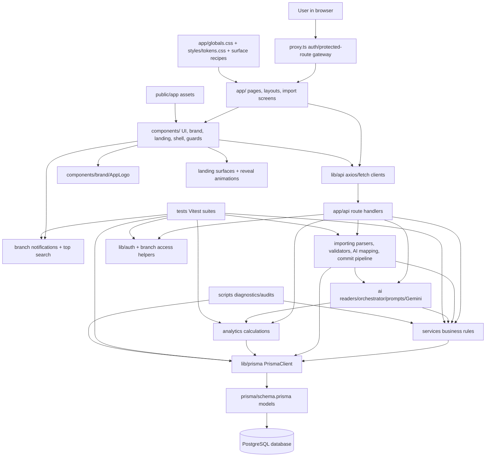

# Lab Lords Full App Source Knowledge Graph

Generated from the local repository inventory on 2026-05-16T08:40:14.059Z. This file is source-level and favors current accuracy over brevity. Secret values from environment files are redacted; generated/dependency internals are summarized rather than expanded.

## High-Level App Graph

## Inventory Scope

- Documented files in current inventory: 358.
- Source/config/text files: 356.
- Static asset files summarized: 2.
- Excluded from detailed expansion: `.git`, `.next`, `node_modules`, `app/generated/prisma`, `.agent/responsive-qa`, `tsconfig.tsbuildinfo`, transient build/dependency/VCS internals.
- Environment files are represented only by variable names with values redacted.

## Current Development Sync

- Import assistant is now a first-class branch workflow: UI pages live under `app/branch/[branchId]/onboarding/import`, API routes under `app/api/branches/[branchId]/import-sessions`, business logic under `importing/`, typed client calls under `lib/api/importSessions.ts`, Prisma persistence under `ImportSession`, `ImportRow`, `ImportQuestion`, and `ImportCommit`, and tests under `tests/unit/importing` plus `tests/unit/api/import-sessions.route.test.ts`.
- Branch navigation and permissions know about the import workflow through `components/layout/BranchSidebar.tsx`, `components/dashboard/QuickActions.tsx`, and `lib/branchPageAccess.ts`; it is guarded by effective student access.
- The public/auth shell has a shared brand system through `components/brand/AppLogo.tsx` and `app/icon.png`, with auth, invite, onboarding, org, landing, and sidebars using the same mark.
- Landing page work now uses `components/ui/landingSurface.ts`, `components/landing/LandingReveal.tsx`, and motion classes in `app/globals.css` for reveal, dashboard drift, scanline, live pulse, seat breathe, CTA shine, and reduced-motion behavior.
- Seat allocation assignment now batches allocation creation in `services/seatAllocation.service.ts` via Prisma `createManyAndReturn`, reducing per-shift create queries while preserving returned allocation rows for DTO mapping.

## Folder Knowledge Graph

### `.agent/`
- Responsibility: Local agent rules and generated/static agent metadata for coding-assistant behavior and lint snapshots.
- Included files documented: 3.
- File categories present: Documentation, Local agent metadata/rules.
- Notable child paths: `.agent/FRONTEND_AGENT_RULES.md`, `.agent/eslint.json`, `.agent/rules`.

### `.github/`
- Responsibility: GitHub automation such as CI workflow definitions.
- Included files documented: 1.
- File categories present: GitHub workflow/config.
- Notable child paths: `.github/workflows`.

### `.jules/`
- Responsibility: Local Jules/Bolt project instructions or metadata.
- Included files documented: 1.
- File categories present: Documentation.
- Notable child paths: `.jules/bolt.md`.

### `.clerk/`
- Responsibility: Local Clerk keyless-development metadata; values are summarized, not expanded.
- Included files documented: 2.
- File categories present: Documentation, Project file.
- Notable child paths: `.clerk/.tmp`.

### `ai/`
- Responsibility: Gemini client, AI contracts, prompts, readers, orchestration, risk detection, report generation, and message drafting.
- Included files documented: 21.
- File categories present: AI/Gemini module.
- Notable child paths: `ai/actionSuggestions`, `ai/branchHealthReport.ts`, `ai/contracts`, `ai/index.ts`, `ai/llm`, `ai/messageDrafting`, `ai/orchestrator`, `ai/prompts`, `ai/readers`, `ai/reports`, `ai/riskDetection`.

### `analytics/`
- Responsibility: Prisma-backed analytics calculations for branch/org health, payments, seats, students, and trend series.
- Included files documented: 8.
- File categories present: Analytics calculation module.
- Notable child paths: `analytics/branch.analytics.ts`, `analytics/org.analytics.ts`, `analytics/payment.analytics.ts`, `analytics/seat.analytics.ts`, `analytics/student.analytics.ts`, `analytics/trends`.

### `app/`
- Responsibility: Next.js App Router pages, layouts, loading/error states, auth/invite/import screens, and API route handlers.
- Included files documented: 82.
- File categories present: Next.js API route, Next.js app UI file, Next.js layout, Next.js page / screen, Static asset, Styling/token file.
- Notable child paths: `app/account`, `app/api`, `app/branch`, `app/error.tsx`, `app/globals.css`, `app/icon.png`, `app/invite`, `app/layout.tsx`, `app/loading.tsx`, `app/onboarding`, `app/org`, `app/page.tsx`, `app/sign-in`, `app/sign-up`.

### `components/`
- Responsibility: Reusable React UI organized by domain, brand, landing, layout, dashboards, settings, tables, and core UI/design-system surfaces.
- Included files documented: 68.
- File categories present: React UI/design-system module, React component.
- Notable child paths: `components/ai`, `components/allocations`, `components/analytics`, `components/auth`, `components/branch`, `components/brand`, `components/dashboard`, `components/landing`, `components/layout`, `components/payments`, `components/settings`, `components/snapshot`, `components/tables`, `components/ui`.

### `docs/`
- Responsibility: Project documentation, auth environment notes, generated knowledge graph, and AI checklists.
- Included files documented: 3.
- File categories present: Documentation, Generated documentation.
- Notable child paths: `docs/ai-production-checklist.md`, `docs/app-knowledge-graph.md`, `docs/auth-environments.md`.

### `hooks/`
- Responsibility: React hook files for analytics, org/branch state, branch access, and data view mode.
- Included files documented: 5.
- File categories present: React hook/helper.
- Notable child paths: `hooks/useAnalytics.ts`, `hooks/useBranch.ts`, `hooks/useBranchAccess.ts`, `hooks/useDataViewMode.ts`, `hooks/useOrg.ts`.

### `importing/`
- Responsibility: Import assistant pipeline: parsers, AI mapping, contracts, validators, preview/commit/session/question services, and utilities.
- Included files documented: 25.
- File categories present: Import assistant module.
- Notable child paths: `importing/ai`, `importing/contracts`, `importing/parsers`, `importing/services`, `importing/utils`, `importing/validators`.

### `lib/`
- Responsibility: Shared runtime helpers: Prisma client, auth/auth-mode, safe redirects, permission messages, branch access, branch notifications, top search, API clients, validation, mock data, and class-name utilities.
- Included files documented: 22.
- File categories present: Frontend API client wrapper, Shared library/helper.
- Notable child paths: `lib/api`, `lib/auth.ts`, `lib/branchNotifications.ts`, `lib/branchPageAccess.ts`, `lib/formValidation.ts`, `lib/mock-data.ts`, `lib/permissionMessages.ts`, `lib/prisma.ts`, `lib/safeRedirect.ts`, `lib/settingsValidation.ts`, `lib/topSearch.ts`, `lib/utils`, `lib/utils.ts`.

### `prisma/`
- Responsibility: Database schema, migrations, migration lock, and seed data.
- Included files documented: 25.
- File categories present: Prisma database schema, Prisma migration, Prisma seed/demo data.
- Notable child paths: `prisma/migrations`, `prisma/schema.prisma`, `prisma/seed.ts`.

### `public/`
- Responsibility: Static assets served by Next.js.
- Included files documented: 1.
- File categories present: Static asset.
- Notable child paths: `public/assets`.

### `scripts/`
- Responsibility: Operational/audit/debug scripts for auth env, database, payments, shifts, analytics, Gemini, and rate limiting.
- Included files documented: 11.
- File categories present: Diagnostic/verification script.
- Notable child paths: `scripts/audit_allocation_safety.ts`, `scripts/audit_analytics_consistency.ts`, `scripts/audit_payment_engine.ts`, `scripts/check-auth-env.ts`, `scripts/debug_payments.ts`, `scripts/list_branches.ts`, `scripts/test-gemini-connection.ts`, `scripts/verify-gemini-client.ts`, `scripts/verify-shifts.ts`, `scripts/verify_phase5_strict.ts`, `scripts/verify_rate_limit.ts`.

### `services/`
- Responsibility: Backend service layer containing core business rules, staff invites, permissions, payments, students, seats, shifts, and Prisma data access.
- Included files documented: 12.
- File categories present: Service-layer business logic.
- Notable child paths: `services/branch.service.ts`, `services/multiShift.service.ts`, `services/onboarding.service.ts`, `services/organization.service.ts`, `services/payment.service.ts`, `services/seat.service.ts`, `services/seatAllocation.service.ts`, `services/shift.service.ts`, `services/staff.service.ts`, `services/staffInvite.service.ts`, `services/student.service.ts`, `services/user.service.ts`.

### `styles/`
- Responsibility: Shared CSS token files.
- Included files documented: 1.
- File categories present: Styling/token file.
- Notable child paths: `styles/tokens.css`.

### `tests/`
- Responsibility: Vitest setup, factories, mocks, unit tests, integration tests, route tests, auth/access/search/import tests, and e2e-style tests.
- Included files documented: 34.
- File categories present: Vitest test/support file.
- Notable child paths: `tests/e2e`, `tests/factories`, `tests/integration`, `tests/mocks`, `tests/setup`, `tests/unit`.

### `types/`
- Responsibility: Shared TypeScript DTOs, enums, settings contracts, and domain types.
- Included files documented: 10.
- File categories present: Shared TypeScript domain type.
- Notable child paths: `types/branch.ts`, `types/enums.ts`, `types/index.ts`, `types/organization.ts`, `types/payment.ts`, `types/seatAllocation.ts`, `types/settings.ts`, `types/shift.ts`, `types/staff.ts`, `types/student.ts`.

### `utils/`
- Responsibility: Small utility modules for dates, money, formatting, and shift-time overlap logic.
- Included files documented: 4.
- File categories present: Utility helper.
- Notable child paths: `utils/dates.ts`, `utils/formatters.ts`, `utils/money.ts`, `utils/shiftTime.ts`.

### Generated/local artifact folders summarized only
- `.git/`: excluded because it is VCS state.
- `.next/`: excluded because it is generated build output.
- `node_modules/`: excluded because it is dependency output.
- `app/generated/prisma/`: excluded because it is generated Prisma Client output.
- `.agent/responsive-qa/`: excluded because it contains generated screenshot QA artifacts.

## Prisma Schema Knowledge Graph

Source: `prisma/schema.prisma`

This schema is the central database contract for the app. It uses PostgreSQL through Prisma, generates the Prisma JS client, and defines branch-scoped operational data plus organization/user identity, auth, staff invites, permission overrides, AI artifacts, audit logs, and import assistant persistence.

### Model `User`
- Fields/relations:
  - `id                     String         @id @default(cuid())`
  - `clerkId                String?        @unique`
  - `email                  String         @unique`
  - `name                   String?`
  - `phone                  String?`
  - `timezone               String         @default("Asia/Kolkata")`
  - `locale                 String         @default("en-IN")`
  - `dateFormat             String         @default("dd MMM yyyy")`
  - `themePreference        String         @default("dark")`
  - `densityPreference      String         @default("comfortable")`
  - `defaultMessageLanguage String         @default("en")`
  - `defaultLandingPage     String         @default("org")`
  - `createdAt              DateTime       @default(now())`
  - `organizations          Organization[]`
  - `staff                  Staff[]`
  - `auditLogs              AuditLog[]`
  - `importSessionsUploaded ImportSession[] @relation("ImportSessionUploadedBy")`
  - `importCommits          ImportCommit[]  @relation("ImportCommitCommittedBy")`
- Indexes/constraints:
  - None declared beyond primary key/default field constraints.
- Main code consumers detected: `.agent/FRONTEND_AGENT_RULES.md`, `.agent/eslint.json`, `.agent/rules/rules.md`, `ai/llm/gemini.client.ts`, `app/account/page.tsx`, `app/api/ai/branch/[branchId]/messages/route.ts`, `app/api/ai/branch/[branchId]/route.ts`, `app/api/analytics/branch/[branchId]/snapshot/route.ts`, `app/api/analytics/branch/[branchId]/trends/route.ts`, `app/api/analytics/org/[orgId]/snapshot/route.ts`, `app/api/analytics/org/[orgId]/trends/route.ts`, `app/api/branches/[branchId]/access/route.ts`, `app/api/branches/[branchId]/import-sessions/[sessionId]/analyze/route.ts`, `app/api/branches/[branchId]/import-sessions/[sessionId]/commit/route.ts`, `app/api/branches/[branchId]/import-sessions/[sessionId]/mapping/route.ts`, `app/api/branches/[branchId]/import-sessions/[sessionId]/preview/route.ts`, `app/api/branches/[branchId]/import-sessions/[sessionId]/questions/route.ts`, `app/api/branches/[branchId]/import-sessions/[sessionId]/route.ts`, `app/api/branches/[branchId]/import-sessions/[sessionId]/rows/route.ts`, `app/api/branches/[branchId]/import-sessions/route.ts`, `app/api/branches/[branchId]/multi-shifts/[multiShiftId]/route.ts`, `app/api/branches/[branchId]/multi-shifts/[multiShiftId]/seat-map/route.ts`, `app/api/branches/[branchId]/multi-shifts/route.ts`, `app/api/branches/[branchId]/payments/generate/route.ts`, `app/api/branches/[branchId]/payments/overdue/route.ts`, `app/api/branches/[branchId]/route.ts`, `app/api/branches/[branchId]/seat-allocations/route.ts`, `app/api/branches/[branchId]/seats/route.ts`, `app/api/branches/[branchId]/shifts/[shiftId]/analyze/route.ts`, `app/api/branches/[branchId]/shifts/[shiftId]/route.ts`, `app/api/branches/[branchId]/shifts/[shiftId]/seat-map/route.ts`, `app/api/branches/[branchId]/shifts/capacity/route.ts`, `app/api/branches/[branchId]/shifts/route.ts`, `app/api/branches/[branchId]/staff-invites/[inviteId]/route.ts`, `app/api/branches/[branchId]/staff-invites/route.ts`, `app/api/branches/[branchId]/staff/[staffId]/route.ts`, ... (+4 more).

### Model `Organization`
- Fields/relations:
  - `id               String   @id @default(cuid())`
  - `name             String`
  - `ownerId          String`
  - `businessType     String?`
  - `legalName        String?`
  - `contactEmail     String?`
  - `contactPhone     String?`
  - `address          String?`
  - `timezone         String   @default("Asia/Kolkata")`
  - `currency         String   @default("INR")`
  - `weekStartsOn     Int      @default(1)`
  - `paymentGraceDays Int      @default(0)`
  - `createdAt        DateTime @default(now())`
  - `branches         Branch[]`
  - `owner            User     @relation(fields: [ownerId], references: [id])`
- Indexes/constraints:
  - None declared beyond primary key/default field constraints.
- Main code consumers detected: `.agent/eslint.json`, `.agent/rules/rules.md`, `analytics/org.analytics.ts`, `app/api/analytics/org/[orgId]/snapshot/route.ts`, `app/api/analytics/org/[orgId]/trends/route.ts`, `app/api/branches/route.ts`, `app/api/onboarding/route.ts`, `app/api/organizations/[orgId]/branches/route.ts`, `app/api/organizations/[orgId]/route.ts`, `app/api/organizations/route.ts`, `app/branch/[branchId]/settings/page.tsx`, `app/invite/[token]/page.tsx`, `app/onboarding/page.tsx`, `app/org/[orgId]/analytics/page.tsx`, `app/org/[orgId]/page.tsx`, `app/org/[orgId]/settings/page.tsx`, `app/org/page.tsx`, `components/branch/CreateBranchDialog.tsx`, `components/layout/OrgSidebar.tsx`, `lib/api/analytics.ts`, `lib/api/organizations.ts`, `lib/permissionMessages.ts`, `prisma/migrations/20251227051340_add_student/migration.sql`, `prisma/migrations/20260115083737_add_price_to_shift/migration.sql`, `prisma/migrations/20260504120000_add_real_settings/migration.sql`, `prisma/seed.ts`, `product.md`, `scripts/audit_allocation_safety.ts`, `scripts/audit_analytics_consistency.ts`, `scripts/audit_payment_engine.ts`, `scripts/verify-shifts.ts`, `services/branch.service.ts`, `services/onboarding.service.ts`, `services/organization.service.ts`, `services/payment.service.ts`, `services/staff.service.ts`, ... (+4 more).

### Model `Branch`
- Fields/relations:
  - `id                     String           @id @default(cuid())`
  - `organizationId         String`
  - `name                   String`
  - `city                   String?`
  - `address                String?`
  - `contactPhone           String?`
  - `openingTime            String?`
  - `closingTime            String?`
  - `defaultFee             Int?             @default(0)`
  - `defaultAdmissionFee    Int?             @default(0)`
  - `defaultMessageLanguage String           @default("en")`
  - `reminderTone           String           @default("polite")`
  - `aiEnabled              Boolean          @default(true)`
  - `createdAt              DateTime         @default(now())`
  - `lastDataChange         DateTime         @default(now())`
  - `aiLastCalledAt         DateTime?`
  - `aiStatus               BranchAIStatus   @default(IDLE)`
  - `organization           Organization     @relation(fields: [organizationId], references: [id])`
  - `aiReports              BranchAIReport[]`
  - `messageDrafts          MessageDraft[]`
  - `multiShifts            MultiShift[]`
  - `payments               Payment[]`
  - `seats                  Seat[]`
  - `shifts                 Shift[]`
  - `staff                  Staff[]`
  - `staffInvites           StaffInvite[]`
  - `students               Student[]`
  - `auditLogs              AuditLog[]`
  - `importSessions         ImportSession[]`
- Indexes/constraints:
  - None declared beyond primary key/default field constraints.
- Main code consumers detected: `.agent/FRONTEND_AGENT_RULES.md`, `.agent/eslint.json`, `.agent/rules/rules.md`, `.jules/bolt.md`, `ai/branchHealthReport.ts`, `ai/contracts/branch.contract.ts`, `ai/index.ts`, `ai/orchestrator/branchAI.orchestrator.ts`, `ai/prompts/branchFullReport.prompt.ts`, `ai/prompts/branchHealth.prompt.ts`, `ai/readers/branch.reader.ts`, `ai/reports/branchFullReport.generator.ts`, `ai/riskDetection/branchRiskDetector.ts`, `analytics/branch.analytics.ts`, `analytics/org.analytics.ts`, `analytics/payment.analytics.ts`, `analytics/seat.analytics.ts`, `analytics/trends/branch.trends.ts`, `app/account/page.tsx`, `app/api/ai/branch/[branchId]/messages/route.ts`, `app/api/analytics/branch/[branchId]/snapshot/route.ts`, `app/api/analytics/branch/[branchId]/trends/route.ts`, `app/api/analytics/org/[orgId]/trends/route.ts`, `app/api/branches/[branchId]/multi-shifts/[multiShiftId]/seat-map/route.ts`, `app/api/branches/[branchId]/route.ts`, `app/api/branches/[branchId]/seats/route.ts`, `app/api/branches/[branchId]/staff/[staffId]/route.ts`, `app/api/branches/[branchId]/staff/route.ts`, `app/api/branches/route.ts`, `app/api/onboarding/route.ts`, `app/api/organizations/[orgId]/branches/route.ts`, `app/api/payments/[paymentId]/audit-log/route.ts`, `app/api/seat-allocations/route.ts`, `app/api/users/me/route.ts`, `app/branch/[branchId]/ai/insights/page.tsx`, `app/branch/[branchId]/ai/messages/page.tsx`, ... (+4 more).

### Model `Student`
- Fields/relations:
  - `id              String           @id @default(cuid())`
  - `branchId        String`
  - `name            String`
  - `phone           String?`
  - `status          StudentStatus    @default(ACTIVE)`
  - `joinedAt        DateTime         @default(now())`
  - `monthlyFee      Int              @default(0)`
  - `feeLinkedShiftId String?`
  - `feeLinkedMultiShiftId String?`
  - `createdAt       DateTime         @default(now())`
  - `updatedAt       DateTime         @updatedAt`
  - `messageDrafts   MessageDraft[]`
  - `payments        Payment[]`
  - `seatAllocations SeatAllocation[]`
  - `branch          Branch           @relation(fields: [branchId], references: [id])`
- Indexes/constraints:
  - `@@index([branchId])`
  - `@@index([feeLinkedShiftId])`
  - `@@index([feeLinkedMultiShiftId])`
- Main code consumers detected: `.agent/eslint.json`, `.jules/bolt.md`, `ai/messageDrafting/branchMessageDrafter.ts`, `ai/riskDetection/branchRiskDetector.ts`, `analytics/branch.analytics.ts`, `analytics/payment.analytics.ts`, `analytics/student.analytics.ts`, `app/api/branches/[branchId]/multi-shifts/[multiShiftId]/seat-map/route.ts`, `app/api/branches/[branchId]/shifts/capacity/route.ts`, `app/api/branches/[branchId]/students/route.ts`, `app/api/students/[studentId]/status/route.ts`, `app/branch/[branchId]/ai/messages/page.tsx`, `app/branch/[branchId]/ai/reports/page.tsx`, `app/branch/[branchId]/allocations/page.tsx`, `app/branch/[branchId]/onboarding/import/[sessionId]/page.tsx`, `app/branch/[branchId]/onboarding/import/page.tsx`, `app/branch/[branchId]/overdue/page.tsx`, `app/branch/[branchId]/page.tsx`, `app/branch/[branchId]/payments/page.tsx`, `app/branch/[branchId]/seats/page.tsx`, `app/branch/[branchId]/settings/page.tsx`, `app/branch/[branchId]/shifts/page.tsx`, `app/branch/[branchId]/staff/page.tsx`, `app/branch/[branchId]/students/AddStudentDialog.tsx`, `app/branch/[branchId]/students/EditStudentDialog.tsx`, `app/branch/[branchId]/students/page.tsx`, `app/org/[orgId]/analytics/page.tsx`, `app/org/[orgId]/page.tsx`, `components/ai/BranchHealthPanel.tsx`, `components/allocations/AllocateSeatDialog.tsx`, `components/allocations/AllocationsTable.tsx`, `components/allocations/SeatPicker.tsx`, `components/dashboard/OverdueTable.tsx`, `components/dashboard/QuickActions.tsx`, `components/dashboard/RecentActivity.tsx`, `components/dashboard/RecentStudents.tsx`, ... (+4 more).

### Model `Seat`
- Fields/relations:
  - `id              String           @id @default(cuid())`
  - `branchId        String`
  - `label           String`
  - `createdAt       DateTime         @default(now())`
  - `branch          Branch           @relation(fields: [branchId], references: [id])`
  - `seatAllocations SeatAllocation[]`
- Indexes/constraints:
  - `@@unique([branchId, label])`
  - `@@index([branchId])`
- Main code consumers detected: `.agent/FRONTEND_AGENT_RULES.md`, `.agent/eslint.json`, `.agent/rules/rules.md`, `.jules/bolt.md`, `ai/riskDetection/branchRiskDetector.ts`, `analytics/branch.analytics.ts`, `analytics/seat.analytics.ts`, `analytics/student.analytics.ts`, `analytics/trends/seat.trends.ts`, `app/api/analytics/branch/[branchId]/trends/route.ts`, `app/api/branches/[branchId]/multi-shifts/[multiShiftId]/seat-map/route.ts`, `app/api/branches/[branchId]/seat-allocations/route.ts`, `app/api/branches/[branchId]/seats/route.ts`, `app/api/branches/[branchId]/shifts/[shiftId]/seat-map/route.ts`, `app/api/branches/[branchId]/shifts/capacity/route.ts`, `app/api/seat-allocations/[allocationId]/route.ts`, `app/api/seat-allocations/route.ts`, `app/branch/[branchId]/allocations/page.tsx`, `app/branch/[branchId]/analytics/page.tsx`, `app/branch/[branchId]/onboarding/import/[sessionId]/page.tsx`, `app/branch/[branchId]/onboarding/import/page.tsx`, `app/branch/[branchId]/page.tsx`, `app/branch/[branchId]/seats/AddSeatDialog.tsx`, `app/branch/[branchId]/seats/page.tsx`, `app/branch/[branchId]/settings/page.tsx`, `app/branch/[branchId]/shifts/page.tsx`, `app/branch/[branchId]/staff/page.tsx`, `app/branch/[branchId]/students/AddStudentDialog.tsx`, `app/branch/[branchId]/students/page.tsx`, `app/globals.css`, `app/onboarding/page.tsx`, `app/org/[orgId]/analytics/page.tsx`, `components/ai/BranchHealthPanel.tsx`, `components/allocations/AllocateSeatDialog.tsx`, `components/allocations/AllocationsTable.tsx`, `components/allocations/MultiShiftSeatPicker.tsx`, ... (+4 more).

### Model `Shift`
- Fields/relations:
  - `id                   String                @id @default(cuid())`
  - `branchId             String`
  - `name                 String`
  - `startTime            String?`
  - `endTime              String?`
  - `price                Int                   @default(0)`
  - `isReserved           Boolean               @default(false)`
  - `status               ShiftStatus           @default(ACTIVE)`
  - `deletedAt            DateTime?`
  - `createdAt            DateTime              @default(now())`
  - `seatAllocations      SeatAllocation[]`
  - `multiShiftComponents MultiShiftComponent[]`
  - `branch               Branch                @relation(fields: [branchId], references: [id])`
- Indexes/constraints:
  - `@@index([branchId])`
  - `@@index([branchId, status])`
- Main code consumers detected: `.agent/eslint.json`, `.agent/rules/rules.md`, `.jules/bolt.md`, `AGENTS.md`, `ai/contracts/branch.contract.ts`, `ai/prompts/branchFullReport.prompt.ts`, `ai/prompts/branchHealth.prompt.ts`, `analytics/branch.analytics.ts`, `analytics/seat.analytics.ts`, `app/api/branches/[branchId]/multi-shifts/[multiShiftId]/route.ts`, `app/api/branches/[branchId]/multi-shifts/[multiShiftId]/seat-map/route.ts`, `app/api/branches/[branchId]/multi-shifts/route.ts`, `app/api/branches/[branchId]/shifts/[shiftId]/analyze/route.ts`, `app/api/branches/[branchId]/shifts/[shiftId]/route.ts`, `app/api/branches/[branchId]/shifts/capacity/route.ts`, `app/api/branches/[branchId]/shifts/route.ts`, `app/api/branches/[branchId]/students/route.ts`, `app/api/seat-allocations/[allocationId]/route.ts`, `app/branch/[branchId]/allocations/page.tsx`, `app/branch/[branchId]/analytics/page.tsx`, `app/branch/[branchId]/onboarding/import/[sessionId]/page.tsx`, `app/branch/[branchId]/onboarding/import/page.tsx`, `app/branch/[branchId]/page.tsx`, `app/branch/[branchId]/seats/page.tsx`, `app/branch/[branchId]/settings/page.tsx`, `app/branch/[branchId]/shifts/page.tsx`, `app/branch/[branchId]/students/AddStudentDialog.tsx`, `app/branch/[branchId]/students/EditStudentDialog.tsx`, `app/branch/[branchId]/students/page.tsx`, `app/onboarding/page.tsx`, `components/allocations/AllocateSeatDialog.tsx`, `components/allocations/AllocationsTable.tsx`, `components/allocations/MultiShiftSeatPicker.tsx`, `components/allocations/SeatPicker.tsx`, `components/allocations/UpdateAllocationDialog.tsx`, `components/branch/CreateBranchDialog.tsx`, ... (+4 more).

### Model `MultiShift`
- Fields/relations:
  - `id          String                @id @default(cuid())`
  - `branchId    String`
  - `name        String`
  - `price       Int                   @default(0)`
  - `createdAt   DateTime              @default(now())`
  - `branch      Branch                @relation(fields: [branchId], references: [id])`
  - `components  MultiShiftComponent[]`
  - `allocations SeatAllocation[]`
- Indexes/constraints:
  - `@@unique([branchId, name])`
  - `@@index([branchId])`
- Main code consumers detected: `.agent/eslint.json`, `.agent/rules/rules.md`, `app/api/branches/[branchId]/multi-shifts/[multiShiftId]/route.ts`, `app/api/branches/[branchId]/multi-shifts/[multiShiftId]/seat-map/route.ts`, `app/api/branches/[branchId]/multi-shifts/route.ts`, `app/branch/[branchId]/allocations/page.tsx`, `app/branch/[branchId]/onboarding/import/[sessionId]/page.tsx`, `app/branch/[branchId]/seats/page.tsx`, `app/branch/[branchId]/shifts/page.tsx`, `app/branch/[branchId]/students/AddStudentDialog.tsx`, `app/branch/[branchId]/students/page.tsx`, `components/allocations/AllocateSeatDialog.tsx`, `components/allocations/AllocationsTable.tsx`, `components/allocations/SeatPicker.tsx`, `components/allocations/UpdateAllocationDialog.tsx`, `importing/contracts/import-session.contract.ts`, `importing/services/import-commit.service.ts`, `importing/services/import-preview.service.ts`, `importing/services/import-session.service.ts`, `importing/utils/column-normalizer.ts`, `importing/utils/row-normalizer.ts`, `importing/validators/import-allocation.validator.ts`, `importing/validators/import-shift.validator.ts`, `importing/validators/import-student.validator.ts`, `lib/api/students.ts`, `lib/branchNotifications.ts`, `prisma/migrations/20260328092418_add_multi_shift/migration.sql`, `services/multiShift.service.ts`, `services/seat.service.ts`, `services/seatAllocation.service.ts`, `services/student.service.ts`, `test_infrastructure_plan.md`, `tests/integration/services/multiShift.test.ts`, `tests/integration/services/seat.test.ts`, `tests/setup/db.ts`, `tests/unit/importing/import-commit.service.test.ts`, ... (+1 more).

### Model `MultiShiftComponent`
- Fields/relations:
  - `id           String     @id @default(cuid())`
  - `multiShiftId String`
  - `shiftId      String`
  - `order        Int        @default(0)`
  - `multiShift   MultiShift @relation(fields: [multiShiftId], references: [id], onDelete: Cascade)`
  - `shift        Shift      @relation(fields: [shiftId], references: [id])`
- Indexes/constraints:
  - `@@unique([multiShiftId, shiftId])`
- Main code consumers detected: `prisma/migrations/20260328092418_add_multi_shift/migration.sql`, `test_infrastructure_plan.md`, `tests/setup/db.ts`.

### Model `SeatAllocation`
- Fields/relations:
  - `id           String      @id @default(cuid())`
  - `seatId       String`
  - `studentId    String`
  - `shiftId      String`
  - `multiShiftId String?`
  - `startDate    DateTime    @default(now())`
  - `endDate      DateTime?`
  - `seat         Seat        @relation(fields: [seatId], references: [id])`
  - `shift        Shift       @relation(fields: [shiftId], references: [id])`
  - `student      Student     @relation(fields: [studentId], references: [id])`
  - `multiShift   MultiShift? @relation(fields: [multiShiftId], references: [id])`
- Indexes/constraints:
  - `@@index([seatId, shiftId])`
  - `@@index([studentId])`
  - `@@index([multiShiftId])`
- Main code consumers detected: `.agent/eslint.json`, `.agent/rules/rules.md`, `.jules/bolt.md`, `analytics/student.analytics.ts`, `app/api/branches/[branchId]/seat-allocations/route.ts`, `app/api/seat-allocations/[allocationId]/end/route.ts`, `app/api/seat-allocations/[allocationId]/route.ts`, `app/api/seat-allocations/route.ts`, `importing/services/import-commit.service.ts`, `importing/services/import-session.service.ts`, `lib/api/seats.ts`, `prisma/migrations/20251227070853_add_seat_allocation/migration.sql`, `prisma/migrations/20260328092418_add_multi_shift/migration.sql`, `prisma/seed.ts`, `product.md`, `scripts/audit_allocation_safety.ts`, `scripts/verify-shifts.ts`, `services/multiShift.service.ts`, `services/seat.service.ts`, `services/seatAllocation.service.ts`, `services/shift.service.ts`, `services/student.service.ts`, `test_infrastructure_plan.md`, `tests/e2e/onboarding.test.ts`, `tests/factories/index.ts`, `tests/integration/services/multiShift.test.ts`, `tests/integration/services/seat.test.ts`, `tests/integration/services/seatAllocation.test.ts`, `tests/integration/services/shift.test.ts`, `tests/integration/services/student.test.ts`, `tests/setup/db.ts`, `tests/unit/importing/import-commit.service.test.ts`, `types/index.ts`.

### Model `Payment`
- Fields/relations:
  - `id            String          @id @default(cuid())`
  - `branchId      String`
  - `studentId     String`
  - `periodStart   DateTime`
  - `periodEnd     DateTime`
  - `dueDate       DateTime`
  - `amount        Int`
  - `status        PaymentStatus   @default(DUE)`
  - `paidAt        DateTime?`
  - `paymentMethod PaymentMethod?`
  - `referenceId   String?`
  - `type          PaymentType     @default(MONTHLY)`
  - `createdAt     DateTime        @default(now())`
  - `branch        Branch          @relation(fields: [branchId], references: [id])`
  - `student       Student         @relation(fields: [studentId], references: [id])`
- Indexes/constraints:
  - `@@unique([studentId, periodStart])`
  - `@@index([branchId, dueDate])`
- Main code consumers detected: `.agent/FRONTEND_AGENT_RULES.md`, `.agent/eslint.json`, `.agent/rules/rules.md`, `.jules/bolt.md`, `ai/contracts/payment.contract.ts`, `ai/index.ts`, `ai/messageDrafting/branchMessageDrafter.ts`, `ai/readers/payment.reader.ts`, `ai/riskDetection/branchRiskDetector.ts`, `analytics/branch.analytics.ts`, `analytics/payment.analytics.ts`, `analytics/trends/payment.trends.ts`, `app/api/analytics/branch/[branchId]/snapshot/route.ts`, `app/api/analytics/branch/[branchId]/trends/route.ts`, `app/api/branches/[branchId]/payments/generate/route.ts`, `app/api/branches/[branchId]/payments/overdue/route.ts`, `app/api/branches/[branchId]/payments/route.ts`, `app/api/payments/[paymentId]/audit-log/route.ts`, `app/api/payments/[paymentId]/pay/route.ts`, `app/api/payments/[paymentId]/waive/route.ts`, `app/branch/[branchId]/ai/messages/page.tsx`, `app/branch/[branchId]/analytics/page.tsx`, `app/branch/[branchId]/onboarding/import/[sessionId]/page.tsx`, `app/branch/[branchId]/onboarding/import/page.tsx`, `app/branch/[branchId]/overdue/page.tsx`, `app/branch/[branchId]/page.tsx`, `app/branch/[branchId]/payments/page.tsx`, `app/branch/[branchId]/settings/page.tsx`, `app/branch/[branchId]/staff/page.tsx`, `app/branch/[branchId]/students/page.tsx`, `app/org/[orgId]/page.tsx`, `app/org/[orgId]/settings/page.tsx`, `components/dashboard/OverdueTable.tsx`, `components/dashboard/QuickActions.tsx`, `components/dashboard/RecentActivity.tsx`, `components/landing/LandingFeatures.tsx`, ... (+4 more).

### Model `Staff`
- Fields/relations:
  - `id        String    @id @default(cuid())`
  - `userId    String`
  - `branchId  String`
  - `role      StaffRole`
  - `createdAt DateTime  @default(now())`
  - `branch    Branch    @relation(fields: [branchId], references: [id])`
  - `user      User      @relation(fields: [userId], references: [id])`
  - `permissionOverrides StaffPermissionOverride[]`
- Indexes/constraints:
  - `@@unique([userId, branchId])`
  - `@@index([branchId])`
- Main code consumers detected: `.agent/eslint.json`, `.agent/rules/rules.md`, `README.md`, `app/account/page.tsx`, `app/api/ai/branch/[branchId]/messages/route.ts`, `app/api/ai/branch/[branchId]/route.ts`, `app/api/analytics/branch/[branchId]/snapshot/route.ts`, `app/api/analytics/branch/[branchId]/trends/route.ts`, `app/api/branches/[branchId]/access/route.ts`, `app/api/branches/[branchId]/multi-shifts/[multiShiftId]/seat-map/route.ts`, `app/api/branches/[branchId]/staff-invites/route.ts`, `app/api/branches/[branchId]/staff/[staffId]/route.ts`, `app/api/branches/[branchId]/staff/route.ts`, `app/api/payments/[paymentId]/audit-log/route.ts`, `app/branch/[branchId]/settings/page.tsx`, `app/branch/[branchId]/staff/page.tsx`, `app/invite/[token]/page.tsx`, `components/auth/BranchAccessGuard.tsx`, `components/landing/LandingFeatures.tsx`, `components/landing/LandingHero.tsx`, `components/landing/LandingHowItWorks.tsx`, `components/landing/LandingMockup.tsx`, `components/layout/BranchNotifications.tsx`, `components/layout/BranchSidebar.tsx`, `components/layout/BranchTopSearch.tsx`, `docs/auth-environments.md`, `importing/services/import-commit.service.ts`, `importing/services/import-session.service.ts`, `lib/api/branches.ts`, `lib/api/staff.ts`, `lib/branchNotifications.ts`, `lib/branchPageAccess.ts`, `lib/permissionMessages.ts`, `lib/topSearch.ts`, `prisma/migrations/20251230060937_add_staff_roles/migration.sql`, `prisma/migrations/20260507103000_add_staff_permission_overrides/migration.sql`, ... (+4 more).

### Model `StaffPermissionOverride`
- Fields/relations:
  - `id        String                @id @default(cuid())`
  - `staffId   String`
  - `action    StaffPermissionAction`
  - `allowed   Boolean`
  - `createdAt DateTime              @default(now())`
  - `updatedAt DateTime              @updatedAt`
  - `staff     Staff                 @relation(fields: [staffId], references: [id], onDelete: Cascade)`
- Indexes/constraints:
  - `@@unique([staffId, action])`
  - `@@index([staffId])`
- Main code consumers detected: `lib/api/staff.ts`, `prisma/migrations/20260507103000_add_staff_permission_overrides/migration.sql`, `services/staff.service.ts`, `tests/integration/services/branch.test.ts`, `tests/integration/services/staff.test.ts`, `tests/setup/db.ts`.

### Model `StaffInvite`
- Fields/relations:
  - `id         String    @id @default(cuid())`
  - `branchId   String`
  - `role       StaffRole`
  - `token      String    @unique`
  - `expiresAt  DateTime`
  - `acceptedAt DateTime?`
  - `createdAt  DateTime  @default(now())`
  - `branch     Branch    @relation(fields: [branchId], references: [id])`
- Indexes/constraints:
  - `@@index([branchId])`
  - `@@index([expiresAt])`
- Main code consumers detected: `app/api/branches/[branchId]/staff-invites/[inviteId]/route.ts`, `app/api/branches/[branchId]/staff-invites/route.ts`, `app/invite/[token]/page.tsx`, `prisma/migrations/20260506173000_add_staff_invites/migration.sql`, `services/staffInvite.service.ts`, `tests/integration/services/staffInvite.test.ts`, `tests/setup/db.ts`.

### Model `BranchAIReport`
- Fields/relations:
  - `id        String   @id @default(cuid())`
  - `branchId  String`
  - `data      Json`
  - `createdAt DateTime @default(now())`
  - `branch    Branch   @relation(fields: [branchId], references: [id])`
- Indexes/constraints:
  - `@@index([branchId, createdAt])`
- Main code consumers detected: `ai/orchestrator/branchAI.orchestrator.ts`, `prisma/migrations/20260219050254_add_ai_rate_limiting/migration.sql`, `prisma/seed.ts`, `product.md`, `test_infrastructure_plan.md`, `tests/setup/db.ts`.

### Model `MessageDraft`
- Fields/relations:
  - `id        String   @id @default(cuid())`
  - `branchId  String`
  - `studentId String?`
  - `action    String`
  - `language  String   @default("en")`
  - `message   String`
  - `createdAt DateTime @default(now())`
  - `branch    Branch   @relation(fields: [branchId], references: [id])`
  - `student   Student? @relation(fields: [studentId], references: [id])`
- Indexes/constraints:
  - `@@index([branchId, studentId])`
- Main code consumers detected: `.agent/eslint.json`, `ai/messageDrafting/branchMessageDrafter.ts`, `components/ai/MessageDraft.tsx`, `prisma/migrations/20260219050254_add_ai_rate_limiting/migration.sql`, `prisma/seed.ts`, `product.md`, `services/payment.service.ts`, `test_infrastructure_plan.md`, `tests/e2e/onboarding.test.ts`, `tests/integration/services/payment.test.ts`, `tests/setup/db.ts`.

### Model `ImportSession`
- Fields/relations:
  - `id               String              @id @default(cuid())`
  - `branchId          String`
  - `uploadedByUserId  String`
  - `sourceType        ImportSourceType`
  - `fileName          String?`
  - `fileMeta          Json?`
  - `status            ImportSessionStatus @default(UPLOADED)`
  - `mapping           Json?`
  - `summary           Json?`
  - `createdAt         DateTime            @default(now())`
  - `updatedAt         DateTime            @updatedAt`
  - `branch            Branch              @relation(fields: [branchId], references: [id], onDelete: Cascade)`
  - `uploadedBy        User                @relation("ImportSessionUploadedBy", fields: [uploadedByUserId], references: [id])`
  - `rows              ImportRow[]`
  - `questions         ImportQuestion[]`
  - `commits           ImportCommit[]`
- Indexes/constraints:
  - `@@index([branchId])`
  - `@@index([uploadedByUserId])`
  - `@@index([branchId, createdAt])`
- Main code consumers detected: `importing/services/import-commit.service.ts`, `importing/services/import-question.service.ts`, `importing/services/import-session.service.ts`, `prisma/migrations/20260514143000_add_import_sessions/migration.sql`, `tests/setup/db.ts`, `tests/unit/importing/import-commit.service.test.ts`.

### Model `ImportRow`
- Fields/relations:
  - `id               String          @id @default(cuid())`
  - `importSessionId  String`
  - `rowNumber        Int`
  - `rawData          Json`
  - `mappedData       Json?`
  - `normalizedData   Json?`
  - `status           ImportRowStatus @default(NEEDS_REVIEW)`
  - `issues           Json?`
  - `warnings         Json?`
  - `confidence       Int?`
  - `skipped          Boolean         @default(false)`
  - `createdEntityIds Json?`
  - `createdAt        DateTime        @default(now())`
  - `updatedAt        DateTime        @updatedAt`
  - `session          ImportSession   @relation(fields: [importSessionId], references: [id], onDelete: Cascade)`
- Indexes/constraints:
  - `@@index([importSessionId])`
  - `@@index([status])`
- Main code consumers detected: `app/branch/[branchId]/onboarding/import/[sessionId]/page.tsx`, `importing/services/import-commit.service.ts`, `importing/services/import-session.service.ts`, `prisma/migrations/20260514143000_add_import_sessions/migration.sql`, `tests/setup/db.ts`, `tests/unit/importing/import-commit.service.test.ts`.

### Model `ImportQuestion`
- Fields/relations:
  - `id              String               @id @default(cuid())`
  - `importSessionId String`
  - `rowId           String?`
  - `field           String?`
  - `question        String`
  - `options         Json?`
  - `answer          Json?`
  - `status          ImportQuestionStatus @default(OPEN)`
  - `createdAt       DateTime             @default(now())`
  - `answeredAt      DateTime?`
  - `session         ImportSession        @relation(fields: [importSessionId], references: [id], onDelete: Cascade)`
- Indexes/constraints:
  - `@@index([importSessionId])`
  - `@@index([status])`
- Main code consumers detected: `app/branch/[branchId]/onboarding/import/[sessionId]/page.tsx`, `importing/services/import-question.service.ts`, `importing/services/import-session.service.ts`, `prisma/migrations/20260514143000_add_import_sessions/migration.sql`, `tests/setup/db.ts`.

### Model `ImportCommit`
- Fields/relations:
  - `id                String             @id @default(cuid())`
  - `importSessionId   String`
  - `committedByUserId String`
  - `status            ImportCommitStatus`
  - `summary           Json`
  - `errors            Json?`
  - `createdAt         DateTime           @default(now())`
  - `session           ImportSession      @relation(fields: [importSessionId], references: [id], onDelete: Cascade)`
  - `committedBy       User               @relation("ImportCommitCommittedBy", fields: [committedByUserId], references: [id])`
- Indexes/constraints:
  - `@@index([importSessionId])`
- Main code consumers detected: `importing/services/import-commit.service.ts`, `prisma/migrations/20260514143000_add_import_sessions/migration.sql`, `tests/setup/db.ts`, `tests/unit/importing/import-commit.service.test.ts`.

### Model `AuditLog`
- Fields/relations:
  - `id        String      @id @default(cuid())`
  - `branchId  String`
  - `userId    String`
  - `action    AuditAction`
  - `paymentId String`
  - `details   Json`
  - `createdAt DateTime    @default(now())`
  - `branch Branch @relation(fields: [branchId], references: [id])`
  - `user   User   @relation(fields: [userId], references: [id])`
- Indexes/constraints:
  - `@@index([branchId])`
  - `@@index([paymentId])`
- Main code consumers detected: `.agent/eslint.json`, `app/api/payments/[paymentId]/audit-log/route.ts`, `app/branch/[branchId]/payments/page.tsx`, `prisma/migrations/20260425143443_add_audit_log/migration.sql`, `services/payment.service.ts`, `services/student.service.ts`, `tests/integration/services/payment.test.ts`, `tests/integration/services/student.test.ts`, `tests/setup/db.ts`, `tests/unit/api/payment-audit-log.route.test.ts`.

### Enum `StudentStatus`
Values: `ACTIVE`, `INACTIVE`.
Main consumers detected: `.agent/eslint.json`, `analytics/branch.analytics.ts`, `app/api/branches/[branchId]/students/route.ts`, `app/api/students/[studentId]/status/route.ts`, `app/branch/[branchId]/students/page.tsx`, `lib/api/students.ts`, `prisma/migrations/20251227051340_add_student/migration.sql`, `prisma/seed.ts`, `scripts/audit_allocation_safety.ts`, `scripts/audit_analytics_consistency.ts`, `scripts/audit_payment_engine.ts`, `services/payment.service.ts`, `services/seatAllocation.service.ts`, `services/student.service.ts`, `test_infrastructure_plan.md`, `types/enums.ts`.

### Enum `ShiftStatus`
Values: `ACTIVE`, `INACTIVE`.
Main consumers detected: `prisma/migrations/20260302072450_add_shift_soft_delete/migration.sql`, `test_infrastructure_plan.md`.

### Enum `PaymentStatus`
Values: `DUE`, `PAID`, `WAIVED`.
Main consumers detected: `.agent/eslint.json`, `analytics/payment.analytics.ts`, `app/api/branches/[branchId]/payments/route.ts`, `app/branch/[branchId]/payments/page.tsx`, `components/dashboard/OverdueTable.tsx`, `importing/contracts/import-session.contract.ts`, `importing/utils/row-normalizer.ts`, `prisma/migrations/20251229060148_add_payment/migration.sql`, `prisma/migrations/20260227090001_new_enumin_payment/migration.sql`, `prisma/seed.ts`, `scripts/audit_analytics_consistency.ts`, `scripts/audit_payment_engine.ts`, `services/payment.service.ts`, `services/student.service.ts`, `test_infrastructure_plan.md`, `tests/unit/lib/paymentStatus.test.ts`, `types/enums.ts`.

### Enum `StaffRole`
Values: `MANAGER`, `STAFF`.
Main consumers detected: `.agent/eslint.json`, `app/api/branches/[branchId]/staff-invites/route.ts`, `app/api/branches/[branchId]/staff/[staffId]/route.ts`, `app/api/branches/[branchId]/staff/route.ts`, `lib/api/staff.ts`, `prisma/migrations/20251230060937_add_staff_roles/migration.sql`, `prisma/migrations/20260506173000_add_staff_invites/migration.sql`, `prisma/seed.ts`, `services/staff.service.ts`, `services/staffInvite.service.ts`, `test_infrastructure_plan.md`, `tests/integration/services/staff.test.ts`, `tests/integration/services/staffInvite.test.ts`, `types/enums.ts`, `types/staff.ts`.

### Enum `StaffPermissionAction`
Values: `MANAGE_BRANCH`, `STUDENTS`, `SEAT_ALLOCATION`, `VIEW_PAYMENTS`, `GENERATE_PAYMENTS`, `MARK_PAYMENT_PAID`, `WAIVE_PAYMENTS`, `ANALYTICS`.
Main consumers detected: `prisma/migrations/20260507103000_add_staff_permission_overrides/migration.sql`, `services/staff.service.ts`, `tests/integration/services/staff.test.ts`, `tests/unit/services/staff.test.ts`, `types/enums.ts`.

### Enum `PaymentType`
Values: `ADMISSION`, `MONTHLY`.
Main consumers detected: `prisma/migrations/20260219050254_add_ai_rate_limiting/migration.sql`, `prisma/seed.ts`, `services/payment.service.ts`, `services/student.service.ts`, `test_infrastructure_plan.md`, `types/enums.ts`.

### Enum `BranchAIStatus`
Values: `IDLE`, `RUNNING`.
Main consumers detected: `prisma/migrations/20260219055724_add_ai_status/migration.sql`, `test_infrastructure_plan.md`.

### Enum `ImportSourceType`
Values: `CSV`, `XLSX`, `XLS`, `PDF`, `PASTED_TABLE`, `OTHER`.
Main consumers detected: `app/api/branches/[branchId]/import-sessions/route.ts`, `importing/contracts/import-session.contract.ts`, `prisma/migrations/20260514143000_add_import_sessions/migration.sql`, `types/enums.ts`.

### Enum `ImportSessionStatus`
Values: `UPLOADED`, `ANALYZING`, `NEEDS_MAPPING`, `NEEDS_INFO`, `VALIDATED`, `READY_TO_COMMIT`, `COMMITTING`, `COMMITTED`, `PARTIAL`, `FAILED`, `CANCELLED`.
Main consumers detected: `importing/contracts/import-session.contract.ts`, `importing/services/import-session.service.ts`, `prisma/migrations/20260514143000_add_import_sessions/migration.sql`, `types/enums.ts`.

### Enum `ImportRowStatus`
Values: `READY`, `NEEDS_REVIEW`, `BLOCKED`, `WARNING`, `DUPLICATE`, `CONFLICT`, `IMPORTED`, `FAILED`, `SKIPPED`.
Main consumers detected: `importing/contracts/import-session.contract.ts`, `importing/services/import-session.service.ts`, `prisma/migrations/20260514143000_add_import_sessions/migration.sql`, `types/enums.ts`.

### Enum `ImportQuestionStatus`
Values: `OPEN`, `ANSWERED`, `CANCELLED`.
Main consumers detected: `importing/contracts/import-session.contract.ts`, `prisma/migrations/20260514143000_add_import_sessions/migration.sql`, `types/enums.ts`.

### Enum `ImportCommitStatus`
Values: `SUCCESS`, `PARTIAL`, `FAILED`.
Main consumers detected: `importing/contracts/import-session.contract.ts`, `prisma/migrations/20260514143000_add_import_sessions/migration.sql`, `types/enums.ts`.

### Enum `PaymentMethod`
Values: `CASH`, `UPI`, `BANK_TRANSFER`.
Main consumers detected: `.agent/eslint.json`, `app/api/payments/[paymentId]/pay/route.ts`, `app/branch/[branchId]/payments/page.tsx`, `importing/contracts/import-session.contract.ts`, `importing/services/import-commit.service.ts`, `importing/utils/row-normalizer.ts`, `prisma/migrations/20260426055443_add_payment_method/migration.sql`, `services/payment.service.ts`, `tests/integration/services/payment.test.ts`, `types/enums.ts`.

### Enum `AuditAction`
Values: `PAYMENT_MARKED_PAID`, `PAYMENT_WAIVED`.
Main consumers detected: `prisma/migrations/20260425143443_add_audit_log/migration.sql`.

## API Route Index

| Route | Methods | File | Local dependencies | Models touched |
| --- | --- | --- | --- | --- |
| /api/ai/branch/[branchId]/messages | GET | app/api/ai/branch/[branchId]/messages/route.ts | `@/ai/messageDrafting/branchMessageDrafter`, `@/lib/auth`, `@/lib/prisma`, `@/services/staff.service` | `Branch` |
| /api/ai/branch/[branchId] | GET | app/api/ai/branch/[branchId]/route.ts | `@/ai/orchestrator/branchAI.orchestrator`, `@/lib/auth`, `@/services/staff.service` | - |
| /api/analytics/branch/[branchId]/snapshot | GET | app/api/analytics/branch/[branchId]/snapshot/route.ts | `@/analytics/branch.analytics`, `@/analytics/payment.analytics`, `@/lib/auth`, `@/services/staff.service` | `Branch` |
| /api/analytics/branch/[branchId]/trends | GET | app/api/analytics/branch/[branchId]/trends/route.ts | `@/analytics/payment.analytics`, `@/analytics/trends/branch.trends`, `@/analytics/trends/payment.trends`, `@/analytics/trends/seat.trends`, `@/lib/auth`, ... (+1 more) | `Branch`, `Seat` |
| /api/analytics/org/[orgId]/snapshot | GET | app/api/analytics/org/[orgId]/snapshot/route.ts | `@/analytics/org.analytics`, `@/lib/auth`, `@/services/organization.service` | - |
| /api/analytics/org/[orgId]/trends | GET | app/api/analytics/org/[orgId]/trends/route.ts | `@/lib/auth`, `@/services/organization.service` | `Organization` |
| /api/branches/[branchId]/access | GET | app/api/branches/[branchId]/access/route.ts | `@/lib/auth`, `@/services/staff.service` | - |
| /api/branches/[branchId]/import-sessions/[sessionId]/analyze | POST | app/api/branches/[branchId]/import-sessions/[sessionId]/analyze/route.ts | `@/importing/services/import-session.service`, `@/lib/auth` | - |
| /api/branches/[branchId]/import-sessions/[sessionId]/commit | POST | app/api/branches/[branchId]/import-sessions/[sessionId]/commit/route.ts | `@/importing/contracts/import-session.contract`, `@/importing/services/import-commit.service`, `@/lib/auth` | - |
| /api/branches/[branchId]/import-sessions/[sessionId]/mapping | PATCH | app/api/branches/[branchId]/import-sessions/[sessionId]/mapping/route.ts | `@/importing/services/import-session.service`, `@/lib/auth` | - |
| /api/branches/[branchId]/import-sessions/[sessionId]/preview | GET | app/api/branches/[branchId]/import-sessions/[sessionId]/preview/route.ts | `@/importing/contracts/import-session.contract`, `@/importing/services/import-preview.service`, `@/lib/auth` | - |
| /api/branches/[branchId]/import-sessions/[sessionId]/questions | GET, POST | app/api/branches/[branchId]/import-sessions/[sessionId]/questions/route.ts | `@/importing/services/import-question.service`, `@/lib/auth` | - |
| /api/branches/[branchId]/import-sessions/[sessionId] | GET | app/api/branches/[branchId]/import-sessions/[sessionId]/route.ts | `@/importing/services/import-session.service`, `@/lib/auth` | - |
| /api/branches/[branchId]/import-sessions/[sessionId]/rows | PATCH | app/api/branches/[branchId]/import-sessions/[sessionId]/rows/route.ts | `@/importing/services/import-session.service`, `@/lib/auth` | - |
| /api/branches/[branchId]/import-sessions | POST, GET | app/api/branches/[branchId]/import-sessions/route.ts | `@/app/generated/prisma/enums`, `@/importing/services/import-session.service`, `@/lib/auth` | - |
| /api/branches/[branchId]/multi-shifts/[multiShiftId] | PATCH, DELETE | app/api/branches/[branchId]/multi-shifts/[multiShiftId]/route.ts | `@/lib/auth`, `@/lib/formValidation`, `@/services/multiShift.service` | - |
| /api/branches/[branchId]/multi-shifts/[multiShiftId]/seat-map | GET | app/api/branches/[branchId]/multi-shifts/[multiShiftId]/seat-map/route.ts | `@/lib/auth`, `@/lib/prisma`, `@/services/staff.service` | `MultiShift`, `Seat`, `Shift` |
| /api/branches/[branchId]/multi-shifts | GET, POST | app/api/branches/[branchId]/multi-shifts/route.ts | `@/lib/auth`, `@/lib/formValidation`, `@/services/multiShift.service` | - |
| /api/branches/[branchId]/payments/generate | POST | app/api/branches/[branchId]/payments/generate/route.ts | `@/lib/auth`, `@/services/payment.service` | - |
| /api/branches/[branchId]/payments/overdue | GET | app/api/branches/[branchId]/payments/overdue/route.ts | `@/analytics/payment.analytics`, `@/lib/auth`, `@/services/payment.service` | - |
| /api/branches/[branchId]/payments | GET | app/api/branches/[branchId]/payments/route.ts | `@/app/generated/prisma/enums`, `@/lib/auth`, `@/services/payment.service` | - |
| /api/branches/[branchId] | GET, PATCH | app/api/branches/[branchId]/route.ts | `@/lib/auth`, `@/services/branch.service` | `Branch` |
| /api/branches/[branchId]/seat-allocations | POST, GET | app/api/branches/[branchId]/seat-allocations/route.ts | `@/lib/auth`, `@/services/seatAllocation.service` | - |
| /api/branches/[branchId]/seats | GET, POST | app/api/branches/[branchId]/seats/route.ts | `@/lib/auth`, `@/lib/formValidation`, `@/services/seat.service` | `Branch` |
| /api/branches/[branchId]/shifts/[shiftId]/analyze | GET | app/api/branches/[branchId]/shifts/[shiftId]/analyze/route.ts | `@/lib/auth`, `@/services/shift.service` | - |
| /api/branches/[branchId]/shifts/[shiftId] | PATCH, DELETE | app/api/branches/[branchId]/shifts/[shiftId]/route.ts | `@/lib/auth`, `@/lib/formValidation`, `@/services/shift.service` | `Shift` |
| /api/branches/[branchId]/shifts/[shiftId]/seat-map | GET | app/api/branches/[branchId]/shifts/[shiftId]/seat-map/route.ts | `@/lib/auth`, `@/services/seat.service` | - |
| /api/branches/[branchId]/shifts/capacity | GET | app/api/branches/[branchId]/shifts/capacity/route.ts | `@/lib/auth`, `@/services/seat.service` | - |
| /api/branches/[branchId]/shifts | GET, POST | app/api/branches/[branchId]/shifts/route.ts | `@/lib/auth`, `@/lib/formValidation`, `@/services/shift.service` | `Shift` |
| /api/branches/[branchId]/staff-invites/[inviteId] | DELETE | app/api/branches/[branchId]/staff-invites/[inviteId]/route.ts | `@/lib/auth`, `@/services/staffInvite.service` | - |
| /api/branches/[branchId]/staff-invites | GET, POST | app/api/branches/[branchId]/staff-invites/route.ts | `@/lib/auth`, `@/services/staffInvite.service`, `@/types` | - |
| /api/branches/[branchId]/staff/[staffId] | DELETE, PATCH | app/api/branches/[branchId]/staff/[staffId]/route.ts | `@/lib/auth`, `@/services/staff.service`, `@/types` | - |
| /api/branches/[branchId]/staff | GET, POST | app/api/branches/[branchId]/staff/route.ts | `@/lib/auth`, `@/services/staff.service`, `@/types` | - |
| /api/branches/[branchId]/students | POST, GET, PATCH | app/api/branches/[branchId]/students/route.ts | `@/app/generated/prisma/enums`, `@/lib/auth`, `@/lib/formValidation`, `@/services/student.service`, `@/types` | `Student` |
| /api/branches | POST | app/api/branches/route.ts | `@/lib/auth`, `@/lib/formValidation`, `@/services/branch.service`, `@/services/organization.service` | `Branch` |
| /api/onboarding | POST | app/api/onboarding/route.ts | `@/lib/auth`, `@/lib/formValidation`, `@/services/onboarding.service` | `Branch`, `Organization` |
| /api/organizations/[orgId]/branches | GET, POST | app/api/organizations/[orgId]/branches/route.ts | `@/lib/auth`, `@/lib/formValidation`, `@/services/branch.service`, `@/services/organization.service` | `Branch` |
| /api/organizations/[orgId] | GET, PATCH | app/api/organizations/[orgId]/route.ts | `@/lib/auth`, `@/services/organization.service` | - |
| /api/organizations | GET, POST | app/api/organizations/route.ts | `@/lib/auth`, `@/lib/formValidation`, `@/services/organization.service` | `Organization` |
| /api/payments/[paymentId]/audit-log | GET | app/api/payments/[paymentId]/audit-log/route.ts | `@/lib/auth`, `@/lib/prisma`, `@/services/staff.service` | `AuditLog`, `Payment` |
| /api/payments/[paymentId]/pay | PATCH | app/api/payments/[paymentId]/pay/route.ts | `@/lib/auth`, `@/services/payment.service`, `@/types` | - |
| /api/payments/[paymentId]/waive | PATCH | app/api/payments/[paymentId]/waive/route.ts | `@/lib/auth`, `@/services/payment.service` | - |
| /api/seat-allocations/[allocationId]/end | POST | app/api/seat-allocations/[allocationId]/end/route.ts | `@/lib/auth`, `@/services/seatAllocation.service` | - |
| /api/seat-allocations/[allocationId] | PUT, PATCH | app/api/seat-allocations/[allocationId]/route.ts | `@/lib/auth`, `@/services/seatAllocation.service` | - |
| /api/seat-allocations | POST | app/api/seat-allocations/route.ts | `@/lib/auth`, `@/services/seatAllocation.service` | `Branch` |
| /api/students/[studentId]/status | PATCH | app/api/students/[studentId]/status/route.ts | `@/app/generated/prisma/enums`, `@/lib/auth`, `@/services/student.service` | - |
| /api/users/me | GET, PATCH | app/api/users/me/route.ts | `@/lib/auth`, `@/services/user.service` | `User` |

## Service To Domain Index

| Service file | Exports/symbols | Prisma/domain models | Local dependencies |
| --- | --- | --- | --- |
| importing/services/import-commit.service.ts | `ImportCommitService` | `ImportCommit`, `ImportRow`, `ImportSession`, `MultiShift`, `Seat`, `Shift` | `./import-session.service`, `@/app/generated/prisma/client`, `@/app/generated/prisma/enums`, `@/importing/contracts/import-session.contract`, `@/lib/prisma`, `@/services/multiShift.service`, `@/services/payment.service`, `@/services/seat.service`, ... (+4 more) |
| importing/services/import-preview.service.ts | `ImportPreviewService` | - | `./import-session.service`, `@/importing/contracts/import-preview.contract`, `@/importing/contracts/import-session.contract` |
| importing/services/import-question.service.ts | `ImportQuestionService` | `ImportQuestion`, `ImportSession` | `./import-session.service`, `@/app/generated/prisma/client`, `@/importing/contracts/import-session.contract`, `@/importing/utils/column-normalizer`, `@/lib/prisma` |
| importing/services/import-session.service.ts | `ImportSessionService` | `Branch`, `ImportQuestion`, `ImportRow`, `ImportSession`, `SeatAllocation` | `@/app/generated/prisma/client`, `@/app/generated/prisma/enums`, `@/importing/ai/import-column-mapper.ai`, `@/importing/contracts/import-session.contract`, `@/importing/parsers/csv.parser`, `@/importing/parsers/pasted-table.parser`, `@/importing/parsers/pdf.parser`, `@/importing/parsers/xlsx.parser`, ... (+11 more) |
| services/branch.service.ts | `BranchService` | `Branch`, `Organization` | `./shift.service`, `./staff.service`, `@/lib/formValidation`, `@/lib/prisma`, `@/lib/settingsValidation`, `@/types` |
| services/multiShift.service.ts | `CreateMultiShiftDto`, `MultiShiftItem`, `MultiShiftService`, `UpdateMultiShiftDto` | `Branch`, `MultiShift`, `Shift` | `@/lib/formValidation`, `@/lib/prisma`, `@/services/staff.service`, `@/types` |
| services/onboarding.service.ts | `OnboardingService` | `Branch`, `Organization`, `Staff`, `User` | `@/lib/formValidation`, `@/lib/prisma` |
| services/organization.service.ts | `OrganizationService` | `Organization`, `Payment` | `@/lib/formValidation`, `@/lib/prisma`, `@/lib/settingsValidation`, `@/types` |
| services/payment.service.ts | `PaymentService` | `Branch`, `Payment`, `Student`, `User` | `@/app/generated/prisma/client`, `@/lib/prisma`, `@/services/staff.service`, `@/types` |
| services/seat.service.ts | `SeatOccupancySnapshot`, `SeatService` | `Branch`, `MultiShift`, `Seat`, `SeatAllocation`, `Shift` | `@/lib/formValidation`, `@/lib/prisma`, `@/services/staff.service`, `@/types`, `@/utils/shiftTime` |
| services/seatAllocation.service.ts | `SeatAllocationService` | `Branch`, `Seat`, `SeatAllocation`, `Shift`, `Student`, `User` | `@/app/generated/prisma/client`, `@/lib/prisma`, `@/services/staff.service`, `@/types`, `@/utils/shiftTime` |
| services/shift.service.ts | `DEFAULT_SHIFTS`, `ResolutionPlan`, `ShiftImpactAnalysis`, `ShiftService` | `Branch`, `Seat`, `SeatAllocation`, `Shift`, `Student` | `@/app/generated/prisma/client`, `@/lib/formValidation`, `@/lib/prisma`, `@/services/staff.service`, `@/types`, `@/utils/shiftTime` |
| services/staff.service.ts | `PERMISSION_MATRIX`, `StaffService` | `Branch`, `Organization`, `Staff`, `User` | `@/lib/prisma`, `@/types` |
| services/staffInvite.service.ts | `StaffInviteService` | - | `@/lib/prisma`, `@/services/staff.service`, `@/types` |
| services/student.service.ts | `StudentService` | `Branch`, `Student` | `@/app/generated/prisma/client`, `@/lib/formValidation`, `@/lib/prisma`, `@/services/seatAllocation.service`, `@/services/staff.service`, `@/types` |
| services/user.service.ts | `UserService` | `User` | `@/lib/prisma`, `@/lib/settingsValidation`, `@/types` |

## Frontend Screen/Layout Index

| Route | File | Kind | Local dependencies | API endpoints |
| --- | --- | --- | --- | --- |
| /account | app/account/page.tsx | Next.js page / screen | `@/components/settings/SettingsWorkspace`, `@/components/ui`, `@/components/ui/InlineFieldError`, `@/components/ui/pageSurface`, `@/lib/formValidation` | `/api/users/me` |
| /branch/[branchId]/ai/insights | app/branch/[branchId]/ai/insights/page.tsx | Next.js page / screen | `@/components/auth/BranchAccessGuard`, `@/components/layout/PageHeader`, `@/components/ui`, `@/components/ui/Badge`, `@/components/ui/formSurface`, `@/components/ui/pageSurface`, `@/lib/branchPageAccess`, `@/lib/utils` | - |
| /branch/[branchId]/ai/messages | app/branch/[branchId]/ai/messages/page.tsx | Next.js page / screen | `@/components/auth/BranchAccessGuard`, `@/components/layout/PageHeader`, `@/components/ui`, `@/components/ui/formSurface`, `@/components/ui/pageSurface`, `@/lib/branchPageAccess`, `@/lib/utils` | `/api/users/me` |
| /branch/[branchId]/ai/reports | app/branch/[branchId]/ai/reports/page.tsx | Next.js page / screen | `@/ai/contracts/structuredReport.contract`, `@/components/ai/BranchHealthPanel`, `@/components/auth/BranchAccessGuard`, `@/components/layout/PageHeader`, `@/components/ui`, `@/components/ui/Badge`, `@/components/ui/pageSurface`, `@/lib/branchPageAccess`, ... (+1 more) | - |
| /branch/[branchId]/allocations | app/branch/[branchId]/allocations/page.tsx | Next.js page / screen | `@/components/allocations/AllocateSeatDialog`, `@/components/allocations/AllocationsTable`, `@/components/allocations/UpdateAllocationDialog`, `@/components/auth/BranchAccessGuard`, `@/components/tables/ViewToggle`, `@/components/ui`, `@/components/ui/pageSurface`, `@/hooks/useDataViewMode`, ... (+2 more) | - |
| /branch/[branchId]/analytics | app/branch/[branchId]/analytics/page.tsx | Next.js page / screen | `@/components/auth/BranchAccessGuard`, `@/components/layout/PageHeader`, `@/components/snapshot/KpiRow`, `@/components/snapshot/MainChart`, `@/components/snapshot/SideStats`, `@/components/ui`, `@/components/ui/Badge`, `@/components/ui/formSurface`, ... (+5 more) | - |
| /branch/[branchId] | app/branch/[branchId]/layout.tsx | Next.js layout | `@/components/layout/AppShell`, `@/components/layout/BranchSidebar` | - |
| /branch/[branchId]/onboarding/import/[sessionId] | app/branch/[branchId]/onboarding/import/[sessionId]/page.tsx | Next.js page / screen | `@/components/auth/BranchAccessGuard`, `@/components/ui`, `@/components/ui/Badge`, `@/components/ui/ConfirmDialog`, `@/components/ui/pageSurface`, `@/importing/contracts/import-session.contract`, `@/lib/api/importSessions`, `@/lib/utils` | - |
| /branch/[branchId]/onboarding/import | app/branch/[branchId]/onboarding/import/page.tsx | Next.js page / screen | `@/components/auth/BranchAccessGuard`, `@/components/ui`, `@/components/ui/Badge`, `@/components/ui/pageSurface`, `@/lib/api/importSessions`, `@/lib/utils` | - |
| /branch/[branchId]/overdue | app/branch/[branchId]/overdue/page.tsx | Next.js page / screen | `@/components/auth/BranchAccessGuard`, `@/components/ui`, `@/components/ui/Badge`, `@/components/ui/formSurface`, `@/components/ui/pageSurface`, `@/lib/branchPageAccess`, `@/lib/utils` | `/api/users/me` |
| /branch/[branchId] | app/branch/[branchId]/page.tsx | Next.js page / screen | `@/components/dashboard/OverdueTable`, `@/components/dashboard/QuickActions`, `@/components/dashboard/RecentActivity`, `@/components/dashboard/RecentStudents`, `@/components/dashboard/ShiftOccupancyCard`, `@/components/dashboard/StatCard`, `@/components/ui`, `@/hooks/useBranchAccess`, ... (+2 more) | - |
| /branch/[branchId]/payments | app/branch/[branchId]/payments/page.tsx | Next.js page / screen | `@/app/generated/prisma/browser`, `@/components/auth/BranchAccessGuard`, `@/components/payments/PaymentAuditLog`, `@/components/tables/DataTable`, `@/components/tables/ViewToggle`, `@/components/ui`, `@/components/ui/Badge`, `@/components/ui/ConfirmDialog`, ... (+9 more) | - |
| /branch/[branchId]/seats | app/branch/[branchId]/seats/page.tsx | Next.js page / screen | `./AddSeatDialog`, `@/app/generated/prisma/browser`, `@/components/allocations/AllocateSeatDialog`, `@/components/auth/BranchAccessGuard`, `@/components/tables/DataTable`, `@/components/tables/ViewToggle`, `@/components/ui`, `@/components/ui/Badge`, ... (+7 more) | - |
| /branch/[branchId]/settings | app/branch/[branchId]/settings/page.tsx | Next.js page / screen | `@/components/auth/BranchAccessGuard`, `@/components/settings/SettingsWorkspace`, `@/components/ui`, `@/components/ui/Badge`, `@/components/ui/InlineFieldError`, `@/components/ui/formSurface`, `@/components/ui/pageSurface`, `@/lib/branchPageAccess`, ... (+2 more) | - |
| /branch/[branchId]/shifts | app/branch/[branchId]/shifts/page.tsx | Next.js page / screen | `@/components/auth/BranchAccessGuard`, `@/components/ui`, `@/components/ui/Badge`, `@/components/ui/Button`, `@/components/ui/InlineFieldError`, `@/components/ui/RowActionsMenu`, `@/components/ui/formSurface`, `@/components/ui/pageSurface`, ... (+5 more) | - |
| /branch/[branchId]/staff | app/branch/[branchId]/staff/page.tsx | Next.js page / screen | `@/components/auth/BranchAccessGuard`, `@/components/layout/PageHeader`, `@/components/ui/Badge`, `@/components/ui/Button`, `@/components/ui/Card`, `@/components/ui/ConfirmDialog`, `@/components/ui/InlineFieldError`, `@/components/ui/RowActionsMenu`, ... (+8 more) | - |
| /branch/[branchId]/students | app/branch/[branchId]/students/page.tsx | Next.js page / screen | `./AddStudentDialog`, `./EditStudentDialog`, `@/app/generated/prisma/browser`, `@/components/auth/BranchAccessGuard`, `@/components/tables/DataTable`, `@/components/tables/ViewToggle`, `@/components/ui`, `@/components/ui/Badge`, ... (+12 more) | - |
| / | app/error.tsx | Next.js app UI file | `@/components/ui`, `@/components/ui/entrySurface`, `@/components/ui/formSurface`, `@/lib/utils` | - |
| /invite/[token] | app/invite/[token]/page.tsx | Next.js page / screen | `@/components/brand/AppLogo`, `@/components/ui/AmbientBackground`, `@/components/ui/Badge`, `@/components/ui/entrySurface`, `@/lib/auth`, `@/lib/utils`, `@/services/staffInvite.service` | - |
| / | app/layout.tsx | Next.js layout | `@/components/analytics/AnalyticsProvider`, `@/lib/site` | - |
| / | app/loading.tsx | Next.js app UI file | `@/components/ui/pageSurface` | - |
| /onboarding | app/onboarding/page.tsx | Next.js page / screen | `@/components/brand/AppLogo`, `@/components/ui`, `@/components/ui/InlineFieldError`, `@/components/ui/entrySurface`, `@/components/ui/formSurface`, `@/lib/api/core`, `@/lib/formValidation`, `@/lib/utils` | - |
| /org/[orgId]/analytics | app/org/[orgId]/analytics/page.tsx | Next.js page / screen | `@/components/dashboard/StatCard`, `@/components/tables/DataTable`, `@/components/ui`, `@/components/ui/Badge`, `@/components/ui/formSurface`, `@/components/ui/pageSurface`, `@/lib/api/analytics`, `@/lib/utils` | - |
| /org/[orgId] | app/org/[orgId]/layout.tsx | Next.js layout | `@/components/layout/AppShell`, `@/components/layout/OrgSidebar` | - |
| /org/[orgId] | app/org/[orgId]/page.tsx | Next.js page / screen | `@/components/branch/CreateBranchDialog`, `@/components/dashboard/StatCard`, `@/components/ui`, `@/components/ui/Badge`, `@/components/ui/formSurface`, `@/components/ui/pageSurface`, `@/lib/api/analytics`, `@/lib/api/organizations`, ... (+1 more) | - |
| /org/[orgId]/settings | app/org/[orgId]/settings/page.tsx | Next.js page / screen | `@/components/settings/SettingsWorkspace`, `@/components/ui`, `@/components/ui/InlineFieldError`, `@/components/ui/pageSurface`, `@/lib/formValidation` | - |
| /org | app/org/page.tsx | Next.js page / screen | `@/app/generated/prisma/browser`, `@/components/brand/AppLogo`, `@/components/ui/AmbientBackground`, `@/components/ui/Badge`, `@/components/ui/entrySurface`, `@/components/ui/formSurface`, `@/components/ui/pageSurface`, `@/lib/api/organizations`, ... (+1 more) | - |
| / | app/page.tsx | Next.js page / screen | `@/components/landing/LandingFeatures`, `@/components/landing/LandingFooter`, `@/components/landing/LandingHero`, `@/components/landing/LandingHowItWorks`, `@/components/landing/LandingMockup`, `@/components/landing/LandingNavbar`, `@/components/landing/LandingPricing`, `@/components/ui/landingSurface`, ... (+3 more) | - |
| /sign-in/[[...sign-in]] | app/sign-in/[[...sign-in]]/page.tsx | Next.js page / screen | `@/components/auth/AuthPageShell`, `@/components/ui/entrySurface`, `@/lib/safeRedirect` | - |
| /sign-up/[[...sign-up]] | app/sign-up/[[...sign-up]]/page.tsx | Next.js page / screen | `@/components/auth/AuthPageShell`, `@/components/ui/entrySurface`, `@/lib/safeRedirect` | - |

## Migration Index

| Migration | Operations | Touched schema tokens |
| --- | --- | --- |
| prisma/migrations/20251225100329_init/migration.sql | CREATE TABLE, CREATE UNIQUE INDEX | User, User_email_key, User_pkey, email, id, name |
| prisma/migrations/20251227051340_add_student/migration.sql | ALTER TABLE, CREATE INDEX, CREATE TABLE, CREATE TYPE | Branch, Branch_organizationId_fkey, Branch_pkey, Organization, Organization_ownerId_fkey, Organization_pkey, Student, StudentStatus, Student_branchId_fkey, Student_branchId_idx, Student_pkey, User, branchId, createdAt, id, joinedAt, name, organizationId, ... (+3 more) |
| prisma/migrations/20251227060107_add_seat/migration.sql | ALTER TABLE, CREATE INDEX, CREATE TABLE, CREATE UNIQUE INDEX | Branch, Seat, Seat_branchId_fkey, Seat_branchId_idx, Seat_branchId_label_key, Seat_pkey, branchId, createdAt, id, label |
| prisma/migrations/20251227061935_add_shift/migration.sql | ALTER TABLE, CREATE INDEX, CREATE TABLE, CREATE UNIQUE INDEX | Branch, Shift, Shift_branchId_fkey, Shift_branchId_idx, Shift_branchId_name_key, Shift_pkey, branchId, createdAt, endTime, id, name, startTime |
| prisma/migrations/20251227070853_add_seat_allocation/migration.sql | ALTER TABLE, CREATE INDEX, CREATE TABLE | Seat, SeatAllocation, SeatAllocation_pkey, SeatAllocation_seatId_fkey, SeatAllocation_seatId_shiftId_idx, SeatAllocation_shiftId_fkey, SeatAllocation_studentId_fkey, SeatAllocation_studentId_idx, Shift, Student, endDate, id, seatId, shiftId, startDate, studentId |
| prisma/migrations/20251229060148_add_payment/migration.sql | ALTER TABLE, CREATE INDEX, CREATE TABLE, CREATE TYPE, CREATE UNIQUE INDEX | Branch, Payment, PaymentStatus, Payment_branchId_dueDate_idx, Payment_branchId_fkey, Payment_pkey, Payment_studentId_fkey, Payment_studentId_periodStart_key, Student, amount, branchId, createdAt, dueDate, id, paidAt, periodEnd, periodStart, status, ... (+1 more) |
| prisma/migrations/20251230060937_add_staff_roles/migration.sql | ALTER TABLE, CREATE INDEX, CREATE TABLE, CREATE TYPE, CREATE UNIQUE INDEX | Branch, Staff, StaffRole, Staff_branchId_fkey, Staff_branchId_idx, Staff_pkey, Staff_userId_branchId_key, Staff_userId_fkey, User, branchId, createdAt, id, role, userId |
| prisma/migrations/20260115083737_add_price_to_shift/migration.sql | ALTER TABLE | Branch, Organization, Shift, businessType, city, defaultFee, price |
| prisma/migrations/20260117050125_impl_shifts/migration.sql | ALTER TABLE | Shift, isReserved |
| prisma/migrations/20260219050254_add_ai_rate_limiting/migration.sql | ALTER TABLE, CREATE INDEX, CREATE TABLE, CREATE TYPE | Branch, BranchAIReport, BranchAIReport_branchId_createdAt_idx, BranchAIReport_branchId_fkey, BranchAIReport_pkey, MessageDraft, MessageDraft_branchId_fkey, MessageDraft_branchId_studentId_idx, MessageDraft_pkey, MessageDraft_studentId_fkey, Payment, PaymentType, Student, action, branchId, createdAt, data, id, ... (+6 more) |
| prisma/migrations/20260219055724_add_ai_status/migration.sql | ALTER TABLE, CREATE TYPE | Branch, BranchAIStatus, aiLastCalledAt, aiStatus |
| prisma/migrations/20260227090001_new_enumin_payment/migration.sql | ALTER TABLE, ALTER TYPE | PaymentStatus, Student, updatedAt |
| prisma/migrations/20260302072450_add_shift_soft_delete/migration.sql | ALTER TABLE, CREATE INDEX, CREATE TYPE | Shift, ShiftStatus, Shift_branchId_status_idx, branchId, deletedAt, status |
| prisma/migrations/20260328092418_add_multi_shift/migration.sql | ALTER TABLE, CREATE INDEX, CREATE TABLE, CREATE UNIQUE INDEX, DROP INDEX | Branch, MultiShift, MultiShiftComponent, MultiShiftComponent_multiShiftId_fkey, MultiShiftComponent_multiShiftId_shiftId_key, MultiShiftComponent_pkey, MultiShiftComponent_shiftId_fkey, MultiShift_branchId_fkey, MultiShift_branchId_idx, MultiShift_branchId_name_key, MultiShift_pkey, SeatAllocation, SeatAllocation_multiShiftId_fkey, SeatAllocation_multiShiftId_idx, Shift, Shift_branchId_name_key, branchId, createdAt, ... (+6 more) |
| prisma/migrations/20260425143443_add_audit_log/migration.sql | ALTER TABLE, CREATE INDEX, CREATE TABLE, CREATE TYPE | AuditAction, AuditLog, AuditLog_branchId_fkey, AuditLog_branchId_idx, AuditLog_paymentId_idx, AuditLog_pkey, AuditLog_userId_fkey, Branch, User, action, branchId, createdAt, details, id, paymentId, userId |
| prisma/migrations/20260426055443_add_payment_method/migration.sql | ALTER TABLE, CREATE TYPE | Payment, PaymentMethod, paymentMethod, referenceId |
| prisma/migrations/20260504000000_add_student_fee_links/migration.sql | ALTER TABLE, CREATE INDEX | Student, Student_feeLinkedMultiShiftId_idx, Student_feeLinkedShiftId_idx, feeLinkedMultiShiftId, feeLinkedShiftId |
| prisma/migrations/20260504120000_add_real_settings/migration.sql | ALTER TABLE | Branch, Organization, User, address, aiEnabled, closingTime, contactEmail, contactPhone, currency, dateFormat, defaultAdmissionFee, defaultLandingPage, defaultMessageLanguage, densityPreference, legalName, locale, openingTime, paymentGraceDays, ... (+5 more) |
| prisma/migrations/20260506100000_add_clerk_user_id/migration.sql | ALTER TABLE, CREATE UNIQUE INDEX | User, User_clerkId_key, clerkId |
| prisma/migrations/20260506173000_add_staff_invites/migration.sql | ALTER TABLE, CREATE INDEX, CREATE TABLE, CREATE UNIQUE INDEX | Branch, StaffInvite, StaffInvite_branchId_fkey, StaffInvite_branchId_idx, StaffInvite_expiresAt_idx, StaffInvite_pkey, StaffInvite_token_key, StaffRole, acceptedAt, branchId, createdAt, expiresAt, id, role, token |
| prisma/migrations/20260507103000_add_staff_permission_overrides/migration.sql | ALTER TABLE, CREATE INDEX, CREATE TABLE, CREATE TYPE, CREATE UNIQUE INDEX | Staff, StaffPermissionAction, StaffPermissionOverride, StaffPermissionOverride_pkey, StaffPermissionOverride_staffId_action_key, StaffPermissionOverride_staffId_fkey, StaffPermissionOverride_staffId_idx, action, allowed, createdAt, id, staffId, updatedAt |
| prisma/migrations/20260514143000_add_import_sessions/migration.sql | ALTER TABLE, CREATE INDEX, CREATE TABLE, CREATE TYPE | ImportCommitStatus, ImportQuestionStatus, ImportRow, ImportRowStatus, ImportSession, ImportSessionStatus, ImportSession_pkey, ImportSourceType, branchId, createdAt, fileMeta, fileName, id, importSessionId, mappedData, mapping, normalizedData, rawData, ... (+6 more) |

## Subsystem Maps

### Authentication, Invites, And Branch Access
- `proxy.ts` protects `/org`, `/branch`, `/account`, `/onboarding`, and `/invite` paths. `lib/auth.ts` bridges Clerk/local bypass identity to local `User` rows. `services/staff.service.ts`, `lib/branchPageAccess.ts`, and `components/auth/BranchAccessGuard.tsx` turn role defaults plus permission overrides into route access decisions.
- Staff invitation flow spans `StaffInvite`, `services/staffInvite.service.ts`, invite API routes, `app/invite/[token]/page.tsx`, staff management UI, branch notifications, and owner-only invite alerts.

### Import Assistant
- Ingestion starts from branch UI (`app/branch/[branchId]/onboarding/import/page.tsx`) and `lib/api/importSessions.ts`, then persists source metadata in `ImportSession` with rows, questions, and commits as child records.
- Parsers cover pasted tables, CSV, XLS/XLSX, and PDF placeholders. Column normalization and AI mapping produce mappings, row normalizers/validators classify records, question services collect missing answers, preview service computes commit readiness, and commit service creates students through `StudentService.createImportedStudent`.
- API handlers are intentionally thin under `app/api/branches/[branchId]/import-sessions/**`, delegating session creation, analysis, row edits, mapping updates, preview, questions, and commit behavior to importing services.

### Brand, Landing, And Shell
- `components/brand/AppLogo.tsx` centralizes the Lab Lords mark/wordmark. Landing sections use shared `landingSurface` recipes plus `LandingReveal` and global landing animation classes. Branch/org sidebars and auth/invite/onboarding pages use the shared mark.
- Branch shell combines `BranchSidebar`, `BranchTopSearch`, `BranchNotifications`, `BranchAccessGuard`, and page-specific `PageHeader`/surface components for permission-aware operations.

### Student Lifecycle
- Student creation/update lives in `services/student.service.ts`, branch student APIs, student dialogs/pages, fee linking to shifts/multi-shifts, admission payments, duplicate identity checks, and status transitions that close allocations and resolve dues.
- Imported students enter through `CreateImportedStudentDto`, import commit service, and the same StudentService authorization/creation path to avoid a parallel student-write contract.

### Seat Allocation And Shift Overlap
- `utils/shiftTime.ts` owns overlap semantics, including null/full-day and midnight-crossing windows. `services/seatAllocation.service.ts` validates seat/student conflicts, active status, multi-shift bundles, capacity, and uses batch creation for new allocations.
- Shift deletion/reallocation flows and seat map APIs preserve allocation history by ending or moving active allocation rows rather than deleting history.

### Payment Generation, Pay, Waive, Audit
- `services/payment.service.ts`, payment route handlers, `lib/utils/paymentStatus.ts`, audit-log routes, and analytics modules coordinate due generation, overdue classification, pay/waive actions, monthly views, audit trails, and permission gates.

### Settings Persistence
- Account, organization, and branch settings are validated through `lib/settingsValidation.ts`, persisted through user/org/branch services, and surfaced through settings pages/components behind Clerk authentication.

### AI Branch Report And Messages
- AI flows read branch/payment/org snapshots, build health/risk/action suggestion contracts, call Gemini via `ai/llm/gemini.client.ts`, persist branch reports/message drafts, and feed branch AI pages. Import column mapping also uses AI helpers but remains isolated under `importing/ai`.

### Analytics Snapshot And Trends
- Branch/org route handlers delegate to analytics modules for payment, seat, student, branch, and trend data. Tests cover canonical due/overdue ledgers and slot-based utilization math.

## Test Coverage Index

| Test/support file | Local dependencies | Named blocks |
| --- | --- | --- |
| tests/e2e/onboarding.test.ts | `@/services/payment.service`, `@/services/student.service`, `@/tests/factories`, `@/tests/mocks`, `@/tests/setup/db` | E2E Flow: Month-End Billing, E2E Flow: Student Admission Journey, FLOW: Create student -> Seat gets occupied -> Admission payment created, FLOW: Generate payments -> Student appears overdue -> Mark paid -> Draft cleared |
| tests/factories/index.ts | `../setup/db` | - |
| tests/integration/analytics/payment.analytics.test.ts | `@/analytics/org.analytics`, `@/analytics/payment.analytics`, `@/analytics/trends/seat.trends`, `@/app/api/analytics/branch/[branchId]/snapshot/route`, `@/tests/factories`, `@/tests/setup/db` | Analytics corrections, accepts period=month for authorized owners, branch analytics route authorization, canonical due and overdue payment counts, getOrganizationHealthSnapshot, getPaymentPeriodStats, getSeatUtilizationTrend, keeps analytics, overdue list, and AI payment snapshot on the same ledger, rejects users without analytics access, returns slot-based utilization counts for branch cards, rolls up seat utilization from slots instead of distinct physical seats, separates monthly revenue, monthly collected, and all due correctly, ... (+2 more) |
| tests/integration/services/branch.test.ts | `@/services/branch.service`, `@/tests/factories`, `@/tests/setup/db` | BranchService Integration, adds calling user as MANAGER on the new branch, allows branch managers to update branch settings, allows staff with payment access to read branch metadata without staff records, createBranchForOrg, creates branch linked to correct org, creates default shifts (Morning, Afternoon, Evening, Full Time) when none supplied, creates the correct number of seats when seatCount supplied, getBranchById, getBranchDetails, rejects branch creation for an organization the user does not own, rejects invalid branch creation fields, ... (+6 more) |
| tests/integration/services/multiShift.test.ts | `@/services/multiShift.service`, `@/tests/factories`, `@/tests/setup/db` | MultiShiftService Integration, REJECTS INACTIVE shifts, REJECTS delete by non-owner, REJECTS duplicate combination (same shifts, different order), REJECTS duplicate combination on update, REJECTS invalid name, price, and component IDs, REJECTS shifts from another branch, REJECTS when fewer than 2 shifts are provided, createMultiShift, deleteMultiShift, happy path - creates multi-shift with correct DTO shape, listMultiShifts, ... (+7 more) |
| tests/integration/services/onboarding.test.ts | `@/services/onboarding.service`, `@/tests/factories`, `@/tests/setup/db` | OnboardingService Integration, adds the user as MANAGER on the new branch, calling twice creates 2 separate networks - no dedup (expected contract), createNetwork, creates correct number of seats when seatCount is supplied, creates custom shifts when shifts array is supplied, creates default shifts on the new branch, creates org and branch atomically - correct ownership chain, requires an owner phone |
| tests/integration/services/organization.test.ts | `@/services/organization.service`, `@/tests/factories`, `@/tests/setup/db` | OrganizationService Integration, REJECTS update by non-owner, createOrganization, creates org linked to the correct owner, getOrganizationById, getOrganizationsByUserId, isOwner, rejects invalid organization settings, requires owner contact phone on create, returns empty array when user has no orgs, returns false for a stranger, returns null for unknown org id, ... (+6 more) |
| tests/integration/services/payment.test.ts | `@/services/payment.service`, `@/tests/factories`, `@/tests/setup/db`, `@/tests/setup/time` | DUE filter includes overdue payments (older than current month), PAID filter is strict - only shows payments in the requested month, PaymentService Integration, WAIVED filter is strict like paid payments, allows STAFF role users to view branch payments, catch-up: generates multiple payments if not run for several months, deletes FOLLOW_UP_OVERDUE_PAYMENTS message drafts when paid, does not generate payments for INACTIVE students, generateDuePaymentsForBranch, generates 1 payment for a student joined 1 month ago (time advanced by 1 month), is idempotent - marking PAID twice does not throw, is idempotent - running twice does not create duplicate payments, ... (+8 more) |
| tests/integration/services/seat.test.ts | `@/services/seat.service`, `@/tests/factories`, `@/tests/setup/db` | 2 shifts x 5 seats x 3 students = correct occupancy math, REJECTS STAFF role users from creating physical seats, REJECTS duplicate label in same branch, REJECTS invalid seat labels, REJECTS non-owner call, SeatService Integration, all seats free -> all occupied: false, allows STAFF role users to view seat maps, createSeat, excludes ended allocations (endDate != null), generateOccupancySnapshot, getSeatMap - multi-shift, ... (+8 more) |
| tests/integration/services/seatAllocation.test.ts | `@/services/seatAllocation.service`, `@/tests/factories`, `@/tests/setup/db` | BUG #001 - Same seat + same shift cannot be allocated twice, REGRESSION: double allocation, REJECTS INACTIVE student, REJECTS if requested shifts overlap each other (e.g. Morning + Full Time), REJECTS if seat is already occupied in a time-overlapping shift, REJECTS if student is already in an overlapping shift, SeatAllocationService Integration, allows STAFF role users to assign seats in their branch, assignSeatToShifts - conflict detection, assignSeatToShifts - happy path, creates TWO allocations for morning + evening (non-overlapping), creates allocation records for each requested shift, ... (+7 more) |
| tests/integration/services/shift.test.ts | `@/services/shift.service`, `@/tests/factories`, `@/tests/setup/db` | END_ALL: marks shift INACTIVE and ends all allocations, REALLOCATE_BULK: REJECTS if target has no capacity, REALLOCATE_BULK: moves students to target shift and marks source INACTIVE, REJECTS deleting the last active shift in a branch, REJECTS duplicate shift name in same branch, REJECTS if new shift time overlaps an existing active shift, REJECTS invalid required fields, time pairs, and price, REJECTS time change that overlaps an existing active shift, ShiftService Integration, allows price-only edits without rechecking untouched shift times, analyzeShiftDeletion, correctly counts students in shift, ... (+8 more) |
| tests/integration/services/staff.test.ts | `@/services/staff.service`, `@/tests/factories`, `@/tests/setup/db`, `@/types` | MANAGER is allowed for manage_branch, Owner is always allowed for any action, REJECTS duplicate staff (same user added twice to same branch), REJECTS if actor is not the owner, REJECTS if actor is not the owner (non-owner cannot manage staff), REJECTS if target user does not exist, STAFF is denied for generate_payments, StaffService Integration, addStaffByEmail, allows a permission override to deny MANAGER access despite role defaults, allows a permission override to grant STAFF access beyond role defaults, authorize, ... (+8 more) |
| tests/integration/services/staffInvite.test.ts | `@/services/staffInvite.service`, `@/tests/factories`, `@/tests/setup/db`, `@/types` | StaffInviteService Integration, acceptInvite, createInvite, creates a one-use invite token for the branch owner, creates the staff membership and marks the invite accepted, does not overwrite an existing staff role when accepting another invite, expires a pending invite so it can no longer be accepted, listActiveInvites, lists only active pending invites for the owner, rejects branch managers because staff invites are owner-only, rejects expired invites, revokeInvite |
| tests/integration/services/student.test.ts | `@/services/student.service`, `@/tests/factories`, `@/tests/setup/db` | StudentService Integration, allows STAFF role users to create students in their branch, allows matching only one student identity field inside the same branch, allows the same student name and phone in a different branch, assigns seat+shift if seatId and shiftIds are provided, createStudent, creates admission payment if admissionFee > 0, creates student with ACTIVE status, does NOT create admission payment if admissionFee is 0, dueResolution=KEEP leaves DUE payments untouched, dueResolution=PAID marks DUE payments as PAID, dueResolution=WAIVED marks DUE payments as WAIVED, ... (+8 more) |
| tests/integration/services/user.test.ts | `@/services/user.service`, `@/tests/factories`, `@/tests/setup/db` | UserService settings, rejects unknown or invalid account settings, updates persisted account settings |
| tests/mocks/index.ts | `@/tests/mocks` | - |
| tests/setup/db.ts | `../../app/generated/prisma/client` | - |
| tests/setup/global.ts | - | - |
| tests/setup/time.ts | - | - |
| tests/unit/api/branches.route.test.ts | `@/app/api/branches/route` | POST /api/branches, creates the branch when the signed-in user owns the organization, returns 401 when no user is signed in, returns 403 when the signed-in user does not own the organization |
| tests/unit/api/import-sessions.route.test.ts | `@/app/api/branches/[branchId]/import-sessions/route` | /api/branches/[branchId]/import-sessions, delegates pasted-table creation to ImportSessionService, returns 401 for unauthenticated GET, returns 401 for unauthenticated POST |
| tests/unit/api/payment-audit-log.route.test.ts | `@/app/api/payments/[paymentId]/audit-log/route` | GET /api/payments/[paymentId]/audit-log, requires view_payments access for the payment branch, returns 401 when no user is signed in, returns 403 when the signed-in user cannot view branch payments |
| tests/unit/importing/import-commit.service.test.ts | `@/importing/services/import-commit.service` | ImportCommitService, does not run when the session is not READY_TO_COMMIT, imports valid student rows through StudentService, refuses blocked rows in STRICT_ALL_OR_NOTHING mode, skips blocked rows in SAFE_PARTIAL mode, uses PaymentService for generated and paid transitions, uses SeatAllocationService for allocations |
| tests/unit/importing/import-parsing-validation.test.ts | `@/importing/ai/import-column-mapper.ai`, `@/importing/parsers/csv.parser`, `@/importing/parsers/pasted-table.parser`, `@/importing/parsers/pdf.parser`, `@/importing/parsers/xlsx.parser`, `@/importing/utils/column-normalizer`, `@/importing/utils/duplicate-detector`, `@/importing/validators/import-payment.validator`, ... (+3 more) | asks a question for unknown shift, asks for payment cycle when payment columns exist, blocks rows missing student name, detects duplicate phone in the same file, falls back when AI mapping fails, import mapping and validation, import parsers, marks ambiguous paid/unpaid values as review warnings, normalizes common column variants, parses CSV headers and rows, parses pasted tabular data, parses the first XLSX sheet, ... (+2 more) |
| tests/unit/lib/auth.test.ts | `@/lib/auth` | creates a local user when no clerkId or email match exists, getSessionUser, links an existing local user by normalized email, rejects email matches already linked to another Clerk user, returns null when Clerk has no signed-in user, returns the local user when clerkId is already linked, uses the configured local bypass user without calling Clerk |
| tests/unit/lib/branchNotifications.test.ts | `@/lib/branchNotifications`, `@/types` | buildBranchNotifications, changes read keys when the underlying notification data changes, creates an overdue payment notification when payment access is allowed, creates owner-only active invite notifications, detects active students without active seat allocations, does not expose payment or invite notifications without permissions, prefers full shift capacity over near-full capacity |
| tests/unit/lib/branchPageAccess.test.ts | `@/lib/branchPageAccess`, `@/types` | branch page access mapping, denies access when no branch access payload is available, maps restricted pages to their effective staff permission, uses the effective permission result instead of role names |
| tests/unit/lib/formValidation.test.ts | `@/lib/formValidation` | formValidation, keeps empty optional integer fields undefined, normalizes shift drafts and rejects bad rows, normalizes supported Indian mobile phone formats, rejects invalid Indian mobile phone formats, rejects negative and decimal integer fields, rejects non-text optional IDs and non-numeric integer payloads, rejects unsafe seat labels, requires phone when requested |
| tests/unit/lib/paymentStatus.test.ts | `@/lib/utils/paymentStatus` | payment status date helpers, returns the first non-overdue day as the query cutoff, treats due as an end-of-day concept, uses calendar days for the seven-day overdue grace period |
| tests/unit/lib/permissionMessages.test.ts | `@/lib/permissionMessages` | explains when any one of multiple permissions can unlock an action, explains who can adjust permissions, has readable labels for sensitive staff actions, permission messages |
| tests/unit/lib/safeRedirect.test.ts | `@/lib/safeRedirect` | allows local relative paths, getSafeRedirectPath, rejects external and malformed paths |
| tests/unit/lib/topSearch.test.ts | `@/lib/topSearch`, `@/types` | buildTopSearchResults, filters record groups and actions by permissions, handles missing optional fields while matching available record data, ranks prefix and name matches before weaker matches, returns permitted quick actions for an empty focused search |
| tests/unit/services/staff.test.ts | `@/lib/prisma`, `@/services/staff.service`, `@/types` | PERMISSION_MATRIX, REJECTS MANAGER from staff_management, REJECTS STAFF from manage_branch, REJECTS STAFF from waiving payments, REJECTS user with no staff record, StaffService.authorize(), allows MANAGER to generate_payments, allows MANAGER to manage_branch, allows STAFF to view payments and mark paid, allows STAFF to view students, allows an explicit permission override to grant access beyond role defaults, allows org OWNER for any action, ... (+8 more) |
| tests/unit/utils/shiftTime.test.ts | `@/utils/shiftTime` | converts HH:MM string to minutes since midnight, full day overlaps with another full day, full day overlaps with midnight-crossing shift, midnight-crossing shift (22:00-06:00) does NOT overlap with afternoon (12:00-17:00), midnight-crossing shift (22:00-06:00) overlaps with early morning (04:00-10:00), midnight-crossing shift overlaps with another midnight-crossing shift, null start/end = full day, overlaps with everything, parseNullableTime, parseTime, parses valid time string, returns false for completely separate shifts (06:00-12:00 vs 14:00-18:00), returns false for non-overlapping shifts (06:00-12:00 vs 12:00-17:00), ... (+6 more) |

## Per-File Source Catalog

## Root, Meta, Config, Docs

### `.agent/eslint.json`
- Category: Local agent metadata/rules.
- Responsibility: Project configuration.
- HTTP exports: `GET`, `POST`, `DELETE`, `PATCH`, `PUT`.
- Local imports: `@/ai/contracts/messageDraft.contract`, `@/components/ui/Button`, `@/components/ui/Card`.
- External/runtime imports: `lucide-react`, `react`.
- Exports/symbols: `AIReportsPage`, `ActivityItem`, `AllocationsPage`, `AuditLogEntry`, `BranchDashboardPage`, `BranchSidebar`, `ConfirmDialog`, `DELETE`, `EmptyState`, `GET`, `LandingFeatures`, `LandingHowItWorks`, `MessageDraft`, `OrgSidebar`, `OverdueMessageDraft`, `OverdueTable`, `PATCH`, `POST`, ... (+20 more).
- Prisma/domain models referenced: `AuditLog`, `Branch`, `MessageDraft`, `MultiShift`, `Organization`, `Payment`, `Seat`, `SeatAllocation`, `Shift`, `Staff`, `Student`, `User`.
- Enums referenced: `PaymentMethod`, `PaymentStatus`, `StaffRole`, `StudentStatus`.

### `.agent/FRONTEND_AGENT_RULES.md`
- Category: Documentation.
- Responsibility: Repository file.
- Local imports: -.
- External/runtime imports: -.
- Exports/symbols: -.
- Prisma/domain models referenced: `Payment`, `Seat`.

### `.agent/rules/rules.md`
- Category: Documentation.
- Responsibility: Repository file.
- Local imports: -.
- External/runtime imports: -.
- Exports/symbols: -.
- Prisma/domain models referenced: `Payment`, `Seat`, `Shift`, `Staff`, `User`.

### `.clerk/.tmp/keyless.json`
- Category: Project file.
- Responsibility: Project configuration.
- Local imports: -.
- External/runtime imports: -.
- Exports/symbols: -.

### `.clerk/.tmp/README.md`
- Category: Documentation.
- Responsibility: Repository file.
- Local imports: -.
- External/runtime imports: -.
- Exports/symbols: -.

### `.env`
- Category: Environment variable manifest.
- Responsibility: Repository file.
- Environment keys present (values redacted): `DATABASE_URL`, `GEMINI_API_KEY`, `Test_API_Key`, `Test_Key_Secret`.

### `.env.test`
- Category: Environment variable manifest.
- Responsibility: Repository file.
- Environment keys present (values redacted): `DATABASE_URL`.

### `.github/workflows/ci.yml`
- Category: GitHub workflow/config.
- Responsibility: Project configuration.
- Local imports: -.
- External/runtime imports: -.
- Exports/symbols: -.

### `.gitignore`
- Category: Project file.
- Responsibility: Repository file.
- Local imports: -.
- External/runtime imports: -.
- Exports/symbols: -.

### `.jules/bolt.md`
- Category: Documentation.
- Responsibility: Repository file.
- Local imports: -.
- External/runtime imports: -.
- Exports/symbols: -.
- Prisma/domain models referenced: `Branch`, `Payment`, `Seat`, `Shift`.

### `AGENTS.md`
- Category: Documentation.
- Responsibility: Repository file.
- Local imports: -.
- External/runtime imports: -.
- Exports/symbols: -.

## AI System

### `ai/actionSuggestions/branchActionSuggester.ts`
- Category: AI/Gemini module.
- Responsibility: Gemini/AI contract, reader, prompt, generator, or orchestrator module.
- Local imports: `../contracts/actionSuggestion.contract`, `../contracts/risk.contract`.
- External/runtime imports: -.
- Exports/symbols: `suggestActionsForBranch`.

### `ai/branchHealthReport.ts`
- Category: AI/Gemini module.
- Responsibility: Gemini/AI contract, reader, prompt, generator, or orchestrator module.
- Local imports: `./actionSuggestions/branchActionSuggester`, `./contracts/actionSuggestion.contract`, `./contracts/branch.contract`, `./contracts/structuredReport.contract`, `./llm/gemini.client`, `./prompts/branchHealth.prompt`, `./riskDetection/branchRiskDetector`.
- External/runtime imports: -.
- Exports/symbols: `generateBranchHealthReport`.

### `ai/contracts/actionSuggestion.contract.ts`
- Category: AI/Gemini module.
- Responsibility: Gemini/AI contract, reader, prompt, generator, or orchestrator module.
- Local imports: -.
- External/runtime imports: -.
- Exports/symbols: `AIActionSuggestion`, `AIActionType`.

### `ai/contracts/branch.contract.ts`
- Category: AI/Gemini module.
- Responsibility: Gemini/AI contract, reader, prompt, generator, or orchestrator module.
- Local imports: -.
- External/runtime imports: -.
- Exports/symbols: `AIBranchSnapshot`.
- Prisma/domain models referenced: `Shift`.

### `ai/contracts/branchHealthReport.contract.ts`
- Category: AI/Gemini module.
- Responsibility: Gemini/AI contract, reader, prompt, generator, or orchestrator module.
- Local imports: -.
- External/runtime imports: -.
- Exports/symbols: `AIBranchHealthReport`.

### `ai/contracts/messageDraft.contract.ts`
- Category: AI/Gemini module.
- Responsibility: Gemini/AI contract, reader, prompt, generator, or orchestrator module.
- Local imports: -.
- External/runtime imports: -.
- Exports/symbols: `AIMessageDraft`, `MessageLanguage`.

### `ai/contracts/org.contract.ts`
- Category: AI/Gemini module.
- Responsibility: Gemini/AI contract, reader, prompt, generator, or orchestrator module.
- Local imports: -.
- External/runtime imports: -.
- Exports/symbols: `AIOrgSnapshot`.

### `ai/contracts/payment.contract.ts`
- Category: AI/Gemini module.
- Responsibility: Gemini/AI contract, reader, prompt, generator, or orchestrator module.
- Local imports: -.
- External/runtime imports: -.
- Exports/symbols: `AIPaymentSnapshot`.

### `ai/contracts/risk.contract.ts`
- Category: AI/Gemini module.
- Responsibility: Gemini/AI contract, reader, prompt, generator, or orchestrator module.
- Local imports: -.
- External/runtime imports: -.
- Exports/symbols: `AIRisk`, `AIRiskSeverity`, `AIRiskType`.

### `ai/contracts/structuredReport.contract.ts`
- Category: AI/Gemini module.
- Responsibility: Gemini/AI contract, reader, prompt, generator, or orchestrator module.
- Local imports: `./actionSuggestion.contract`.
- External/runtime imports: -.
- Exports/symbols: `AIStructuredBranchReport`.

### `ai/index.ts`
- Category: AI/Gemini module.
- Responsibility: Gemini/AI contract, reader, prompt, generator, or orchestrator module.
- Local imports: -.
- External/runtime imports: -.
- Exports/symbols: -.

### `ai/llm/gemini.client.ts`
- Category: AI/Gemini module.
- Responsibility: Gemini/AI contract, reader, prompt, generator, or orchestrator module.
- Local imports: -.
- External/runtime imports: `@google/genai`.
- Exports/symbols: `callGemini`.

### `ai/messageDrafting/branchMessageDrafter.ts`
- Category: AI/Gemini module.
- Responsibility: Gemini/AI contract, reader, prompt, generator, or orchestrator module.
- Local imports: `../llm/gemini.client`, `@/analytics/payment.analytics`, `@/lib/prisma`.
- External/runtime imports: `date-fns`.
- Exports/symbols: `OverdueMessageDraft`, `draftOverdueMessages`.
- Prisma/domain models referenced: `MessageDraft`.

### `ai/orchestrator/branchAI.orchestrator.ts`
- Category: AI/Gemini module.
- Responsibility: Gemini/AI contract, reader, prompt, generator, or orchestrator module.
- Local imports: `../actionSuggestions/branchActionSuggester`, `../branchHealthReport`, `../contracts/structuredReport.contract`, `../readers/branch.reader`, `../riskDetection/branchRiskDetector`, `@/app/generated/prisma/client`, `@/lib/prisma`.
- External/runtime imports: `date-fns`.
- Exports/symbols: `BranchAIResponse`, `runBranchAI`.
- Prisma/domain models referenced: `Branch`, `BranchAIReport`.

### `ai/prompts/branchFullReport.prompt.ts`
- Category: AI/Gemini module.
- Responsibility: Gemini/AI contract, reader, prompt, generator, or orchestrator module.
- Local imports: `../contracts/actionSuggestion.contract`, `../contracts/branch.contract`, `../contracts/risk.contract`.
- External/runtime imports: -.
- Exports/symbols: `branchFullReportPrompt`.
- Prisma/domain models referenced: `Branch`, `Shift`.

### `ai/prompts/branchHealth.prompt.ts`
- Category: AI/Gemini module.
- Responsibility: Gemini/AI contract, reader, prompt, generator, or orchestrator module.
- Local imports: `../contracts/branch.contract`, `../contracts/risk.contract`, `../contracts/structuredReport.contract`.
- External/runtime imports: -.
- Exports/symbols: `branchHealthPrompt`.
- Prisma/domain models referenced: `Branch`, `Shift`.

### `ai/readers/branch.reader.ts`
- Category: AI/Gemini module.
- Responsibility: Gemini/AI contract, reader, prompt, generator, or orchestrator module.
- Local imports: `@/ai/contracts/branch.contract`, `@/analytics/branch.analytics`.
- External/runtime imports: -.
- Exports/symbols: `readBranchSnapshotForAI`.

### `ai/readers/org.reader.ts`
- Category: AI/Gemini module.
- Responsibility: Gemini/AI contract, reader, prompt, generator, or orchestrator module.
- Local imports: `@/ai/contracts/org.contract`, `@/analytics/org.analytics`.
- External/runtime imports: -.
- Exports/symbols: `readOrgSnapshotForAI`.

### `ai/readers/payment.reader.ts`
- Category: AI/Gemini module.
- Responsibility: Gemini/AI contract, reader, prompt, generator, or orchestrator module.
- Local imports: `@/ai/contracts/payment.contract`, `@/analytics/payment.analytics`.
- External/runtime imports: -.
- Exports/symbols: `readPaymentSnapshotForAI`.

### `ai/reports/branchFullReport.generator.ts`
- Category: AI/Gemini module.
- Responsibility: Gemini/AI contract, reader, prompt, generator, or orchestrator module.
- Local imports: `../contracts/actionSuggestion.contract`, `../contracts/branch.contract`, `../contracts/risk.contract`, `../llm/gemini.client`, `../prompts/branchFullReport.prompt`.
- External/runtime imports: -.
- Exports/symbols: `generateBranchFullReport`.

### `ai/riskDetection/branchRiskDetector.ts`
- Category: AI/Gemini module.
- Responsibility: Gemini/AI contract, reader, prompt, generator, or orchestrator module.
- Local imports: `../contracts/branch.contract`, `../contracts/risk.contract`, `../contracts/structuredReport.contract`.
- External/runtime imports: -.
- Exports/symbols: `calculateHealthScore`, `detectBranchRisks`.
- Prisma/domain models referenced: `Branch`, `Payment`, `Seat`, `Student`.

## Analytics

### `analytics/branch.analytics.ts`
- Category: Analytics calculation module.
- Responsibility: Analytics helper calculating branch/org/payment/seat/student metrics or trends.
- Local imports: `./payment.analytics`, `./seat.analytics`, `./student.analytics`, `@/lib/prisma`.
- External/runtime imports: -.
- Exports/symbols: `getBranchHealthSnapshot`, `getBranchSnapshot`.
- Prisma/domain models referenced: `Branch`, `Shift`.

### `analytics/org.analytics.ts`
- Category: Analytics calculation module.
- Responsibility: Analytics helper calculating branch/org/payment/seat/student metrics or trends.
- Local imports: `./branch.analytics`, `@/lib/prisma`.
- External/runtime imports: -.
- Exports/symbols: `getOrgSnapshot`, `getOrganizationHealthSnapshot`.
- Prisma/domain models referenced: `Branch`, `Organization`.

### `analytics/payment.analytics.ts`
- Category: Analytics calculation module.
- Responsibility: Analytics helper calculating branch/org/payment/seat/student metrics or trends.
- Local imports: `@/lib/prisma`, `@/lib/utils/paymentStatus`.
- External/runtime imports: `date-fns`.
- Exports/symbols: `AnalyticsPeriod`, `getDueStudents`, `getOpenPaymentLedger`, `getOverduePayments`, `getPaymentPeriodStats`, `getPaymentSnapshot`, `getPaymentStats`.
- Prisma/domain models referenced: `Payment`.

### `analytics/seat.analytics.ts`
- Category: Analytics calculation module.
- Responsibility: Analytics helper calculating branch/org/payment/seat/student metrics or trends.
- Local imports: `@/services/seat.service`.
- External/runtime imports: -.
- Exports/symbols: `getSeatOccupancySnapshot`, `getSeatUtilization`, `getSeatUtilizationByShift`.
- Prisma/domain models referenced: `Seat`.

### `analytics/student.analytics.ts`
- Category: Analytics calculation module.
- Responsibility: Analytics helper calculating branch/org/payment/seat/student metrics or trends.
- Local imports: `@/lib/prisma`.
- External/runtime imports: -.
- Exports/symbols: `getStudentSeatingSnapshot`, `getStudentStatusSnapshot`.
- Prisma/domain models referenced: `SeatAllocation`, `Student`.

### `analytics/trends/branch.trends.ts`
- Category: Analytics calculation module.
- Responsibility: Analytics helper calculating branch/org/payment/seat/student metrics or trends.
- Local imports: `../branch.analytics`.
- External/runtime imports: -.
- Exports/symbols: `getBranchHealthTrend`.

### `analytics/trends/payment.trends.ts`
- Category: Analytics calculation module.
- Responsibility: Analytics helper calculating branch/org/payment/seat/student metrics or trends.
- Local imports: `../payment.analytics`.
- External/runtime imports: -.
- Exports/symbols: `getPaymentTrend`.

### `analytics/trends/seat.trends.ts`
- Category: Analytics calculation module.
- Responsibility: Analytics helper calculating branch/org/payment/seat/student metrics or trends.
- Local imports: `../seat.analytics`.
- External/runtime imports: -.
- Exports/symbols: `getSeatUtilizationTrend`.

## Application Routes And Screens

### `app/account/page.tsx`
- Category: Next.js page / screen.
- Responsibility: Next.js page for /account.
- App route context: `/account`.
- Local imports: `@/components/settings/SettingsWorkspace`, `@/components/ui`, `@/components/ui/InlineFieldError`, `@/components/ui/pageSurface`, `@/lib/formValidation`.
- External/runtime imports: `date-fns`, `lucide-react`, `next/navigation`, `react`.
- Exports/symbols: `AccountPage`.
- Prisma/domain models referenced: `Branch`, `User`.
- API endpoints referenced: `/api/users/me`.

### `app/api/ai/branch/[branchId]/messages/route.ts`
- Category: Next.js API route.
- Responsibility: API route handler for /api/ai/branch/[branchId]/messages.
- App route context: `/api/ai/branch/[branchId]/messages`.
- HTTP exports: `GET`.
- Local imports: `@/ai/messageDrafting/branchMessageDrafter`, `@/lib/auth`, `@/lib/prisma`, `@/services/staff.service`.
- External/runtime imports: `next/server`.
- Exports/symbols: `GET`.
- Prisma/domain models referenced: `Branch`.

### `app/api/ai/branch/[branchId]/route.ts`
- Category: Next.js API route.
- Responsibility: API route handler for /api/ai/branch/[branchId].
- App route context: `/api/ai/branch/[branchId]`.
- HTTP exports: `GET`.
- Local imports: `@/ai/orchestrator/branchAI.orchestrator`, `@/lib/auth`, `@/services/staff.service`.
- External/runtime imports: -.
- Exports/symbols: `GET`.

### `app/api/analytics/branch/[branchId]/snapshot/route.ts`
- Category: Next.js API route.
- Responsibility: API route handler for /api/analytics/branch/[branchId]/snapshot.
- App route context: `/api/analytics/branch/[branchId]/snapshot`.
- HTTP exports: `GET`.
- Local imports: `@/analytics/branch.analytics`, `@/analytics/payment.analytics`, `@/lib/auth`, `@/services/staff.service`.
- External/runtime imports: `next/server`.
- Exports/symbols: `GET`.
- Prisma/domain models referenced: `Branch`.

### `app/api/analytics/branch/[branchId]/trends/route.ts`
- Category: Next.js API route.
- Responsibility: API route handler for /api/analytics/branch/[branchId]/trends.
- App route context: `/api/analytics/branch/[branchId]/trends`.
- HTTP exports: `GET`.
- Local imports: `@/analytics/payment.analytics`, `@/analytics/trends/branch.trends`, `@/analytics/trends/payment.trends`, `@/analytics/trends/seat.trends`, `@/lib/auth`, `@/services/staff.service`.
- External/runtime imports: `next/server`.
- Exports/symbols: `GET`.
- Prisma/domain models referenced: `Branch`, `Seat`.

### `app/api/analytics/org/[orgId]/snapshot/route.ts`
- Category: Next.js API route.
- Responsibility: API route handler for /api/analytics/org/[orgId]/snapshot.
- App route context: `/api/analytics/org/[orgId]/snapshot`.
- HTTP exports: `GET`.
- Local imports: `@/analytics/org.analytics`, `@/lib/auth`, `@/services/organization.service`.
- External/runtime imports: `next/server`.
- Exports/symbols: `GET`.

### `app/api/analytics/org/[orgId]/trends/route.ts`
- Category: Next.js API route.
- Responsibility: API route handler for /api/analytics/org/[orgId]/trends.
- App route context: `/api/analytics/org/[orgId]/trends`.
- HTTP exports: `GET`.
- Local imports: `@/lib/auth`, `@/services/organization.service`.
- External/runtime imports: `next/server`.
- Exports/symbols: `GET`.
- Prisma/domain models referenced: `Organization`.

### `app/api/branches/[branchId]/access/route.ts`
- Category: Next.js API route.
- Responsibility: API route handler for /api/branches/[branchId]/access.
- App route context: `/api/branches/[branchId]/access`.
- HTTP exports: `GET`.
- Local imports: `@/lib/auth`, `@/services/staff.service`.
- External/runtime imports: `next/server`.
- Exports/symbols: `GET`.

### `app/api/branches/[branchId]/import-sessions/[sessionId]/analyze/route.ts`
- Category: Next.js API route.
- Responsibility: API endpoint for the branch import assistant workflow at /api/branches/[branchId]/import-sessions/[sessionId]/analyze.
- App route context: `/api/branches/[branchId]/import-sessions/[sessionId]/analyze`.
- HTTP exports: `POST`.
- Local imports: `@/importing/services/import-session.service`, `@/lib/auth`.
- External/runtime imports: `next/server`.
- Exports/symbols: `POST`.

### `app/api/branches/[branchId]/import-sessions/[sessionId]/commit/route.ts`
- Category: Next.js API route.
- Responsibility: API endpoint for the branch import assistant workflow at /api/branches/[branchId]/import-sessions/[sessionId]/commit.
- App route context: `/api/branches/[branchId]/import-sessions/[sessionId]/commit`.
- HTTP exports: `POST`.
- Local imports: `@/importing/contracts/import-session.contract`, `@/importing/services/import-commit.service`, `@/lib/auth`.
- External/runtime imports: `next/server`.
- Exports/symbols: `POST`.

### `app/api/branches/[branchId]/import-sessions/[sessionId]/mapping/route.ts`
- Category: Next.js API route.
- Responsibility: API endpoint for the branch import assistant workflow at /api/branches/[branchId]/import-sessions/[sessionId]/mapping.
- App route context: `/api/branches/[branchId]/import-sessions/[sessionId]/mapping`.
- HTTP exports: `PATCH`.
- Local imports: `@/importing/services/import-session.service`, `@/lib/auth`.
- External/runtime imports: `next/server`.
- Exports/symbols: `PATCH`.

### `app/api/branches/[branchId]/import-sessions/[sessionId]/preview/route.ts`
- Category: Next.js API route.
- Responsibility: API endpoint for the branch import assistant workflow at /api/branches/[branchId]/import-sessions/[sessionId]/preview.
- App route context: `/api/branches/[branchId]/import-sessions/[sessionId]/preview`.
- HTTP exports: `GET`.
- Local imports: `@/importing/contracts/import-session.contract`, `@/importing/services/import-preview.service`, `@/lib/auth`.
- External/runtime imports: `next/server`.
- Exports/symbols: `GET`.

### `app/api/branches/[branchId]/import-sessions/[sessionId]/questions/route.ts`
- Category: Next.js API route.
- Responsibility: API endpoint for the branch import assistant workflow at /api/branches/[branchId]/import-sessions/[sessionId]/questions.
- App route context: `/api/branches/[branchId]/import-sessions/[sessionId]/questions`.
- HTTP exports: `GET`, `POST`.
- Local imports: `@/importing/services/import-question.service`, `@/lib/auth`.
- External/runtime imports: `next/server`.
- Exports/symbols: `GET`, `POST`.

### `app/api/branches/[branchId]/import-sessions/[sessionId]/route.ts`
- Category: Next.js API route.
- Responsibility: API endpoint for the branch import assistant workflow at /api/branches/[branchId]/import-sessions/[sessionId].
- App route context: `/api/branches/[branchId]/import-sessions/[sessionId]`.
- HTTP exports: `GET`.
- Local imports: `@/importing/services/import-session.service`, `@/lib/auth`.
- External/runtime imports: `next/server`.
- Exports/symbols: `GET`.

### `app/api/branches/[branchId]/import-sessions/[sessionId]/rows/route.ts`
- Category: Next.js API route.
- Responsibility: API endpoint for the branch import assistant workflow at /api/branches/[branchId]/import-sessions/[sessionId]/rows.
- App route context: `/api/branches/[branchId]/import-sessions/[sessionId]/rows`.
- HTTP exports: `PATCH`.
- Local imports: `@/importing/services/import-session.service`, `@/lib/auth`.
- External/runtime imports: `next/server`.
- Exports/symbols: `PATCH`.

### `app/api/branches/[branchId]/import-sessions/route.ts`
- Category: Next.js API route.
- Responsibility: API endpoint for the branch import assistant workflow at /api/branches/[branchId]/import-sessions.
- App route context: `/api/branches/[branchId]/import-sessions`.
- HTTP exports: `POST`, `GET`.
- Local imports: `@/app/generated/prisma/enums`, `@/importing/services/import-session.service`, `@/lib/auth`.
- External/runtime imports: `next/server`.
- Exports/symbols: `GET`, `POST`.
- Enums referenced: `ImportSourceType`.

### `app/api/branches/[branchId]/multi-shifts/[multiShiftId]/route.ts`
- Category: Next.js API route.
- Responsibility: API route handler for /api/branches/[branchId]/multi-shifts/[multiShiftId].
- App route context: `/api/branches/[branchId]/multi-shifts/[multiShiftId]`.
- HTTP exports: `PATCH`, `DELETE`.
- Local imports: `@/lib/auth`, `@/lib/formValidation`, `@/services/multiShift.service`.
- External/runtime imports: `next/server`.
- Exports/symbols: `DELETE`, `PATCH`.

### `app/api/branches/[branchId]/multi-shifts/[multiShiftId]/seat-map/route.ts`
- Category: Next.js API route.
- Responsibility: API route handler for /api/branches/[branchId]/multi-shifts/[multiShiftId]/seat-map.
- App route context: `/api/branches/[branchId]/multi-shifts/[multiShiftId]/seat-map`.
- HTTP exports: `GET`.
- Local imports: `@/lib/auth`, `@/lib/prisma`, `@/services/staff.service`.
- External/runtime imports: `next/server`.
- Exports/symbols: `GET`.
- Prisma/domain models referenced: `MultiShift`, `Seat`, `Shift`.

### `app/api/branches/[branchId]/multi-shifts/route.ts`
- Category: Next.js API route.
- Responsibility: API route handler for /api/branches/[branchId]/multi-shifts.
- App route context: `/api/branches/[branchId]/multi-shifts`.
- HTTP exports: `GET`, `POST`.
- Local imports: `@/lib/auth`, `@/lib/formValidation`, `@/services/multiShift.service`.
- External/runtime imports: `next/server`.
- Exports/symbols: `GET`, `POST`.

### `app/api/branches/[branchId]/payments/generate/route.ts`
- Category: Next.js API route.
- Responsibility: API route handler for /api/branches/[branchId]/payments/generate.
- App route context: `/api/branches/[branchId]/payments/generate`.
- HTTP exports: `POST`.
- Local imports: `@/lib/auth`, `@/services/payment.service`.
- External/runtime imports: `next/server`.
- Exports/symbols: `POST`.

### `app/api/branches/[branchId]/payments/overdue/route.ts`
- Category: Next.js API route.
- Responsibility: API route handler for /api/branches/[branchId]/payments/overdue.
- App route context: `/api/branches/[branchId]/payments/overdue`.
- HTTP exports: `GET`.
- Local imports: `@/analytics/payment.analytics`, `@/lib/auth`, `@/services/payment.service`.
- External/runtime imports: `next/server`.
- Exports/symbols: `GET`.

### `app/api/branches/[branchId]/payments/route.ts`
- Category: Next.js API route.
- Responsibility: API route handler for /api/branches/[branchId]/payments.
- App route context: `/api/branches/[branchId]/payments`.
- HTTP exports: `GET`.
- Local imports: `@/app/generated/prisma/enums`, `@/lib/auth`, `@/services/payment.service`.
- External/runtime imports: `next/server`.
- Exports/symbols: `GET`.
- Enums referenced: `PaymentStatus`.

### `app/api/branches/[branchId]/route.ts`
- Category: Next.js API route.
- Responsibility: API route handler for /api/branches/[branchId].
- App route context: `/api/branches/[branchId]`.
- HTTP exports: `GET`, `PATCH`.
- Local imports: `@/lib/auth`, `@/services/branch.service`.
- External/runtime imports: `next/server`.
- Exports/symbols: `GET`, `PATCH`.
- Prisma/domain models referenced: `Branch`.

### `app/api/branches/[branchId]/seat-allocations/route.ts`
- Category: Next.js API route.
- Responsibility: API route handler for /api/branches/[branchId]/seat-allocations.
- App route context: `/api/branches/[branchId]/seat-allocations`.
- HTTP exports: `POST`, `GET`.
- Local imports: `@/lib/auth`, `@/services/seatAllocation.service`.
- External/runtime imports: `next/server`.
- Exports/symbols: `GET`, `POST`.

### `app/api/branches/[branchId]/seats/route.ts`
- Category: Next.js API route.
- Responsibility: API route handler for /api/branches/[branchId]/seats.
- App route context: `/api/branches/[branchId]/seats`.
- HTTP exports: `GET`, `POST`.
- Local imports: `@/lib/auth`, `@/lib/formValidation`, `@/services/seat.service`.
- External/runtime imports: `next/server`.
- Exports/symbols: `GET`, `POST`.
- Prisma/domain models referenced: `Branch`.

### `app/api/branches/[branchId]/shifts/[shiftId]/analyze/route.ts`
- Category: Next.js API route.
- Responsibility: API route handler for /api/branches/[branchId]/shifts/[shiftId]/analyze.
- App route context: `/api/branches/[branchId]/shifts/[shiftId]/analyze`.
- HTTP exports: `GET`.
- Local imports: `@/lib/auth`, `@/services/shift.service`.
- External/runtime imports: `next/server`.
- Exports/symbols: `GET`.

### `app/api/branches/[branchId]/shifts/[shiftId]/route.ts`
- Category: Next.js API route.
- Responsibility: API route handler for /api/branches/[branchId]/shifts/[shiftId].
- App route context: `/api/branches/[branchId]/shifts/[shiftId]`.
- HTTP exports: `PATCH`, `DELETE`.
- Local imports: `@/lib/auth`, `@/lib/formValidation`, `@/services/shift.service`.
- External/runtime imports: `next/server`.
- Exports/symbols: `DELETE`, `PATCH`.
- Prisma/domain models referenced: `Shift`.

### `app/api/branches/[branchId]/shifts/[shiftId]/seat-map/route.ts`
- Category: Next.js API route.
- Responsibility: API route handler for /api/branches/[branchId]/shifts/[shiftId]/seat-map.
- App route context: `/api/branches/[branchId]/shifts/[shiftId]/seat-map`.
- HTTP exports: `GET`.
- Local imports: `@/lib/auth`, `@/services/seat.service`.
- External/runtime imports: `next/server`.
- Exports/symbols: `GET`.

### `app/api/branches/[branchId]/shifts/capacity/route.ts`
- Category: Next.js API route.
- Responsibility: API route handler for /api/branches/[branchId]/shifts/capacity.
- App route context: `/api/branches/[branchId]/shifts/capacity`.
- HTTP exports: `GET`.
- Local imports: `@/lib/auth`, `@/services/seat.service`.
- External/runtime imports: `next/server`.
- Exports/symbols: `GET`.

### `app/api/branches/[branchId]/shifts/route.ts`
- Category: Next.js API route.
- Responsibility: API route handler for /api/branches/[branchId]/shifts.
- App route context: `/api/branches/[branchId]/shifts`.
- HTTP exports: `GET`, `POST`.
- Local imports: `@/lib/auth`, `@/lib/formValidation`, `@/services/shift.service`.
- External/runtime imports: `next/server`.
- Exports/symbols: `GET`, `POST`.
- Prisma/domain models referenced: `Shift`.

### `app/api/branches/[branchId]/staff-invites/[inviteId]/route.ts`
- Category: Next.js API route.
- Responsibility: API route handler for /api/branches/[branchId]/staff-invites/[inviteId].
- App route context: `/api/branches/[branchId]/staff-invites/[inviteId]`.
- HTTP exports: `DELETE`.
- Local imports: `@/lib/auth`, `@/services/staffInvite.service`.
- External/runtime imports: `next/server`.
- Exports/symbols: `DELETE`.

### `app/api/branches/[branchId]/staff-invites/route.ts`
- Category: Next.js API route.
- Responsibility: API route handler for /api/branches/[branchId]/staff-invites.
- App route context: `/api/branches/[branchId]/staff-invites`.
- HTTP exports: `GET`, `POST`.
- Local imports: `@/lib/auth`, `@/services/staffInvite.service`, `@/types`.
- External/runtime imports: `next/server`.
- Exports/symbols: `GET`, `POST`.
- Enums referenced: `StaffRole`.

### `app/api/branches/[branchId]/staff/[staffId]/route.ts`
- Category: Next.js API route.
- Responsibility: API route handler for /api/branches/[branchId]/staff/[staffId].
- App route context: `/api/branches/[branchId]/staff/[staffId]`.
- HTTP exports: `DELETE`, `PATCH`.
- Local imports: `@/lib/auth`, `@/services/staff.service`, `@/types`.
- External/runtime imports: `next/server`.
- Exports/symbols: `DELETE`, `PATCH`.
- Enums referenced: `StaffRole`.

### `app/api/branches/[branchId]/staff/route.ts`
- Category: Next.js API route.
- Responsibility: API route handler for /api/branches/[branchId]/staff.
- App route context: `/api/branches/[branchId]/staff`.
- HTTP exports: `GET`, `POST`.
- Local imports: `@/lib/auth`, `@/services/staff.service`, `@/types`.
- External/runtime imports: `next/server`.
- Exports/symbols: `GET`, `POST`.
- Enums referenced: `StaffRole`.

### `app/api/branches/[branchId]/students/route.ts`
- Category: Next.js API route.
- Responsibility: API route handler for /api/branches/[branchId]/students.
- App route context: `/api/branches/[branchId]/students`.
- HTTP exports: `POST`, `GET`, `PATCH`.
- Local imports: `@/app/generated/prisma/enums`, `@/lib/auth`, `@/lib/formValidation`, `@/services/student.service`, `@/types`.
- External/runtime imports: `next/server`.
- Exports/symbols: `GET`, `PATCH`, `POST`.
- Prisma/domain models referenced: `Student`.
- Enums referenced: `StudentStatus`.

### `app/api/branches/route.ts`
- Category: Next.js API route.
- Responsibility: API route handler for /api/branches.
- App route context: `/api/branches`.
- HTTP exports: `POST`.
- Local imports: `@/lib/auth`, `@/lib/formValidation`, `@/services/branch.service`, `@/services/organization.service`.
- External/runtime imports: `next/server`.
- Exports/symbols: `POST`.
- Prisma/domain models referenced: `Branch`.

### `app/api/onboarding/route.ts`
- Category: Next.js API route.
- Responsibility: API route handler for /api/onboarding.
- App route context: `/api/onboarding`.
- HTTP exports: `POST`.
- Local imports: `@/lib/auth`, `@/lib/formValidation`, `@/services/onboarding.service`.
- External/runtime imports: `next/server`.
- Exports/symbols: `POST`.
- Prisma/domain models referenced: `Branch`, `Organization`.

### `app/api/organizations/[orgId]/branches/route.ts`
- Category: Next.js API route.
- Responsibility: API route handler for /api/organizations/[orgId]/branches.
- App route context: `/api/organizations/[orgId]/branches`.
- HTTP exports: `GET`, `POST`.
- Local imports: `@/lib/auth`, `@/lib/formValidation`, `@/services/branch.service`, `@/services/organization.service`.
- External/runtime imports: `next/server`.
- Exports/symbols: `GET`, `POST`.
- Prisma/domain models referenced: `Branch`.

### `app/api/organizations/[orgId]/route.ts`
- Category: Next.js API route.
- Responsibility: API route handler for /api/organizations/[orgId].
- App route context: `/api/organizations/[orgId]`.
- HTTP exports: `GET`, `PATCH`.
- Local imports: `@/lib/auth`, `@/services/organization.service`.
- External/runtime imports: `next/server`.
- Exports/symbols: `GET`, `PATCH`.

### `app/api/organizations/route.ts`
- Category: Next.js API route.
- Responsibility: API route handler for /api/organizations.
- App route context: `/api/organizations`.
- HTTP exports: `GET`, `POST`.
- Local imports: `@/lib/auth`, `@/lib/formValidation`, `@/services/organization.service`.
- External/runtime imports: `next/server`.
- Exports/symbols: `GET`, `POST`.
- Prisma/domain models referenced: `Organization`.

### `app/api/payments/[paymentId]/audit-log/route.ts`
- Category: Next.js API route.
- Responsibility: API route handler for /api/payments/[paymentId]/audit-log.
- App route context: `/api/payments/[paymentId]/audit-log`.
- HTTP exports: `GET`.
- Local imports: `@/lib/auth`, `@/lib/prisma`, `@/services/staff.service`.
- External/runtime imports: `next/server`.
- Exports/symbols: `GET`.
- Prisma/domain models referenced: `AuditLog`, `Payment`.

### `app/api/payments/[paymentId]/pay/route.ts`
- Category: Next.js API route.
- Responsibility: API route handler for /api/payments/[paymentId]/pay.
- App route context: `/api/payments/[paymentId]/pay`.
- HTTP exports: `PATCH`.
- Local imports: `@/lib/auth`, `@/services/payment.service`, `@/types`.
- External/runtime imports: `next/server`.
- Exports/symbols: `PATCH`.
- Enums referenced: `PaymentMethod`.

### `app/api/payments/[paymentId]/waive/route.ts`
- Category: Next.js API route.
- Responsibility: API route handler for /api/payments/[paymentId]/waive.
- App route context: `/api/payments/[paymentId]/waive`.
- HTTP exports: `PATCH`.
- Local imports: `@/lib/auth`, `@/services/payment.service`.
- External/runtime imports: `next/server`.
- Exports/symbols: `PATCH`.

### `app/api/seat-allocations/[allocationId]/end/route.ts`
- Category: Next.js API route.
- Responsibility: API route handler for /api/seat-allocations/[allocationId]/end.
- App route context: `/api/seat-allocations/[allocationId]/end`.
- HTTP exports: `POST`.
- Local imports: `@/lib/auth`, `@/services/seatAllocation.service`.
- External/runtime imports: `next/server`.
- Exports/symbols: `POST`.

### `app/api/seat-allocations/[allocationId]/route.ts`
- Category: Next.js API route.
- Responsibility: API route handler for /api/seat-allocations/[allocationId].
- App route context: `/api/seat-allocations/[allocationId]`.
- HTTP exports: `PUT`, `PATCH`.
- Local imports: `@/lib/auth`, `@/services/seatAllocation.service`.
- External/runtime imports: `next/server`.
- Exports/symbols: `PATCH`, `PUT`.

### `app/api/seat-allocations/route.ts`
- Category: Next.js API route.
- Responsibility: API route handler for /api/seat-allocations.
- App route context: `/api/seat-allocations`.
- HTTP exports: `POST`.
- Local imports: `@/lib/auth`, `@/services/seatAllocation.service`.
- External/runtime imports: `next/server`.
- Exports/symbols: `POST`.
- Prisma/domain models referenced: `Branch`.

### `app/api/students/[studentId]/status/route.ts`
- Category: Next.js API route.
- Responsibility: API route handler for /api/students/[studentId]/status.
- App route context: `/api/students/[studentId]/status`.
- HTTP exports: `PATCH`.
- Local imports: `@/app/generated/prisma/enums`, `@/lib/auth`, `@/services/student.service`.
- External/runtime imports: `next/server`.
- Exports/symbols: `PATCH`.
- Enums referenced: `StudentStatus`.

### `app/api/users/me/route.ts`
- Category: Next.js API route.
- Responsibility: API route handler for /api/users/me.
- App route context: `/api/users/me`.
- HTTP exports: `GET`, `PATCH`.
- Local imports: `@/lib/auth`, `@/services/user.service`.
- External/runtime imports: `next/server`.
- Exports/symbols: `GET`, `PATCH`.
- Prisma/domain models referenced: `User`.

### `app/branch/[branchId]/ai/insights/page.tsx`
- Category: Next.js page / screen.
- Responsibility: Next.js page for /branch/[branchId]/ai/insights.
- App route context: `/branch/[branchId]/ai/insights`.
- Local imports: `@/components/auth/BranchAccessGuard`, `@/components/layout/PageHeader`, `@/components/ui`, `@/components/ui/Badge`, `@/components/ui/formSurface`, `@/components/ui/pageSurface`, `@/lib/branchPageAccess`, `@/lib/utils`.
- External/runtime imports: `lucide-react`, `next/navigation`, `react`.
- Exports/symbols: `AIInsightsPage`.
- Prisma/domain models referenced: `Branch`.

### `app/branch/[branchId]/ai/messages/page.tsx`
- Category: Next.js page / screen.
- Responsibility: Next.js page for /branch/[branchId]/ai/messages.
- App route context: `/branch/[branchId]/ai/messages`.
- Local imports: `@/components/auth/BranchAccessGuard`, `@/components/layout/PageHeader`, `@/components/ui`, `@/components/ui/formSurface`, `@/components/ui/pageSurface`, `@/lib/branchPageAccess`, `@/lib/utils`.
- External/runtime imports: `date-fns`, `lucide-react`, `next/navigation`, `react`.
- Exports/symbols: `AIMessagesPage`.
- Prisma/domain models referenced: `Payment`, `Student`, `User`.
- API endpoints referenced: `/api/users/me`.

### `app/branch/[branchId]/ai/reports/page.tsx`
- Category: Next.js page / screen.
- Responsibility: Next.js page for /branch/[branchId]/ai/reports.
- App route context: `/branch/[branchId]/ai/reports`.
- Local imports: `@/ai/contracts/structuredReport.contract`, `@/components/ai/BranchHealthPanel`, `@/components/auth/BranchAccessGuard`, `@/components/layout/PageHeader`, `@/components/ui`, `@/components/ui/Badge`, `@/components/ui/pageSurface`, `@/lib/branchPageAccess`, `@/lib/utils`.
- External/runtime imports: `lucide-react`, `next/navigation`, `react`.
- Exports/symbols: `AIReportsPage`.
- Prisma/domain models referenced: `Branch`, `Student`.

### `app/branch/[branchId]/allocations/page.tsx`
- Category: Next.js page / screen.
- Responsibility: Next.js page for /branch/[branchId]/allocations.
- App route context: `/branch/[branchId]/allocations`.
- Local imports: `@/components/allocations/AllocateSeatDialog`, `@/components/allocations/AllocationsTable`, `@/components/allocations/UpdateAllocationDialog`, `@/components/auth/BranchAccessGuard`, `@/components/tables/ViewToggle`, `@/components/ui`, `@/components/ui/pageSurface`, `@/hooks/useDataViewMode`, `@/lib/branchPageAccess`, `@/lib/utils`.
- External/runtime imports: `lucide-react`, `next/navigation`, `react`.
- Exports/symbols: `AllocationsPage`.
- Prisma/domain models referenced: `Seat`.

### `app/branch/[branchId]/analytics/page.tsx`
- Category: Next.js page / screen.
- Responsibility: Next.js page for /branch/[branchId]/analytics.
- App route context: `/branch/[branchId]/analytics`.
- Local imports: `@/components/auth/BranchAccessGuard`, `@/components/layout/PageHeader`, `@/components/snapshot/KpiRow`, `@/components/snapshot/MainChart`, `@/components/snapshot/SideStats`, `@/components/ui`, `@/components/ui/Badge`, `@/components/ui/formSurface`, `@/components/ui/pageSurface`, `@/lib/api/analytics`, `@/lib/api/branches`, `@/lib/branchPageAccess`, `@/lib/utils`.
- External/runtime imports: `lucide-react`, `react`.
- Exports/symbols: `AnalyticsPage`.
- Prisma/domain models referenced: `Branch`, `Seat`, `Shift`.

### `app/branch/[branchId]/layout.tsx`
- Category: Next.js layout.
- Responsibility: Next.js layout for /branch/[branchId].
- App route context: `/branch/[branchId]`.
- Local imports: `@/components/layout/AppShell`, `@/components/layout/BranchSidebar`.
- External/runtime imports: -.
- Exports/symbols: `BranchLayout`.

### `app/branch/[branchId]/onboarding/import/[sessionId]/page.tsx`
- Category: Next.js page / screen.
- Responsibility: Branch import assistant screen at /branch/[branchId]/onboarding/import/[sessionId].
- App route context: `/branch/[branchId]/onboarding/import/[sessionId]`.
- Local imports: `@/components/auth/BranchAccessGuard`, `@/components/ui`, `@/components/ui/Badge`, `@/components/ui/ConfirmDialog`, `@/components/ui/pageSurface`, `@/importing/contracts/import-session.contract`, `@/lib/api/importSessions`, `@/lib/utils`.
- External/runtime imports: `lucide-react`, `next/navigation`, `react`.
- Exports/symbols: `ImportSessionPage`.
- Prisma/domain models referenced: `ImportQuestion`, `ImportRow`, `Payment`, `Seat`, `Shift`, `Student`.

### `app/branch/[branchId]/onboarding/import/page.tsx`
- Category: Next.js page / screen.
- Responsibility: Branch import assistant screen at /branch/[branchId]/onboarding/import.
- App route context: `/branch/[branchId]/onboarding/import`.
- Local imports: `@/components/auth/BranchAccessGuard`, `@/components/ui`, `@/components/ui/Badge`, `@/components/ui/pageSurface`, `@/lib/api/importSessions`, `@/lib/utils`.
- External/runtime imports: `lucide-react`, `next/navigation`, `react`.
- Exports/symbols: `ImportAssistantPage`.

### `app/branch/[branchId]/overdue/page.tsx`
- Category: Next.js page / screen.
- Responsibility: Next.js page for /branch/[branchId]/overdue.
- App route context: `/branch/[branchId]/overdue`.
- Local imports: `@/components/auth/BranchAccessGuard`, `@/components/ui`, `@/components/ui/Badge`, `@/components/ui/formSurface`, `@/components/ui/pageSurface`, `@/lib/branchPageAccess`, `@/lib/utils`.
- External/runtime imports: `date-fns`, `lucide-react`, `next/navigation`, `react`.
- Exports/symbols: `OverduePage`.
- Prisma/domain models referenced: `Student`.
- API endpoints referenced: `/api/users/me`.

### `app/branch/[branchId]/page.tsx`
- Category: Next.js page / screen.
- Responsibility: Next.js page for /branch/[branchId].
- App route context: `/branch/[branchId]`.
- Local imports: `@/components/dashboard/OverdueTable`, `@/components/dashboard/QuickActions`, `@/components/dashboard/RecentActivity`, `@/components/dashboard/RecentStudents`, `@/components/dashboard/ShiftOccupancyCard`, `@/components/dashboard/StatCard`, `@/components/ui`, `@/hooks/useBranchAccess`, `@/lib/api/analytics`, `@/lib/api/branches`.
- External/runtime imports: `date-fns`, `lucide-react`, `next/navigation`, `react`.
- Exports/symbols: `BranchDashboardPage`.
- Prisma/domain models referenced: `Branch`, `Seat`, `Student`.

### `app/branch/[branchId]/payments/page.tsx`
- Category: Next.js page / screen.
- Responsibility: Next.js page for /branch/[branchId]/payments.
- App route context: `/branch/[branchId]/payments`.
- Local imports: `@/app/generated/prisma/browser`, `@/components/auth/BranchAccessGuard`, `@/components/payments/PaymentAuditLog`, `@/components/tables/DataTable`, `@/components/tables/ViewToggle`, `@/components/ui`, `@/components/ui/Badge`, `@/components/ui/ConfirmDialog`, `@/components/ui/RowActionsMenu`, `@/components/ui/formSurface`, `@/components/ui/pageSurface`, `@/hooks/useDataViewMode`, `@/lib/api/payments`, `@/lib/branchPageAccess`, ... (+3 more).
- External/runtime imports: `date-fns`, `lucide-react`, `next/navigation`, `react`, `react-dom`.
- Exports/symbols: `PaymentsPage`.
- Prisma/domain models referenced: `Branch`, `Payment`, `Student`.

### `app/branch/[branchId]/seats/AddSeatDialog.tsx`
- Category: Next.js app UI file.
- Responsibility: Repository file.
- App route context: `/branch/[branchId]/seats/AddSeatDialog.tsx`.
- Local imports: `@/components/ui/Button`, `@/components/ui/InlineFieldError`, `@/components/ui/formSurface`, `@/lib/api/branches`, `@/lib/formValidation`, `@/lib/utils`.
- External/runtime imports: `lucide-react`, `react`.
- Exports/symbols: `AddSeatDialog`.
- Prisma/domain models referenced: `Seat`.

### `app/branch/[branchId]/seats/page.tsx`
- Category: Next.js page / screen.
- Responsibility: Next.js page for /branch/[branchId]/seats.
- App route context: `/branch/[branchId]/seats`.
- Local imports: `./AddSeatDialog`, `@/app/generated/prisma/browser`, `@/components/allocations/AllocateSeatDialog`, `@/components/auth/BranchAccessGuard`, `@/components/tables/DataTable`, `@/components/tables/ViewToggle`, `@/components/ui`, `@/components/ui/Badge`, `@/components/ui/ConfirmDialog`, `@/components/ui/formSurface`, `@/components/ui/pageSurface`, `@/lib/api/branches`, `@/lib/branchPageAccess`, `@/lib/permissionMessages`, ... (+1 more).
- External/runtime imports: `lucide-react`, `next/navigation`, `react`.
- Exports/symbols: `SeatsPage`.
- Prisma/domain models referenced: `Branch`, `Seat`, `Shift`, `Student`, `User`.

### `app/branch/[branchId]/settings/page.tsx`
- Category: Next.js page / screen.
- Responsibility: Next.js page for /branch/[branchId]/settings.
- App route context: `/branch/[branchId]/settings`.
- Local imports: `@/components/auth/BranchAccessGuard`, `@/components/settings/SettingsWorkspace`, `@/components/ui`, `@/components/ui/Badge`, `@/components/ui/InlineFieldError`, `@/components/ui/formSurface`, `@/components/ui/pageSurface`, `@/lib/branchPageAccess`, `@/lib/formValidation`, `@/lib/utils`.
- External/runtime imports: `date-fns`, `lucide-react`, `next/navigation`, `react`.
- Exports/symbols: `BranchSettingsPage`.
- Prisma/domain models referenced: `Branch`, `Organization`, `Seat`, `Staff`, `Student`.

### `app/branch/[branchId]/shifts/page.tsx`
- Category: Next.js page / screen.
- Responsibility: Next.js page for /branch/[branchId]/shifts.
- App route context: `/branch/[branchId]/shifts`.
- Local imports: `@/components/auth/BranchAccessGuard`, `@/components/ui`, `@/components/ui/Badge`, `@/components/ui/Button`, `@/components/ui/InlineFieldError`, `@/components/ui/RowActionsMenu`, `@/components/ui/formSurface`, `@/components/ui/pageSurface`, `@/lib/branchPageAccess`, `@/lib/formValidation`, `@/lib/permissionMessages`, `@/lib/utils`, `@/utils/shiftTime`.
- External/runtime imports: `lucide-react`, `next/navigation`, `react`.
- Exports/symbols: `ShiftsPage`.
- Prisma/domain models referenced: `Branch`, `MultiShift`, `Seat`, `Shift`, `Student`.

### `app/branch/[branchId]/staff/page.tsx`
- Category: Next.js page / screen.
- Responsibility: Next.js page for /branch/[branchId]/staff.
- App route context: `/branch/[branchId]/staff`.
- Local imports: `@/components/auth/BranchAccessGuard`, `@/components/layout/PageHeader`, `@/components/ui/Badge`, `@/components/ui/Button`, `@/components/ui/Card`, `@/components/ui/ConfirmDialog`, `@/components/ui/InlineFieldError`, `@/components/ui/RowActionsMenu`, `@/components/ui/formSurface`, `@/components/ui/pageSurface`, `@/lib/api/staff`, `@/lib/branchPageAccess`, `@/lib/formValidation`, `@/lib/permissionMessages`, ... (+2 more).
- External/runtime imports: `date-fns`, `lucide-react`, `react`.
- Exports/symbols: `StaffPage`.
- Prisma/domain models referenced: `Branch`, `Seat`, `Staff`.

### `app/branch/[branchId]/students/AddStudentDialog.tsx`
- Category: Next.js app UI file.
- Responsibility: Repository file.
- App route context: `/branch/[branchId]/students/AddStudentDialog.tsx`.
- Local imports: `@/components/allocations/SeatPicker`, `@/components/ui/Button`, `@/components/ui/InlineFieldError`, `@/components/ui/formSurface`, `@/lib/api/students`, `@/lib/formValidation`, `@/lib/utils`, `@/types`.
- External/runtime imports: `lucide-react`, `react`.
- Exports/symbols: `AddStudentDialog`.
- Prisma/domain models referenced: `Branch`, `Student`.

### `app/branch/[branchId]/students/EditStudentDialog.tsx`
- Category: Next.js app UI file.
- Responsibility: Repository file.
- App route context: `/branch/[branchId]/students/EditStudentDialog.tsx`.
- Local imports: `@/app/generated/prisma/browser`, `@/components/ui/Button`, `@/components/ui/InlineFieldError`, `@/components/ui/formSurface`, `@/lib/formValidation`, `@/lib/utils`.
- External/runtime imports: `lucide-react`, `react`.
- Exports/symbols: `EditStudentDialog`.
- Prisma/domain models referenced: `Student`, `User`.

### `app/branch/[branchId]/students/page.tsx`
- Category: Next.js page / screen.
- Responsibility: Next.js page for /branch/[branchId]/students.
- App route context: `/branch/[branchId]/students`.
- Local imports: `./AddStudentDialog`, `./EditStudentDialog`, `@/app/generated/prisma/browser`, `@/components/auth/BranchAccessGuard`, `@/components/tables/DataTable`, `@/components/tables/ViewToggle`, `@/components/ui`, `@/components/ui/Badge`, `@/components/ui/Button`, `@/components/ui/ConfirmDialog`, `@/components/ui/RowActionsMenu`, `@/components/ui/formSurface`, `@/components/ui/pageSurface`, `@/hooks/useDataViewMode`, ... (+6 more).
- External/runtime imports: `date-fns`, `lucide-react`, `next/navigation`, `react`.
- Exports/symbols: `StudentsPage`.
- Prisma/domain models referenced: `Payment`, `Seat`, `Shift`, `Student`.
- Enums referenced: `StudentStatus`.

### `app/error.tsx`
- Category: Next.js app UI file.
- Responsibility: Repository file.
- App route context: `/`.
- Local imports: `@/components/ui`, `@/components/ui/entrySurface`, `@/components/ui/formSurface`, `@/lib/utils`.
- External/runtime imports: `react`.
- Exports/symbols: `Error`.

### `app/globals.css`
- Category: Styling/token file.
- Responsibility: Global or token CSS.
- App route context: `/globals.css`.
- Local imports: -.
- External/runtime imports: -.
- Exports/symbols: -.

### `app/icon.png`
- Category: Static asset.
- Responsibility: Static image asset served by the app.
- App route context: `/icon.png`.
- Asset summary: 43 KB PNG file.

### `app/invite/[token]/page.tsx`
- Category: Next.js page / screen.
- Responsibility: Next.js page for /invite/[token].
- App route context: `/invite/[token]`.
- Local imports: `@/components/brand/AppLogo`, `@/components/ui/AmbientBackground`, `@/components/ui/Badge`, `@/components/ui/entrySurface`, `@/lib/auth`, `@/lib/utils`, `@/services/staffInvite.service`.
- External/runtime imports: `lucide-react`, `next/link`, `next/navigation`.
- Exports/symbols: `StaffInvitePage`, `dynamic`.
- Prisma/domain models referenced: `Staff`.

### `app/layout.tsx`
- Category: Next.js layout.
- Responsibility: Next.js layout for /.
- App route context: `/`.
- Local imports: `@/components/analytics/AnalyticsProvider`, `@/lib/site`.
- External/runtime imports: `@clerk/nextjs`, `next`, `next/font/google`.
- Exports/symbols: `RootLayout`, `metadata`.

### `app/loading.tsx`
- Category: Next.js app UI file.
- Responsibility: Repository file.
- App route context: `/`.
- Local imports: `@/components/ui/pageSurface`.
- External/runtime imports: `lucide-react`.
- Exports/symbols: `Loading`.

### `app/onboarding/page.tsx`
- Category: Next.js page / screen.
- Responsibility: Next.js page for /onboarding.
- App route context: `/onboarding`.
- Local imports: `@/components/brand/AppLogo`, `@/components/ui`, `@/components/ui/InlineFieldError`, `@/components/ui/entrySurface`, `@/components/ui/formSurface`, `@/lib/api/core`, `@/lib/formValidation`, `@/lib/utils`.
- External/runtime imports: `lucide-react`, `next/navigation`, `react`.
- Exports/symbols: `OnboardingPage`.
- Prisma/domain models referenced: `Branch`, `Organization`.

### `app/org/[orgId]/analytics/page.tsx`
- Category: Next.js page / screen.
- Responsibility: Next.js page for /org/[orgId]/analytics.
- App route context: `/org/[orgId]/analytics`.
- Local imports: `@/components/dashboard/StatCard`, `@/components/tables/DataTable`, `@/components/ui`, `@/components/ui/Badge`, `@/components/ui/formSurface`, `@/components/ui/pageSurface`, `@/lib/api/analytics`, `@/lib/utils`.
- External/runtime imports: `lucide-react`, `next/navigation`, `react`.
- Exports/symbols: `OrgAnalyticsPage`.
- Prisma/domain models referenced: `Branch`, `Organization`, `Seat`, `Student`.

### `app/org/[orgId]/layout.tsx`
- Category: Next.js layout.
- Responsibility: Next.js layout for /org/[orgId].
- App route context: `/org/[orgId]`.
- Local imports: `@/components/layout/AppShell`, `@/components/layout/OrgSidebar`.
- External/runtime imports: -.
- Exports/symbols: `OrgLayout`.

### `app/org/[orgId]/page.tsx`
- Category: Next.js page / screen.
- Responsibility: Next.js page for /org/[orgId].
- App route context: `/org/[orgId]`.
- Local imports: `@/components/branch/CreateBranchDialog`, `@/components/dashboard/StatCard`, `@/components/ui`, `@/components/ui/Badge`, `@/components/ui/formSurface`, `@/components/ui/pageSurface`, `@/lib/api/analytics`, `@/lib/api/organizations`, `@/lib/utils`.
- External/runtime imports: `lucide-react`, `next/navigation`, `react`.
- Exports/symbols: `OrgDashboardPage`.
- Prisma/domain models referenced: `Organization`, `Payment`, `Student`.

### `app/org/[orgId]/settings/page.tsx`
- Category: Next.js page / screen.
- Responsibility: Next.js page for /org/[orgId]/settings.
- App route context: `/org/[orgId]/settings`.
- Local imports: `@/components/settings/SettingsWorkspace`, `@/components/ui`, `@/components/ui/InlineFieldError`, `@/components/ui/pageSurface`, `@/lib/formValidation`.
- External/runtime imports: `date-fns`, `lucide-react`, `next/navigation`, `react`.
- Exports/symbols: `OrgSettingsPage`.
- Prisma/domain models referenced: `Organization`, `Payment`.

### `app/org/page.tsx`
- Category: Next.js page / screen.
- Responsibility: Next.js page for /org.
- App route context: `/org`.
- Local imports: `@/app/generated/prisma/browser`, `@/components/brand/AppLogo`, `@/components/ui/AmbientBackground`, `@/components/ui/Badge`, `@/components/ui/entrySurface`, `@/components/ui/formSurface`, `@/components/ui/pageSurface`, `@/lib/api/organizations`, `@/lib/utils`.
- External/runtime imports: `lucide-react`, `next/navigation`, `react`.
- Exports/symbols: `OrgSelectionPage`.
- Prisma/domain models referenced: `Organization`.

### `app/page.tsx`
- Category: Next.js page / screen.
- Responsibility: Next.js page for /.
- App route context: `/`.
- Local imports: `@/components/landing/LandingFeatures`, `@/components/landing/LandingFooter`, `@/components/landing/LandingHero`, `@/components/landing/LandingHowItWorks`, `@/components/landing/LandingMockup`, `@/components/landing/LandingNavbar`, `@/components/landing/LandingPricing`, `@/components/ui/landingSurface`, `@/components/ui/pageSurface`, `@/lib/api/organizations`.
- External/runtime imports: `@clerk/nextjs`, `lucide-react`, `next/navigation`, `react`.
- Exports/symbols: `RootPage`.

### `app/sign-in/[[...sign-in]]/page.tsx`
- Category: Next.js page / screen.
- Responsibility: Next.js page for /sign-in/[[...sign-in]].
- App route context: `/sign-in/[[...sign-in]]`.
- Local imports: `@/components/auth/AuthPageShell`, `@/components/ui/entrySurface`, `@/lib/safeRedirect`.
- External/runtime imports: `@clerk/nextjs`.
- Exports/symbols: `SignInPage`.

### `app/sign-up/[[...sign-up]]/page.tsx`
- Category: Next.js page / screen.
- Responsibility: Next.js page for /sign-up/[[...sign-up]].
- App route context: `/sign-up/[[...sign-up]]`.
- Local imports: `@/components/auth/AuthPageShell`, `@/components/ui/entrySurface`, `@/lib/safeRedirect`.
- External/runtime imports: `@clerk/nextjs`, `next/link`.
- Exports/symbols: `SignUpPage`.

## React Components

### `components/ai/BranchHealthPanel.tsx`
- Category: React component.
- Responsibility: Reusable React component in the app UI.
- Local imports: `@/ai/contracts/structuredReport.contract`, `@/components/ui`, `@/components/ui/Badge`, `@/components/ui/formSurface`, `@/components/ui/pageSurface`, `@/lib/utils`.
- External/runtime imports: `lucide-react`, `react`.
- Exports/symbols: `BranchHealthPanel`.
- Prisma/domain models referenced: `Branch`.

### `components/ai/InsightCard.tsx`
- Category: React component.
- Responsibility: Reusable React component in the app UI.
- Local imports: -.
- External/runtime imports: -.
- Exports/symbols: -.

### `components/ai/MessageDraft.tsx`
- Category: React component.
- Responsibility: Reusable React component in the app UI.
- Local imports: `@/ai/contracts/messageDraft.contract`, `@/components/ui`, `@/components/ui/Badge`.
- External/runtime imports: `lucide-react`, `react`.
- Exports/symbols: `MessageDraft`.
- Prisma/domain models referenced: `MessageDraft`.

### `components/ai/ReportCard.tsx`
- Category: React component.
- Responsibility: Reusable React component in the app UI.
- Local imports: -.
- External/runtime imports: -.
- Exports/symbols: -.

### `components/allocations/AllocateSeatDialog.tsx`
- Category: React component.
- Responsibility: Reusable React component in the app UI.
- Local imports: `./SeatPicker`, `@/components/ui/Button`, `@/components/ui/InlineFieldError`, `@/components/ui/formSurface`, `@/lib/utils`.
- External/runtime imports: `lucide-react`, `react`.
- Exports/symbols: `AllocateSeatDialog`.
- Prisma/domain models referenced: `Seat`, `Shift`, `Student`.

### `components/allocations/AllocationsTable.tsx`
- Category: React component.
- Responsibility: Reusable React component in the app UI.
- Local imports: `@/components/tables/DataTable`, `@/components/ui`, `@/components/ui/Badge`, `@/components/ui/ConfirmDialog`, `@/components/ui/pageSurface`, `@/lib/utils`.
- External/runtime imports: `date-fns`, `lucide-react`, `react`.
- Exports/symbols: `AllocationsTable`.
- Prisma/domain models referenced: `Seat`, `Shift`, `Student`.

### `components/allocations/MultiShiftSeatPicker.tsx`
- Category: React component.
- Responsibility: Reusable React component in the app UI.
- Local imports: `@/components/ui/formSurface`, `@/components/ui/pickerSurface`, `@/lib/utils`.
- External/runtime imports: `lucide-react`, `react`.
- Exports/symbols: `MultiShiftSeatPicker`.

### `components/allocations/SeatPicker.tsx`
- Category: React component.
- Responsibility: Reusable React component in the app UI.
- Local imports: `@/components/ui/formSurface`, `@/components/ui/pickerSurface`, `@/lib/utils`.
- External/runtime imports: `lucide-react`, `react`.
- Exports/symbols: `SeatCell`, `SeatMapData`, `SeatPicker`, `ShiftCapacity`.
- Prisma/domain models referenced: `MultiShift`, `Seat`, `Shift`.

### `components/allocations/UpdateAllocationDialog.tsx`
- Category: React component.
- Responsibility: Reusable React component in the app UI.
- Local imports: `./SeatPicker`, `@/components/ui/Button`, `@/components/ui/InlineFieldError`, `@/components/ui/formSurface`, `@/lib/formValidation`, `@/lib/utils`.
- External/runtime imports: `lucide-react`, `react`.
- Exports/symbols: `UpdateAllocationDialog`.
- Prisma/domain models referenced: `Seat`, `Shift`.

### `components/analytics/AnalyticsHeader.tsx`
- Category: React component.
- Responsibility: Reusable React component in the app UI.
- Local imports: -.
- External/runtime imports: -.
- Exports/symbols: -.

### `components/analytics/TrendSummary.tsx`
- Category: React component.
- Responsibility: Reusable React component in the app UI.
- Local imports: -.
- External/runtime imports: -.
- Exports/symbols: -.

### `components/analytics/TrendTable.tsx`
- Category: React component.
- Responsibility: Reusable React component in the app UI.
- Local imports: -.
- External/runtime imports: -.
- Exports/symbols: -.

### `components/auth/BranchAccessGuard.tsx`
- Category: React component.
- Responsibility: Reusable React component in the app UI.
- Local imports: `@/components/ui`, `@/components/ui/entrySurface`, `@/components/ui/pageSurface`, `@/hooks/useBranchAccess`, `@/lib/permissionMessages`, `@/lib/utils`, `@/types`.
- External/runtime imports: `lucide-react`, `next/navigation`, `react`.
- Exports/symbols: `BranchAccessGuard`, `BranchAccessLoading`, `BranchNoAccess`.

### `components/branch/CreateBranchDialog.tsx`
- Category: React component.
- Responsibility: Reusable React component in the app UI.
- Local imports: `@/components/ui/Button`, `@/components/ui/InlineFieldError`, `@/components/ui/formSurface`, `@/lib/formValidation`, `@/lib/utils`, `@/utils/shiftTime`.
- External/runtime imports: `lucide-react`, `react`.
- Exports/symbols: `CreateBranchDialog`.
- Prisma/domain models referenced: `Branch`, `Shift`.
- API endpoints referenced: `/api/branches`.

### `components/brand/AppLogo.tsx`
- Category: React component.
- Responsibility: Shared Lab Lords logo mark and wordmark used across auth, landing, organization, invite, and shell routes.
- Local imports: `@/lib/utils`.
- External/runtime imports: `react`.
- Exports/symbols: `AppLogo`, `LogoMark`.
- Prisma/domain models referenced: `Branch`.

### `components/dashboard/OverdueTable.tsx`
- Category: React component.
- Responsibility: Dashboard component for branch summaries, quick actions, activity, or stats.
- Local imports: `@/components/ui`, `@/components/ui/pageSurface`, `@/lib/utils`, `@/lib/utils/paymentStatus`.
- External/runtime imports: `lucide-react`, `next/navigation`.
- Exports/symbols: `OverdueTable`.
- Prisma/domain models referenced: `Payment`, `Student`.

### `components/dashboard/QuickActions.tsx`
- Category: React component.
- Responsibility: Dashboard component for branch summaries, quick actions, activity, or stats.
- Local imports: `@/components/ui`, `@/components/ui/pageSurface`, `@/hooks/useBranchAccess`, `@/lib/permissionMessages`, `@/lib/utils`, `@/types`.
- External/runtime imports: `lucide-react`, `next/navigation`.
- Exports/symbols: `QuickActions`.

### `components/dashboard/RecentActivity.tsx`
- Category: React component.
- Responsibility: Dashboard component for branch summaries, quick actions, activity, or stats.
- Local imports: `@/components/ui`, `@/components/ui/pageSurface`, `@/lib/utils`.
- External/runtime imports: `date-fns`, `lucide-react`, `next/navigation`.
- Exports/symbols: `ActivityItem`, `RecentActivity`.
- Prisma/domain models referenced: `Payment`, `Seat`, `Student`.

### `components/dashboard/RecentStudents.tsx`
- Category: React component.
- Responsibility: Dashboard component for branch summaries, quick actions, activity, or stats.
- Local imports: `@/components/ui`, `@/components/ui/Badge`, `@/components/ui/pageSurface`, `@/lib/utils`.
- External/runtime imports: `date-fns`, `lucide-react`, `next/navigation`.
- Exports/symbols: `RecentStudents`.
- Prisma/domain models referenced: `Student`.

### `components/dashboard/ShiftOccupancyCard.tsx`
- Category: React component.
- Responsibility: Dashboard component for branch summaries, quick actions, activity, or stats.
- Local imports: `@/components/ui`, `@/components/ui/pageSurface`, `@/lib/utils`.
- External/runtime imports: `lucide-react`, `next/navigation`.
- Exports/symbols: `ShiftOccupancyCard`.
- Prisma/domain models referenced: `Shift`.

### `components/dashboard/StatCard.tsx`
- Category: React component.
- Responsibility: Dashboard component for branch summaries, quick actions, activity, or stats.
- Local imports: `@/lib/utils`.
- External/runtime imports: `lucide-react`.
- Exports/symbols: `StatCard`.

### `components/landing/LandingFeatures.tsx`
- Category: React component.
- Responsibility: Landing page section/component for the premium public marketing experience.
- Local imports: `@/components/landing/LandingReveal`, `@/components/ui/landingSurface`.
- External/runtime imports: `lucide-react`.
- Exports/symbols: `LandingFeatures`.
- Prisma/domain models referenced: `Branch`, `Payment`, `Staff`, `Student`.

### `components/landing/LandingFooter.tsx`
- Category: React component.
- Responsibility: Landing page section/component for the premium public marketing experience.
- Local imports: `@/components/brand/AppLogo`, `@/components/landing/LandingReveal`, `@/components/ui/landingSurface`.
- External/runtime imports: -.
- Exports/symbols: `LandingFooter`.
- Prisma/domain models referenced: `Branch`.

### `components/landing/LandingHero.tsx`
- Category: React component.
- Responsibility: Landing page section/component for the premium public marketing experience.
- Local imports: `@/components/brand/AppLogo`, `@/components/ui/landingSurface`.
- External/runtime imports: `lucide-react`.
- Exports/symbols: `LandingHero`.
- Prisma/domain models referenced: `Branch`, `Seat`, `Shift`.

### `components/landing/LandingHowItWorks.tsx`
- Category: React component.
- Responsibility: Landing page section/component for the premium public marketing experience.
- Local imports: `@/components/landing/LandingReveal`, `@/components/ui/landingSurface`.
- External/runtime imports: `lucide-react`.
- Exports/symbols: `LandingHowItWorks`.
- Prisma/domain models referenced: `Student`.

### `components/landing/LandingMockup.tsx`
- Category: React component.
- Responsibility: Landing page section/component for the premium public marketing experience.
- Local imports: `@/components/landing/LandingReveal`, `@/components/ui/landingSurface`.
- External/runtime imports: `lucide-react`.
- Exports/symbols: `LandingMockup`.
- Prisma/domain models referenced: `Branch`, `Seat`, `Shift`, `Staff`.

### `components/landing/LandingNavbar.tsx`
- Category: React component.
- Responsibility: Landing page section/component for the premium public marketing experience.
- Local imports: `@/components/brand/AppLogo`, `@/components/ui/landingSurface`.
- External/runtime imports: `lucide-react`, `next/link`.
- Exports/symbols: `LandingNavbar`.

### `components/landing/LandingPricing.tsx`
- Category: React component.
- Responsibility: Landing page section/component for the premium public marketing experience.
- Local imports: `@/components/landing/LandingReveal`, `@/components/ui/landingSurface`.
- External/runtime imports: `lucide-react`.
- Exports/symbols: `LandingPricing`.
- Prisma/domain models referenced: `Payment`, `Seat`, `Student`.

### `components/landing/LandingReveal.tsx`
- Category: React component.
- Responsibility: Client-side intersection-observer reveal wrapper for animated landing sections.
- Local imports: `@/lib/utils`.
- External/runtime imports: `react`.
- Exports/symbols: `LandingReveal`.

### `components/layout/AppShell.tsx`
- Category: React component.
- Responsibility: Application shell/navigation component for branch or organization workspaces.
- Local imports: `@/components/layout/BranchNotifications`, `@/components/layout/BranchTopSearch`, `@/components/ui/AmbientBackground`, `@/components/ui/chromeSurface`, `@/lib/utils`.
- External/runtime imports: `@clerk/nextjs`, `lucide-react`, `next/navigation`, `react`.
- Exports/symbols: `AppShell`.
- Prisma/domain models referenced: `User`.

### `components/layout/BranchNotifications.tsx`
- Category: React component.
- Responsibility: Application shell/navigation component for branch or organization workspaces.
- Local imports: `@/components/ui/chromeSurface`, `@/components/ui/formSurface`, `@/hooks/useBranchAccess`, `@/lib/api/branches`, `@/lib/api/seats`, `@/lib/api/staff`, `@/lib/branchNotifications`, `@/lib/utils`.
- External/runtime imports: `lucide-react`, `next/navigation`, `react`.
- Exports/symbols: `BranchNotifications`.
- Prisma/domain models referenced: `Branch`.

### `components/layout/BranchSidebar.tsx`
- Category: React component.
- Responsibility: Application shell/navigation component for branch or organization workspaces.
- Local imports: `./SidebarItem`, `@/components/brand/AppLogo`, `@/components/ui/chromeSurface`, `@/hooks/useBranchAccess`, `@/types`.
- External/runtime imports: `lucide-react`, `next/navigation`.
- Exports/symbols: `BranchSidebar`.
- Prisma/domain models referenced: `Branch`, `Staff`.

### `components/layout/BranchTopSearch.tsx`
- Category: React component.
- Responsibility: Application shell/navigation component for branch or organization workspaces.
- Local imports: `@/components/ui/chromeSurface`, `@/components/ui/formSurface`, `@/hooks/useBranchAccess`, `@/lib/api/branches`, `@/lib/api/payments`, `@/lib/api/staff`, `@/lib/topSearch`, `@/lib/utils`.
- External/runtime imports: `lucide-react`, `next/navigation`, `react`.
- Exports/symbols: `BranchTopSearch`.

### `components/layout/OrgSidebar.tsx`
- Category: React component.
- Responsibility: Application shell/navigation component for branch or organization workspaces.
- Local imports: `./SidebarItem`, `@/components/brand/AppLogo`, `@/components/ui/chromeSurface`.
- External/runtime imports: `lucide-react`, `next/navigation`.
- Exports/symbols: `OrgSidebar`.
- Prisma/domain models referenced: `Organization`.

### `components/layout/PageHeader.tsx`
- Category: React component.
- Responsibility: Application shell/navigation component for branch or organization workspaces.
- Local imports: `@/components/ui`, `@/components/ui/formSurface`, `@/components/ui/pageSurface`.
- External/runtime imports: `lucide-react`.
- Exports/symbols: `PageHeader`.

### `components/layout/SidebarItem.tsx`
- Category: React component.
- Responsibility: Application shell/navigation component for branch or organization workspaces.
- Local imports: `@/lib/utils`.
- External/runtime imports: `lucide-react`, `react`.
- Exports/symbols: `SidebarItem`.

### `components/payments/PaymentAuditLog.tsx`
- Category: React component.
- Responsibility: Reusable React component in the app UI.
- Local imports: `@/components/ui/formSurface`, `@/lib/api/payments`, `@/lib/utils`.
- External/runtime imports: `date-fns`, `lucide-react`, `react`, `react-dom`.
- Exports/symbols: `PaymentAuditLog`.
- Prisma/domain models referenced: `Payment`.

### `components/settings/SettingsWorkspace.tsx`
- Category: React component.
- Responsibility: Reusable React component in the app UI.
- Local imports: `@/components/ui`, `@/components/ui/InlineFieldError`, `@/components/ui/formSurface`, `@/components/ui/pageSurface`, `@/lib/utils`.
- External/runtime imports: `lucide-react`, `react`.
- Exports/symbols: `ReadOnlyRow`, `SegmentedControl`, `SettingsCard`, `SettingsEmptyState`, `SettingsField`, `SettingsInput`, `SettingsPanel`, `SettingsSaveBar`, `SettingsSection`, `SettingsSelect`, `SettingsSubtleText`, `SettingsText`, `SettingsTextArea`, `SettingsToggle`, `SettingsWorkspace`.

### `components/snapshot/KpiRow.tsx`
- Category: React component.
- Responsibility: Reusable React component in the app UI.
- Local imports: `@/components/ui`, `@/lib/api/analytics`.
- External/runtime imports: `react`, `recharts`.
- Exports/symbols: `KpiCard`, `KpiRow`.

### `components/snapshot/MainChart.tsx`
- Category: React component.
- Responsibility: Reusable React component in the app UI.
- Local imports: `@/components/ui`, `@/lib/api/analytics`.
- External/runtime imports: `date-fns`, `recharts`.
- Exports/symbols: `MainChart`.

### `components/snapshot/SideStats.tsx`
- Category: React component.
- Responsibility: Reusable React component in the app UI.
- Local imports: `@/components/ui`, `@/components/ui/Badge`, `@/lib/api/analytics`.
- External/runtime imports: `lucide-react`.
- Exports/symbols: `SideStats`.

### `components/snapshot/SnapshotFooter.tsx`
- Category: React component.
- Responsibility: Reusable React component in the app UI.
- Local imports: `@/components/ui`, `@/lib/api/analytics`.
- External/runtime imports: `date-fns`, `react`, `recharts`.
- Exports/symbols: `SnapshotFooter`.

### `components/tables/DataTable.tsx`
- Category: React component.
- Responsibility: Reusable table/grid view component for dense operational data.
- Local imports: `@/lib/utils`.
- External/runtime imports: `react`.
- Exports/symbols: `DataTable`, `DataViewMode`.

### `components/tables/RowActions.tsx`
- Category: React component.
- Responsibility: Reusable table/grid view component for dense operational data.
- Local imports: -.
- External/runtime imports: -.
- Exports/symbols: -.

### `components/tables/TableFilters.tsx`
- Category: React component.
- Responsibility: Reusable table/grid view component for dense operational data.
- Local imports: -.
- External/runtime imports: -.
- Exports/symbols: -.

### `components/tables/ViewToggle.tsx`
- Category: React component.
- Responsibility: Reusable table/grid view component for dense operational data.
- Local imports: `./DataTable`, `@/lib/utils`.
- External/runtime imports: `lucide-react`.
- Exports/symbols: `ViewToggle`.

### `components/ui/AmbientBackground.tsx`
- Category: React UI/design-system module.
- Responsibility: Reusable UI primitive or class recipe used by app screens.
- Local imports: -.
- External/runtime imports: -.
- Exports/symbols: `AmbientBackground`.

### `components/ui/AppButton.tsx`
- Category: React UI/design-system module.
- Responsibility: Reusable UI primitive or class recipe used by app screens.
- Local imports: `@/lib/utils`.
- External/runtime imports: `lucide-react`, `react`.
- Exports/symbols: `AppButton`.

### `components/ui/AppPanel.tsx`
- Category: React UI/design-system module.
- Responsibility: Reusable UI primitive or class recipe used by app screens.
- Local imports: `@/lib/utils`.
- External/runtime imports: `react`.
- Exports/symbols: `AppPanel`.

### `components/ui/Badge.tsx`
- Category: React UI/design-system module.
- Responsibility: Reusable UI primitive or class recipe used by app screens.
- Local imports: `@/lib/utils`.
- External/runtime imports: `react`.
- Exports/symbols: `Badge`.

### `components/ui/Button.tsx`
- Category: React UI/design-system module.
- Responsibility: Reusable UI primitive or class recipe used by app screens.
- Local imports: `@/lib/utils`.
- External/runtime imports: `lucide-react`, `react`.
- Exports/symbols: `Button`.

### `components/ui/Card.tsx`
- Category: React UI/design-system module.
- Responsibility: Reusable UI primitive or class recipe used by app screens.
- Local imports: `@/lib/utils`.
- External/runtime imports: `react`.
- Exports/symbols: `Card`.

### `components/ui/chromeSurface.ts`
- Category: React UI/design-system module.
- Responsibility: Reusable UI primitive or class recipe used by app screens.
- Local imports: -.
- External/runtime imports: -.
- Exports/symbols: `chromeAppRootClass`, `chromeCompactIconButtonClass`, `chromeDividerClass`, `chromeEmptyStateClass`, `chromeHeaderClass`, `chromeIconButtonClass`, `chromeInlineCardClass`, `chromeInlineCardHoverClass`, `chromeInputClass`, `chromeInputIconClass`, `chromeInputShellClass`, `chromeListIconClass`, `chromeListItemActiveClass`, `chromeListItemClass`, `chromeMobilePanelClass`, `chromeMutedTextClass`, `chromeOrgSidebarClass`, `chromeOverlayClass`, ... (+9 more).

### `components/ui/ConfirmDialog.tsx`
- Category: React UI/design-system module.
- Responsibility: Reusable UI primitive or class recipe used by app screens.
- Local imports: `@/components/ui/Button`, `@/lib/utils`.
- External/runtime imports: `lucide-react`, `react`, `react-dom`.
- Exports/symbols: `ConfirmDialog`.

### `components/ui/EmptyState.tsx`
- Category: React UI/design-system module.
- Responsibility: Reusable UI primitive or class recipe used by app screens.
- Local imports: `@/components/ui/pageSurface`, `@/lib/utils`.
- External/runtime imports: `next/image`, `react`.
- Exports/symbols: `EmptyState`.

### `components/ui/entrySurface.ts`
- Category: React UI/design-system module.
- Responsibility: Reusable UI primitive or class recipe used by app screens.
- Local imports: -.
- External/runtime imports: -.
- Exports/symbols: `entryClerkAppearanceElements`, `entryContentClass`, `entryIconFrameClass`, `entryInlineInfoClass`, `entryMutedTextClass`, `entryPanelClass`, `entryPrimaryLinkClass`, `entryRootClass`, `entrySecondaryLinkClass`, `entrySubtitleClass`, `entrySubtleTextClass`, `entryTitleClass`.

### `components/ui/formSurface.ts`
- Category: React UI/design-system module.
- Responsibility: Reusable UI primitive or class recipe used by app screens.
- Local imports: -.
- External/runtime imports: -.
- Exports/symbols: `formCheckboxClass`, `formCompactLabelClass`, `formControlClass`, `formDialogFooterClass`, `formDialogHeaderClass`, `formDialogOverlayClass`, `formDialogPanelClass`, `formDrawerFooterClass`, `formDrawerHeaderClass`, `formDrawerPanelClass`, `formErrorBannerClass`, `formHelpTextClass`, `formIconClass`, `formInlineControlClass`, `formLabelClass`, `formRequiredClass`, `formSuccessBannerClass`, `formSurfaceClass`, ... (+3 more).

### `components/ui/GlowText.tsx`
- Category: React UI/design-system module.
- Responsibility: Reusable UI primitive or class recipe used by app screens.
- Local imports: `@/lib/utils`.
- External/runtime imports: `react`.
- Exports/symbols: `GlowText`.

### `components/ui/index.ts`
- Category: React UI/design-system module.
- Responsibility: Reusable UI primitive or class recipe used by app screens.
- Local imports: -.
- External/runtime imports: -.
- Exports/symbols: `AppButton`, `AppPanel`, `PageShell`.

### `components/ui/InlineFieldError.tsx`
- Category: React UI/design-system module.
- Responsibility: Reusable UI primitive or class recipe used by app screens.
- Local imports: `@/lib/utils`.
- External/runtime imports: `lucide-react`, `react`.
- Exports/symbols: `FieldError`, `fieldErrorClass`, `fieldErrorProps`, `useInlineFieldErrors`.

### `components/ui/landingSurface.ts`
- Category: React UI/design-system module.
- Responsibility: Class recipe module for the redesigned landing page surface, buttons, panels, and typography.
- Local imports: -.
- External/runtime imports: -.
- Exports/symbols: `landingContainerClass`, `landingDescriptionClass`, `landingEyebrowClass`, `landingInsetClass`, `landingMetricClass`, `landingMutedTextClass`, `landingNavLinkClass`, `landingPanelClass`, `landingPrimaryButtonClass`, `landingRootClass`, `landingSecondaryButtonClass`, `landingSectionClass`, `landingSubtleTextClass`, `landingTitleClass`.

### `components/ui/PageShell.tsx`
- Category: React UI/design-system module.
- Responsibility: Reusable UI primitive or class recipe used by app screens.
- Local imports: `@/lib/utils`.
- External/runtime imports: `react`.
- Exports/symbols: `PageShell`.

### `components/ui/pageSurface.ts`
- Category: React UI/design-system module.
- Responsibility: Reusable UI primitive or class recipe used by app screens.
- Local imports: -.
- External/runtime imports: -.
- Exports/symbols: `pageCountBadgeClass`, `pageDescriptionClass`, `pageEmptyStateClass`, `pageErrorIconClass`, `pageErrorStateClass`, `pageEyebrowClass`, `pageFilterShellClass`, `pageGridCardClass`, `pageGridCardHoverClass`, `pageInsetHoverClass`, `pageInsetMetricClass`, `pageInsetSurfaceClass`, `pageLoadingStateClass`, `pageMetaPillClass`, `pageMutedTextClass`, `pageProgressTrackClass`, `pageSectionDescriptionClass`, `pageSectionDividerClass`, ... (+7 more).

### `components/ui/pickerSurface.ts`
- Category: React UI/design-system module.
- Responsibility: Reusable UI primitive or class recipe used by app screens.
- Local imports: -.
- External/runtime imports: -.
- Exports/symbols: `pickerCheckBoxClass`, `pickerChoiceCardBaseClass`, `pickerChoiceCardDisabledClass`, `pickerChoiceCardIdleClass`, `pickerChoiceCardSelectedClass`, `pickerChoiceCardSelectedWarningClass`, `pickerDividerClass`, `pickerGroupLabelClass`, `pickerHintClass`, `pickerLoadingClass`, `pickerProgressTrackClass`, `pickerSeatAvailableClass`, `pickerSeatButtonBaseClass`, `pickerSeatCurrentClass`, `pickerSeatOccupiedClass`, `pickerSeatSelectedClass`, `pickerSectionLabelClass`, `pickerTooltipClass`, ... (+1 more).

### `components/ui/README.md`
- Category: React UI/design-system module.
- Responsibility: Reusable UI primitive or class recipe used by app screens.
- Local imports: -.
- External/runtime imports: -.
- Exports/symbols: -.

### `components/ui/RowActionsMenu.tsx`
- Category: React UI/design-system module.
- Responsibility: Reusable UI primitive or class recipe used by app screens.
- Local imports: `@/lib/utils`.
- External/runtime imports: `lucide-react`, `react`, `react-dom`.
- Exports/symbols: `RowActionsMenu`, `RowActionsMenuItem`.

### `components/ui/Separator.tsx`
- Category: React UI/design-system module.
- Responsibility: Reusable UI primitive or class recipe used by app screens.
- Local imports: `@/lib/utils`.
- External/runtime imports: `react`.
- Exports/symbols: `Separator`.

### `components/ui/Table.tsx`
- Category: React UI/design-system module.
- Responsibility: Reusable UI primitive or class recipe used by app screens.
- Local imports: -.
- External/runtime imports: -.
- Exports/symbols: `Table`.

## Root, Meta, Config, Docs

### `docs/ai-production-checklist.md`
- Category: Documentation.
- Responsibility: Project documentation.
- Local imports: -.
- External/runtime imports: -.
- Exports/symbols: -.
- Prisma/domain models referenced: `Branch`, `Payment`, `Seat`, `Student`.

### `docs/app-knowledge-graph.md`
- Category: Generated documentation.
- Responsibility: Generated source knowledge graph for the repository; summarized as a generated artifact to avoid recursive expansion.
- Local imports: -.
- External/runtime imports: -.
- Exports/symbols: -.

### `docs/auth-environments.md`
- Category: Documentation.
- Responsibility: Project documentation.
- Local imports: -.
- External/runtime imports: -.
- Exports/symbols: -.
- Prisma/domain models referenced: `User`.

### `eslint.config.mjs`
- Category: Project file.
- Responsibility: Project configuration.
- Local imports: -.
- External/runtime imports: `eslint-config-next/core-web-vitals`, `eslint-config-next/typescript`, `eslint/config`.
- Exports/symbols: `eslintConfig`.

## Shared Lib, API Clients, Types, Utils, Hooks

### `hooks/useAnalytics.ts`
- Category: React hook/helper.
- Responsibility: Client React hook for app state or persisted view preferences.
- Local imports: -.
- External/runtime imports: -.
- Exports/symbols: -.

### `hooks/useBranch.ts`
- Category: React hook/helper.
- Responsibility: Client React hook for app state or persisted view preferences.
- Local imports: -.
- External/runtime imports: -.
- Exports/symbols: -.

### `hooks/useBranchAccess.ts`
- Category: React hook/helper.
- Responsibility: Client React hook for app state or persisted view preferences.
- Local imports: `@/lib/api/branches`, `@/types`.
- External/runtime imports: `react`.
- Exports/symbols: `useBranchAccess`.

### `hooks/useDataViewMode.ts`
- Category: React hook/helper.
- Responsibility: Client React hook for app state or persisted view preferences.
- Local imports: `@/components/tables/DataTable`.
- External/runtime imports: `react`.
- Exports/symbols: `useDataViewMode`.

### `hooks/useOrg.ts`
- Category: React hook/helper.
- Responsibility: Client React hook for app state or persisted view preferences.
- Local imports: -.
- External/runtime imports: -.
- Exports/symbols: -.

## Import Assistant Pipeline

### `importing/ai/import-column-mapper.ai.ts`
- Category: Import assistant module.
- Responsibility: AI helper/prompt for import column mapping or gap explanation.
- Local imports: `./prompts/import-column-mapping.prompt`, `@/ai/llm/gemini.client`, `@/importing/contracts/import-session.contract`, `@/importing/utils/column-normalizer`.
- External/runtime imports: -.
- Exports/symbols: `mapImportColumns`.

### `importing/ai/import-gap-explainer.ai.ts`
- Category: Import assistant module.
- Responsibility: AI helper/prompt for import column mapping or gap explanation.
- Local imports: `@/importing/contracts/import-session.contract`.
- External/runtime imports: -.
- Exports/symbols: `explainImportGaps`.

### `importing/ai/prompts/import-column-mapping.prompt.ts`
- Category: Import assistant module.
- Responsibility: AI helper/prompt for import column mapping or gap explanation.
- Local imports: `@/importing/contracts/import-session.contract`.
- External/runtime imports: -.
- Exports/symbols: `buildImportColumnMappingPrompt`.
- Prisma/domain models referenced: `Branch`.

### `importing/contracts/import-preview.contract.ts`
- Category: Import assistant module.
- Responsibility: TypeScript contract for import assistant DTOs and workflow payloads.
- Local imports: `./import-session.contract`.
- External/runtime imports: -.
- Exports/symbols: `ImportPreview`, `ImportPreviewRow`.

### `importing/contracts/import-question.contract.ts`
- Category: Import assistant module.
- Responsibility: TypeScript contract for import assistant DTOs and workflow payloads.
- Local imports: -.
- External/runtime imports: -.
- Exports/symbols: -.

### `importing/contracts/import-row.contract.ts`
- Category: Import assistant module.
- Responsibility: TypeScript contract for import assistant DTOs and workflow payloads.
- Local imports: -.
- External/runtime imports: -.
- Exports/symbols: -.

### `importing/contracts/import-session.contract.ts`
- Category: Import assistant module.
- Responsibility: TypeScript contract for import assistant DTOs and workflow payloads.
- Local imports: `@/app/generated/prisma/enums`.
- External/runtime imports: -.
- Exports/symbols: `CommitMode`, `CreateImportSessionInput`, `IMPORT_TARGET_FIELDS`, `ImportAIQuestion`, `ImportColumnMapping`, `ImportCommitResult`, `ImportEntityType`, `ImportIssue`, `ImportMappingResult`, `ImportMappingState`, `ImportNormalizedRow`, `ImportOptions`, `ImportPaymentMapping`, `ImportQuestionDto`, `ImportRowDto`, `ImportSessionListItem`, `ImportSessionSummary`, `ImportTargetField`, ... (+4 more).
- Enums referenced: `ImportCommitStatus`, `ImportQuestionStatus`, `ImportRowStatus`, `ImportSessionStatus`, `ImportSourceType`, `PaymentMethod`, `PaymentStatus`.

### `importing/parsers/csv.parser.ts`
- Category: Import assistant module.
- Responsibility: Import assistant parser for uploaded or pasted source data.
- Local imports: `@/importing/contracts/import-session.contract`, `@/importing/utils/import-errors`.
- External/runtime imports: -.
- Exports/symbols: `parseCsv`.

### `importing/parsers/pasted-table.parser.ts`
- Category: Import assistant module.
- Responsibility: Import assistant parser for uploaded or pasted source data.
- Local imports: `./csv.parser`, `@/importing/contracts/import-session.contract`, `@/importing/utils/import-errors`.
- External/runtime imports: -.
- Exports/symbols: `parsePastedTable`.

### `importing/parsers/pdf.parser.ts`
- Category: Import assistant module.
- Responsibility: Import assistant parser for uploaded or pasted source data.
- Local imports: `./pasted-table.parser`, `@/importing/contracts/import-session.contract`, `@/importing/utils/import-errors`.
- External/runtime imports: `pdf-parse`.
- Exports/symbols: `parsePdf`.

### `importing/parsers/xlsx.parser.ts`
- Category: Import assistant module.
- Responsibility: Import assistant parser for uploaded or pasted source data.
- Local imports: `@/importing/contracts/import-session.contract`, `@/importing/utils/import-errors`.
- External/runtime imports: `xlsx`.
- Exports/symbols: `parseXlsx`.

### `importing/services/import-commit.service.ts`
- Category: Import assistant module.
- Responsibility: Import assistant service layer for creating sessions, analyzing rows, answering questions, previewing, and committing imported records.
- Local imports: `./import-session.service`, `@/app/generated/prisma/client`, `@/app/generated/prisma/enums`, `@/importing/contracts/import-session.contract`, `@/lib/prisma`, `@/services/multiShift.service`, `@/services/payment.service`, `@/services/seat.service`, `@/services/seatAllocation.service`, `@/services/shift.service`, `@/services/staff.service`, `@/services/student.service`.
- External/runtime imports: `date-fns`.
- Exports/symbols: `ImportCommitService`.
- Prisma/domain models referenced: `ImportCommit`, `ImportRow`, `ImportSession`, `MultiShift`, `Seat`, `Shift`.
- Enums referenced: `PaymentMethod`.

### `importing/services/import-preview.service.ts`
- Category: Import assistant module.
- Responsibility: Import assistant service layer for creating sessions, analyzing rows, answering questions, previewing, and committing imported records.
- Local imports: `./import-session.service`, `@/importing/contracts/import-preview.contract`, `@/importing/contracts/import-session.contract`.
- External/runtime imports: -.
- Exports/symbols: `ImportPreviewService`.

### `importing/services/import-question.service.ts`
- Category: Import assistant module.
- Responsibility: Import assistant service layer for creating sessions, analyzing rows, answering questions, previewing, and committing imported records.
- Local imports: `./import-session.service`, `@/app/generated/prisma/client`, `@/importing/contracts/import-session.contract`, `@/importing/utils/column-normalizer`, `@/lib/prisma`.
- External/runtime imports: -.
- Exports/symbols: `ImportQuestionService`.
- Prisma/domain models referenced: `ImportQuestion`, `ImportSession`.

### `importing/services/import-session.service.ts`
- Category: Import assistant module.
- Responsibility: Import assistant service layer for creating sessions, analyzing rows, answering questions, previewing, and committing imported records.
- Local imports: `@/app/generated/prisma/client`, `@/app/generated/prisma/enums`, `@/importing/ai/import-column-mapper.ai`, `@/importing/contracts/import-session.contract`, `@/importing/parsers/csv.parser`, `@/importing/parsers/pasted-table.parser`, `@/importing/parsers/pdf.parser`, `@/importing/parsers/xlsx.parser`, `@/importing/utils/column-normalizer`, `@/importing/utils/duplicate-detector`, `@/importing/utils/row-normalizer`, `@/importing/validators/import-allocation.validator`, `@/importing/validators/import-payment.validator`, `@/importing/validators/import-required-fields.validator`, ... (+5 more).
- External/runtime imports: -.
- Exports/symbols: `ImportSessionService`.
- Prisma/domain models referenced: `Branch`, `ImportQuestion`, `ImportRow`, `ImportSession`, `SeatAllocation`.
- Enums referenced: `ImportRowStatus`, `ImportSessionStatus`.

### `importing/utils/column-normalizer.ts`
- Category: Import assistant module.
- Responsibility: Import assistant normalization, duplicate detection, and error utilities.
- Local imports: `@/importing/contracts/import-session.contract`.
- External/runtime imports: -.
- Exports/symbols: `buildFallbackMappings`, `normalizeColumnName`, `suggestMappingForColumn`.

### `importing/utils/duplicate-detector.ts`
- Category: Import assistant module.
- Responsibility: Import assistant normalization, duplicate detection, and error utilities.
- Local imports: `./row-normalizer`, `@/importing/contracts/import-session.contract`.
- External/runtime imports: -.
- Exports/symbols: `ExistingStudentLookup`, `detectDuplicateImportRows`, `detectExistingStudentDuplicates`.

### `importing/utils/import-errors.ts`
- Category: Import assistant module.
- Responsibility: Import assistant normalization, duplicate detection, and error utilities.
- Local imports: -.
- External/runtime imports: -.
- Exports/symbols: `ImportParserError`, `ImportValidationError`, `PDF_PARSE_ERROR`.

### `importing/utils/row-normalizer.ts`
- Category: Import assistant module.
- Responsibility: Import assistant normalization, duplicate detection, and error utilities.
- Local imports: `@/app/generated/prisma/enums`, `@/importing/contracts/import-session.contract`.
- External/runtime imports: -.
- Exports/symbols: `classifyPaymentStatus`, `compactImportText`, `normalizeImportRow`, `normalizeNameKey`, `normalizePhoneKey`, `parseImportDate`, `parseImportMoney`, `parsePaymentMethod`.
- Prisma/domain models referenced: `Payment`.
- Enums referenced: `PaymentMethod`, `PaymentStatus`.

### `importing/validators/import-allocation.validator.ts`
- Category: Import assistant module.
- Responsibility: Import assistant row validator for normalized student, shift, seat, payment, allocation, and required-field data.
- Local imports: `./import-required-fields.validator`, `@/importing/contracts/import-session.contract`.
- External/runtime imports: -.
- Exports/symbols: `validateImportAllocation`.
- Prisma/domain models referenced: `Seat`.

### `importing/validators/import-payment.validator.ts`
- Category: Import assistant module.
- Responsibility: Import assistant row validator for normalized student, shift, seat, payment, allocation, and required-field data.
- Local imports: `./import-required-fields.validator`, `@/importing/contracts/import-session.contract`.
- External/runtime imports: -.
- Exports/symbols: `validateImportPayment`.
- Prisma/domain models referenced: `Payment`.

### `importing/validators/import-required-fields.validator.ts`
- Category: Import assistant module.
- Responsibility: Import assistant row validator for normalized student, shift, seat, payment, allocation, and required-field data.
- Local imports: `@/importing/contracts/import-session.contract`.
- External/runtime imports: -.
- Exports/symbols: `ImportValidationQuestionDraft`, `ImportValidatorResult`, `emptyValidatorResult`, `mergeValidatorResults`, `validateRequiredImportFields`.
- Prisma/domain models referenced: `Student`.

### `importing/validators/import-seat.validator.ts`
- Category: Import assistant module.
- Responsibility: Import assistant row validator for normalized student, shift, seat, payment, allocation, and required-field data.
- Local imports: `./import-required-fields.validator`, `@/importing/contracts/import-session.contract`.
- External/runtime imports: -.
- Exports/symbols: `validateImportSeat`.
- Prisma/domain models referenced: `Seat`.

### `importing/validators/import-shift.validator.ts`
- Category: Import assistant module.
- Responsibility: Import assistant row validator for normalized student, shift, seat, payment, allocation, and required-field data.
- Local imports: `./import-required-fields.validator`, `@/importing/contracts/import-session.contract`.
- External/runtime imports: -.
- Exports/symbols: `validateImportShift`.
- Prisma/domain models referenced: `Seat`, `Shift`.

### `importing/validators/import-student.validator.ts`
- Category: Import assistant module.
- Responsibility: Import assistant row validator for normalized student, shift, seat, payment, allocation, and required-field data.
- Local imports: `./import-required-fields.validator`, `@/importing/contracts/import-session.contract`, `@/lib/formValidation`.
- External/runtime imports: -.
- Exports/symbols: `validateImportStudent`.

## Shared Lib, API Clients, Types, Utils, Hooks

### `lib/api/analytics.ts`
- Category: Frontend API client wrapper.
- Responsibility: Frontend API client wrapper for typed route access.
- Local imports: `./core`.
- External/runtime imports: -.
- Exports/symbols: `AnalyticsPeriod`, `AnalyticsTrendType`, `BranchSnapshot`, `OrganizationAnalyticsSnapshot`, `TrendData`, `analytics`.

### `lib/api/branches.ts`
- Category: Frontend API client wrapper.
- Responsibility: Frontend API client wrapper for typed route access.
- Local imports: `./core`, `@/app/generated/prisma/browser`, `@/types`.
- External/runtime imports: -.
- Exports/symbols: `branches`.
- Prisma/domain models referenced: `Branch`, `Payment`, `Seat`, `Shift`, `Staff`, `Student`.

### `lib/api/core.ts`
- Category: Frontend API client wrapper.
- Responsibility: Frontend API client wrapper for typed route access.
- Local imports: -.
- External/runtime imports: `axios`.
- Exports/symbols: `apiClient`.

### `lib/api/importSessions.ts`
- Category: Frontend API client wrapper.
- Responsibility: Fetch wrapper for branch import-session create/list/detail/analyze/mapping/rows/questions/preview/commit calls.
- Local imports: `./core`, `@/importing/contracts/import-session.contract`.
- External/runtime imports: -.
- Exports/symbols: `importSessions`.

### `lib/api/organizations.ts`
- Category: Frontend API client wrapper.
- Responsibility: Frontend API client wrapper for typed route access.
- Local imports: `./core`, `@/app/generated/prisma/browser`, `@/types`.
- External/runtime imports: -.
- Exports/symbols: `BranchWithCounts`, `organizations`.
- Prisma/domain models referenced: `Branch`, `Organization`.

### `lib/api/payments.ts`
- Category: Frontend API client wrapper.
- Responsibility: Frontend API client wrapper for typed route access.
- Local imports: `./core`, `@/app/generated/prisma/browser`.
- External/runtime imports: -.
- Exports/symbols: `AuditLogEntry`, `payments`.
- Prisma/domain models referenced: `Payment`.

### `lib/api/seats.ts`
- Category: Frontend API client wrapper.
- Responsibility: Frontend API client wrapper for typed route access.
- Local imports: `./core`, `@/app/generated/prisma/browser`.
- External/runtime imports: -.
- Exports/symbols: `seats`.
- Prisma/domain models referenced: `SeatAllocation`.

### `lib/api/staff.ts`
- Category: Frontend API client wrapper.
- Responsibility: Frontend API client wrapper for typed route access.
- Local imports: `./core`, `@/app/generated/prisma/browser`, `@/types`.
- External/runtime imports: -.
- Exports/symbols: `StaffInviteResponse`, `StaffWithUser`, `staff`.
- Prisma/domain models referenced: `Staff`, `StaffPermissionOverride`.
- Enums referenced: `StaffRole`.

### `lib/api/students.ts`
- Category: Frontend API client wrapper.
- Responsibility: Frontend API client wrapper for typed route access.
- Local imports: `./core`, `@/app/generated/prisma/browser`, `@/types`.
- External/runtime imports: -.
- Exports/symbols: `StudentListItem`, `StudentSeatAllocation`, `students`.
- Prisma/domain models referenced: `Student`.
- Enums referenced: `StudentStatus`.

### `lib/auth.ts`
- Category: Shared library/helper.
- Responsibility: Shared runtime helper for auth, validation, permissions, notifications, search, or utilities.
- Local imports: `@/lib/prisma`.
- External/runtime imports: `@clerk/nextjs/server`.
- Exports/symbols: `SessionUser`, `getSessionUser`.
- Prisma/domain models referenced: `User`.

### `lib/branchNotifications.ts`
- Category: Shared library/helper.
- Responsibility: Shared runtime helper for auth, validation, permissions, notifications, search, or utilities.
- Local imports: `@/types`.
- External/runtime imports: -.
- Exports/symbols: `AllocationNotificationRecord`, `BranchNotification`, `BranchNotificationAccess`, `BranchNotificationKind`, `BranchNotificationSeverity`, `BuildBranchNotificationsInput`, `OverduePaymentNotificationData`, `ShiftCapacityNotificationRecord`, `StaffInviteNotificationRecord`, `StudentNotificationRecord`, `buildBranchNotifications`.

### `lib/branchPageAccess.ts`
- Category: Shared library/helper.
- Responsibility: Maps branch page paths, including import assistant routes, to effective staff permissions.
- Local imports: `@/types`.
- External/runtime imports: -.
- Exports/symbols: `BRANCH_PAGE_ACCESS`, `BranchPageAccessKey`, `hasBranchPageAccess`.

### `lib/formValidation.ts`
- Category: Shared library/helper.
- Responsibility: Shared runtime helper for auth, validation, permissions, notifications, search, or utilities.
- Local imports: `@/utils/shiftTime`.
- External/runtime imports: -.
- Exports/symbols: `FORM_LIMITS`, `NormalizedShiftDraft`, `ShiftDraftInput`, `ValidationResult`, `compactText`, `parseIntegerField`, `validateOptionalEmail`, `validateOptionalId`, `validateOptionalText`, `validateOptionalTime`, `validatePhone`, `validateRequiredPhone`, `validateRequiredText`, `validateSeatLabel`, `validateShiftDrafts`.
- Prisma/domain models referenced: `Seat`, `Shift`.

### `lib/mock-data.ts`
- Category: Shared library/helper.
- Responsibility: Shared runtime helper for auth, validation, permissions, notifications, search, or utilities.
- Local imports: -.
- External/runtime imports: -.
- Exports/symbols: `MOCK_BRANCH_ANALYTICS`, `MOCK_NOTIFICATIONS`, `MOCK_PAYMENTS`, `MOCK_SEATS`, `MOCK_STUDENTS`.
- Prisma/domain models referenced: `Payment`, `Seat`.

### `lib/permissionMessages.ts`
- Category: Shared library/helper.
- Responsibility: Shared runtime helper for auth, validation, permissions, notifications, search, or utilities.
- Local imports: `@/types`.
- External/runtime imports: -.
- Exports/symbols: `STAFF_ACTION_LABELS`, `getAnyPermissionHelpText`, `getPermissionHelpText`.

### `lib/prisma.ts`
- Category: Shared library/helper.
- Responsibility: Shared runtime helper for auth, validation, permissions, notifications, search, or utilities.
- Local imports: `@/app/generated/prisma/client`.
- External/runtime imports: `@prisma/adapter-pg`, `@prisma/extension-accelerate`.
- Exports/symbols: `prisma`.

### `lib/safeRedirect.ts`
- Category: Shared library/helper.
- Responsibility: Shared runtime helper for auth, validation, permissions, notifications, search, or utilities.
- Local imports: -.
- External/runtime imports: -.
- Exports/symbols: `getSafeRedirectPath`.

### `lib/settingsValidation.ts`
- Category: Shared library/helper.
- Responsibility: Shared runtime helper for auth, validation, permissions, notifications, search, or utilities.
- Local imports: `@/lib/formValidation`.
- External/runtime imports: -.
- Exports/symbols: `assertKnownFields`, `assertPlainObject`, `optionalBoolean`, `optionalChoice`, `optionalEmail`, `optionalNumber`, `optionalPhone`, `optionalText`, `optionalTime`, `requiredPhone`.

### `lib/topSearch.ts`
- Category: Shared library/helper.
- Responsibility: Shared runtime helper for auth, validation, permissions, notifications, search, or utilities.
- Local imports: `@/types`.
- External/runtime imports: -.
- Exports/symbols: `BuildTopSearchResultsInput`, `PaymentSearchRecord`, `SeatSearchRecord`, `ShiftSearchRecord`, `StaffSearchRecord`, `StudentSearchRecord`, `TopSearchAccess`, `TopSearchGroup`, `TopSearchGroupId`, `TopSearchResult`, `TopSearchResultType`, `buildTopSearchResults`.
- Prisma/domain models referenced: `Seat`, `Staff`, `Student`.

### `lib/utils.ts`
- Category: Shared library/helper.
- Responsibility: Shared runtime helper for auth, validation, permissions, notifications, search, or utilities.
- Local imports: -.
- External/runtime imports: `clsx`, `tailwind-merge`.
- Exports/symbols: `cn`.

### `lib/utils/paymentStatus.ts`
- Category: Shared library/helper.
- Responsibility: Shared runtime helper for auth, validation, permissions, notifications, search, or utilities.
- Local imports: -.
- External/runtime imports: `date-fns`.
- Exports/symbols: `OVERDUE_GRACE_DAYS`, `daysPastDue`, `dueAsOfCutoff`, `isOverdue`, `overdueCutoff`.

## Root, Meta, Config, Docs

### `next-env.d.ts`
- Category: Project file.
- Responsibility: Repository file.
- Local imports: -.
- External/runtime imports: -.
- Exports/symbols: -.

### `next.config.ts`
- Category: Project file.
- Responsibility: Project configuration.
- Local imports: -.
- External/runtime imports: `next`.
- Exports/symbols: `nextConfig`.

### `package.json`
- Category: Project file.
- Responsibility: Project configuration.
- Local imports: -.
- External/runtime imports: -.
- Exports/symbols: -.

### `pnpm-lock.yaml`
- Category: Project file.
- Responsibility: Project configuration.
- Local imports: -.
- External/runtime imports: -.
- Exports/symbols: -.

### `pnpm-workspace.yaml`
- Category: Project file.
- Responsibility: Project configuration.
- Local imports: -.
- External/runtime imports: -.
- Exports/symbols: -.

### `postcss.config.mjs`
- Category: Project file.
- Responsibility: Project configuration.
- Local imports: -.
- External/runtime imports: -.
- Exports/symbols: `config`.

### `prisma.config.ts`
- Category: Project file.
- Responsibility: Project configuration.
- Local imports: -.
- External/runtime imports: `prisma/config`.
- Exports/symbols: -.

## Prisma Schema, Migrations, Seed

### `prisma/migrations/20251225100329_init/migration.sql`
- Category: Prisma migration.
- Responsibility: SQL migration that evolves the Prisma/PostgreSQL schema.
- Local imports: -.
- External/runtime imports: -.
- Exports/symbols: -.
- Prisma/domain models referenced: `User`.

### `prisma/migrations/20251227051340_add_student/migration.sql`
- Category: Prisma migration.
- Responsibility: SQL migration that evolves the Prisma/PostgreSQL schema.
- Local imports: -.
- External/runtime imports: -.
- Exports/symbols: -.
- Prisma/domain models referenced: `Branch`, `Organization`, `Student`, `User`.
- Enums referenced: `StudentStatus`.

### `prisma/migrations/20251227060107_add_seat/migration.sql`
- Category: Prisma migration.
- Responsibility: SQL migration that evolves the Prisma/PostgreSQL schema.
- Local imports: -.
- External/runtime imports: -.
- Exports/symbols: -.
- Prisma/domain models referenced: `Branch`, `Seat`.

### `prisma/migrations/20251227061935_add_shift/migration.sql`
- Category: Prisma migration.
- Responsibility: SQL migration that evolves the Prisma/PostgreSQL schema.
- Local imports: -.
- External/runtime imports: -.
- Exports/symbols: -.
- Prisma/domain models referenced: `Branch`, `Shift`.

### `prisma/migrations/20251227070853_add_seat_allocation/migration.sql`
- Category: Prisma migration.
- Responsibility: SQL migration that evolves the Prisma/PostgreSQL schema.
- Local imports: -.
- External/runtime imports: -.
- Exports/symbols: -.
- Prisma/domain models referenced: `Seat`, `SeatAllocation`, `Shift`, `Student`.

### `prisma/migrations/20251229060148_add_payment/migration.sql`
- Category: Prisma migration.
- Responsibility: SQL migration that evolves the Prisma/PostgreSQL schema.
- Local imports: -.
- External/runtime imports: -.
- Exports/symbols: -.
- Prisma/domain models referenced: `Branch`, `Payment`, `Student`.
- Enums referenced: `PaymentStatus`.

### `prisma/migrations/20251230060937_add_staff_roles/migration.sql`
- Category: Prisma migration.
- Responsibility: SQL migration that evolves the Prisma/PostgreSQL schema.
- Local imports: -.
- External/runtime imports: -.
- Exports/symbols: -.
- Prisma/domain models referenced: `Branch`, `Staff`, `User`.
- Enums referenced: `StaffRole`.

### `prisma/migrations/20260115083737_add_price_to_shift/migration.sql`
- Category: Prisma migration.
- Responsibility: SQL migration that evolves the Prisma/PostgreSQL schema.
- Local imports: -.
- External/runtime imports: -.
- Exports/symbols: -.
- Prisma/domain models referenced: `Branch`, `Organization`, `Shift`.

### `prisma/migrations/20260117050125_impl_shifts/migration.sql`
- Category: Prisma migration.
- Responsibility: SQL migration that evolves the Prisma/PostgreSQL schema.
- Local imports: -.
- External/runtime imports: -.
- Exports/symbols: -.
- Prisma/domain models referenced: `Shift`.

### `prisma/migrations/20260219050254_add_ai_rate_limiting/migration.sql`
- Category: Prisma migration.
- Responsibility: SQL migration that evolves the Prisma/PostgreSQL schema.
- Local imports: -.
- External/runtime imports: -.
- Exports/symbols: -.
- Prisma/domain models referenced: `Branch`, `BranchAIReport`, `MessageDraft`, `Payment`, `Student`.
- Enums referenced: `PaymentType`.

### `prisma/migrations/20260219055724_add_ai_status/migration.sql`
- Category: Prisma migration.
- Responsibility: SQL migration that evolves the Prisma/PostgreSQL schema.
- Local imports: -.
- External/runtime imports: -.
- Exports/symbols: -.
- Prisma/domain models referenced: `Branch`.
- Enums referenced: `BranchAIStatus`.

### `prisma/migrations/20260227090001_new_enumin_payment/migration.sql`
- Category: Prisma migration.
- Responsibility: SQL migration that evolves the Prisma/PostgreSQL schema.
- Local imports: -.
- External/runtime imports: -.
- Exports/symbols: -.
- Prisma/domain models referenced: `Student`.
- Enums referenced: `PaymentStatus`.

### `prisma/migrations/20260302072450_add_shift_soft_delete/migration.sql`
- Category: Prisma migration.
- Responsibility: SQL migration that evolves the Prisma/PostgreSQL schema.
- Local imports: -.
- External/runtime imports: -.
- Exports/symbols: -.
- Prisma/domain models referenced: `Shift`.
- Enums referenced: `ShiftStatus`.

### `prisma/migrations/20260328092418_add_multi_shift/migration.sql`
- Category: Prisma migration.
- Responsibility: SQL migration that evolves the Prisma/PostgreSQL schema.
- Local imports: -.
- External/runtime imports: -.
- Exports/symbols: -.
- Prisma/domain models referenced: `Branch`, `MultiShift`, `MultiShiftComponent`, `SeatAllocation`, `Shift`.

### `prisma/migrations/20260425143443_add_audit_log/migration.sql`
- Category: Prisma migration.
- Responsibility: SQL migration that evolves the Prisma/PostgreSQL schema.
- Local imports: -.
- External/runtime imports: -.
- Exports/symbols: -.
- Prisma/domain models referenced: `AuditLog`, `Branch`, `User`.
- Enums referenced: `AuditAction`.

### `prisma/migrations/20260426055443_add_payment_method/migration.sql`
- Category: Prisma migration.
- Responsibility: SQL migration that evolves the Prisma/PostgreSQL schema.
- Local imports: -.
- External/runtime imports: -.
- Exports/symbols: -.
- Prisma/domain models referenced: `Payment`.
- Enums referenced: `PaymentMethod`.

### `prisma/migrations/20260504000000_add_student_fee_links/migration.sql`
- Category: Prisma migration.
- Responsibility: SQL migration that evolves the Prisma/PostgreSQL schema.
- Local imports: -.
- External/runtime imports: -.
- Exports/symbols: -.
- Prisma/domain models referenced: `Student`.

### `prisma/migrations/20260504120000_add_real_settings/migration.sql`
- Category: Prisma migration.
- Responsibility: SQL migration that evolves the Prisma/PostgreSQL schema.
- Local imports: -.
- External/runtime imports: -.
- Exports/symbols: -.
- Prisma/domain models referenced: `Branch`, `Organization`, `User`.

### `prisma/migrations/20260506100000_add_clerk_user_id/migration.sql`
- Category: Prisma migration.
- Responsibility: SQL migration that evolves the Prisma/PostgreSQL schema.
- Local imports: -.
- External/runtime imports: -.
- Exports/symbols: -.
- Prisma/domain models referenced: `User`.

### `prisma/migrations/20260506173000_add_staff_invites/migration.sql`
- Category: Prisma migration.
- Responsibility: SQL migration that evolves the Prisma/PostgreSQL schema.
- Local imports: -.
- External/runtime imports: -.
- Exports/symbols: -.
- Prisma/domain models referenced: `Branch`, `StaffInvite`.
- Enums referenced: `StaffRole`.

### `prisma/migrations/20260507103000_add_staff_permission_overrides/migration.sql`
- Category: Prisma migration.
- Responsibility: SQL migration that evolves the Prisma/PostgreSQL schema.
- Local imports: -.
- External/runtime imports: -.
- Exports/symbols: -.
- Prisma/domain models referenced: `Staff`, `StaffPermissionOverride`.
- Enums referenced: `StaffPermissionAction`.

### `prisma/migrations/20260514143000_add_import_sessions/migration.sql`
- Category: Prisma migration.
- Responsibility: SQL migration that evolves the Prisma/PostgreSQL schema.
- Local imports: -.
- External/runtime imports: -.
- Exports/symbols: -.
- Prisma/domain models referenced: `Branch`, `ImportCommit`, `ImportQuestion`, `ImportRow`, `ImportSession`, `User`.
- Enums referenced: `ImportCommitStatus`, `ImportQuestionStatus`, `ImportRowStatus`, `ImportSessionStatus`, `ImportSourceType`.

### `prisma/migrations/migration_lock.toml`
- Category: Prisma migration.
- Responsibility: SQL migration that evolves the Prisma/PostgreSQL schema.
- Local imports: -.
- External/runtime imports: -.
- Exports/symbols: -.

### `prisma/schema.prisma`
- Category: Prisma database schema.
- Responsibility: Central Prisma/PostgreSQL data model for orgs, branches, staff, students, payments, AI, audit logs, and import sessions.
- Local imports: -.
- External/runtime imports: -.
- Exports/symbols: `AuditAction`, `BranchAIStatus`, `ImportCommitStatus`, `ImportQuestionStatus`, `ImportRowStatus`, `ImportSessionStatus`, `ImportSourceType`, `PaymentMethod`, `PaymentStatus`, `PaymentType`, `ShiftStatus`, `StaffPermissionAction`, `StaffRole`, `StudentStatus`.
- Prisma/domain models referenced: `AuditLog`, `Branch`, `BranchAIReport`, `ImportCommit`, `ImportQuestion`, `ImportRow`, `ImportSession`, `MessageDraft`, `MultiShift`, `MultiShiftComponent`, `Organization`, `Payment`, `Seat`, `SeatAllocation`, `Shift`, `Staff`, `StaffInvite`, `StaffPermissionOverride`, ... (+2 more).
- Enums referenced: `AuditAction`, `BranchAIStatus`, `ImportCommitStatus`, `ImportQuestionStatus`, `ImportRowStatus`, `ImportSessionStatus`, `ImportSourceType`, `PaymentMethod`, `PaymentStatus`, `PaymentType`, `ShiftStatus`, `StaffPermissionAction`, `StaffRole`, `StudentStatus`.

### `prisma/seed.ts`
- Category: Prisma seed/demo data.
- Responsibility: Demo/test seed data for local development.
- Local imports: `../app/generated/prisma/client`.
- External/runtime imports: `@prisma/adapter-pg`, `date-fns`, `fs`.
- Exports/symbols: `alice`, `aliceOrg`, `bob`, `carol`, `dave`, `dueDate`, `generateMonthlyPayments`, `log`, `logStream`, `main`, `month`, `prisma`, `records`, `s01At`, `seats`, `status`, `today`, `uptown`.
- Prisma/domain models referenced: `Branch`, `BranchAIReport`, `MessageDraft`, `Organization`, `Payment`, `Seat`, `SeatAllocation`, `Shift`, `Staff`, `Student`, `User`.
- Enums referenced: `PaymentStatus`, `PaymentType`, `StaffRole`, `StudentStatus`.

## Root, Meta, Config, Docs

### `product.md`
- Category: Documentation.
- Responsibility: Repository file.
- Local imports: -.
- External/runtime imports: -.
- Exports/symbols: -.
- Prisma/domain models referenced: `Branch`, `BranchAIReport`, `MessageDraft`, `Organization`, `Seat`, `Shift`, `Staff`, `Student`, `User`.

### `proxy.ts`
- Category: Project file.
- Responsibility: Repository file.
- Local imports: -.
- External/runtime imports: `@clerk/nextjs/server`, `next/server`.
- Exports/symbols: `config`, `proxy`.

## Scripts, Styles, Public Assets

### `public/assets/astronaut_empty_state.png`
- Category: Static asset.
- Responsibility: Static image asset served by the app.
- Asset summary: 521 KB PNG file.

## Root, Meta, Config, Docs

### `README.md`
- Category: Documentation.
- Responsibility: Repository file.
- Local imports: -.
- External/runtime imports: -.
- Exports/symbols: -.

## Scripts, Styles, Public Assets

### `scripts/audit_allocation_safety.ts`
- Category: Diagnostic/verification script.
- Responsibility: Local diagnostic or verification script.
- Local imports: `../app/generated/prisma/enums`, `../lib/prisma`, `../services/seatAllocation.service`.
- External/runtime imports: -.
- Exports/symbols: `alloc`, `branch`, `errorMessage`, `historic`, `main`, `message`, `org`, `seat1`, `shiftMorning`, `shiftReserved`, `student1`, `student2`, `user`.
- Prisma/domain models referenced: `Branch`, `Organization`, `Seat`, `SeatAllocation`, `Shift`, `Student`, `User`.
- Enums referenced: `StudentStatus`.

### `scripts/audit_analytics_consistency.ts`
- Category: Diagnostic/verification script.
- Responsibility: Local diagnostic or verification script.
- Local imports: `../app/generated/prisma/enums`, `../lib/prisma`.
- External/runtime imports: -.
- Exports/symbols: `aiHighRiskCount`, `branch`, `endpointCount`, `main`, `org`, `pastOneMonth`, `payments`, `rawCount`, `s1`, `s2`, `sevenDaysAgo`, `user`.
- Prisma/domain models referenced: `Branch`, `Organization`, `Payment`, `Student`, `User`.
- Enums referenced: `PaymentStatus`, `StudentStatus`.

### `scripts/audit_payment_engine.ts`
- Category: Diagnostic/verification script.
- Responsibility: Local diagnostic or verification script.
- Local imports: `../app/generated/prisma/enums`, `../lib/prisma`, `../services/payment.service`, `../services/student.service`.
- External/runtime imports: `date-fns`.
- Exports/symbols: `branch`, `datesMatch`, `dueDates`, `expectedDates`, `febPayment`, `finalPayments`, `joinDate`, `main`, `newDueDates`, `org`, `payments`, `refetchedPayments`, `student`, `unpaidCount`, `user`.
- Prisma/domain models referenced: `Branch`, `Organization`, `Payment`, `Student`, `User`.
- Enums referenced: `PaymentStatus`, `StudentStatus`.

### `scripts/check-auth-env.ts`
- Category: Diagnostic/verification script.
- Responsibility: Local diagnostic or verification script.
- Local imports: -.
- External/runtime imports: `dotenv`.
- Exports/symbols: `KeyMode`, `databaseUrl`, `envFile`, `getKeyMode`, `hasDatabase`, `hasPublishableKey`, `hasSecretKey`, `isTestEnv`, `keyMode`, `marker`, `pkMode`, `publishableKey`, `secretKey`, `skMode`, `status`.

### `scripts/debug_payments.ts`
- Category: Diagnostic/verification script.
- Responsibility: Local diagnostic or verification script.
- Local imports: `../lib/prisma`, `../services/payment.service`.
- External/runtime imports: -.
- Exports/symbols: `branch`, `main`, `payments`, `user`.
- Prisma/domain models referenced: `Branch`, `Payment`, `User`.

### `scripts/list_branches.ts`
- Category: Diagnostic/verification script.
- Responsibility: Local diagnostic or verification script.
- Local imports: `../app/generated/prisma/client`.
- External/runtime imports: `@prisma/adapter-pg`.
- Exports/symbols: `branches`, `main`, `prisma`.
- Prisma/domain models referenced: `Branch`.

### `scripts/test-gemini-connection.ts`
- Category: Diagnostic/verification script.
- Responsibility: Local diagnostic or verification script.
- Local imports: -.
- External/runtime imports: `@google/genai`, `dotenv`.
- Exports/symbols: `apiKey`, `genAI`, `maskedKey`, `message`, `name`, `response`, `testGemini`, `text`.

### `scripts/verify_phase5_strict.ts`
- Category: Diagnostic/verification script.
- Responsibility: Local diagnostic or verification script.
- Local imports: `../ai/actionSuggestions/branchActionSuggester`, `../ai/contracts/branch.contract`, `../ai/messageDrafting/branchMessageDrafter`, `../ai/riskDetection/branchRiskDetector`.
- External/runtime imports: -.
- Exports/symbols: `hasInactive`, `hasOverdue`, `hasUtilization`, `messagesEn`, `messagesHi`, `riskySnapshot`, `runVerification`, `strictRisks`, `strictScore`, `zeroActions`, `zeroDataSnapshot`, `zeroRisks`, `zeroScore`.
- Prisma/domain models referenced: `Branch`.

### `scripts/verify_rate_limit.ts`
- Category: Diagnostic/verification script.
- Responsibility: Local diagnostic or verification script.
- Local imports: `../ai/orchestrator/branchAI.orchestrator`, `../lib/prisma`.
- External/runtime imports: -.
- Exports/symbols: `branch`, `main`, `result1`, `result2`, `result3`.
- Prisma/domain models referenced: `Branch`.

### `scripts/verify-gemini-client.ts`
- Category: Diagnostic/verification script.
- Responsibility: Local diagnostic or verification script.
- Local imports: `../ai/llm/gemini.client`.
- External/runtime imports: `dotenv`.
- Exports/symbols: `response`, `verifyClient`.

### `scripts/verify-shifts.ts`
- Category: Diagnostic/verification script.
- Responsibility: Local diagnostic or verification script.
- Local imports: `../app/generated/prisma/client`.
- External/runtime imports: `@prisma/adapter-pg`.
- Exports/symbols: `assignSeat`, `branch`, `branchId`, `defaults`, `errorMessage`, `hasReservedAllocation`, `main`, `org`, `ownerEmail`, `prisma`, `sameShiftAllocation`, `seat`, `seatAllocations`, `shift`, `shifts`, `student`, `studentAllocations`, `user`.
- Prisma/domain models referenced: `Branch`, `Organization`, `Seat`, `Shift`, `Student`, `User`.

## Services Business Logic

### `services/branch.service.ts`
- Category: Service-layer business logic.
- Responsibility: Domain service implementing Prisma-backed business rules and authorization checks.
- Local imports: `./shift.service`, `./staff.service`, `@/lib/formValidation`, `@/lib/prisma`, `@/lib/settingsValidation`, `@/types`.
- External/runtime imports: -.
- Exports/symbols: `BranchService`.
- Prisma/domain models referenced: `Branch`, `Organization`.

### `services/multiShift.service.ts`
- Category: Service-layer business logic.
- Responsibility: Domain service implementing Prisma-backed business rules and authorization checks.
- Local imports: `@/lib/formValidation`, `@/lib/prisma`, `@/services/staff.service`, `@/types`.
- External/runtime imports: -.
- Exports/symbols: `CreateMultiShiftDto`, `MultiShiftItem`, `MultiShiftService`, `UpdateMultiShiftDto`.
- Prisma/domain models referenced: `Branch`, `MultiShift`, `Shift`.

### `services/onboarding.service.ts`
- Category: Service-layer business logic.
- Responsibility: Domain service implementing Prisma-backed business rules and authorization checks.
- Local imports: `@/lib/formValidation`, `@/lib/prisma`.
- External/runtime imports: -.
- Exports/symbols: `OnboardingService`.
- Prisma/domain models referenced: `Branch`, `Organization`, `Staff`, `User`.

### `services/organization.service.ts`
- Category: Service-layer business logic.
- Responsibility: Domain service implementing Prisma-backed business rules and authorization checks.
- Local imports: `@/lib/formValidation`, `@/lib/prisma`, `@/lib/settingsValidation`, `@/types`.
- External/runtime imports: -.
- Exports/symbols: `OrganizationService`.
- Prisma/domain models referenced: `Organization`, `Payment`.

### `services/payment.service.ts`
- Category: Service-layer business logic.
- Responsibility: Domain service implementing Prisma-backed business rules and authorization checks.
- Local imports: `@/app/generated/prisma/client`, `@/lib/prisma`, `@/services/staff.service`, `@/types`.
- External/runtime imports: `date-fns`.
- Exports/symbols: `PaymentService`.
- Prisma/domain models referenced: `Branch`, `Payment`, `Student`, `User`.
- Enums referenced: `PaymentMethod`, `PaymentStatus`, `PaymentType`, `StudentStatus`.

### `services/seat.service.ts`
- Category: Service-layer business logic.
- Responsibility: Domain service implementing Prisma-backed business rules and authorization checks.
- Local imports: `@/lib/formValidation`, `@/lib/prisma`, `@/services/staff.service`, `@/types`, `@/utils/shiftTime`.
- External/runtime imports: -.
- Exports/symbols: `SeatOccupancySnapshot`, `SeatService`.
- Prisma/domain models referenced: `Branch`, `MultiShift`, `Seat`, `SeatAllocation`, `Shift`.

### `services/seatAllocation.service.ts`
- Category: Service-layer business logic.
- Responsibility: Seat allocation business rules, overlap checks, multi-shift assignment, and bulk allocation creation via Prisma createManyAndReturn.
- Local imports: `@/app/generated/prisma/client`, `@/lib/prisma`, `@/services/staff.service`, `@/types`, `@/utils/shiftTime`.
- External/runtime imports: -.
- Exports/symbols: `SeatAllocationService`.
- Prisma/domain models referenced: `Branch`, `Seat`, `SeatAllocation`, `Shift`, `Student`, `User`.
- Enums referenced: `StudentStatus`.

### `services/shift.service.ts`
- Category: Service-layer business logic.
- Responsibility: Domain service implementing Prisma-backed business rules and authorization checks.
- Local imports: `@/app/generated/prisma/client`, `@/lib/formValidation`, `@/lib/prisma`, `@/services/staff.service`, `@/types`, `@/utils/shiftTime`.
- External/runtime imports: -.
- Exports/symbols: `DEFAULT_SHIFTS`, `ResolutionPlan`, `ShiftImpactAnalysis`, `ShiftService`.
- Prisma/domain models referenced: `Branch`, `Seat`, `SeatAllocation`, `Shift`, `Student`.

### `services/staff.service.ts`
- Category: Service-layer business logic.
- Responsibility: Domain service implementing Prisma-backed business rules and authorization checks.
- Local imports: `@/lib/prisma`, `@/types`.
- External/runtime imports: -.
- Exports/symbols: `PERMISSION_MATRIX`, `StaffService`.
- Prisma/domain models referenced: `Branch`, `Organization`, `Staff`, `User`.
- Enums referenced: `StaffPermissionAction`, `StaffRole`.

### `services/staffInvite.service.ts`
- Category: Service-layer business logic.
- Responsibility: Domain service implementing Prisma-backed business rules and authorization checks.
- Local imports: `@/lib/prisma`, `@/services/staff.service`, `@/types`.
- External/runtime imports: `crypto`.
- Exports/symbols: `StaffInviteService`.
- Enums referenced: `StaffRole`.

### `services/student.service.ts`
- Category: Service-layer business logic.
- Responsibility: Domain service implementing Prisma-backed business rules and authorization checks.
- Local imports: `@/app/generated/prisma/client`, `@/lib/formValidation`, `@/lib/prisma`, `@/services/seatAllocation.service`, `@/services/staff.service`, `@/types`.
- External/runtime imports: `date-fns`.
- Exports/symbols: `StudentService`.
- Prisma/domain models referenced: `Branch`, `Student`.
- Enums referenced: `PaymentStatus`, `PaymentType`, `StudentStatus`.

### `services/user.service.ts`
- Category: Service-layer business logic.
- Responsibility: Domain service implementing Prisma-backed business rules and authorization checks.
- Local imports: `@/lib/prisma`, `@/lib/settingsValidation`, `@/types`.
- External/runtime imports: -.
- Exports/symbols: `UserService`.
- Prisma/domain models referenced: `User`.

## Scripts, Styles, Public Assets

### `styles/tokens.css`
- Category: Styling/token file.
- Responsibility: Global or token CSS.
- Local imports: -.
- External/runtime imports: -.
- Exports/symbols: -.

## Root, Meta, Config, Docs

### `tailwind.config.ts`
- Category: Project file.
- Responsibility: Project configuration.
- Local imports: -.
- External/runtime imports: `tailwind-scrollbar`, `tailwindcss`.
- Exports/symbols: `config`.

### `test_infrastructure_plan.md`
- Category: Documentation.
- Responsibility: Repository file.
- Local imports: `../setup/db`, `@/lib/prisma`, `@/services/payment.service`, `@/services/seatAllocation.service`, `@/services/shift.service`, `@/services/staff.service`, `@/services/student.service`, `@/tests/factories`, `@/tests/mocks`, `@/tests/setup/db`, `@/tests/setup/time`, `@/utils/shiftTime`.
- External/runtime imports: `@prisma/adapter-pg`, `@prisma/client`, `date-fns`, `dotenv`, `path`, `vite-tsconfig-paths`, `vitest`, `vitest/config`.
- Exports/symbols: `advanceMonths`, `createAllocation`, `createBranch`, `createOrg`, `createPayment`, `createSeat`, `createShift`, `createStaff`, `createStudent`, `createTestWorld`, `createUser`, `disconnectDatabase`, `freezeTime`, `mockAI`, `resetAllMocks`, `resetDatabase`, `restoreTime`, `setup`, ... (+2 more).
- Prisma/domain models referenced: `Branch`, `BranchAIReport`, `MessageDraft`, `MultiShift`, `MultiShiftComponent`, `Organization`, `Payment`, `Seat`, `SeatAllocation`, `Shift`, `Staff`, `Student`, `User`.
- Enums referenced: `BranchAIStatus`, `PaymentStatus`, `PaymentType`, `ShiftStatus`, `StaffRole`, `StudentStatus`.
- Named test/describe blocks: PERMISSION_MATRIX, converts HH:MM string to minutes since midnight, full day overlaps with another full day, full day overlaps with midnight-crossing shift, manage_org allows no roles (owner only), midnight-crossing shift (22:00-06:00) does NOT overlap with afternoon (12:00-17:00), midnight-crossing shift (22:00-06:00) overlaps with early morning (04:00-10:00), midnight-crossing shift overlaps with another midnight-crossing shift, null start/end = full day, overlaps with everything, parseNullableTime, parseTime, parses valid time string, returns false for completely separate shifts (06:00-12:00 vs 14:00-18:00), returns false for non-overlapping shifts (06:00-12:00 vs 12:00-17:00), returns null for empty string, returns null for null input, returns null for undefined, returns true for standard overlap (06:00-12:00 vs 08:00-14:00), ... (+2 more).

## Tests

### `tests/e2e/onboarding.test.ts`
- Category: Vitest test/support file.
- Responsibility: Vitest coverage or support file for services, routes, importing, auth, analytics, or utilities.
- Local imports: `@/services/payment.service`, `@/services/student.service`, `@/tests/factories`, `@/tests/mocks`, `@/tests/setup/db`.
- External/runtime imports: `date-fns`, `vitest`.
- Exports/symbols: `BASE`, `allocation`, `drafts`, `payment`, `payments`, `result`, `student`.
- Prisma/domain models referenced: `Seat`, `Student`.
- Named test/describe blocks: E2E Flow: Month-End Billing, E2E Flow: Student Admission Journey, FLOW: Create student -> Seat gets occupied -> Admission payment created, FLOW: Generate payments -> Student appears overdue -> Mark paid -> Draft cleared.

### `tests/factories/index.ts`
- Category: Vitest test/support file.
- Responsibility: Vitest coverage or support file for services, routes, importing, auth, analytics, or utilities.
- Local imports: `../setup/db`.
- External/runtime imports: -.
- Exports/symbols: `createAllocation`, `createBranch`, `createOrg`, `createPayment`, `createSeat`, `createShift`, `createStaff`, `createStudent`, `createTestWorld`, `createUser`.
- Prisma/domain models referenced: `Branch`, `Organization`, `Payment`, `Seat`, `SeatAllocation`, `Shift`, `Staff`, `Student`, `User`.

### `tests/integration/analytics/payment.analytics.test.ts`
- Category: Vitest test/support file.
- Responsibility: Vitest coverage or support file for services, routes, importing, auth, analytics, or utilities.
- Local imports: `@/analytics/org.analytics`, `@/analytics/payment.analytics`, `@/analytics/trends/seat.trends`, `@/app/api/analytics/branch/[branchId]/snapshot/route`, `@/tests/factories`, `@/tests/setup/db`.
- External/runtime imports: `date-fns`, `vitest`.
- Exports/symbols: `aiSnapshot`, `allTime`, `asOf`, `authMock`, `body`, `firstStudent`, `monthly`, `org`, `paidInMarch`, `response`, `secondSeat`, `secondShift`, `secondStudent`, `snapshot`, `stranger`, `students`, `trend`, `user`.
- Named test/describe blocks: Analytics corrections, accepts period=month for authorized owners, branch analytics route authorization, canonical due and overdue payment counts, getOrganizationHealthSnapshot, getPaymentPeriodStats, getSeatUtilizationTrend, keeps analytics, overdue list, and AI payment snapshot on the same ledger, rejects users without analytics access, returns slot-based utilization counts for branch cards, rolls up seat utilization from slots instead of distinct physical seats, separates monthly revenue, monthly collected, and all due correctly, uses overdue counts, not due counts, in organization AI snapshots, uses shift-slot occupancy instead of distinct-seat occupancy.

### `tests/integration/services/branch.test.ts`
- Category: Vitest test/support file.
- Responsibility: Vitest coverage or support file for services, routes, importing, auth, analytics, or utilities.
- Local imports: `@/services/branch.service`, `@/tests/factories`, `@/tests/setup/db`.
- External/runtime imports: `vitest`.
- Exports/symbols: `branch`, `count`, `details`, `found`, `manager`, `org`, `otherUser`, `owner`, `result`, `shifts`, `staff`, `staffRecord`, `updated`, `user`.
- Prisma/domain models referenced: `Branch`, `Payment`, `Seat`, `Shift`, `Staff`.
- Named test/describe blocks: BranchService Integration, adds calling user as MANAGER on the new branch, allows branch managers to update branch settings, allows staff with payment access to read branch metadata without staff records, createBranchForOrg, creates branch linked to correct org, creates default shifts (Morning, Afternoon, Evening, Full Time) when none supplied, creates the correct number of seats when seatCount supplied, getBranchById, getBranchDetails, rejects branch creation for an organization the user does not own, rejects invalid branch creation fields, rejects invalid branch settings, rejects staff without manage_branch permission, returns branch for a valid id, returns null for an unknown id, updateSettings, updates branch settings for the organization owner.

### `tests/integration/services/multiShift.test.ts`
- Category: Vitest test/support file.
- Responsibility: Vitest coverage or support file for services, routes, importing, auth, analytics, or utilities.
- Local imports: `@/services/multiShift.service`, `@/tests/factories`, `@/tests/setup/db`.
- External/runtime imports: `vitest`.
- Exports/symbols: `afternoon`, `alloc`, `evening`, `foreignShift`, `linkedStudent`, `manualStudent`, `morning`, `ms`, `ms2`, `refreshed`, `refreshedLinked`, `refreshedManual`, `seat`, `setupTwoShifts`, `shiftIds`, `student`, `updated`, `world`.
- Prisma/domain models referenced: `Branch`.
- Named test/describe blocks: MultiShiftService Integration, REJECTS INACTIVE shifts, REJECTS delete by non-owner, REJECTS duplicate combination (same shifts, different order), REJECTS duplicate combination on update, REJECTS invalid name, price, and component IDs, REJECTS shifts from another branch, REJECTS when fewer than 2 shifts are provided, createMultiShift, deleteMultiShift, happy path - creates multi-shift with correct DTO shape, listMultiShifts, returns correct DTO shape for existing multi-shifts, returns empty array when no multi-shifts exist, soft-nulls multiShiftId on existing allocations - history preserved, syncs linked student fees when bundle price changes, updateMultiShift, updates components - replaces old, creates new, ... (+1 more).

### `tests/integration/services/onboarding.test.ts`
- Category: Vitest test/support file.
- Responsibility: Vitest coverage or support file for services, routes, importing, auth, analytics, or utilities.
- Local imports: `@/services/onboarding.service`, `@/tests/factories`, `@/tests/setup/db`.
- External/runtime imports: `vitest`.
- Exports/symbols: `baseParams`, `orgCount`, `result1`, `result2`, `seatCount`, `shiftCount`, `shifts`, `staffRecord`, `user`.
- Prisma/domain models referenced: `User`.
- Named test/describe blocks: OnboardingService Integration, adds the user as MANAGER on the new branch, calling twice creates 2 separate networks - no dedup (expected contract), createNetwork, creates correct number of seats when seatCount is supplied, creates custom shifts when shifts array is supplied, creates default shifts on the new branch, creates org and branch atomically - correct ownership chain, requires an owner phone.

### `tests/integration/services/organization.test.ts`
- Category: Vitest test/support file.
- Responsibility: Vitest coverage or support file for services, routes, importing, auth, analytics, or utilities.
- Local imports: `@/services/organization.service`, `@/tests/factories`, `@/tests/setup/db`.
- External/runtime imports: `vitest`.
- Exports/symbols: `found`, `org`, `orgs`, `owner`, `result`, `stranger`, `updated`, `user`, `user1`, `user2`.
- Prisma/domain models referenced: `Branch`.
- Named test/describe blocks: OrganizationService Integration, REJECTS update by non-owner, createOrganization, creates org linked to the correct owner, getOrganizationById, getOrganizationsByUserId, isOwner, rejects invalid organization settings, requires owner contact phone on create, returns empty array when user has no orgs, returns false for a stranger, returns null for unknown org id, returns only orgs belonging to the requesting user, returns org with branches included, returns true for the actual owner, updateOrganization, updates org name successfully, updates persisted organization settings.

### `tests/integration/services/payment.test.ts`
- Category: Vitest test/support file.
- Responsibility: Vitest coverage or support file for services, routes, importing, auth, analytics, or utilities.
- Local imports: `@/services/payment.service`, `@/tests/factories`, `@/tests/setup/db`, `@/tests/setup/time`.
- External/runtime imports: `date-fns`, `vitest`.
- Exports/symbols: `BASE`, `asOf`, `auditLog`, `drafts`, `february`, `februaryWaiver`, `januaryWaiver`, `payment`, `payments`, `result`, `results`, `staffUser`, `student`, `updated`, `waiver`.
- Prisma/domain models referenced: `Student`.
- Named test/describe blocks: DUE filter includes overdue payments (older than current month), PAID filter is strict - only shows payments in the requested month, PaymentService Integration, WAIVED filter is strict like paid payments, allows STAFF role users to view branch payments, catch-up: generates multiple payments if not run for several months, deletes FOLLOW_UP_OVERDUE_PAYMENTS message drafts when paid, does not generate payments for INACTIVE students, generateDuePaymentsForBranch, generates 1 payment for a student joined 1 month ago (time advanced by 1 month), is idempotent - marking PAID twice does not throw, is idempotent - running twice does not create duplicate payments, listPayments, markPaymentAsPaid, monthly mixed view includes waived history records, records paymentMethod CASH with null referenceId, records paymentMethod UPI with txn referenceId, rejects STAFF role users from generating payments, ... (+2 more).

### `tests/integration/services/seat.test.ts`
- Category: Vitest test/support file.
- Responsibility: Vitest coverage or support file for services, routes, importing, auth, analytics, or utilities.
- Local imports: `@/services/seat.service`, `@/tests/factories`, `@/tests/setup/db`.
- External/runtime imports: `vitest`.
- Exports/symbols: `capacities`, `entry`, `evening`, `extraStudents`, `found`, `fullTime`, `map`, `morning`, `morningShift`, `ms`, `seat`, `seats`, `snap`, `staffUser`, `student`, `students`, `warnSpy`, `wrongUser`.
- Named test/describe blocks: 2 shifts x 5 seats x 3 students = correct occupancy math, REJECTS STAFF role users from creating physical seats, REJECTS duplicate label in same branch, REJECTS invalid seat labels, REJECTS non-owner call, SeatService Integration, all seats free -> all occupied: false, allows STAFF role users to view seat maps, createSeat, excludes ended allocations (endDate != null), generateOccupancySnapshot, getSeatMap - multi-shift, getSeatMap - primary shift, happy path - creates seat with correct branchId and label, invariant: used  capacity per shift even with corrupted data, listSeats, occupied seat shows occupied: true and occupiedBy: studentName, returns 0% when there are no allocations, ... (+2 more).

### `tests/integration/services/seatAllocation.test.ts`
- Category: Vitest test/support file.
- Responsibility: Vitest coverage or support file for services, routes, importing, auth, analytics, or utilities.
- Local imports: `@/services/seatAllocation.service`, `@/tests/factories`, `@/tests/setup/db`.
- External/runtime imports: `vitest`.
- Exports/symbols: `alloc`, `evening`, `fullTime`, `illegalShift`, `morning`, `morningShift`, `overlappingShift`, `result`, `seat`, `seat1`, `seat2`, `shift`, `staffUser`, `stranger`, `student`, `student1`, `student2`, `updated`.
- Prisma/domain models referenced: `Seat`, `SeatAllocation`, `Student`.
- Named test/describe blocks: BUG #001 - Same seat + same shift cannot be allocated twice, REGRESSION: double allocation, REJECTS INACTIVE student, REJECTS if requested shifts overlap each other (e.g. Morning + Full Time), REJECTS if seat is already occupied in a time-overlapping shift, REJECTS if student is already in an overlapping shift, SeatAllocationService Integration, allows STAFF role users to assign seats in their branch, assignSeatToShifts - conflict detection, assignSeatToShifts - happy path, creates TWO allocations for morning + evening (non-overlapping), creates allocation records for each requested shift, double-release throws - second call rejects, happy path - sets endDate to a non-null Date value, listAllocations, no filters returns all allocations - active and historical, rejects users without branch access, unassignSeat, ... (+1 more).

### `tests/integration/services/shift.test.ts`
- Category: Vitest test/support file.
- Responsibility: Vitest coverage or support file for services, routes, importing, auth, analytics, or utilities.
- Local imports: `@/services/shift.service`, `@/tests/factories`, `@/tests/setup/db`.
- External/runtime imports: `vitest`.
- Exports/symbols: `alloc`, `analysis`, `blocker1`, `blocker2`, `evening`, `existingPayment`, `linkedStudent`, `manualStudent`, `morningStudent`, `newAlloc`, `refreshedLinked`, `seat1`, `seat2`, `shift`, `student`, `updated`, `updatedAlloc`, `updatedShift`.
- Named test/describe blocks: END_ALL: marks shift INACTIVE and ends all allocations, REALLOCATE_BULK: REJECTS if target has no capacity, REALLOCATE_BULK: moves students to target shift and marks source INACTIVE, REJECTS deleting the last active shift in a branch, REJECTS duplicate shift name in same branch, REJECTS if new shift time overlaps an existing active shift, REJECTS invalid required fields, time pairs, and price, REJECTS time change that overlaps an existing active shift, ShiftService Integration, allows price-only edits without rechecking untouched shift times, analyzeShiftDeletion, correctly counts students in shift, createShift, creates a shift successfully, deleteShift, deleteShift -> REALLOCATE_MANUAL, name change succeeds when no duplicate exists, sets isLastActiveShift=true if only 1 active shift, ... (+2 more).

### `tests/integration/services/staff.test.ts`
- Category: Vitest test/support file.
- Responsibility: Vitest coverage or support file for services, routes, importing, auth, analytics, or utilities.
- Local imports: `@/services/staff.service`, `@/tests/factories`, `@/tests/setup/db`, `@/types`.
- External/runtime imports: `vitest`.
- Exports/symbols: `deleted`, `found`, `list`, `managerUser`, `nonOwner`, `ownerAccess`, `record`, `staffAccess`, `staffRecord`, `staffUser`, `stranger`, `targetUser`, `updated`.
- Prisma/domain models referenced: `Staff`.
- Enums referenced: `StaffPermissionAction`, `StaffRole`.
- Named test/describe blocks: MANAGER is allowed for manage_branch, Owner is always allowed for any action, REJECTS duplicate staff (same user added twice to same branch), REJECTS if actor is not the owner, REJECTS if actor is not the owner (non-owner cannot manage staff), REJECTS if target user does not exist, STAFF is denied for generate_payments, StaffService Integration, addStaffByEmail, allows a permission override to deny MANAGER access despite role defaults, allows a permission override to grant STAFF access beyond role defaults, authorize, happy path - creates staff record with correct role, happy path - staff record is deleted from DB, rejects permission updates from non-owners, removeStaff, removes a permission override when it is reset to null, returns effective branch access for owners and staff, ... (+2 more).

### `tests/integration/services/staffInvite.test.ts`
- Category: Vitest test/support file.
- Responsibility: Vitest coverage or support file for services, routes, importing, auth, analytics, or utilities.
- Local imports: `@/services/staffInvite.service`, `@/tests/factories`, `@/tests/setup/db`, `@/types`.
- External/runtime imports: `vitest`.
- Exports/symbols: `accepted`, `active`, `expired`, `invite`, `invitedUser`, `invites`, `manager`, `revoked`, `savedInvite`, `staff`.
- Enums referenced: `StaffRole`.
- Named test/describe blocks: StaffInviteService Integration, acceptInvite, createInvite, creates a one-use invite token for the branch owner, creates the staff membership and marks the invite accepted, does not overwrite an existing staff role when accepting another invite, expires a pending invite so it can no longer be accepted, listActiveInvites, lists only active pending invites for the owner, rejects branch managers because staff invites are owner-only, rejects expired invites, revokeInvite.

### `tests/integration/services/student.test.ts`
- Category: Vitest test/support file.
- Responsibility: Vitest coverage or support file for services, routes, importing, auth, analytics, or utilities.
- Local imports: `@/services/student.service`, `@/tests/factories`, `@/tests/setup/db`.
- External/runtime imports: `vitest`.
- Exports/symbols: `admission`, `alloc`, `auditLog`, `createdPayment`, `first`, `otherBranch`, `otherShift`, `payment`, `refreshed`, `sameName`, `samePhone`, `second`, `staffUser`, `student`, `unchanged`, `unchangedPayment`, `unchangedStudent`, `updated`.
- Prisma/domain models referenced: `Branch`, `Staff`, `Student`.
- Named test/describe blocks: StudentService Integration, allows STAFF role users to create students in their branch, allows matching only one student identity field inside the same branch, allows the same student name and phone in a different branch, assigns seat+shift if seatId and shiftIds are provided, createStudent, creates admission payment if admissionFee > 0, creates student with ACTIVE status, does NOT create admission payment if admissionFee is 0, dueResolution=KEEP leaves DUE payments untouched, dueResolution=PAID marks DUE payments as PAID, dueResolution=WAIVED marks DUE payments as WAIVED, ends all active seat allocations, rejects duplicate student name and phone inside the same branch, rejects invalid profile, fee, and fee-link inputs, rejects updates that duplicate another student name and phone in the same branch, updateStudentProfile, updateStudentStatus -> INACTIVE, ... (+2 more).

### `tests/integration/services/user.test.ts`
- Category: Vitest test/support file.
- Responsibility: Vitest coverage or support file for services, routes, importing, auth, analytics, or utilities.
- Local imports: `@/services/user.service`, `@/tests/factories`, `@/tests/setup/db`.
- External/runtime imports: `vitest`.
- Exports/symbols: `updated`, `user`.
- Named test/describe blocks: UserService settings, rejects unknown or invalid account settings, updates persisted account settings.

### `tests/mocks/index.ts`
- Category: Vitest test/support file.
- Responsibility: Vitest coverage or support file for services, routes, importing, auth, analytics, or utilities.
- Local imports: `@/tests/mocks`.
- External/runtime imports: `vitest`.
- Exports/symbols: `mockAI`, `resetAllMocks`.
- Prisma/domain models referenced: `Payment`.

### `tests/setup/db.ts`
- Category: Vitest test/support file.
- Responsibility: Vitest coverage or support file for services, routes, importing, auth, analytics, or utilities.
- Local imports: `../../app/generated/prisma/client`.
- External/runtime imports: `@prisma/adapter-pg`.
- Exports/symbols: `disconnectDatabase`, `resetDatabase`, `testPrisma`.
- Prisma/domain models referenced: `AuditLog`, `Branch`, `BranchAIReport`, `ImportCommit`, `ImportQuestion`, `ImportRow`, `ImportSession`, `MessageDraft`, `MultiShift`, `MultiShiftComponent`, `Organization`, `Payment`, `Seat`, `SeatAllocation`, `Shift`, `Staff`, `StaffInvite`, `StaffPermissionOverride`, ... (+2 more).

### `tests/setup/global.ts`
- Category: Vitest test/support file.
- Responsibility: Vitest coverage or support file for services, routes, importing, auth, analytics, or utilities.
- Local imports: -.
- External/runtime imports: `dotenv`, `path`.
- Exports/symbols: `setup`, `teardown`.

### `tests/setup/time.ts`
- Category: Vitest test/support file.
- Responsibility: Vitest coverage or support file for services, routes, importing, auth, analytics, or utilities.
- Local imports: -.
- External/runtime imports: `date-fns`, `vitest`.
- Exports/symbols: `advanceMonths`, `freezeTime`, `restoreTime`.

### `tests/unit/api/branches.route.test.ts`
- Category: Vitest test/support file.
- Responsibility: Vitest coverage or support file for services, routes, importing, auth, analytics, or utilities.
- Local imports: `@/app/api/branches/route`.
- External/runtime imports: `vitest`.
- Exports/symbols: `mocks`, `request`, `response`.
- Prisma/domain models referenced: `Branch`.
- Named test/describe blocks: POST /api/branches, creates the branch when the signed-in user owns the organization, returns 401 when no user is signed in, returns 403 when the signed-in user does not own the organization.

### `tests/unit/api/import-sessions.route.test.ts`
- Category: Vitest test/support file.
- Responsibility: Vitest coverage or support file for services, routes, importing, auth, analytics, or utilities.
- Local imports: `@/app/api/branches/[branchId]/import-sessions/route`.
- External/runtime imports: `vitest`.
- Exports/symbols: `mocks`, `response`.
- API endpoints referenced: `/api/branches/[branchId]/import-sessions`.
- Named test/describe blocks: /api/branches/[branchId]/import-sessions, delegates pasted-table creation to ImportSessionService, returns 401 for unauthenticated GET, returns 401 for unauthenticated POST.

### `tests/unit/api/payment-audit-log.route.test.ts`
- Category: Vitest test/support file.
- Responsibility: Vitest coverage or support file for services, routes, importing, auth, analytics, or utilities.
- Local imports: `@/app/api/payments/[paymentId]/audit-log/route`.
- External/runtime imports: `next/server`, `vitest`.
- Exports/symbols: `context`, `mocks`, `request`, `response`.
- Named test/describe blocks: GET /api/payments/[paymentId]/audit-log, requires view_payments access for the payment branch, returns 401 when no user is signed in, returns 403 when the signed-in user cannot view branch payments.

### `tests/unit/importing/import-commit.service.test.ts`
- Category: Vitest test/support file.
- Responsibility: Vitest coverage or support file for services, routes, importing, auth, analytics, or utilities.
- Local imports: `@/importing/services/import-commit.service`.
- External/runtime imports: `vitest`.
- Exports/symbols: `mocks`, `readyDetail`, `result`.
- Prisma/domain models referenced: `ImportCommit`, `ImportRow`, `ImportSession`, `MultiShift`, `Seat`, `Shift`.
- Named test/describe blocks: ImportCommitService, does not run when the session is not READY_TO_COMMIT, imports valid student rows through StudentService, refuses blocked rows in STRICT_ALL_OR_NOTHING mode, skips blocked rows in SAFE_PARTIAL mode, uses PaymentService for generated and paid transitions, uses SeatAllocationService for allocations.

### `tests/unit/importing/import-parsing-validation.test.ts`
- Category: Vitest test/support file.
- Responsibility: Vitest coverage or support file for services, routes, importing, auth, analytics, or utilities.
- Local imports: `@/importing/ai/import-column-mapper.ai`, `@/importing/parsers/csv.parser`, `@/importing/parsers/pasted-table.parser`, `@/importing/parsers/pdf.parser`, `@/importing/parsers/xlsx.parser`, `@/importing/utils/column-normalizer`, `@/importing/utils/duplicate-detector`, `@/importing/validators/import-payment.validator`, `@/importing/validators/import-required-fields.validator`, `@/importing/validators/import-shift.validator`, `@/importing/validators/import-student.validator`.
- External/runtime imports: `vitest`, `xlsx`.
- Exports/symbols: `XLSX`, `buffer`, `mapped`, `mappings`, `mocks`, `parsed`, `result`, `sheet`, `workbook`.
- Prisma/domain models referenced: `Seat`, `Student`.
- Named test/describe blocks: asks a question for unknown shift, asks for payment cycle when payment columns exist, blocks rows missing student name, detects duplicate phone in the same file, falls back when AI mapping fails, import mapping and validation, import parsers, marks ambiguous paid/unpaid values as review warnings, normalizes common column variants, parses CSV headers and rows, parses pasted tabular data, parses the first XLSX sheet, returns a graceful PDF parser error, warns for missing phone.

### `tests/unit/lib/auth.test.ts`
- Category: Vitest test/support file.
- Responsibility: Vitest coverage or support file for services, routes, importing, auth, analytics, or utilities.
- Local imports: `@/lib/auth`.
- External/runtime imports: `vitest`.
- Exports/symbols: `clerkUser`, `mocks`.
- Named test/describe blocks: creates a local user when no clerkId or email match exists, getSessionUser, links an existing local user by normalized email, rejects email matches already linked to another Clerk user, returns null when Clerk has no signed-in user, returns the local user when clerkId is already linked, uses the configured local bypass user without calling Clerk.

### `tests/unit/lib/branchNotifications.test.ts`
- Category: Vitest test/support file.
- Responsibility: Vitest coverage or support file for services, routes, importing, auth, analytics, or utilities.
- Local imports: `@/lib/branchNotifications`, `@/types`.
- External/runtime imports: `vitest`.
- Exports/symbols: `branchId`, `first`, `notifications`, `permissions`, `second`.
- Named test/describe blocks: buildBranchNotifications, changes read keys when the underlying notification data changes, creates an overdue payment notification when payment access is allowed, creates owner-only active invite notifications, detects active students without active seat allocations, does not expose payment or invite notifications without permissions, prefers full shift capacity over near-full capacity.

### `tests/unit/lib/branchPageAccess.test.ts`
- Category: Vitest test/support file.
- Responsibility: Vitest coverage or support file for services, routes, importing, auth, analytics, or utilities.
- Local imports: `@/lib/branchPageAccess`, `@/types`.
- External/runtime imports: `vitest`.
- Exports/symbols: `access`, `permissions`.
- Named test/describe blocks: branch page access mapping, denies access when no branch access payload is available, maps restricted pages to their effective staff permission, uses the effective permission result instead of role names.

### `tests/unit/lib/formValidation.test.ts`
- Category: Vitest test/support file.
- Responsibility: Vitest coverage or support file for services, routes, importing, auth, analytics, or utilities.
- Local imports: `@/lib/formValidation`.
- External/runtime imports: `vitest`.
- Exports/symbols: `result`, `valid`, `values`.
- Named test/describe blocks: formValidation, keeps empty optional integer fields undefined, normalizes shift drafts and rejects bad rows, normalizes supported Indian mobile phone formats, rejects invalid Indian mobile phone formats, rejects negative and decimal integer fields, rejects non-text optional IDs and non-numeric integer payloads, rejects unsafe seat labels, requires phone when requested.

### `tests/unit/lib/paymentStatus.test.ts`
- Category: Vitest test/support file.
- Responsibility: Vitest coverage or support file for services, routes, importing, auth, analytics, or utilities.
- Local imports: `@/lib/utils/paymentStatus`.
- External/runtime imports: `vitest`.
- Exports/symbols: `asOf`, `cutoff`.
- Named test/describe blocks: payment status date helpers, returns the first non-overdue day as the query cutoff, treats due as an end-of-day concept, uses calendar days for the seven-day overdue grace period.

### `tests/unit/lib/permissionMessages.test.ts`
- Category: Vitest test/support file.
- Responsibility: Vitest coverage or support file for services, routes, importing, auth, analytics, or utilities.
- Local imports: `@/lib/permissionMessages`.
- External/runtime imports: `vitest`.
- Exports/symbols: -.
- Named test/describe blocks: explains when any one of multiple permissions can unlock an action, explains who can adjust permissions, has readable labels for sensitive staff actions, permission messages.

### `tests/unit/lib/safeRedirect.test.ts`
- Category: Vitest test/support file.
- Responsibility: Vitest coverage or support file for services, routes, importing, auth, analytics, or utilities.
- Local imports: `@/lib/safeRedirect`.
- External/runtime imports: `vitest`.
- Exports/symbols: -.
- Named test/describe blocks: allows local relative paths, getSafeRedirectPath, rejects external and malformed paths.

### `tests/unit/lib/topSearch.test.ts`
- Category: Vitest test/support file.
- Responsibility: Vitest coverage or support file for services, routes, importing, auth, analytics, or utilities.
- Local imports: `@/lib/topSearch`, `@/types`.
- External/runtime imports: `vitest`.
- Exports/symbols: `actions`, `branchId`, `groups`, `payments`, `permissions`, `students`.
- Prisma/domain models referenced: `Seat`, `Student`.
- Named test/describe blocks: buildTopSearchResults, filters record groups and actions by permissions, handles missing optional fields while matching available record data, ranks prefix and name matches before weaker matches, returns permitted quick actions for an empty focused search.

### `tests/unit/services/staff.test.ts`
- Category: Vitest test/support file.
- Responsibility: Vitest coverage or support file for services, routes, importing, auth, analytics, or utilities.
- Local imports: `@/lib/prisma`, `@/services/staff.service`, `@/types`.
- External/runtime imports: `vitest`.
- Exports/symbols: `OTHER_ID`, `OWNER_ID`, `access`, `mockBranch`, `mockStaff`.
- Prisma/domain models referenced: `Branch`, `Staff`.
- Enums referenced: `StaffPermissionAction`.
- Named test/describe blocks: PERMISSION_MATRIX, REJECTS MANAGER from staff_management, REJECTS STAFF from manage_branch, REJECTS STAFF from waiving payments, REJECTS user with no staff record, StaffService.authorize(), allows MANAGER to generate_payments, allows MANAGER to manage_branch, allows STAFF to view payments and mark paid, allows STAFF to view students, allows an explicit permission override to grant access beyond role defaults, allows org OWNER for any action, manage_branch allows MANAGER, manage_org allows no roles (owner only), payment collection allows MANAGER and STAFF, payment generation and waivers allow MANAGER only, rejects when an explicit permission override disables a role default, staff_management allows no roles (owner only), ... (+2 more).

### `tests/unit/utils/shiftTime.test.ts`
- Category: Vitest test/support file.
- Responsibility: Vitest coverage or support file for services, routes, importing, auth, analytics, or utilities.
- Local imports: `@/utils/shiftTime`.
- External/runtime imports: `vitest`.
- Exports/symbols: -.
- Named test/describe blocks: converts HH:MM string to minutes since midnight, full day overlaps with another full day, full day overlaps with midnight-crossing shift, midnight-crossing shift (22:00-06:00) does NOT overlap with afternoon (12:00-17:00), midnight-crossing shift (22:00-06:00) overlaps with early morning (04:00-10:00), midnight-crossing shift overlaps with another midnight-crossing shift, null start/end = full day, overlaps with everything, parseNullableTime, parseTime, parses valid time string, returns false for completely separate shifts (06:00-12:00 vs 14:00-18:00), returns false for non-overlapping shifts (06:00-12:00 vs 12:00-17:00), returns null for empty string, returns null for null input, returns null for undefined, returns true for standard overlap (06:00-12:00 vs 08:00-14:00), returns true when one shift fully contains the other, timesOverlap.

## Root, Meta, Config, Docs

### `tsconfig.json`
- Category: Project file.
- Responsibility: Project configuration.
- Local imports: -.
- External/runtime imports: -.
- Exports/symbols: -.

## Shared Lib, API Clients, Types, Utils, Hooks

### `types/branch.ts`
- Category: Shared TypeScript domain type.
- Responsibility: Shared TypeScript domain contracts.
- Local imports: -.
- External/runtime imports: -.
- Exports/symbols: `CreateBranchDto`.

### `types/enums.ts`
- Category: Shared TypeScript domain type.
- Responsibility: Shared TypeScript domain contracts.
- Local imports: -.
- External/runtime imports: -.
- Exports/symbols: `DueResolution`, `ImportCommitStatus`, `ImportQuestionStatus`, `ImportRowStatus`, `ImportSessionStatus`, `ImportSourceType`, `PaymentMethod`, `PaymentStatus`, `PaymentType`, `StaffPermissionAction`, `StaffRole`, `StudentStatus`.
- Enums referenced: `ImportCommitStatus`, `ImportQuestionStatus`, `ImportRowStatus`, `ImportSessionStatus`, `ImportSourceType`, `PaymentMethod`, `PaymentStatus`, `PaymentType`, `StaffPermissionAction`, `StaffRole`, `StudentStatus`.

### `types/index.ts`
- Category: Shared TypeScript domain type.
- Responsibility: Shared TypeScript domain contracts.
- Local imports: -.
- External/runtime imports: -.
- Exports/symbols: -.

### `types/organization.ts`
- Category: Shared TypeScript domain type.
- Responsibility: Shared TypeScript domain contracts.
- Local imports: -.
- External/runtime imports: -.
- Exports/symbols: `CreateOrganizationDto`.

### `types/payment.ts`
- Category: Shared TypeScript domain type.
- Responsibility: Shared TypeScript domain contracts.
- Local imports: -.
- External/runtime imports: -.
- Exports/symbols: `BillingPeriod`, `PaymentGenerationResult`.

### `types/seatAllocation.ts`
- Category: Shared TypeScript domain type.
- Responsibility: Shared TypeScript domain contracts.
- Local imports: -.
- External/runtime imports: -.
- Exports/symbols: `SeatAllocationFilters`.

### `types/settings.ts`
- Category: Shared TypeScript domain type.
- Responsibility: Shared TypeScript domain contracts.
- Local imports: -.
- External/runtime imports: -.
- Exports/symbols: `DEFAULT_LANDING_PAGES`, `DENSITY_PREFERENCES`, `DefaultLandingPage`, `DensityPreference`, `MESSAGE_LANGUAGES`, `MessageLanguage`, `REMINDER_TONES`, `ReminderTone`, `THEME_PREFERENCES`, `ThemePreference`, `UpdateBranchSettingsDto`, `UpdateOrganizationSettingsDto`, `UpdateUserSettingsDto`, `WEEK_STARTS_ON`.

### `types/shift.ts`
- Category: Shared TypeScript domain type.
- Responsibility: Shared TypeScript domain contracts.
- Local imports: -.
- External/runtime imports: -.
- Exports/symbols: `CreateShiftDto`.

### `types/staff.ts`
- Category: Shared TypeScript domain type.
- Responsibility: Shared TypeScript domain contracts.
- Local imports: `./enums`.
- External/runtime imports: -.
- Exports/symbols: `BranchAccess`, `BranchAccessRole`, `EntityPermissionMatrix`, `OVERRIDABLE_STAFF_ACTIONS`, `OverridableStaffAction`, `STAFF_ACTIONS`, `StaffAction`, `StaffPermissionUpdate`.
- Enums referenced: `StaffRole`.

### `types/student.ts`
- Category: Shared TypeScript domain type.
- Responsibility: Shared TypeScript domain contracts.
- Local imports: -.
- External/runtime imports: -.
- Exports/symbols: `CreateImportedStudentDto`, `CreateStudentDto`, `UpdateStudentProfileDto`.

### `utils/dates.ts`
- Category: Utility helper.
- Responsibility: Small reusable utility helper.
- Local imports: -.
- External/runtime imports: -.
- Exports/symbols: -.

### `utils/formatters.ts`
- Category: Utility helper.
- Responsibility: Small reusable utility helper.
- Local imports: -.
- External/runtime imports: -.
- Exports/symbols: -.

### `utils/money.ts`
- Category: Utility helper.
- Responsibility: Small reusable utility helper.
- Local imports: -.
- External/runtime imports: -.
- Exports/symbols: -.

### `utils/shiftTime.ts`
- Category: Utility helper.
- Responsibility: Small reusable utility helper.
- Local imports: -.
- External/runtime imports: -.
- Exports/symbols: `parseNullableTime`, `parseTime`, `timesOverlap`.

## Root, Meta, Config, Docs

### `vitest.config.ts`
- Category: Project file.
- Responsibility: Project configuration.
- Local imports: -.
- External/runtime imports: `vite-tsconfig-paths`, `vitest/config`.
- Exports/symbols: -.

## Relationship Indexes

### File To Imports
- `.agent/eslint.json` imports `@/ai/contracts/messageDraft.contract`, `@/components/ui/Button`, `@/components/ui/Card`, `lucide-react`, `react`.
- `ai/actionSuggestions/branchActionSuggester.ts` imports `../contracts/actionSuggestion.contract`, `../contracts/risk.contract`.
- `ai/branchHealthReport.ts` imports `./actionSuggestions/branchActionSuggester`, `./contracts/actionSuggestion.contract`, `./contracts/branch.contract`, `./contracts/structuredReport.contract`, `./llm/gemini.client`, `./prompts/branchHealth.prompt`, `./riskDetection/branchRiskDetector`.
- `ai/contracts/structuredReport.contract.ts` imports `./actionSuggestion.contract`.
- `ai/llm/gemini.client.ts` imports `@google/genai`.
- `ai/messageDrafting/branchMessageDrafter.ts` imports `../llm/gemini.client`, `@/analytics/payment.analytics`, `@/lib/prisma`, `date-fns`.
- `ai/orchestrator/branchAI.orchestrator.ts` imports `../actionSuggestions/branchActionSuggester`, `../branchHealthReport`, `../contracts/structuredReport.contract`, `../readers/branch.reader`, `../riskDetection/branchRiskDetector`, `@/app/generated/prisma/client`, `@/lib/prisma`, `date-fns`.
- `ai/prompts/branchFullReport.prompt.ts` imports `../contracts/actionSuggestion.contract`, `../contracts/branch.contract`, `../contracts/risk.contract`.
- `ai/prompts/branchHealth.prompt.ts` imports `../contracts/branch.contract`, `../contracts/risk.contract`, `../contracts/structuredReport.contract`.
- `ai/readers/branch.reader.ts` imports `@/ai/contracts/branch.contract`, `@/analytics/branch.analytics`.
- `ai/readers/org.reader.ts` imports `@/ai/contracts/org.contract`, `@/analytics/org.analytics`.
- `ai/readers/payment.reader.ts` imports `@/ai/contracts/payment.contract`, `@/analytics/payment.analytics`.
- `ai/reports/branchFullReport.generator.ts` imports `../contracts/actionSuggestion.contract`, `../contracts/branch.contract`, `../contracts/risk.contract`, `../llm/gemini.client`, `../prompts/branchFullReport.prompt`.
- `ai/riskDetection/branchRiskDetector.ts` imports `../contracts/branch.contract`, `../contracts/risk.contract`, `../contracts/structuredReport.contract`.
- `analytics/branch.analytics.ts` imports `./payment.analytics`, `./seat.analytics`, `./student.analytics`, `@/lib/prisma`.
- `analytics/org.analytics.ts` imports `./branch.analytics`, `@/lib/prisma`.
- `analytics/payment.analytics.ts` imports `@/lib/prisma`, `@/lib/utils/paymentStatus`, `date-fns`.
- `analytics/seat.analytics.ts` imports `@/services/seat.service`.
- `analytics/student.analytics.ts` imports `@/lib/prisma`.
- `analytics/trends/branch.trends.ts` imports `../branch.analytics`.
- `analytics/trends/payment.trends.ts` imports `../payment.analytics`.
- `analytics/trends/seat.trends.ts` imports `../seat.analytics`.
- `app/account/page.tsx` imports `@/components/settings/SettingsWorkspace`, `@/components/ui`, `@/components/ui/InlineFieldError`, `@/components/ui/pageSurface`, `@/lib/formValidation`, `date-fns`, `lucide-react`, `next/navigation`, `react`.
- `app/api/ai/branch/[branchId]/messages/route.ts` imports `@/ai/messageDrafting/branchMessageDrafter`, `@/lib/auth`, `@/lib/prisma`, `@/services/staff.service`, `next/server`.
- `app/api/ai/branch/[branchId]/route.ts` imports `@/ai/orchestrator/branchAI.orchestrator`, `@/lib/auth`, `@/services/staff.service`.
- `app/api/analytics/branch/[branchId]/snapshot/route.ts` imports `@/analytics/branch.analytics`, `@/analytics/payment.analytics`, `@/lib/auth`, `@/services/staff.service`, `next/server`.
- `app/api/analytics/branch/[branchId]/trends/route.ts` imports `@/analytics/payment.analytics`, `@/analytics/trends/branch.trends`, `@/analytics/trends/payment.trends`, `@/analytics/trends/seat.trends`, `@/lib/auth`, `@/services/staff.service`, `next/server`.
- `app/api/analytics/org/[orgId]/snapshot/route.ts` imports `@/analytics/org.analytics`, `@/lib/auth`, `@/services/organization.service`, `next/server`.
- `app/api/analytics/org/[orgId]/trends/route.ts` imports `@/lib/auth`, `@/services/organization.service`, `next/server`.
- `app/api/branches/[branchId]/access/route.ts` imports `@/lib/auth`, `@/services/staff.service`, `next/server`.
- `app/api/branches/[branchId]/import-sessions/[sessionId]/analyze/route.ts` imports `@/importing/services/import-session.service`, `@/lib/auth`, `next/server`.
- `app/api/branches/[branchId]/import-sessions/[sessionId]/commit/route.ts` imports `@/importing/contracts/import-session.contract`, `@/importing/services/import-commit.service`, `@/lib/auth`, `next/server`.
- `app/api/branches/[branchId]/import-sessions/[sessionId]/mapping/route.ts` imports `@/importing/services/import-session.service`, `@/lib/auth`, `next/server`.
- `app/api/branches/[branchId]/import-sessions/[sessionId]/preview/route.ts` imports `@/importing/contracts/import-session.contract`, `@/importing/services/import-preview.service`, `@/lib/auth`, `next/server`.
- `app/api/branches/[branchId]/import-sessions/[sessionId]/questions/route.ts` imports `@/importing/services/import-question.service`, `@/lib/auth`, `next/server`.
- `app/api/branches/[branchId]/import-sessions/[sessionId]/route.ts` imports `@/importing/services/import-session.service`, `@/lib/auth`, `next/server`.
- `app/api/branches/[branchId]/import-sessions/[sessionId]/rows/route.ts` imports `@/importing/services/import-session.service`, `@/lib/auth`, `next/server`.
- `app/api/branches/[branchId]/import-sessions/route.ts` imports `@/app/generated/prisma/enums`, `@/importing/services/import-session.service`, `@/lib/auth`, `next/server`.
- `app/api/branches/[branchId]/multi-shifts/[multiShiftId]/route.ts` imports `@/lib/auth`, `@/lib/formValidation`, `@/services/multiShift.service`, `next/server`.
- `app/api/branches/[branchId]/multi-shifts/[multiShiftId]/seat-map/route.ts` imports `@/lib/auth`, `@/lib/prisma`, `@/services/staff.service`, `next/server`.
- `app/api/branches/[branchId]/multi-shifts/route.ts` imports `@/lib/auth`, `@/lib/formValidation`, `@/services/multiShift.service`, `next/server`.
- `app/api/branches/[branchId]/payments/generate/route.ts` imports `@/lib/auth`, `@/services/payment.service`, `next/server`.
- `app/api/branches/[branchId]/payments/overdue/route.ts` imports `@/analytics/payment.analytics`, `@/lib/auth`, `@/services/payment.service`, `next/server`.
- `app/api/branches/[branchId]/payments/route.ts` imports `@/app/generated/prisma/enums`, `@/lib/auth`, `@/services/payment.service`, `next/server`.
- `app/api/branches/[branchId]/route.ts` imports `@/lib/auth`, `@/services/branch.service`, `next/server`.
- `app/api/branches/[branchId]/seat-allocations/route.ts` imports `@/lib/auth`, `@/services/seatAllocation.service`, `next/server`.
- `app/api/branches/[branchId]/seats/route.ts` imports `@/lib/auth`, `@/lib/formValidation`, `@/services/seat.service`, `next/server`.
- `app/api/branches/[branchId]/shifts/[shiftId]/analyze/route.ts` imports `@/lib/auth`, `@/services/shift.service`, `next/server`.
- `app/api/branches/[branchId]/shifts/[shiftId]/route.ts` imports `@/lib/auth`, `@/lib/formValidation`, `@/services/shift.service`, `next/server`.
- `app/api/branches/[branchId]/shifts/[shiftId]/seat-map/route.ts` imports `@/lib/auth`, `@/services/seat.service`, `next/server`.
- `app/api/branches/[branchId]/shifts/capacity/route.ts` imports `@/lib/auth`, `@/services/seat.service`, `next/server`.
- `app/api/branches/[branchId]/shifts/route.ts` imports `@/lib/auth`, `@/lib/formValidation`, `@/services/shift.service`, `next/server`.
- `app/api/branches/[branchId]/staff-invites/[inviteId]/route.ts` imports `@/lib/auth`, `@/services/staffInvite.service`, `next/server`.
- `app/api/branches/[branchId]/staff-invites/route.ts` imports `@/lib/auth`, `@/services/staffInvite.service`, `@/types`, `next/server`.
- `app/api/branches/[branchId]/staff/[staffId]/route.ts` imports `@/lib/auth`, `@/services/staff.service`, `@/types`, `next/server`.
- `app/api/branches/[branchId]/staff/route.ts` imports `@/lib/auth`, `@/services/staff.service`, `@/types`, `next/server`.
- `app/api/branches/[branchId]/students/route.ts` imports `@/app/generated/prisma/enums`, `@/lib/auth`, `@/lib/formValidation`, `@/services/student.service`, `@/types`, `next/server`.
- `app/api/branches/route.ts` imports `@/lib/auth`, `@/lib/formValidation`, `@/services/branch.service`, `@/services/organization.service`, `next/server`.
- `app/api/onboarding/route.ts` imports `@/lib/auth`, `@/lib/formValidation`, `@/services/onboarding.service`, `next/server`.
- `app/api/organizations/[orgId]/branches/route.ts` imports `@/lib/auth`, `@/lib/formValidation`, `@/services/branch.service`, `@/services/organization.service`, `next/server`.
- `app/api/organizations/[orgId]/route.ts` imports `@/lib/auth`, `@/services/organization.service`, `next/server`.
- `app/api/organizations/route.ts` imports `@/lib/auth`, `@/lib/formValidation`, `@/services/organization.service`, `next/server`.
- `app/api/payments/[paymentId]/audit-log/route.ts` imports `@/lib/auth`, `@/lib/prisma`, `@/services/staff.service`, `next/server`.
- `app/api/payments/[paymentId]/pay/route.ts` imports `@/lib/auth`, `@/services/payment.service`, `@/types`, `next/server`.
- `app/api/payments/[paymentId]/waive/route.ts` imports `@/lib/auth`, `@/services/payment.service`, `next/server`.
- `app/api/seat-allocations/[allocationId]/end/route.ts` imports `@/lib/auth`, `@/services/seatAllocation.service`, `next/server`.
- `app/api/seat-allocations/[allocationId]/route.ts` imports `@/lib/auth`, `@/services/seatAllocation.service`, `next/server`.
- `app/api/seat-allocations/route.ts` imports `@/lib/auth`, `@/services/seatAllocation.service`, `next/server`.
- `app/api/students/[studentId]/status/route.ts` imports `@/app/generated/prisma/enums`, `@/lib/auth`, `@/services/student.service`, `next/server`.
- `app/api/users/me/route.ts` imports `@/lib/auth`, `@/services/user.service`, `next/server`.
- `app/branch/[branchId]/ai/insights/page.tsx` imports `@/components/auth/BranchAccessGuard`, `@/components/layout/PageHeader`, `@/components/ui`, `@/components/ui/Badge`, `@/components/ui/formSurface`, `@/components/ui/pageSurface`, `@/lib/branchPageAccess`, `@/lib/utils`, `lucide-react`, `next/navigation`, `react`.
- `app/branch/[branchId]/ai/messages/page.tsx` imports `@/components/auth/BranchAccessGuard`, `@/components/layout/PageHeader`, `@/components/ui`, `@/components/ui/formSurface`, `@/components/ui/pageSurface`, `@/lib/branchPageAccess`, `@/lib/utils`, `date-fns`, `lucide-react`, `next/navigation`, `react`.
- `app/branch/[branchId]/ai/reports/page.tsx` imports `@/ai/contracts/structuredReport.contract`, `@/components/ai/BranchHealthPanel`, `@/components/auth/BranchAccessGuard`, `@/components/layout/PageHeader`, `@/components/ui`, `@/components/ui/Badge`, `@/components/ui/pageSurface`, `@/lib/branchPageAccess`, `@/lib/utils`, `lucide-react`, `next/navigation`, `react`.
- `app/branch/[branchId]/allocations/page.tsx` imports `@/components/allocations/AllocateSeatDialog`, `@/components/allocations/AllocationsTable`, `@/components/allocations/UpdateAllocationDialog`, `@/components/auth/BranchAccessGuard`, `@/components/tables/ViewToggle`, `@/components/ui`, `@/components/ui/pageSurface`, `@/hooks/useDataViewMode`, `@/lib/branchPageAccess`, `@/lib/utils`, `lucide-react`, `next/navigation`, `react`.
- `app/branch/[branchId]/analytics/page.tsx` imports `@/components/auth/BranchAccessGuard`, `@/components/layout/PageHeader`, `@/components/snapshot/KpiRow`, `@/components/snapshot/MainChart`, `@/components/snapshot/SideStats`, `@/components/ui`, `@/components/ui/Badge`, `@/components/ui/formSurface`, `@/components/ui/pageSurface`, `@/lib/api/analytics`, `@/lib/api/branches`, `@/lib/branchPageAccess`, `@/lib/utils`, `lucide-react`, `react`.
- `app/branch/[branchId]/layout.tsx` imports `@/components/layout/AppShell`, `@/components/layout/BranchSidebar`.
- `app/branch/[branchId]/onboarding/import/[sessionId]/page.tsx` imports `@/components/auth/BranchAccessGuard`, `@/components/ui`, `@/components/ui/Badge`, `@/components/ui/ConfirmDialog`, `@/components/ui/pageSurface`, `@/importing/contracts/import-session.contract`, `@/lib/api/importSessions`, `@/lib/utils`, `lucide-react`, `next/navigation`, `react`.
- `app/branch/[branchId]/onboarding/import/page.tsx` imports `@/components/auth/BranchAccessGuard`, `@/components/ui`, `@/components/ui/Badge`, `@/components/ui/pageSurface`, `@/lib/api/importSessions`, `@/lib/utils`, `lucide-react`, `next/navigation`, `react`.
- `app/branch/[branchId]/overdue/page.tsx` imports `@/components/auth/BranchAccessGuard`, `@/components/ui`, `@/components/ui/Badge`, `@/components/ui/formSurface`, `@/components/ui/pageSurface`, `@/lib/branchPageAccess`, `@/lib/utils`, `date-fns`, `lucide-react`, `next/navigation`, `react`.
- `app/branch/[branchId]/page.tsx` imports `@/components/dashboard/OverdueTable`, `@/components/dashboard/QuickActions`, `@/components/dashboard/RecentActivity`, `@/components/dashboard/RecentStudents`, `@/components/dashboard/ShiftOccupancyCard`, `@/components/dashboard/StatCard`, `@/components/ui`, `@/hooks/useBranchAccess`, `@/lib/api/analytics`, `@/lib/api/branches`, `date-fns`, `lucide-react`, `next/navigation`, `react`.
- `app/branch/[branchId]/payments/page.tsx` imports `@/app/generated/prisma/browser`, `@/components/auth/BranchAccessGuard`, `@/components/payments/PaymentAuditLog`, `@/components/tables/DataTable`, `@/components/tables/ViewToggle`, `@/components/ui`, `@/components/ui/Badge`, `@/components/ui/ConfirmDialog`, `@/components/ui/RowActionsMenu`, `@/components/ui/formSurface`, `@/components/ui/pageSurface`, `@/hooks/useDataViewMode`, `@/lib/api/payments`, `@/lib/branchPageAccess`, `@/lib/permissionMessages`, `@/lib/utils`, `@/lib/utils/paymentStatus`, `date-fns`, `lucide-react`, `next/navigation`, `react`, `react-dom`.
- `app/branch/[branchId]/seats/AddSeatDialog.tsx` imports `@/components/ui/Button`, `@/components/ui/InlineFieldError`, `@/components/ui/formSurface`, `@/lib/api/branches`, `@/lib/formValidation`, `@/lib/utils`, `lucide-react`, `react`.
- `app/branch/[branchId]/seats/page.tsx` imports `./AddSeatDialog`, `@/app/generated/prisma/browser`, `@/components/allocations/AllocateSeatDialog`, `@/components/auth/BranchAccessGuard`, `@/components/tables/DataTable`, `@/components/tables/ViewToggle`, `@/components/ui`, `@/components/ui/Badge`, `@/components/ui/ConfirmDialog`, `@/components/ui/formSurface`, `@/components/ui/pageSurface`, `@/lib/api/branches`, `@/lib/branchPageAccess`, `@/lib/permissionMessages`, `@/lib/utils`, `lucide-react`, `next/navigation`, `react`.
- `app/branch/[branchId]/settings/page.tsx` imports `@/components/auth/BranchAccessGuard`, `@/components/settings/SettingsWorkspace`, `@/components/ui`, `@/components/ui/Badge`, `@/components/ui/InlineFieldError`, `@/components/ui/formSurface`, `@/components/ui/pageSurface`, `@/lib/branchPageAccess`, `@/lib/formValidation`, `@/lib/utils`, `date-fns`, `lucide-react`, `next/navigation`, `react`.
- `app/branch/[branchId]/shifts/page.tsx` imports `@/components/auth/BranchAccessGuard`, `@/components/ui`, `@/components/ui/Badge`, `@/components/ui/Button`, `@/components/ui/InlineFieldError`, `@/components/ui/RowActionsMenu`, `@/components/ui/formSurface`, `@/components/ui/pageSurface`, `@/lib/branchPageAccess`, `@/lib/formValidation`, `@/lib/permissionMessages`, `@/lib/utils`, `@/utils/shiftTime`, `lucide-react`, `next/navigation`, `react`.
- `app/branch/[branchId]/staff/page.tsx` imports `@/components/auth/BranchAccessGuard`, `@/components/layout/PageHeader`, `@/components/ui/Badge`, `@/components/ui/Button`, `@/components/ui/Card`, `@/components/ui/ConfirmDialog`, `@/components/ui/InlineFieldError`, `@/components/ui/RowActionsMenu`, `@/components/ui/formSurface`, `@/components/ui/pageSurface`, `@/lib/api/staff`, `@/lib/branchPageAccess`, `@/lib/formValidation`, `@/lib/permissionMessages`, `@/lib/utils`, `@/types`, `date-fns`, `lucide-react`, `react`.
- `app/branch/[branchId]/students/AddStudentDialog.tsx` imports `@/components/allocations/SeatPicker`, `@/components/ui/Button`, `@/components/ui/InlineFieldError`, `@/components/ui/formSurface`, `@/lib/api/students`, `@/lib/formValidation`, `@/lib/utils`, `@/types`, `lucide-react`, `react`.
- `app/branch/[branchId]/students/EditStudentDialog.tsx` imports `@/app/generated/prisma/browser`, `@/components/ui/Button`, `@/components/ui/InlineFieldError`, `@/components/ui/formSurface`, `@/lib/formValidation`, `@/lib/utils`, `lucide-react`, `react`.
- `app/branch/[branchId]/students/page.tsx` imports `./AddStudentDialog`, `./EditStudentDialog`, `@/app/generated/prisma/browser`, `@/components/auth/BranchAccessGuard`, `@/components/tables/DataTable`, `@/components/tables/ViewToggle`, `@/components/ui`, `@/components/ui/Badge`, `@/components/ui/Button`, `@/components/ui/ConfirmDialog`, `@/components/ui/RowActionsMenu`, `@/components/ui/formSurface`, `@/components/ui/pageSurface`, `@/hooks/useDataViewMode`, `@/lib/api/branches`, `@/lib/api/payments`, `@/lib/api/students`, `@/lib/branchPageAccess`, `@/lib/permissionMessages`, `@/lib/utils`, `date-fns`, `lucide-react`, ... (+2 more).
- `app/error.tsx` imports `@/components/ui`, `@/components/ui/entrySurface`, `@/components/ui/formSurface`, `@/lib/utils`, `react`.
- `app/invite/[token]/page.tsx` imports `@/components/brand/AppLogo`, `@/components/ui/AmbientBackground`, `@/components/ui/Badge`, `@/components/ui/entrySurface`, `@/lib/auth`, `@/lib/utils`, `@/services/staffInvite.service`, `lucide-react`, `next/link`, `next/navigation`.
- `app/layout.tsx` imports `@/components/analytics/AnalyticsProvider`, `@/lib/site`, `@clerk/nextjs`, `next`, `next/font/google`, `react`.
- `app/loading.tsx` imports `@/components/ui/pageSurface`, `lucide-react`.
- `app/onboarding/page.tsx` imports `@/components/brand/AppLogo`, `@/components/ui`, `@/components/ui/InlineFieldError`, `@/components/ui/entrySurface`, `@/components/ui/formSurface`, `@/lib/api/core`, `@/lib/formValidation`, `@/lib/utils`, `lucide-react`, `next/navigation`, `react`.
- `app/org/[orgId]/analytics/page.tsx` imports `@/components/dashboard/StatCard`, `@/components/tables/DataTable`, `@/components/ui`, `@/components/ui/Badge`, `@/components/ui/formSurface`, `@/components/ui/pageSurface`, `@/lib/api/analytics`, `@/lib/utils`, `lucide-react`, `next/navigation`, `react`.
- `app/org/[orgId]/layout.tsx` imports `@/components/layout/AppShell`, `@/components/layout/OrgSidebar`.
- `app/org/[orgId]/page.tsx` imports `@/components/branch/CreateBranchDialog`, `@/components/dashboard/StatCard`, `@/components/ui`, `@/components/ui/Badge`, `@/components/ui/formSurface`, `@/components/ui/pageSurface`, `@/lib/api/analytics`, `@/lib/api/organizations`, `@/lib/utils`, `lucide-react`, `next/navigation`, `react`.
- `app/org/[orgId]/settings/page.tsx` imports `@/components/settings/SettingsWorkspace`, `@/components/ui`, `@/components/ui/InlineFieldError`, `@/components/ui/pageSurface`, `@/lib/formValidation`, `date-fns`, `lucide-react`, `next/navigation`, `react`.
- `app/org/page.tsx` imports `@/app/generated/prisma/browser`, `@/components/brand/AppLogo`, `@/components/ui/AmbientBackground`, `@/components/ui/Badge`, `@/components/ui/entrySurface`, `@/components/ui/formSurface`, `@/components/ui/pageSurface`, `@/lib/api/organizations`, `@/lib/utils`, `lucide-react`, `next/navigation`, `react`.
- `app/page.tsx` imports `@/components/landing/LandingFeatures`, `@/components/landing/LandingFooter`, `@/components/landing/LandingHero`, `@/components/landing/LandingHowItWorks`, `@/components/landing/LandingMockup`, `@/components/landing/LandingNavbar`, `@/components/landing/LandingPricing`, `@/components/ui/landingSurface`, `@/components/ui/pageSurface`, `@/lib/api/organizations`, `@clerk/nextjs`, `next/navigation`, `react`.
- `app/sign-in/[[...sign-in]]/page.tsx` imports `@/components/auth/AuthPageShell`, `@/components/ui/entrySurface`, `@/lib/safeRedirect`, `@clerk/nextjs`, `next`.
- `app/sign-up/[[...sign-up]]/page.tsx` imports `@/components/auth/AuthPageShell`, `@/components/ui/entrySurface`, `@/lib/safeRedirect`, `@clerk/nextjs`, `next`, `next/link`.
- `components/ai/BranchHealthPanel.tsx` imports `@/ai/contracts/structuredReport.contract`, `@/components/ui`, `@/components/ui/Badge`, `@/components/ui/formSurface`, `@/components/ui/pageSurface`, `@/lib/utils`, `lucide-react`, `react`.
- `components/ai/MessageDraft.tsx` imports `@/ai/contracts/messageDraft.contract`, `@/components/ui`, `@/components/ui/Badge`, `lucide-react`, `react`.
- `components/allocations/AllocateSeatDialog.tsx` imports `./SeatPicker`, `@/components/ui/Button`, `@/components/ui/InlineFieldError`, `@/components/ui/formSurface`, `@/lib/utils`, `lucide-react`, `react`.
- `components/allocations/AllocationsTable.tsx` imports `@/components/tables/DataTable`, `@/components/ui`, `@/components/ui/Badge`, `@/components/ui/ConfirmDialog`, `@/components/ui/pageSurface`, `@/lib/utils`, `date-fns`, `lucide-react`, `react`.
- `components/allocations/MultiShiftSeatPicker.tsx` imports `@/components/ui/formSurface`, `@/components/ui/pickerSurface`, `@/lib/utils`, `lucide-react`, `react`.
- `components/allocations/SeatPicker.tsx` imports `@/components/ui/formSurface`, `@/components/ui/pickerSurface`, `@/lib/utils`, `lucide-react`, `react`.
- `components/allocations/UpdateAllocationDialog.tsx` imports `./SeatPicker`, `@/components/ui/Button`, `@/components/ui/InlineFieldError`, `@/components/ui/formSurface`, `@/lib/formValidation`, `@/lib/utils`, `lucide-react`, `react`.
- `components/auth/BranchAccessGuard.tsx` imports `@/components/ui`, `@/components/ui/entrySurface`, `@/components/ui/pageSurface`, `@/hooks/useBranchAccess`, `@/lib/permissionMessages`, `@/lib/utils`, `@/types`, `lucide-react`, `next/navigation`, `react`.
- `components/branch/CreateBranchDialog.tsx` imports `@/components/ui/Button`, `@/components/ui/InlineFieldError`, `@/components/ui/formSurface`, `@/lib/formValidation`, `@/lib/utils`, `@/utils/shiftTime`, `lucide-react`, `react`.
- `components/brand/AppLogo.tsx` imports `@/lib/utils`, `react`.
- `components/dashboard/OverdueTable.tsx` imports `@/components/ui`, `@/components/ui/pageSurface`, `@/lib/utils`, `@/lib/utils/paymentStatus`, `lucide-react`, `next/navigation`.
- `components/dashboard/QuickActions.tsx` imports `@/components/ui`, `@/components/ui/pageSurface`, `@/hooks/useBranchAccess`, `@/lib/permissionMessages`, `@/lib/utils`, `@/types`, `lucide-react`, `next/navigation`.
- `components/dashboard/RecentActivity.tsx` imports `@/components/ui`, `@/components/ui/pageSurface`, `@/lib/utils`, `date-fns`, `lucide-react`, `next/navigation`.
- `components/dashboard/RecentStudents.tsx` imports `@/components/ui`, `@/components/ui/Badge`, `@/components/ui/pageSurface`, `@/lib/utils`, `date-fns`, `lucide-react`, `next/navigation`.
- `components/dashboard/ShiftOccupancyCard.tsx` imports `@/components/ui`, `@/components/ui/pageSurface`, `@/lib/utils`, `lucide-react`, `next/navigation`.
- `components/dashboard/StatCard.tsx` imports `@/lib/utils`, `lucide-react`.
- `components/landing/LandingFeatures.tsx` imports `@/components/landing/LandingReveal`, `@/components/ui/landingSurface`, `lucide-react`.
- `components/landing/LandingFooter.tsx` imports `@/components/brand/AppLogo`, `@/components/landing/LandingReveal`, `@/components/ui/landingSurface`.
- `components/landing/LandingHero.tsx` imports `@/components/brand/AppLogo`, `@/components/ui/landingSurface`, `lucide-react`.
- `components/landing/LandingHowItWorks.tsx` imports `@/components/landing/LandingReveal`, `@/components/ui/landingSurface`, `lucide-react`.
- `components/landing/LandingMockup.tsx` imports `@/components/landing/LandingReveal`, `@/components/ui/landingSurface`, `lucide-react`.
- `components/landing/LandingNavbar.tsx` imports `@/components/brand/AppLogo`, `@/components/ui/landingSurface`, `lucide-react`, `next/link`.
- `components/landing/LandingPricing.tsx` imports `@/components/landing/LandingReveal`, `@/components/ui/landingSurface`, `lucide-react`.
- `components/landing/LandingReveal.tsx` imports `@/lib/utils`, `react`.
- `components/layout/AppShell.tsx` imports `@/components/layout/BranchNotifications`, `@/components/layout/BranchTopSearch`, `@/components/ui/AmbientBackground`, `@/components/ui/chromeSurface`, `@/lib/utils`, `@clerk/nextjs`, `lucide-react`, `next/navigation`, `react`.
- `components/layout/BranchNotifications.tsx` imports `@/components/ui/chromeSurface`, `@/components/ui/formSurface`, `@/hooks/useBranchAccess`, `@/lib/api/branches`, `@/lib/api/seats`, `@/lib/api/staff`, `@/lib/branchNotifications`, `@/lib/utils`, `lucide-react`, `next/navigation`, `react`.
- `components/layout/BranchSidebar.tsx` imports `./SidebarItem`, `@/components/brand/AppLogo`, `@/components/ui/chromeSurface`, `@/hooks/useBranchAccess`, `@/types`, `lucide-react`, `next/navigation`.
- `components/layout/BranchTopSearch.tsx` imports `@/components/ui/chromeSurface`, `@/components/ui/formSurface`, `@/hooks/useBranchAccess`, `@/lib/api/branches`, `@/lib/api/payments`, `@/lib/api/staff`, `@/lib/topSearch`, `@/lib/utils`, `lucide-react`, `next/navigation`, `react`.
- `components/layout/OrgSidebar.tsx` imports `./SidebarItem`, `@/components/brand/AppLogo`, `@/components/ui/chromeSurface`, `lucide-react`, `next/navigation`.
- `components/layout/PageHeader.tsx` imports `@/components/ui`, `@/components/ui/formSurface`, `@/components/ui/pageSurface`, `lucide-react`.
- `components/layout/SidebarItem.tsx` imports `@/lib/utils`, `lucide-react`, `react`.
- `components/payments/PaymentAuditLog.tsx` imports `@/components/ui/formSurface`, `@/lib/api/payments`, `@/lib/utils`, `date-fns`, `lucide-react`, `react`, `react-dom`.
- `components/settings/SettingsWorkspace.tsx` imports `@/components/ui`, `@/components/ui/InlineFieldError`, `@/components/ui/formSurface`, `@/components/ui/pageSurface`, `@/lib/utils`, `lucide-react`, `react`.
- `components/snapshot/KpiRow.tsx` imports `@/components/ui`, `@/lib/api/analytics`, `react`, `recharts`.
- `components/snapshot/MainChart.tsx` imports `@/components/ui`, `@/lib/api/analytics`, `date-fns`, `recharts`.
- `components/snapshot/SideStats.tsx` imports `@/components/ui`, `@/components/ui/Badge`, `@/lib/api/analytics`, `lucide-react`.
- `components/snapshot/SnapshotFooter.tsx` imports `@/components/ui`, `@/lib/api/analytics`, `date-fns`, `react`, `recharts`.
- `components/tables/DataTable.tsx` imports `@/lib/utils`, `react`.
- `components/tables/ViewToggle.tsx` imports `./DataTable`, `@/lib/utils`, `lucide-react`.
- `components/ui/AppButton.tsx` imports `@/lib/utils`, `lucide-react`, `react`.
- `components/ui/AppPanel.tsx` imports `@/lib/utils`, `react`.
- `components/ui/Badge.tsx` imports `@/lib/utils`, `react`.
- `components/ui/Button.tsx` imports `@/lib/utils`, `lucide-react`, `react`.
- `components/ui/Card.tsx` imports `@/lib/utils`, `react`.
- `components/ui/ConfirmDialog.tsx` imports `@/components/ui/Button`, `@/lib/utils`, `lucide-react`, `react`, `react-dom`.
- `components/ui/EmptyState.tsx` imports `@/components/ui/pageSurface`, `@/lib/utils`, `next/image`, `react`.
- `components/ui/GlowText.tsx` imports `@/lib/utils`, `react`.
- `components/ui/InlineFieldError.tsx` imports `@/lib/utils`, `lucide-react`, `react`.
- `components/ui/PageShell.tsx` imports `@/lib/utils`, `react`.
- `components/ui/RowActionsMenu.tsx` imports `@/lib/utils`, `lucide-react`, `react`, `react-dom`.
- `components/ui/Separator.tsx` imports `@/lib/utils`, `react`.
- `eslint.config.mjs` imports `eslint-config-next/core-web-vitals`, `eslint-config-next/typescript`, `eslint/config`.
- `hooks/useBranchAccess.ts` imports `@/lib/api/branches`, `@/types`, `react`.
- `hooks/useDataViewMode.ts` imports `@/components/tables/DataTable`, `react`.
- `importing/ai/import-column-mapper.ai.ts` imports `./prompts/import-column-mapping.prompt`, `@/ai/llm/gemini.client`, `@/importing/contracts/import-session.contract`, `@/importing/utils/column-normalizer`.
- `importing/ai/import-gap-explainer.ai.ts` imports `@/importing/contracts/import-session.contract`.
- `importing/ai/prompts/import-column-mapping.prompt.ts` imports `@/importing/contracts/import-session.contract`.
- `importing/contracts/import-preview.contract.ts` imports `./import-session.contract`.
- `importing/contracts/import-session.contract.ts` imports `@/app/generated/prisma/enums`.
- `importing/parsers/csv.parser.ts` imports `@/importing/contracts/import-session.contract`, `@/importing/utils/import-errors`.
- `importing/parsers/pasted-table.parser.ts` imports `./csv.parser`, `@/importing/contracts/import-session.contract`, `@/importing/utils/import-errors`.
- `importing/parsers/pdf.parser.ts` imports `./pasted-table.parser`, `@/importing/contracts/import-session.contract`, `@/importing/utils/import-errors`, `pdf-parse`.
- `importing/parsers/xlsx.parser.ts` imports `@/importing/contracts/import-session.contract`, `@/importing/utils/import-errors`, `xlsx`.
- `importing/services/import-commit.service.ts` imports `./import-session.service`, `@/app/generated/prisma/client`, `@/app/generated/prisma/enums`, `@/importing/contracts/import-session.contract`, `@/lib/prisma`, `@/services/multiShift.service`, `@/services/payment.service`, `@/services/seat.service`, `@/services/seatAllocation.service`, `@/services/shift.service`, `@/services/staff.service`, `@/services/student.service`, `date-fns`.
- `importing/services/import-preview.service.ts` imports `./import-session.service`, `@/importing/contracts/import-preview.contract`, `@/importing/contracts/import-session.contract`.
- `importing/services/import-question.service.ts` imports `./import-session.service`, `@/app/generated/prisma/client`, `@/importing/contracts/import-session.contract`, `@/importing/utils/column-normalizer`, `@/lib/prisma`.
- `importing/services/import-session.service.ts` imports `@/app/generated/prisma/client`, `@/app/generated/prisma/enums`, `@/importing/ai/import-column-mapper.ai`, `@/importing/contracts/import-session.contract`, `@/importing/parsers/csv.parser`, `@/importing/parsers/pasted-table.parser`, `@/importing/parsers/pdf.parser`, `@/importing/parsers/xlsx.parser`, `@/importing/utils/column-normalizer`, `@/importing/utils/duplicate-detector`, `@/importing/utils/row-normalizer`, `@/importing/validators/import-allocation.validator`, `@/importing/validators/import-payment.validator`, `@/importing/validators/import-required-fields.validator`, `@/importing/validators/import-seat.validator`, `@/importing/validators/import-shift.validator`, `@/importing/validators/import-student.validator`, `@/lib/prisma`, `@/services/staff.service`.
- `importing/utils/column-normalizer.ts` imports `@/importing/contracts/import-session.contract`.
- `importing/utils/duplicate-detector.ts` imports `./row-normalizer`, `@/importing/contracts/import-session.contract`.
- `importing/utils/row-normalizer.ts` imports `@/app/generated/prisma/enums`, `@/importing/contracts/import-session.contract`.
- `importing/validators/import-allocation.validator.ts` imports `./import-required-fields.validator`, `@/importing/contracts/import-session.contract`.
- `importing/validators/import-payment.validator.ts` imports `./import-required-fields.validator`, `@/importing/contracts/import-session.contract`.
- `importing/validators/import-required-fields.validator.ts` imports `@/importing/contracts/import-session.contract`.
- `importing/validators/import-seat.validator.ts` imports `./import-required-fields.validator`, `@/importing/contracts/import-session.contract`.
- `importing/validators/import-shift.validator.ts` imports `./import-required-fields.validator`, `@/importing/contracts/import-session.contract`.
- `importing/validators/import-student.validator.ts` imports `./import-required-fields.validator`, `@/importing/contracts/import-session.contract`, `@/lib/formValidation`.
- `lib/api/analytics.ts` imports `./core`.
- `lib/api/branches.ts` imports `./core`, `@/app/generated/prisma/browser`, `@/types`.
- `lib/api/core.ts` imports `axios`.
- `lib/api/importSessions.ts` imports `./core`, `@/importing/contracts/import-session.contract`.
- `lib/api/organizations.ts` imports `./core`, `@/app/generated/prisma/browser`, `@/types`.
- `lib/api/payments.ts` imports `./core`, `@/app/generated/prisma/browser`.
- `lib/api/seats.ts` imports `./core`, `@/app/generated/prisma/browser`.
- `lib/api/staff.ts` imports `./core`, `@/app/generated/prisma/browser`, `@/types`.
- `lib/api/students.ts` imports `./core`, `@/app/generated/prisma/browser`, `@/types`.
- `lib/auth.ts` imports `@/lib/prisma`, `@clerk/nextjs/server`.
- `lib/branchNotifications.ts` imports `@/types`.
- `lib/branchPageAccess.ts` imports `@/types`.
- `lib/formValidation.ts` imports `@/utils/shiftTime`.
- `lib/permissionMessages.ts` imports `@/types`.
- `lib/prisma.ts` imports `@/app/generated/prisma/client`, `@prisma/adapter-pg`, `@prisma/extension-accelerate`.
- `lib/settingsValidation.ts` imports `@/lib/formValidation`.
- `lib/topSearch.ts` imports `@/types`.
- `lib/utils.ts` imports `clsx`, `tailwind-merge`.
- `lib/utils/paymentStatus.ts` imports `date-fns`.
- `next.config.ts` imports `next`.
- `prisma.config.ts` imports `prisma/config`.
- `prisma/seed.ts` imports `../app/generated/prisma/client`, `@prisma/adapter-pg`, `date-fns`, `fs`.
- `proxy.ts` imports `@clerk/nextjs/server`, `next/server`.
- `scripts/audit_allocation_safety.ts` imports `../app/generated/prisma/enums`, `../lib/prisma`, `../services/seatAllocation.service`.
- `scripts/audit_analytics_consistency.ts` imports `../app/generated/prisma/enums`, `../lib/prisma`.
- `scripts/audit_payment_engine.ts` imports `../app/generated/prisma/enums`, `../lib/prisma`, `../services/payment.service`, `../services/student.service`, `date-fns`.
- `scripts/check-auth-env.ts` imports `dotenv`.
- `scripts/debug_payments.ts` imports `../lib/prisma`, `../services/payment.service`.
- `scripts/list_branches.ts` imports `../app/generated/prisma/client`, `@prisma/adapter-pg`.
- `scripts/test-gemini-connection.ts` imports `@google/genai`, `dotenv`.
- `scripts/verify_phase5_strict.ts` imports `../ai/actionSuggestions/branchActionSuggester`, `../ai/contracts/branch.contract`, `../ai/messageDrafting/branchMessageDrafter`, `../ai/riskDetection/branchRiskDetector`.
- `scripts/verify_rate_limit.ts` imports `../ai/orchestrator/branchAI.orchestrator`, `../lib/prisma`.
- `scripts/verify-gemini-client.ts` imports `../ai/llm/gemini.client`, `dotenv`.
- `scripts/verify-shifts.ts` imports `../app/generated/prisma/client`, `@prisma/adapter-pg`.
- `services/branch.service.ts` imports `./shift.service`, `./staff.service`, `@/lib/formValidation`, `@/lib/prisma`, `@/lib/settingsValidation`, `@/types`.
- `services/multiShift.service.ts` imports `@/lib/formValidation`, `@/lib/prisma`, `@/services/staff.service`, `@/types`.
- `services/onboarding.service.ts` imports `@/lib/formValidation`, `@/lib/prisma`.
- `services/organization.service.ts` imports `@/lib/formValidation`, `@/lib/prisma`, `@/lib/settingsValidation`, `@/types`.
- `services/payment.service.ts` imports `@/app/generated/prisma/client`, `@/lib/prisma`, `@/services/staff.service`, `@/types`, `date-fns`.
- `services/seat.service.ts` imports `@/lib/formValidation`, `@/lib/prisma`, `@/services/staff.service`, `@/types`, `@/utils/shiftTime`.
- `services/seatAllocation.service.ts` imports `@/app/generated/prisma/client`, `@/lib/prisma`, `@/services/staff.service`, `@/types`, `@/utils/shiftTime`.
- `services/shift.service.ts` imports `@/app/generated/prisma/client`, `@/lib/formValidation`, `@/lib/prisma`, `@/services/staff.service`, `@/types`, `@/utils/shiftTime`.
- `services/staff.service.ts` imports `@/lib/prisma`, `@/types`.
- `services/staffInvite.service.ts` imports `@/lib/prisma`, `@/services/staff.service`, `@/types`, `crypto`.
- `services/student.service.ts` imports `@/app/generated/prisma/client`, `@/lib/formValidation`, `@/lib/prisma`, `@/services/seatAllocation.service`, `@/services/staff.service`, `@/types`, `date-fns`.
- `services/user.service.ts` imports `@/lib/prisma`, `@/lib/settingsValidation`, `@/types`.
- `tailwind.config.ts` imports `tailwind-scrollbar`, `tailwindcss`.
- `test_infrastructure_plan.md` imports `../setup/db`, `@/lib/prisma`, `@/services/payment.service`, `@/services/seatAllocation.service`, `@/services/shift.service`, `@/services/staff.service`, `@/services/student.service`, `@/tests/factories`, `@/tests/mocks`, `@/tests/setup/db`, `@/tests/setup/time`, `@/utils/shiftTime`, `@prisma/adapter-pg`, `@prisma/client`, `date-fns`, `dotenv`, `path`, `vite-tsconfig-paths`, `vitest`, `vitest/config`.
- `tests/e2e/onboarding.test.ts` imports `@/services/payment.service`, `@/services/student.service`, `@/tests/factories`, `@/tests/mocks`, `@/tests/setup/db`, `date-fns`, `vitest`.
- `tests/factories/index.ts` imports `../setup/db`.
- `tests/integration/analytics/payment.analytics.test.ts` imports `@/analytics/org.analytics`, `@/analytics/payment.analytics`, `@/analytics/trends/seat.trends`, `@/app/api/analytics/branch/[branchId]/snapshot/route`, `@/tests/factories`, `@/tests/setup/db`, `date-fns`, `vitest`.
- `tests/integration/services/branch.test.ts` imports `@/services/branch.service`, `@/tests/factories`, `@/tests/setup/db`, `vitest`.
- `tests/integration/services/multiShift.test.ts` imports `@/services/multiShift.service`, `@/tests/factories`, `@/tests/setup/db`, `vitest`.
- `tests/integration/services/onboarding.test.ts` imports `@/services/onboarding.service`, `@/tests/factories`, `@/tests/setup/db`, `vitest`.
- `tests/integration/services/organization.test.ts` imports `@/services/organization.service`, `@/tests/factories`, `@/tests/setup/db`, `vitest`.
- `tests/integration/services/payment.test.ts` imports `@/services/payment.service`, `@/tests/factories`, `@/tests/setup/db`, `@/tests/setup/time`, `date-fns`, `vitest`.
- `tests/integration/services/seat.test.ts` imports `@/services/seat.service`, `@/tests/factories`, `@/tests/setup/db`, `vitest`.
- `tests/integration/services/seatAllocation.test.ts` imports `@/services/seatAllocation.service`, `@/tests/factories`, `@/tests/setup/db`, `vitest`.
- `tests/integration/services/shift.test.ts` imports `@/services/shift.service`, `@/tests/factories`, `@/tests/setup/db`, `vitest`.
- `tests/integration/services/staff.test.ts` imports `@/services/staff.service`, `@/tests/factories`, `@/tests/setup/db`, `@/types`, `vitest`.
- `tests/integration/services/staffInvite.test.ts` imports `@/services/staffInvite.service`, `@/tests/factories`, `@/tests/setup/db`, `@/types`, `vitest`.
- `tests/integration/services/student.test.ts` imports `@/services/student.service`, `@/tests/factories`, `@/tests/setup/db`, `vitest`.
- `tests/integration/services/user.test.ts` imports `@/services/user.service`, `@/tests/factories`, `@/tests/setup/db`, `vitest`.
- `tests/mocks/index.ts` imports `@/tests/mocks`, `vitest`.
- `tests/setup/db.ts` imports `../../app/generated/prisma/client`, `@prisma/adapter-pg`.
- `tests/setup/global.ts` imports `dotenv`, `path`.
- `tests/setup/time.ts` imports `date-fns`, `vitest`.
- `tests/unit/api/branches.route.test.ts` imports `@/app/api/branches/route`, `vitest`.
- `tests/unit/api/import-sessions.route.test.ts` imports `@/app/api/branches/[branchId]/import-sessions/route`, `vitest`.
- `tests/unit/api/payment-audit-log.route.test.ts` imports `@/app/api/payments/[paymentId]/audit-log/route`, `next/server`, `vitest`.
- `tests/unit/importing/import-commit.service.test.ts` imports `@/importing/services/import-commit.service`, `vitest`.
- `tests/unit/importing/import-parsing-validation.test.ts` imports `@/importing/ai/import-column-mapper.ai`, `@/importing/parsers/csv.parser`, `@/importing/parsers/pasted-table.parser`, `@/importing/parsers/pdf.parser`, `@/importing/parsers/xlsx.parser`, `@/importing/utils/column-normalizer`, `@/importing/utils/duplicate-detector`, `@/importing/validators/import-payment.validator`, `@/importing/validators/import-required-fields.validator`, `@/importing/validators/import-shift.validator`, `@/importing/validators/import-student.validator`, `vitest`, `xlsx`.
- `tests/unit/lib/auth.test.ts` imports `@/lib/auth`, `vitest`.
- `tests/unit/lib/branchNotifications.test.ts` imports `@/lib/branchNotifications`, `@/types`, `vitest`.
- `tests/unit/lib/branchPageAccess.test.ts` imports `@/lib/branchPageAccess`, `@/types`, `vitest`.
- `tests/unit/lib/formValidation.test.ts` imports `@/lib/formValidation`, `vitest`.
- `tests/unit/lib/paymentStatus.test.ts` imports `@/lib/utils/paymentStatus`, `vitest`.
- `tests/unit/lib/permissionMessages.test.ts` imports `@/lib/permissionMessages`, `vitest`.
- `tests/unit/lib/safeRedirect.test.ts` imports `@/lib/safeRedirect`, `vitest`.
- `tests/unit/lib/topSearch.test.ts` imports `@/lib/topSearch`, `@/types`, `vitest`.
- `tests/unit/services/staff.test.ts` imports `@/lib/prisma`, `@/services/staff.service`, `@/types`, `vitest`.
- `tests/unit/utils/shiftTime.test.ts` imports `@/utils/shiftTime`, `vitest`.
- `types/staff.ts` imports `./enums`.
- `vitest.config.ts` imports `vite-tsconfig-paths`, `vitest/config`.

### File To Exports
- `.agent/eslint.json` exports `AIReportsPage`, `ActivityItem`, `AllocationsPage`, `AuditLogEntry`, `BranchDashboardPage`, `BranchSidebar`, `ConfirmDialog`, `DELETE`, `EmptyState`, `GET`, `LandingFeatures`, `LandingHowItWorks`, `MessageDraft`, `OrgSidebar`, `OverdueMessageDraft`, `OverdueTable`, `PATCH`, `POST`, `PUT`, `PaymentAuditLog`, `PaymentsPage`, `RecentActivity`, ... (+16 more).
- `ai/actionSuggestions/branchActionSuggester.ts` exports `suggestActionsForBranch`.
- `ai/branchHealthReport.ts` exports `generateBranchHealthReport`.
- `ai/contracts/actionSuggestion.contract.ts` exports `AIActionSuggestion`, `AIActionType`.
- `ai/contracts/branch.contract.ts` exports `AIBranchSnapshot`.
- `ai/contracts/branchHealthReport.contract.ts` exports `AIBranchHealthReport`.
- `ai/contracts/messageDraft.contract.ts` exports `AIMessageDraft`, `MessageLanguage`.
- `ai/contracts/org.contract.ts` exports `AIOrgSnapshot`.
- `ai/contracts/payment.contract.ts` exports `AIPaymentSnapshot`.
- `ai/contracts/risk.contract.ts` exports `AIRisk`, `AIRiskSeverity`, `AIRiskType`.
- `ai/contracts/structuredReport.contract.ts` exports `AIStructuredBranchReport`.
- `ai/llm/gemini.client.ts` exports `callGemini`.
- `ai/messageDrafting/branchMessageDrafter.ts` exports `OverdueMessageDraft`, `draftOverdueMessages`.
- `ai/orchestrator/branchAI.orchestrator.ts` exports `BranchAIResponse`, `runBranchAI`.
- `ai/prompts/branchFullReport.prompt.ts` exports `branchFullReportPrompt`.
- `ai/prompts/branchHealth.prompt.ts` exports `branchHealthPrompt`.
- `ai/readers/branch.reader.ts` exports `readBranchSnapshotForAI`.
- `ai/readers/org.reader.ts` exports `readOrgSnapshotForAI`.
- `ai/readers/payment.reader.ts` exports `readPaymentSnapshotForAI`.
- `ai/reports/branchFullReport.generator.ts` exports `generateBranchFullReport`.
- `ai/riskDetection/branchRiskDetector.ts` exports `calculateHealthScore`, `detectBranchRisks`.
- `analytics/branch.analytics.ts` exports `getBranchHealthSnapshot`, `getBranchSnapshot`.
- `analytics/org.analytics.ts` exports `getOrgSnapshot`, `getOrganizationHealthSnapshot`.
- `analytics/payment.analytics.ts` exports `AnalyticsPeriod`, `getDueStudents`, `getOpenPaymentLedger`, `getOverduePayments`, `getPaymentPeriodStats`, `getPaymentSnapshot`, `getPaymentStats`.
- `analytics/seat.analytics.ts` exports `getSeatOccupancySnapshot`, `getSeatUtilization`, `getSeatUtilizationByShift`.
- `analytics/student.analytics.ts` exports `getStudentSeatingSnapshot`, `getStudentStatusSnapshot`.
- `analytics/trends/branch.trends.ts` exports `getBranchHealthTrend`.
- `analytics/trends/payment.trends.ts` exports `getPaymentTrend`.
- `analytics/trends/seat.trends.ts` exports `getSeatUtilizationTrend`.
- `app/account/page.tsx` exports `AccountPage`.
- `app/api/ai/branch/[branchId]/messages/route.ts` exports `GET`.
- `app/api/ai/branch/[branchId]/route.ts` exports `GET`.
- `app/api/analytics/branch/[branchId]/snapshot/route.ts` exports `GET`.
- `app/api/analytics/branch/[branchId]/trends/route.ts` exports `GET`.
- `app/api/analytics/org/[orgId]/snapshot/route.ts` exports `GET`.
- `app/api/analytics/org/[orgId]/trends/route.ts` exports `GET`.
- `app/api/branches/[branchId]/access/route.ts` exports `GET`.
- `app/api/branches/[branchId]/import-sessions/[sessionId]/analyze/route.ts` exports `POST`.
- `app/api/branches/[branchId]/import-sessions/[sessionId]/commit/route.ts` exports `POST`.
- `app/api/branches/[branchId]/import-sessions/[sessionId]/mapping/route.ts` exports `PATCH`.
- `app/api/branches/[branchId]/import-sessions/[sessionId]/preview/route.ts` exports `GET`.
- `app/api/branches/[branchId]/import-sessions/[sessionId]/questions/route.ts` exports `GET`, `POST`.
- `app/api/branches/[branchId]/import-sessions/[sessionId]/route.ts` exports `GET`.
- `app/api/branches/[branchId]/import-sessions/[sessionId]/rows/route.ts` exports `PATCH`.
- `app/api/branches/[branchId]/import-sessions/route.ts` exports `GET`, `POST`.
- `app/api/branches/[branchId]/multi-shifts/[multiShiftId]/route.ts` exports `DELETE`, `PATCH`.
- `app/api/branches/[branchId]/multi-shifts/[multiShiftId]/seat-map/route.ts` exports `GET`.
- `app/api/branches/[branchId]/multi-shifts/route.ts` exports `GET`, `POST`.
- `app/api/branches/[branchId]/payments/generate/route.ts` exports `POST`.
- `app/api/branches/[branchId]/payments/overdue/route.ts` exports `GET`.
- `app/api/branches/[branchId]/payments/route.ts` exports `GET`.
- `app/api/branches/[branchId]/route.ts` exports `GET`, `PATCH`.
- `app/api/branches/[branchId]/seat-allocations/route.ts` exports `GET`, `POST`.
- `app/api/branches/[branchId]/seats/route.ts` exports `GET`, `POST`.
- `app/api/branches/[branchId]/shifts/[shiftId]/analyze/route.ts` exports `GET`.
- `app/api/branches/[branchId]/shifts/[shiftId]/route.ts` exports `DELETE`, `PATCH`.
- `app/api/branches/[branchId]/shifts/[shiftId]/seat-map/route.ts` exports `GET`.
- `app/api/branches/[branchId]/shifts/capacity/route.ts` exports `GET`.
- `app/api/branches/[branchId]/shifts/route.ts` exports `GET`, `POST`.
- `app/api/branches/[branchId]/staff-invites/[inviteId]/route.ts` exports `DELETE`.
- `app/api/branches/[branchId]/staff-invites/route.ts` exports `GET`, `POST`.
- `app/api/branches/[branchId]/staff/[staffId]/route.ts` exports `DELETE`, `PATCH`.
- `app/api/branches/[branchId]/staff/route.ts` exports `GET`, `POST`.
- `app/api/branches/[branchId]/students/route.ts` exports `GET`, `PATCH`, `POST`.
- `app/api/branches/route.ts` exports `POST`.
- `app/api/onboarding/route.ts` exports `POST`.
- `app/api/organizations/[orgId]/branches/route.ts` exports `GET`, `POST`.
- `app/api/organizations/[orgId]/route.ts` exports `GET`, `PATCH`.
- `app/api/organizations/route.ts` exports `GET`, `POST`.
- `app/api/payments/[paymentId]/audit-log/route.ts` exports `GET`.
- `app/api/payments/[paymentId]/pay/route.ts` exports `PATCH`.
- `app/api/payments/[paymentId]/waive/route.ts` exports `PATCH`.
- `app/api/seat-allocations/[allocationId]/end/route.ts` exports `POST`.
- `app/api/seat-allocations/[allocationId]/route.ts` exports `PATCH`, `PUT`.
- `app/api/seat-allocations/route.ts` exports `POST`.
- `app/api/students/[studentId]/status/route.ts` exports `PATCH`.
- `app/api/users/me/route.ts` exports `GET`, `PATCH`.
- `app/branch/[branchId]/ai/insights/page.tsx` exports `AIInsightsPage`.
- `app/branch/[branchId]/ai/messages/page.tsx` exports `AIMessagesPage`.
- `app/branch/[branchId]/ai/reports/page.tsx` exports `AIReportsPage`.
- `app/branch/[branchId]/allocations/page.tsx` exports `AllocationsPage`.
- `app/branch/[branchId]/analytics/page.tsx` exports `AnalyticsPage`.
- `app/branch/[branchId]/layout.tsx` exports `BranchLayout`.
- `app/branch/[branchId]/onboarding/import/[sessionId]/page.tsx` exports `ImportSessionPage`.
- `app/branch/[branchId]/onboarding/import/page.tsx` exports `ImportAssistantPage`.
- `app/branch/[branchId]/overdue/page.tsx` exports `OverduePage`.
- `app/branch/[branchId]/page.tsx` exports `BranchDashboardPage`.
- `app/branch/[branchId]/payments/page.tsx` exports `PaymentsPage`.
- `app/branch/[branchId]/seats/AddSeatDialog.tsx` exports `AddSeatDialog`.
- `app/branch/[branchId]/seats/page.tsx` exports `SeatsPage`.
- `app/branch/[branchId]/settings/page.tsx` exports `BranchSettingsPage`.
- `app/branch/[branchId]/shifts/page.tsx` exports `ShiftsPage`.
- `app/branch/[branchId]/staff/page.tsx` exports `StaffPage`.
- `app/branch/[branchId]/students/AddStudentDialog.tsx` exports `AddStudentDialog`.
- `app/branch/[branchId]/students/EditStudentDialog.tsx` exports `EditStudentDialog`.
- `app/branch/[branchId]/students/page.tsx` exports `StudentsPage`.
- `app/error.tsx` exports `Error`.
- `app/invite/[token]/page.tsx` exports `StaffInvitePage`, `dynamic`.
- `app/layout.tsx` exports `RootLayout`, `metadata`.
- `app/loading.tsx` exports `Loading`.
- `app/onboarding/page.tsx` exports `OnboardingPage`.
- `app/org/[orgId]/analytics/page.tsx` exports `OrgAnalyticsPage`.
- `app/org/[orgId]/layout.tsx` exports `OrgLayout`.
- `app/org/[orgId]/page.tsx` exports `OrgDashboardPage`.
- `app/org/[orgId]/settings/page.tsx` exports `OrgSettingsPage`.
- `app/org/page.tsx` exports `OrgSelectionPage`.
- `app/page.tsx` exports `RootPage`.
- `app/sign-in/[[...sign-in]]/page.tsx` exports `SignInPage`.
- `app/sign-up/[[...sign-up]]/page.tsx` exports `SignUpPage`.
- `components/ai/BranchHealthPanel.tsx` exports `BranchHealthPanel`.
- `components/ai/MessageDraft.tsx` exports `MessageDraft`.
- `components/allocations/AllocateSeatDialog.tsx` exports `AllocateSeatDialog`.
- `components/allocations/AllocationsTable.tsx` exports `AllocationsTable`.
- `components/allocations/MultiShiftSeatPicker.tsx` exports `MultiShiftSeatPicker`.
- `components/allocations/SeatPicker.tsx` exports `SeatCell`, `SeatMapData`, `SeatPicker`, `ShiftCapacity`.
- `components/allocations/UpdateAllocationDialog.tsx` exports `UpdateAllocationDialog`.
- `components/auth/BranchAccessGuard.tsx` exports `BranchAccessGuard`, `BranchAccessLoading`, `BranchNoAccess`.
- `components/branch/CreateBranchDialog.tsx` exports `CreateBranchDialog`.
- `components/brand/AppLogo.tsx` exports `AppLogo`, `LogoMark`.
- `components/dashboard/OverdueTable.tsx` exports `OverdueTable`.
- `components/dashboard/QuickActions.tsx` exports `QuickActions`.
- `components/dashboard/RecentActivity.tsx` exports `ActivityItem`, `RecentActivity`.
- `components/dashboard/RecentStudents.tsx` exports `RecentStudents`.
- `components/dashboard/ShiftOccupancyCard.tsx` exports `ShiftOccupancyCard`.
- `components/dashboard/StatCard.tsx` exports `StatCard`.
- `components/landing/LandingFeatures.tsx` exports `LandingFeatures`.
- `components/landing/LandingFooter.tsx` exports `LandingFooter`.
- `components/landing/LandingHero.tsx` exports `LandingHero`.
- `components/landing/LandingHowItWorks.tsx` exports `LandingHowItWorks`.
- `components/landing/LandingMockup.tsx` exports `LandingMockup`.
- `components/landing/LandingNavbar.tsx` exports `LandingNavbar`.
- `components/landing/LandingPricing.tsx` exports `LandingPricing`.
- `components/landing/LandingReveal.tsx` exports `LandingReveal`.
- `components/layout/AppShell.tsx` exports `AppShell`.
- `components/layout/BranchNotifications.tsx` exports `BranchNotifications`.
- `components/layout/BranchSidebar.tsx` exports `BranchSidebar`.
- `components/layout/BranchTopSearch.tsx` exports `BranchTopSearch`.
- `components/layout/OrgSidebar.tsx` exports `OrgSidebar`.
- `components/layout/PageHeader.tsx` exports `PageHeader`.
- `components/layout/SidebarItem.tsx` exports `SidebarItem`.
- `components/payments/PaymentAuditLog.tsx` exports `PaymentAuditLog`.
- `components/settings/SettingsWorkspace.tsx` exports `ReadOnlyRow`, `SegmentedControl`, `SettingsCard`, `SettingsEmptyState`, `SettingsField`, `SettingsInput`, `SettingsPanel`, `SettingsSaveBar`, `SettingsSection`, `SettingsSelect`, `SettingsSubtleText`, `SettingsText`, `SettingsTextArea`, `SettingsToggle`, `SettingsWorkspace`.
- `components/snapshot/KpiRow.tsx` exports `KpiCard`, `KpiRow`.
- `components/snapshot/MainChart.tsx` exports `MainChart`.
- `components/snapshot/SideStats.tsx` exports `SideStats`.
- `components/snapshot/SnapshotFooter.tsx` exports `SnapshotFooter`.
- `components/tables/DataTable.tsx` exports `DataTable`, `DataViewMode`.
- `components/tables/ViewToggle.tsx` exports `ViewToggle`.
- `components/ui/AmbientBackground.tsx` exports `AmbientBackground`.
- `components/ui/AppButton.tsx` exports `AppButton`.
- `components/ui/AppPanel.tsx` exports `AppPanel`.
- `components/ui/Badge.tsx` exports `Badge`.
- `components/ui/Button.tsx` exports `Button`.
- `components/ui/Card.tsx` exports `Card`.
- `components/ui/chromeSurface.ts` exports `chromeAppRootClass`, `chromeCompactIconButtonClass`, `chromeDividerClass`, `chromeEmptyStateClass`, `chromeHeaderClass`, `chromeIconButtonClass`, `chromeInlineCardClass`, `chromeInlineCardHoverClass`, `chromeInputClass`, `chromeInputIconClass`, `chromeInputShellClass`, `chromeListIconClass`, `chromeListItemActiveClass`, `chromeListItemClass`, `chromeMobilePanelClass`, `chromeMutedTextClass`, `chromeOrgSidebarClass`, `chromeOverlayClass`, `chromePopoverClass`, `chromePopoverHeaderClass`, `chromePopoverScrollClass`, `chromePulseBlockClass`, ... (+5 more).
- `components/ui/ConfirmDialog.tsx` exports `ConfirmDialog`.
- `components/ui/EmptyState.tsx` exports `EmptyState`.
- `components/ui/entrySurface.ts` exports `entryClerkAppearanceElements`, `entryContentClass`, `entryIconFrameClass`, `entryInlineInfoClass`, `entryMutedTextClass`, `entryPanelClass`, `entryPrimaryLinkClass`, `entryRootClass`, `entrySecondaryLinkClass`, `entrySubtitleClass`, `entrySubtleTextClass`, `entryTitleClass`.
- `components/ui/formSurface.ts` exports `formCheckboxClass`, `formCompactLabelClass`, `formControlClass`, `formDialogFooterClass`, `formDialogHeaderClass`, `formDialogOverlayClass`, `formDialogPanelClass`, `formDrawerFooterClass`, `formDrawerHeaderClass`, `formDrawerPanelClass`, `formErrorBannerClass`, `formHelpTextClass`, `formIconClass`, `formInlineControlClass`, `formLabelClass`, `formRequiredClass`, `formSuccessBannerClass`, `formSurfaceClass`, `formSurfaceHoverClass`, `formWarningActionClass`, `formWarningBannerClass`.
- `components/ui/GlowText.tsx` exports `GlowText`.
- `components/ui/index.ts` exports `AppButton`, `AppPanel`, `PageShell`.
- `components/ui/InlineFieldError.tsx` exports `FieldError`, `fieldErrorClass`, `fieldErrorProps`, `useInlineFieldErrors`.
- `components/ui/landingSurface.ts` exports `landingContainerClass`, `landingDescriptionClass`, `landingEyebrowClass`, `landingInsetClass`, `landingMetricClass`, `landingMutedTextClass`, `landingNavLinkClass`, `landingPanelClass`, `landingPrimaryButtonClass`, `landingRootClass`, `landingSecondaryButtonClass`, `landingSectionClass`, `landingSubtleTextClass`, `landingTitleClass`.
- `components/ui/PageShell.tsx` exports `PageShell`.
- `components/ui/pageSurface.ts` exports `pageCountBadgeClass`, `pageDescriptionClass`, `pageEmptyStateClass`, `pageErrorIconClass`, `pageErrorStateClass`, `pageEyebrowClass`, `pageFilterShellClass`, `pageGridCardClass`, `pageGridCardHoverClass`, `pageInsetHoverClass`, `pageInsetMetricClass`, `pageInsetSurfaceClass`, `pageLoadingStateClass`, `pageMetaPillClass`, `pageMutedTextClass`, `pageProgressTrackClass`, `pageSectionDescriptionClass`, `pageSectionDividerClass`, `pageSectionTitleClass`, `pageSubtleTextClass`, `pageTableBodyDividerClass`, `pageTableHeadClass`, ... (+3 more).
- `components/ui/pickerSurface.ts` exports `pickerCheckBoxClass`, `pickerChoiceCardBaseClass`, `pickerChoiceCardDisabledClass`, `pickerChoiceCardIdleClass`, `pickerChoiceCardSelectedClass`, `pickerChoiceCardSelectedWarningClass`, `pickerDividerClass`, `pickerGroupLabelClass`, `pickerHintClass`, `pickerLoadingClass`, `pickerProgressTrackClass`, `pickerSeatAvailableClass`, `pickerSeatButtonBaseClass`, `pickerSeatCurrentClass`, `pickerSeatOccupiedClass`, `pickerSeatSelectedClass`, `pickerSectionLabelClass`, `pickerTooltipClass`, `pickerWarningHintClass`.
- `components/ui/RowActionsMenu.tsx` exports `RowActionsMenu`, `RowActionsMenuItem`.
- `components/ui/Separator.tsx` exports `Separator`.
- `components/ui/Table.tsx` exports `Table`.
- `hooks/useBranchAccess.ts` exports `useBranchAccess`.
- `hooks/useDataViewMode.ts` exports `useDataViewMode`.
- `importing/ai/import-column-mapper.ai.ts` exports `mapImportColumns`.
- `importing/ai/import-gap-explainer.ai.ts` exports `explainImportGaps`.
- `importing/ai/prompts/import-column-mapping.prompt.ts` exports `buildImportColumnMappingPrompt`.
- `importing/contracts/import-preview.contract.ts` exports `ImportPreview`, `ImportPreviewRow`.
- `importing/contracts/import-session.contract.ts` exports `CommitMode`, `CreateImportSessionInput`, `IMPORT_TARGET_FIELDS`, `ImportAIQuestion`, `ImportColumnMapping`, `ImportCommitResult`, `ImportEntityType`, `ImportIssue`, `ImportMappingResult`, `ImportMappingState`, `ImportNormalizedRow`, `ImportOptions`, `ImportPaymentMapping`, `ImportQuestionDto`, `ImportRowDto`, `ImportSessionListItem`, `ImportSessionSummary`, `ImportTargetField`, `ParsedImportRow`, `ParsedImportSource`, `PaymentCycleOption`, `PaymentImportAction`.
- `importing/parsers/csv.parser.ts` exports `parseCsv`.
- `importing/parsers/pasted-table.parser.ts` exports `parsePastedTable`.
- `importing/parsers/pdf.parser.ts` exports `parsePdf`.
- `importing/parsers/xlsx.parser.ts` exports `parseXlsx`.
- `importing/services/import-commit.service.ts` exports `ImportCommitService`.
- `importing/services/import-preview.service.ts` exports `ImportPreviewService`.
- `importing/services/import-question.service.ts` exports `ImportQuestionService`.
- `importing/services/import-session.service.ts` exports `ImportSessionService`.
- `importing/utils/column-normalizer.ts` exports `buildFallbackMappings`, `normalizeColumnName`, `suggestMappingForColumn`.
- `importing/utils/duplicate-detector.ts` exports `ExistingStudentLookup`, `detectDuplicateImportRows`, `detectExistingStudentDuplicates`.
- `importing/utils/import-errors.ts` exports `ImportParserError`, `ImportValidationError`, `PDF_PARSE_ERROR`.
- `importing/utils/row-normalizer.ts` exports `classifyPaymentStatus`, `compactImportText`, `normalizeImportRow`, `normalizeNameKey`, `normalizePhoneKey`, `parseImportDate`, `parseImportMoney`, `parsePaymentMethod`.
- `importing/validators/import-allocation.validator.ts` exports `validateImportAllocation`.
- `importing/validators/import-payment.validator.ts` exports `validateImportPayment`.
- `importing/validators/import-required-fields.validator.ts` exports `ImportValidationQuestionDraft`, `ImportValidatorResult`, `emptyValidatorResult`, `mergeValidatorResults`, `validateRequiredImportFields`.
- `importing/validators/import-seat.validator.ts` exports `validateImportSeat`.
- `importing/validators/import-shift.validator.ts` exports `validateImportShift`.
- `importing/validators/import-student.validator.ts` exports `validateImportStudent`.
- `lib/api/analytics.ts` exports `AnalyticsPeriod`, `AnalyticsTrendType`, `BranchSnapshot`, `OrganizationAnalyticsSnapshot`, `TrendData`, `analytics`.
- `lib/api/branches.ts` exports `branches`.
- `lib/api/core.ts` exports `apiClient`.
- `lib/api/importSessions.ts` exports `importSessions`.
- `lib/api/organizations.ts` exports `BranchWithCounts`, `organizations`.
- `lib/api/payments.ts` exports `AuditLogEntry`, `payments`.
- `lib/api/seats.ts` exports `seats`.
- `lib/api/staff.ts` exports `StaffInviteResponse`, `StaffWithUser`, `staff`.
- `lib/api/students.ts` exports `StudentListItem`, `StudentSeatAllocation`, `students`.
- `lib/auth.ts` exports `SessionUser`, `getSessionUser`.
- `lib/branchNotifications.ts` exports `AllocationNotificationRecord`, `BranchNotification`, `BranchNotificationAccess`, `BranchNotificationKind`, `BranchNotificationSeverity`, `BuildBranchNotificationsInput`, `OverduePaymentNotificationData`, `ShiftCapacityNotificationRecord`, `StaffInviteNotificationRecord`, `StudentNotificationRecord`, `buildBranchNotifications`.
- `lib/branchPageAccess.ts` exports `BRANCH_PAGE_ACCESS`, `BranchPageAccessKey`, `hasBranchPageAccess`.
- `lib/formValidation.ts` exports `FORM_LIMITS`, `NormalizedShiftDraft`, `ShiftDraftInput`, `ValidationResult`, `compactText`, `parseIntegerField`, `validateOptionalEmail`, `validateOptionalId`, `validateOptionalText`, `validateOptionalTime`, `validatePhone`, `validateRequiredPhone`, `validateRequiredText`, `validateSeatLabel`, `validateShiftDrafts`.
- `lib/mock-data.ts` exports `MOCK_BRANCH_ANALYTICS`, `MOCK_NOTIFICATIONS`, `MOCK_PAYMENTS`, `MOCK_SEATS`, `MOCK_STUDENTS`.
- `lib/permissionMessages.ts` exports `STAFF_ACTION_LABELS`, `getAnyPermissionHelpText`, `getPermissionHelpText`.
- `lib/prisma.ts` exports `prisma`.
- `lib/safeRedirect.ts` exports `getSafeRedirectPath`.
- `lib/settingsValidation.ts` exports `assertKnownFields`, `assertPlainObject`, `optionalBoolean`, `optionalChoice`, `optionalEmail`, `optionalNumber`, `optionalPhone`, `optionalText`, `optionalTime`, `requiredPhone`.
- `lib/topSearch.ts` exports `BuildTopSearchResultsInput`, `PaymentSearchRecord`, `SeatSearchRecord`, `ShiftSearchRecord`, `StaffSearchRecord`, `StudentSearchRecord`, `TopSearchAccess`, `TopSearchGroup`, `TopSearchGroupId`, `TopSearchResult`, `TopSearchResultType`, `buildTopSearchResults`.
- `lib/utils.ts` exports `cn`.
- `lib/utils/paymentStatus.ts` exports `OVERDUE_GRACE_DAYS`, `daysPastDue`, `dueAsOfCutoff`, `isOverdue`, `overdueCutoff`.
- `proxy.ts` exports `config`, `proxy`.
- `services/branch.service.ts` exports `BranchService`.
- `services/multiShift.service.ts` exports `CreateMultiShiftDto`, `MultiShiftItem`, `MultiShiftService`, `UpdateMultiShiftDto`.
- `services/onboarding.service.ts` exports `OnboardingService`.
- `services/organization.service.ts` exports `OrganizationService`.
- `services/payment.service.ts` exports `PaymentService`.
- `services/seat.service.ts` exports `SeatOccupancySnapshot`, `SeatService`.
- `services/seatAllocation.service.ts` exports `SeatAllocationService`.
- `services/shift.service.ts` exports `DEFAULT_SHIFTS`, `ResolutionPlan`, `ShiftImpactAnalysis`, `ShiftService`.
- `services/staff.service.ts` exports `PERMISSION_MATRIX`, `StaffService`.
- `services/staffInvite.service.ts` exports `StaffInviteService`.
- `services/student.service.ts` exports `StudentService`.
- `services/user.service.ts` exports `UserService`.
- `test_infrastructure_plan.md` exports `advanceMonths`, `createAllocation`, `createBranch`, `createOrg`, `createPayment`, `createSeat`, `createShift`, `createStaff`, `createStudent`, `createTestWorld`, `createUser`, `disconnectDatabase`, `freezeTime`, `mockAI`, `resetAllMocks`, `resetDatabase`, `restoreTime`, `setup`, `teardown`, `testPrisma`.
- `tests/factories/index.ts` exports `createAllocation`, `createBranch`, `createOrg`, `createPayment`, `createSeat`, `createShift`, `createStaff`, `createStudent`, `createTestWorld`, `createUser`.
- `tests/mocks/index.ts` exports `mockAI`, `resetAllMocks`.
- `tests/setup/db.ts` exports `disconnectDatabase`, `resetDatabase`, `testPrisma`.
- `tests/setup/global.ts` exports `setup`, `teardown`.
- `tests/setup/time.ts` exports `advanceMonths`, `freezeTime`, `restoreTime`.
- `types/branch.ts` exports `CreateBranchDto`.
- `types/enums.ts` exports `DueResolution`, `ImportCommitStatus`, `ImportQuestionStatus`, `ImportRowStatus`, `ImportSessionStatus`, `ImportSourceType`, `PaymentMethod`, `PaymentStatus`, `PaymentType`, `StaffPermissionAction`, `StaffRole`, `StudentStatus`.
- `types/organization.ts` exports `CreateOrganizationDto`.
- `types/payment.ts` exports `BillingPeriod`, `PaymentGenerationResult`.
- `types/seatAllocation.ts` exports `SeatAllocationFilters`.
- `types/settings.ts` exports `DEFAULT_LANDING_PAGES`, `DENSITY_PREFERENCES`, `DefaultLandingPage`, `DensityPreference`, `MESSAGE_LANGUAGES`, `MessageLanguage`, `REMINDER_TONES`, `ReminderTone`, `THEME_PREFERENCES`, `ThemePreference`, `UpdateBranchSettingsDto`, `UpdateOrganizationSettingsDto`, `UpdateUserSettingsDto`, `WEEK_STARTS_ON`.
- `types/shift.ts` exports `CreateShiftDto`.
- `types/staff.ts` exports `BranchAccess`, `BranchAccessRole`, `EntityPermissionMatrix`, `OVERRIDABLE_STAFF_ACTIONS`, `OverridableStaffAction`, `STAFF_ACTIONS`, `StaffAction`, `StaffPermissionUpdate`.
- `types/student.ts` exports `CreateImportedStudentDto`, `CreateStudentDto`, `UpdateStudentProfileDto`.
- `utils/shiftTime.ts` exports `parseNullableTime`, `parseTime`, `timesOverlap`.

### Service To Prisma Model
- `importing/services/import-commit.service.ts` touches `ImportCommit`, `ImportRow`, `ImportSession`, `MultiShift`, `Seat`, `Shift`.
- `importing/services/import-question.service.ts` touches `ImportQuestion`, `ImportSession`.
- `importing/services/import-session.service.ts` touches `Branch`, `ImportQuestion`, `ImportRow`, `ImportSession`, `SeatAllocation`.
- `services/branch.service.ts` touches `Branch`, `Organization`.
- `services/multiShift.service.ts` touches `Branch`, `MultiShift`, `Shift`.
- `services/onboarding.service.ts` touches `Branch`, `Organization`, `Staff`, `User`.
- `services/organization.service.ts` touches `Organization`, `Payment`.
- `services/payment.service.ts` touches `Branch`, `Payment`, `Student`, `User`.
- `services/seat.service.ts` touches `Branch`, `MultiShift`, `Seat`, `SeatAllocation`, `Shift`.
- `services/seatAllocation.service.ts` touches `Branch`, `Seat`, `SeatAllocation`, `Shift`, `Student`, `User`.
- `services/shift.service.ts` touches `Branch`, `Seat`, `SeatAllocation`, `Shift`, `Student`.
- `services/staff.service.ts` touches `Branch`, `Organization`, `Staff`, `User`.
- `services/student.service.ts` touches `Branch`, `Student`.
- `services/user.service.ts` touches `User`.

### Page Or Component To API Client / Endpoint
- `app/account/page.tsx` depends on `/api/users/me`.
- `app/branch/[branchId]/ai/messages/page.tsx` depends on `/api/users/me`.
- `app/branch/[branchId]/analytics/page.tsx` depends on `@/lib/api/analytics`, `@/lib/api/branches`.
- `app/branch/[branchId]/onboarding/import/[sessionId]/page.tsx` depends on `@/lib/api/importSessions`.
- `app/branch/[branchId]/onboarding/import/page.tsx` depends on `@/lib/api/importSessions`.
- `app/branch/[branchId]/overdue/page.tsx` depends on `/api/users/me`.
- `app/branch/[branchId]/page.tsx` depends on `@/lib/api/analytics`, `@/lib/api/branches`.
- `app/branch/[branchId]/payments/page.tsx` depends on `@/lib/api/payments`.
- `app/branch/[branchId]/seats/AddSeatDialog.tsx` depends on `@/lib/api/branches`.
- `app/branch/[branchId]/seats/page.tsx` depends on `@/lib/api/branches`.
- `app/branch/[branchId]/staff/page.tsx` depends on `@/lib/api/staff`.
- `app/branch/[branchId]/students/AddStudentDialog.tsx` depends on `@/lib/api/students`.
- `app/branch/[branchId]/students/page.tsx` depends on `@/lib/api/branches`, `@/lib/api/payments`, `@/lib/api/students`.
- `app/onboarding/page.tsx` depends on `@/lib/api/core`.
- `app/org/[orgId]/analytics/page.tsx` depends on `@/lib/api/analytics`.
- `app/org/[orgId]/page.tsx` depends on `@/lib/api/analytics`, `@/lib/api/organizations`.
- `app/org/page.tsx` depends on `@/lib/api/organizations`.
- `app/page.tsx` depends on `@/lib/api/organizations`.
- `components/branch/CreateBranchDialog.tsx` depends on `/api/branches`.
- `components/layout/BranchNotifications.tsx` depends on `@/lib/api/branches`, `@/lib/api/seats`, `@/lib/api/staff`.
- `components/layout/BranchTopSearch.tsx` depends on `@/lib/api/branches`, `@/lib/api/payments`, `@/lib/api/staff`.
- `components/payments/PaymentAuditLog.tsx` depends on `@/lib/api/payments`.
- `components/snapshot/KpiRow.tsx` depends on `@/lib/api/analytics`.
- `components/snapshot/MainChart.tsx` depends on `@/lib/api/analytics`.
- `components/snapshot/SideStats.tsx` depends on `@/lib/api/analytics`.
- `components/snapshot/SnapshotFooter.tsx` depends on `@/lib/api/analytics`.

### Test To Covered Module
- `tests/e2e/onboarding.test.ts` covers/depends on `@/services/payment.service`, `@/services/student.service`, `@/tests/factories`, `@/tests/mocks`, `@/tests/setup/db`; named blocks: E2E Flow: Month-End Billing, E2E Flow: Student Admission Journey, FLOW: Create student -> Seat gets occupied -> Admission payment created, FLOW: Generate payments -> Student appears overdue -> Mark paid -> Draft cleared.
- `tests/factories/index.ts` covers/depends on `../setup/db`; named blocks: none detected.
- `tests/integration/analytics/payment.analytics.test.ts` covers/depends on `@/analytics/org.analytics`, `@/analytics/payment.analytics`, `@/analytics/trends/seat.trends`, `@/app/api/analytics/branch/[branchId]/snapshot/route`, `@/tests/factories`, `@/tests/setup/db`; named blocks: Analytics corrections, accepts period=month for authorized owners, branch analytics route authorization, canonical due and overdue payment counts, getOrganizationHealthSnapshot, getPaymentPeriodStats, getSeatUtilizationTrend, keeps analytics, overdue list, and AI payment snapshot on the same ledger, rejects users without analytics access, returns slot-based utilization counts for branch cards, rolls up seat utilization from slots instead of distinct physical seats, separates monthly revenue, monthly collected, and all due correctly, uses overdue counts, not due counts, in organization AI snapshots, uses shift-slot occupancy instead of distinct-seat occupancy.
- `tests/integration/services/branch.test.ts` covers/depends on `@/services/branch.service`, `@/tests/factories`, `@/tests/setup/db`; named blocks: BranchService Integration, adds calling user as MANAGER on the new branch, allows branch managers to update branch settings, allows staff with payment access to read branch metadata without staff records, createBranchForOrg, creates branch linked to correct org, creates default shifts (Morning, Afternoon, Evening, Full Time) when none supplied, creates the correct number of seats when seatCount supplied, getBranchById, getBranchDetails, rejects branch creation for an organization the user does not own, rejects invalid branch creation fields, rejects invalid branch settings, rejects staff without manage_branch permission, returns branch for a valid id, returns null for an unknown id, ... (+2 more).
- `tests/integration/services/multiShift.test.ts` covers/depends on `@/services/multiShift.service`, `@/tests/factories`, `@/tests/setup/db`; named blocks: MultiShiftService Integration, REJECTS INACTIVE shifts, REJECTS delete by non-owner, REJECTS duplicate combination (same shifts, different order), REJECTS duplicate combination on update, REJECTS invalid name, price, and component IDs, REJECTS shifts from another branch, REJECTS when fewer than 2 shifts are provided, createMultiShift, deleteMultiShift, happy path - creates multi-shift with correct DTO shape, listMultiShifts, returns correct DTO shape for existing multi-shifts, returns empty array when no multi-shifts exist, soft-nulls multiShiftId on existing allocations - history preserved, syncs linked student fees when bundle price changes, ... (+3 more).
- `tests/integration/services/onboarding.test.ts` covers/depends on `@/services/onboarding.service`, `@/tests/factories`, `@/tests/setup/db`; named blocks: OnboardingService Integration, adds the user as MANAGER on the new branch, calling twice creates 2 separate networks - no dedup (expected contract), createNetwork, creates correct number of seats when seatCount is supplied, creates custom shifts when shifts array is supplied, creates default shifts on the new branch, creates org and branch atomically - correct ownership chain, requires an owner phone.
- `tests/integration/services/organization.test.ts` covers/depends on `@/services/organization.service`, `@/tests/factories`, `@/tests/setup/db`; named blocks: OrganizationService Integration, REJECTS update by non-owner, createOrganization, creates org linked to the correct owner, getOrganizationById, getOrganizationsByUserId, isOwner, rejects invalid organization settings, requires owner contact phone on create, returns empty array when user has no orgs, returns false for a stranger, returns null for unknown org id, returns only orgs belonging to the requesting user, returns org with branches included, returns true for the actual owner, updateOrganization, ... (+2 more).
- `tests/integration/services/payment.test.ts` covers/depends on `@/services/payment.service`, `@/tests/factories`, `@/tests/setup/db`, `@/tests/setup/time`; named blocks: DUE filter includes overdue payments (older than current month), PAID filter is strict - only shows payments in the requested month, PaymentService Integration, WAIVED filter is strict like paid payments, allows STAFF role users to view branch payments, catch-up: generates multiple payments if not run for several months, deletes FOLLOW_UP_OVERDUE_PAYMENTS message drafts when paid, does not generate payments for INACTIVE students, generateDuePaymentsForBranch, generates 1 payment for a student joined 1 month ago (time advanced by 1 month), is idempotent - marking PAID twice does not throw, is idempotent - running twice does not create duplicate payments, listPayments, markPaymentAsPaid, monthly mixed view includes waived history records, records paymentMethod CASH with null referenceId, ... (+4 more).
- `tests/integration/services/seat.test.ts` covers/depends on `@/services/seat.service`, `@/tests/factories`, `@/tests/setup/db`; named blocks: 2 shifts x 5 seats x 3 students = correct occupancy math, REJECTS STAFF role users from creating physical seats, REJECTS duplicate label in same branch, REJECTS invalid seat labels, REJECTS non-owner call, SeatService Integration, all seats free -> all occupied: false, allows STAFF role users to view seat maps, createSeat, excludes ended allocations (endDate != null), generateOccupancySnapshot, getSeatMap - multi-shift, getSeatMap - primary shift, happy path - creates seat with correct branchId and label, invariant: used  capacity per shift even with corrupted data, listSeats, ... (+4 more).
- `tests/integration/services/seatAllocation.test.ts` covers/depends on `@/services/seatAllocation.service`, `@/tests/factories`, `@/tests/setup/db`; named blocks: BUG #001 - Same seat + same shift cannot be allocated twice, REGRESSION: double allocation, REJECTS INACTIVE student, REJECTS if requested shifts overlap each other (e.g. Morning + Full Time), REJECTS if seat is already occupied in a time-overlapping shift, REJECTS if student is already in an overlapping shift, SeatAllocationService Integration, allows STAFF role users to assign seats in their branch, assignSeatToShifts - conflict detection, assignSeatToShifts - happy path, creates TWO allocations for morning + evening (non-overlapping), creates allocation records for each requested shift, double-release throws - second call rejects, happy path - sets endDate to a non-null Date value, listAllocations, no filters returns all allocations - active and historical, ... (+3 more).
- `tests/integration/services/shift.test.ts` covers/depends on `@/services/shift.service`, `@/tests/factories`, `@/tests/setup/db`; named blocks: END_ALL: marks shift INACTIVE and ends all allocations, REALLOCATE_BULK: REJECTS if target has no capacity, REALLOCATE_BULK: moves students to target shift and marks source INACTIVE, REJECTS deleting the last active shift in a branch, REJECTS duplicate shift name in same branch, REJECTS if new shift time overlaps an existing active shift, REJECTS invalid required fields, time pairs, and price, REJECTS time change that overlaps an existing active shift, ShiftService Integration, allows price-only edits without rechecking untouched shift times, analyzeShiftDeletion, correctly counts students in shift, createShift, creates a shift successfully, deleteShift, deleteShift -> REALLOCATE_MANUAL, ... (+4 more).
- `tests/integration/services/staff.test.ts` covers/depends on `@/services/staff.service`, `@/tests/factories`, `@/tests/setup/db`, `@/types`; named blocks: MANAGER is allowed for manage_branch, Owner is always allowed for any action, REJECTS duplicate staff (same user added twice to same branch), REJECTS if actor is not the owner, REJECTS if actor is not the owner (non-owner cannot manage staff), REJECTS if target user does not exist, STAFF is denied for generate_payments, StaffService Integration, addStaffByEmail, allows a permission override to deny MANAGER access despite role defaults, allows a permission override to grant STAFF access beyond role defaults, authorize, happy path - creates staff record with correct role, happy path - staff record is deleted from DB, rejects permission updates from non-owners, removeStaff, ... (+4 more).
- `tests/integration/services/staffInvite.test.ts` covers/depends on `@/services/staffInvite.service`, `@/tests/factories`, `@/tests/setup/db`, `@/types`; named blocks: StaffInviteService Integration, acceptInvite, createInvite, creates a one-use invite token for the branch owner, creates the staff membership and marks the invite accepted, does not overwrite an existing staff role when accepting another invite, expires a pending invite so it can no longer be accepted, listActiveInvites, lists only active pending invites for the owner, rejects branch managers because staff invites are owner-only, rejects expired invites, revokeInvite.
- `tests/integration/services/student.test.ts` covers/depends on `@/services/student.service`, `@/tests/factories`, `@/tests/setup/db`; named blocks: StudentService Integration, allows STAFF role users to create students in their branch, allows matching only one student identity field inside the same branch, allows the same student name and phone in a different branch, assigns seat+shift if seatId and shiftIds are provided, createStudent, creates admission payment if admissionFee > 0, creates student with ACTIVE status, does NOT create admission payment if admissionFee is 0, dueResolution=KEEP leaves DUE payments untouched, dueResolution=PAID marks DUE payments as PAID, dueResolution=WAIVED marks DUE payments as WAIVED, ends all active seat allocations, rejects duplicate student name and phone inside the same branch, rejects invalid profile, fee, and fee-link inputs, rejects updates that duplicate another student name and phone in the same branch, ... (+4 more).
- `tests/integration/services/user.test.ts` covers/depends on `@/services/user.service`, `@/tests/factories`, `@/tests/setup/db`; named blocks: UserService settings, rejects unknown or invalid account settings, updates persisted account settings.
- `tests/mocks/index.ts` covers/depends on `@/tests/mocks`; named blocks: none detected.
- `tests/setup/db.ts` covers/depends on `../../app/generated/prisma/client`; named blocks: none detected.
- `tests/setup/global.ts` covers/depends on -; named blocks: none detected.
- `tests/setup/time.ts` covers/depends on -; named blocks: none detected.
- `tests/unit/api/branches.route.test.ts` covers/depends on `@/app/api/branches/route`; named blocks: POST /api/branches, creates the branch when the signed-in user owns the organization, returns 401 when no user is signed in, returns 403 when the signed-in user does not own the organization.
- `tests/unit/api/import-sessions.route.test.ts` covers/depends on `@/app/api/branches/[branchId]/import-sessions/route`; named blocks: /api/branches/[branchId]/import-sessions, delegates pasted-table creation to ImportSessionService, returns 401 for unauthenticated GET, returns 401 for unauthenticated POST.
- `tests/unit/api/payment-audit-log.route.test.ts` covers/depends on `@/app/api/payments/[paymentId]/audit-log/route`; named blocks: GET /api/payments/[paymentId]/audit-log, requires view_payments access for the payment branch, returns 401 when no user is signed in, returns 403 when the signed-in user cannot view branch payments.
- `tests/unit/importing/import-commit.service.test.ts` covers/depends on `@/importing/services/import-commit.service`; named blocks: ImportCommitService, does not run when the session is not READY_TO_COMMIT, imports valid student rows through StudentService, refuses blocked rows in STRICT_ALL_OR_NOTHING mode, skips blocked rows in SAFE_PARTIAL mode, uses PaymentService for generated and paid transitions, uses SeatAllocationService for allocations.
- `tests/unit/importing/import-parsing-validation.test.ts` covers/depends on `@/importing/ai/import-column-mapper.ai`, `@/importing/parsers/csv.parser`, `@/importing/parsers/pasted-table.parser`, `@/importing/parsers/pdf.parser`, `@/importing/parsers/xlsx.parser`, `@/importing/utils/column-normalizer`, `@/importing/utils/duplicate-detector`, `@/importing/validators/import-payment.validator`, `@/importing/validators/import-required-fields.validator`, `@/importing/validators/import-shift.validator`, `@/importing/validators/import-student.validator`; named blocks: asks a question for unknown shift, asks for payment cycle when payment columns exist, blocks rows missing student name, detects duplicate phone in the same file, falls back when AI mapping fails, import mapping and validation, import parsers, marks ambiguous paid/unpaid values as review warnings, normalizes common column variants, parses CSV headers and rows, parses pasted tabular data, parses the first XLSX sheet, returns a graceful PDF parser error, warns for missing phone.
- `tests/unit/lib/auth.test.ts` covers/depends on `@/lib/auth`; named blocks: creates a local user when no clerkId or email match exists, getSessionUser, links an existing local user by normalized email, rejects email matches already linked to another Clerk user, returns null when Clerk has no signed-in user, returns the local user when clerkId is already linked, uses the configured local bypass user without calling Clerk.
- `tests/unit/lib/branchNotifications.test.ts` covers/depends on `@/lib/branchNotifications`, `@/types`; named blocks: buildBranchNotifications, changes read keys when the underlying notification data changes, creates an overdue payment notification when payment access is allowed, creates owner-only active invite notifications, detects active students without active seat allocations, does not expose payment or invite notifications without permissions, prefers full shift capacity over near-full capacity.
- `tests/unit/lib/branchPageAccess.test.ts` covers/depends on `@/lib/branchPageAccess`, `@/types`; named blocks: branch page access mapping, denies access when no branch access payload is available, maps restricted pages to their effective staff permission, uses the effective permission result instead of role names.
- `tests/unit/lib/formValidation.test.ts` covers/depends on `@/lib/formValidation`; named blocks: formValidation, keeps empty optional integer fields undefined, normalizes shift drafts and rejects bad rows, normalizes supported Indian mobile phone formats, rejects invalid Indian mobile phone formats, rejects negative and decimal integer fields, rejects non-text optional IDs and non-numeric integer payloads, rejects unsafe seat labels, requires phone when requested.
- `tests/unit/lib/paymentStatus.test.ts` covers/depends on `@/lib/utils/paymentStatus`; named blocks: payment status date helpers, returns the first non-overdue day as the query cutoff, treats due as an end-of-day concept, uses calendar days for the seven-day overdue grace period.
- `tests/unit/lib/permissionMessages.test.ts` covers/depends on `@/lib/permissionMessages`; named blocks: explains when any one of multiple permissions can unlock an action, explains who can adjust permissions, has readable labels for sensitive staff actions, permission messages.
- `tests/unit/lib/safeRedirect.test.ts` covers/depends on `@/lib/safeRedirect`; named blocks: allows local relative paths, getSafeRedirectPath, rejects external and malformed paths.
- `tests/unit/lib/topSearch.test.ts` covers/depends on `@/lib/topSearch`, `@/types`; named blocks: buildTopSearchResults, filters record groups and actions by permissions, handles missing optional fields while matching available record data, ranks prefix and name matches before weaker matches, returns permitted quick actions for an empty focused search.
- `tests/unit/services/staff.test.ts` covers/depends on `@/lib/prisma`, `@/services/staff.service`, `@/types`; named blocks: PERMISSION_MATRIX, REJECTS MANAGER from staff_management, REJECTS STAFF from manage_branch, REJECTS STAFF from waiving payments, REJECTS user with no staff record, StaffService.authorize(), allows MANAGER to generate_payments, allows MANAGER to manage_branch, allows STAFF to view payments and mark paid, allows STAFF to view students, allows an explicit permission override to grant access beyond role defaults, allows org OWNER for any action, manage_branch allows MANAGER, manage_org allows no roles (owner only), payment collection allows MANAGER and STAFF, payment generation and waivers allow MANAGER only, ... (+4 more).
- `tests/unit/utils/shiftTime.test.ts` covers/depends on `@/utils/shiftTime`; named blocks: converts HH:MM string to minutes since midnight, full day overlaps with another full day, full day overlaps with midnight-crossing shift, midnight-crossing shift (22:00-06:00) does NOT overlap with afternoon (12:00-17:00), midnight-crossing shift (22:00-06:00) overlaps with early morning (04:00-10:00), midnight-crossing shift overlaps with another midnight-crossing shift, null start/end = full day, overlaps with everything, parseNullableTime, parseTime, parses valid time string, returns false for completely separate shifts (06:00-12:00 vs 14:00-18:00), returns false for non-overlapping shifts (06:00-12:00 vs 12:00-17:00), returns null for empty string, returns null for null input, returns null for undefined, returns true for standard overlap (06:00-12:00 vs 08:00-14:00), ... (+2 more).

### Migration To Schema Change
- `prisma/migrations/20251225100329_init/migration.sql`: CREATE TABLE, CREATE UNIQUE INDEX touching User, User_email_key, User_pkey, email, id, name.
- `prisma/migrations/20251227051340_add_student/migration.sql`: ALTER TABLE, CREATE INDEX, CREATE TABLE, CREATE TYPE touching Branch, Branch_organizationId_fkey, Branch_pkey, Organization, Organization_ownerId_fkey, Organization_pkey, Student, StudentStatus, Student_branchId_fkey, Student_branchId_idx, Student_pkey, User, branchId, createdAt, id, joinedAt, name, organizationId, ownerId, phone, status.
- `prisma/migrations/20251227060107_add_seat/migration.sql`: ALTER TABLE, CREATE INDEX, CREATE TABLE, CREATE UNIQUE INDEX touching Branch, Seat, Seat_branchId_fkey, Seat_branchId_idx, Seat_branchId_label_key, Seat_pkey, branchId, createdAt, id, label.
- `prisma/migrations/20251227061935_add_shift/migration.sql`: ALTER TABLE, CREATE INDEX, CREATE TABLE, CREATE UNIQUE INDEX touching Branch, Shift, Shift_branchId_fkey, Shift_branchId_idx, Shift_branchId_name_key, Shift_pkey, branchId, createdAt, endTime, id, name, startTime.
- `prisma/migrations/20251227070853_add_seat_allocation/migration.sql`: ALTER TABLE, CREATE INDEX, CREATE TABLE touching Seat, SeatAllocation, SeatAllocation_pkey, SeatAllocation_seatId_fkey, SeatAllocation_seatId_shiftId_idx, SeatAllocation_shiftId_fkey, SeatAllocation_studentId_fkey, SeatAllocation_studentId_idx, Shift, Student, endDate, id, seatId, shiftId, startDate, studentId.
- `prisma/migrations/20251229060148_add_payment/migration.sql`: ALTER TABLE, CREATE INDEX, CREATE TABLE, CREATE TYPE, CREATE UNIQUE INDEX touching Branch, Payment, PaymentStatus, Payment_branchId_dueDate_idx, Payment_branchId_fkey, Payment_pkey, Payment_studentId_fkey, Payment_studentId_periodStart_key, Student, amount, branchId, createdAt, dueDate, id, paidAt, periodEnd, periodStart, status, studentId.
- `prisma/migrations/20251230060937_add_staff_roles/migration.sql`: ALTER TABLE, CREATE INDEX, CREATE TABLE, CREATE TYPE, CREATE UNIQUE INDEX touching Branch, Staff, StaffRole, Staff_branchId_fkey, Staff_branchId_idx, Staff_pkey, Staff_userId_branchId_key, Staff_userId_fkey, User, branchId, createdAt, id, role, userId.
- `prisma/migrations/20260115083737_add_price_to_shift/migration.sql`: ALTER TABLE touching Branch, Organization, Shift, businessType, city, defaultFee, price.
- `prisma/migrations/20260117050125_impl_shifts/migration.sql`: ALTER TABLE touching Shift, isReserved.
- `prisma/migrations/20260219050254_add_ai_rate_limiting/migration.sql`: ALTER TABLE, CREATE INDEX, CREATE TABLE, CREATE TYPE touching Branch, BranchAIReport, BranchAIReport_branchId_createdAt_idx, BranchAIReport_branchId_fkey, BranchAIReport_pkey, MessageDraft, MessageDraft_branchId_fkey, MessageDraft_branchId_studentId_idx, MessageDraft_pkey, MessageDraft_studentId_fkey, Payment, PaymentType, Student, action, branchId, createdAt, data, id, language, lastDataChange, message, monthlyFee, ... (+2 more).
- `prisma/migrations/20260219055724_add_ai_status/migration.sql`: ALTER TABLE, CREATE TYPE touching Branch, BranchAIStatus, aiLastCalledAt, aiStatus.
- `prisma/migrations/20260227090001_new_enumin_payment/migration.sql`: ALTER TABLE, ALTER TYPE touching PaymentStatus, Student, updatedAt.
- `prisma/migrations/20260302072450_add_shift_soft_delete/migration.sql`: ALTER TABLE, CREATE INDEX, CREATE TYPE touching Shift, ShiftStatus, Shift_branchId_status_idx, branchId, deletedAt, status.
- `prisma/migrations/20260328092418_add_multi_shift/migration.sql`: ALTER TABLE, CREATE INDEX, CREATE TABLE, CREATE UNIQUE INDEX, DROP INDEX touching Branch, MultiShift, MultiShiftComponent, MultiShiftComponent_multiShiftId_fkey, MultiShiftComponent_multiShiftId_shiftId_key, MultiShiftComponent_pkey, MultiShiftComponent_shiftId_fkey, MultiShift_branchId_fkey, MultiShift_branchId_idx, MultiShift_branchId_name_key, MultiShift_pkey, SeatAllocation, SeatAllocation_multiShiftId_fkey, SeatAllocation_multiShiftId_idx, Shift, Shift_branchId_name_key, branchId, createdAt, id, multiShiftId, name, order, ... (+2 more).
- `prisma/migrations/20260425143443_add_audit_log/migration.sql`: ALTER TABLE, CREATE INDEX, CREATE TABLE, CREATE TYPE touching AuditAction, AuditLog, AuditLog_branchId_fkey, AuditLog_branchId_idx, AuditLog_paymentId_idx, AuditLog_pkey, AuditLog_userId_fkey, Branch, User, action, branchId, createdAt, details, id, paymentId, userId.
- `prisma/migrations/20260426055443_add_payment_method/migration.sql`: ALTER TABLE, CREATE TYPE touching Payment, PaymentMethod, paymentMethod, referenceId.
- `prisma/migrations/20260504000000_add_student_fee_links/migration.sql`: ALTER TABLE, CREATE INDEX touching Student, Student_feeLinkedMultiShiftId_idx, Student_feeLinkedShiftId_idx, feeLinkedMultiShiftId, feeLinkedShiftId.
- `prisma/migrations/20260504120000_add_real_settings/migration.sql`: ALTER TABLE touching Branch, Organization, User, address, aiEnabled, closingTime, contactEmail, contactPhone, currency, dateFormat, defaultAdmissionFee, defaultLandingPage, defaultMessageLanguage, densityPreference, legalName, locale, openingTime, paymentGraceDays, phone, reminderTone, themePreference, timezone, ... (+1 more).
- `prisma/migrations/20260506100000_add_clerk_user_id/migration.sql`: ALTER TABLE, CREATE UNIQUE INDEX touching User, User_clerkId_key, clerkId.
- `prisma/migrations/20260506173000_add_staff_invites/migration.sql`: ALTER TABLE, CREATE INDEX, CREATE TABLE, CREATE UNIQUE INDEX touching Branch, StaffInvite, StaffInvite_branchId_fkey, StaffInvite_branchId_idx, StaffInvite_expiresAt_idx, StaffInvite_pkey, StaffInvite_token_key, StaffRole, acceptedAt, branchId, createdAt, expiresAt, id, role, token.
- `prisma/migrations/20260507103000_add_staff_permission_overrides/migration.sql`: ALTER TABLE, CREATE INDEX, CREATE TABLE, CREATE TYPE, CREATE UNIQUE INDEX touching Staff, StaffPermissionAction, StaffPermissionOverride, StaffPermissionOverride_pkey, StaffPermissionOverride_staffId_action_key, StaffPermissionOverride_staffId_fkey, StaffPermissionOverride_staffId_idx, action, allowed, createdAt, id, staffId, updatedAt.
- `prisma/migrations/20260514143000_add_import_sessions/migration.sql`: ALTER TABLE, CREATE INDEX, CREATE TABLE, CREATE TYPE touching ImportCommitStatus, ImportQuestionStatus, ImportRow, ImportRowStatus, ImportSession, ImportSessionStatus, ImportSession_pkey, ImportSourceType, branchId, createdAt, fileMeta, fileName, id, importSessionId, mappedData, mapping, normalizedData, rawData, rowNumber, sourceType, status, summary, ... (+2 more).

## Verification Notes

- This document was regenerated from the actual local file inventory after the latest repo changes.
- Every included file has one per-file catalog entry; generated/dependency/VCS internals are summarized only.
- Environment values are redacted to variable names.
- Static dependency, export, model, and business-rule detection uses textual analysis, so human judgment is still useful for nuanced intent, but the catalog is anchored to the current source tree.
